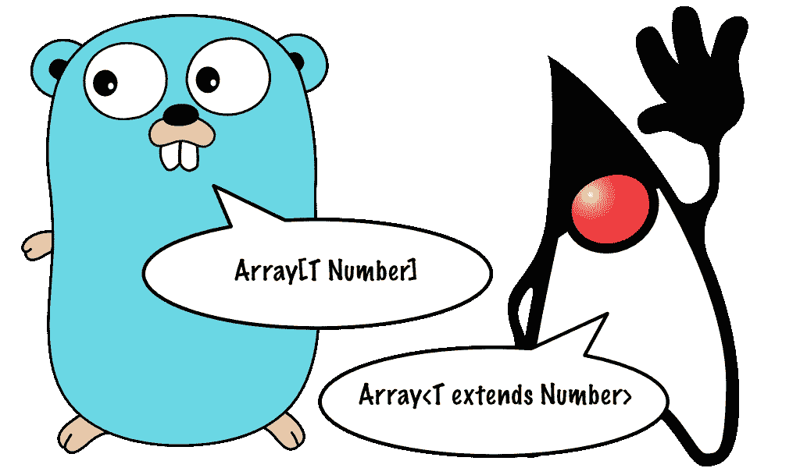
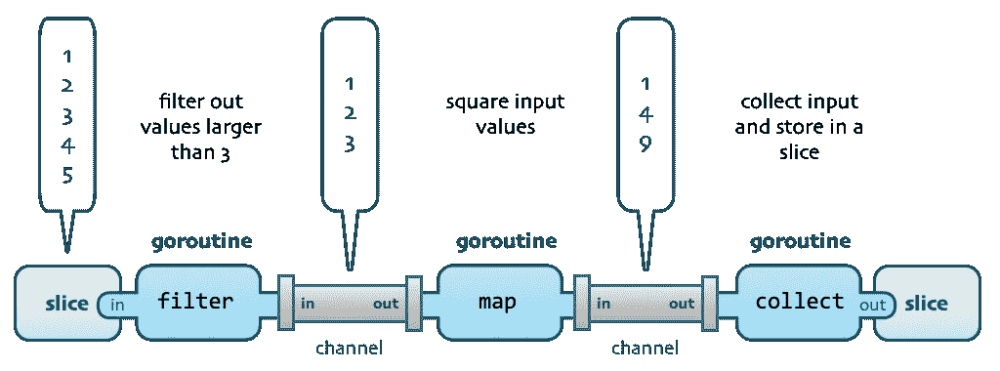

# Go 泛型 vs Java 泛型

> 原文：<https://itnext.io/go-generics-vs-java-generics-48cbf0e0f333?source=collection_archive---------2----------------------->

## Java 和 C#人群已经没有理由讨厌围棋了



Go 是一种让人又爱又恨的语言。因为没有泛型而在 Go 上扣篮几乎就像是全球开发者社区中的一场体育赛事。随着 Go generics 的推出，讨厌 Go 的社区将会遇到一点身份危机。缺乏泛型是每个人都可以团结起来的事情。今天，不仅 Go 有泛型，而且它们的泛型也非常好。事实上，Go 泛型在很多方面都比 Java 和 C#中的泛型要好。

让我们用一个在 Go 中经常用来演示泛型的简单例子来看看为什么。在前泛型时代，我们可能会像这样在 Go 中编写一个`Sum`函数:

```
**func** Sum(numbers int) int {
    **var** total int
    **for** _, x := **range** numbers {
        total += x
    }
    **return** total
}
```

这个解决方案是有局限性的，因为我们只能对整数求和。如果我们想对浮点数或复数求和呢？以前，我们必须复制代码。今天，我们可以挥舞着魔法棒写下:

```
**type** Number **interface** {
    int16 | int32 | int64 | float32| float64
}

**func** Sum[T Number](numbers []T) T {
    var total T
    **for** _, x := **range** numbers {
        total += x
    }
    return total
}
```

在代码示例中，我们声明任何不同位长的整数或浮点数类型都满足`Number`接口。我们可以通过从[golang.org/x/exp/constraints](https://pkg.go.dev/golang.org/x/exp/constraints)包中导入现成的接口来更优雅地实现这段代码:

```
**import**  "golang.org/x/exp/constraints"

**type** Number **interface** {
	Integer | Float
}
```

这个代码示例是泛型的一个非常简单和明显的用法。不管我使用什么编程语言，使用泛型处理简单的数据类型，比如整数和浮点数，是我的工作。然而，这个明显有用的代码甚至不可能用 Java 编写:

```
// Won't compile
**static** <T extends Number>  T sum(T[] v) {
    T total = 0;
    **for**(int k = 0; k < v.length; k++) {
        total += v[k];
    }
    **return** total;
}
```

在微软发布下一个版本的 C#之前，我相信你也不能在 C#中做到这一点。Java 和 C#都把原始类型变成了二等公民，这使得明显有用的代码不可能在没有丑陋的黑客破坏性能的情况下实现。Go 代码示例实际上转化为超高效的机器代码:

```
sum:
    MOVD  ZR, R0       // start index at zero
    MOVD  ZR, R3       // zero out total
    JMP	  compare

addup:    
    MOVW  (R1)(R0<<2), R4
    ADD	  $1, R0, R0   // increment index
    ADD	  R4, R3, R3   // add to total

compare:    
    CMP   R0, R2       // are we at end of loop
    BGT	  addup        // branch greater than
    MOVD  R3, R0       // put total in return reg
    RET	  (R30)
```

汇编代码是 ARM64，使用 Go 构建工具的交叉编译器功能生成。您可以运行这行代码:

```
❯ env GOOS=linux GOARCH=arm64 go build -gcflags -S \ 
      generic-sum.go 2> generic-sum.S
```

## Go 和 Java 中的类型擦除

在 Java 中，编译后不保留类型信息。我们将这一事实称为*型擦除*。下面的代码简单演示了 Java 中类型擦除的后果。你可以看到，尽管`Array<Integer>`和`Array<Float>`在运行时应该被视为不同的类型，但 Java 无法做到这一点。班级也一样。

```
public **class** Array<T **extends** Number> {
    // ...
};

Array<Integer> integers = new Array<Integer>();
Array<Float> floats = new Array<Float>();

// evaluates to true
**if** (integers.getClass() == floats.getClass()) { 
    System.out.println("they're equal");
}
```

Go 型系统没有这个问题。它在运行时正确地将`Array[int64]`和`Array[float64]`识别为不同的类型。

```
**type** Number **interface** {
	int | int64 | uint | float32 | float64
}

**type** Array[T Number] **struct** {
	elements []T
}

**var** integers Array[int64]
**var** floats Array[float64]

// Not equal
**if** reflect.TypeOf(integers) == reflect.TypeOf(floats) {
	fmt.Printf("they're equal")
}
```

## 但是 Go 不允许方法中有类型参数！

对 Go 泛型的一个常见抱怨是，不能向方法添加新的类型参数。我们这样说到底是什么意思？经常提到的一个例子是，试图向集合类中添加`Map`、`Filter`和`Reduce`方法。

一种幼稚的尝试是将这些函数作为方法添加到自定义集合类型中。下面是这种方法的一个例子。

```
**package** main

**import** "fmt"

**type** Array[V any] **struct** {
	elements []V
}

**type** Reducer[T, V any] **func**(accum T, value V) T

**func** (xs Array[V]) Reduce[T any](f Reducer[T, V]) T {
	**var** accum T
	**for** _, x := **range** xs.elements {
		accum = f(accum, x)
	}
	**return** accum
}

**func** adder(accum, x int) int {
	**return** accum + x
}

**func** main() {
	numbers := Array{[]int{1, 2, 3, 4, 5}}
	total := numbers.Reduce(adder)

	fmt.Println(total)
}
```

程序将无法编译，并显示错误消息:

```
reducer.go:11:26: syntax error: method must have no type parameters
```

原因是我们在`Reduce`方法上引入了一个类型参数`T`。Go 不允许向方法中引入新的类型参数。在这种情况下，正确的方法是创建在迭代器上操作的免费函数，这就是我在故事中描述的内容:[在 Go 中进行泛型映射、过滤和归约。](https://erik-engheim.medium.com/generic-map-filter-and-reduce-in-go-3845781a591c)

[](https://erik-engheim.medium.com/generic-map-filter-and-reduce-in-go-3845781a591c) [## Go 中的通用映射、过滤和减少

### 使用泛型在 Go 中实现高阶函数

erik-engheim.medium.com](https://erik-engheim.medium.com/generic-map-filter-and-reduce-in-go-3845781a591c) 

使用基于迭代器的方法，您可以编写如下所示的代码:

```
**var** numbers []int = []int{1, 2, 3, 4, 5}

// Create iterator over a slice of integers
iter := NewSliceIterator(numbers)

// Pick values larger than 3
filtered := Filter(iter, **func**(x int) bool {
	**return** x > 3
})

// Square all values
mapped := Map(filtered, **func**(x int) int {
	**return** x * x
})

// Collect result from collection
result := Collect(mapped)

**for** _, x := **range** result {
	fmt.Println(x)
}
```

通过使用迭代器，您不需要为每个想要支持`Map`、`Filter`、`Reduce`或任何其他算法的集合添加代码。您所需要做的就是为您想要过滤、减少或映射的集合创建一个迭代器类型。功能可以很容易地用包含搜索特定元素的其他算法的独立包来扩展。你甚至可以为不代表集合的东西创建一个迭代器，比如 I/O 对象。您可以使用不同的迭代器来读取行、字符或标记。这些迭代器可以输入到 filter、map 和 reduce 中。

有很多可能性，但在走极端之前，我认为值得记住的是，在 Go Go 中，路线和渠道通常会给你更多的灵活性。虽然迭代器可以用来创建复杂的数据转换管道，但是它们存在不能并发运行的问题。



过滤、映射和收集可以作为通过通道连接的 goroutines 运行

将通过通道消费和生产数据的 goroutines 链接起来更有效，因为它们原则上可以并行运行。因此，不要试图假装 Go 是 Haskell、OCaml 或某种奇特的函数式语言，提醒自己 Go 是关于并发性和简单性的。Goroutines 是地鼠的首选武器。

## 结束语

对于阅读这篇文章的 Java 和 C#开发人员，我希望你们不要把我的取笑看得太严重。竞争难道不是开发者世界的乐趣之一吗？

虽然我认为 Go 比 Java 有更好的泛型解决方案，但这最终只是一种主观看法。这取决于你如何构建软件。有些人比其他人更多地使用泛型。我认为 Go generics 将主要吸引那些实用主义者。对我来说，Go 泛型非常适合我通常使用泛型的方式，即使是在比 Go 更复杂的支持泛型的语言中。

我不认为开发者总是使用语言特性是因为他们从中受益，而是因为他们想使用闪亮的新事物。保持事情简单比看起来要困难得多。