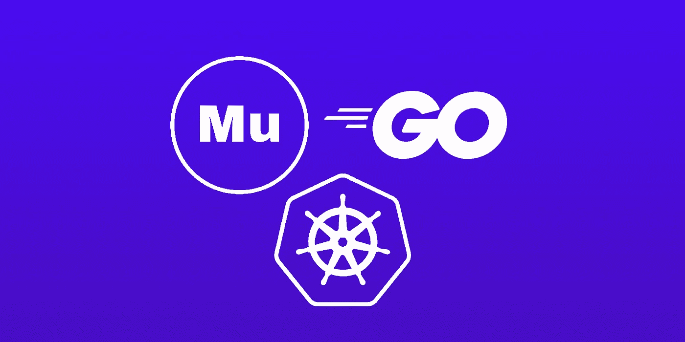
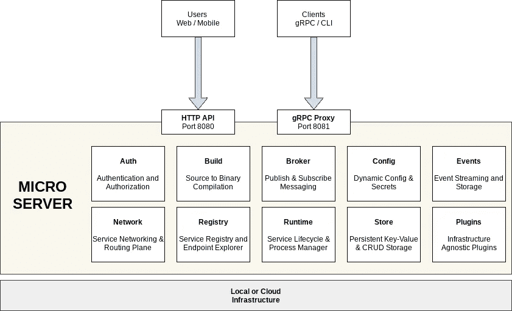
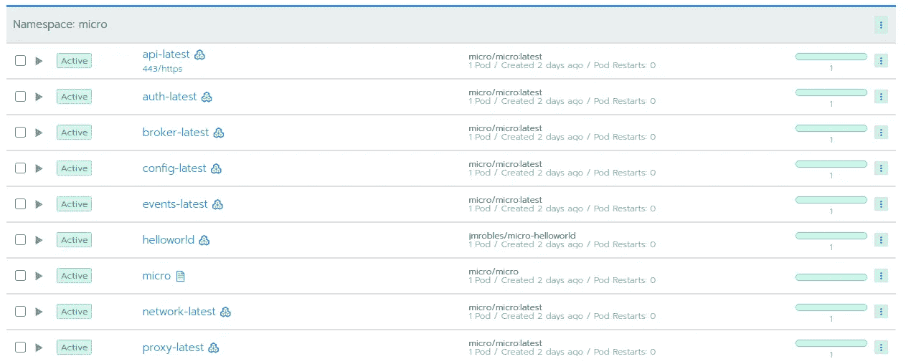
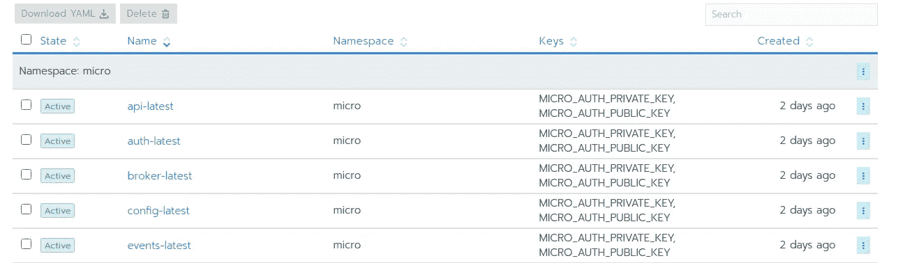
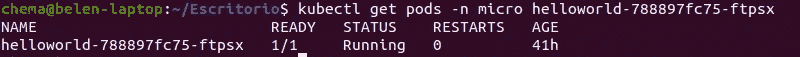
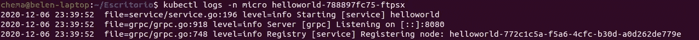
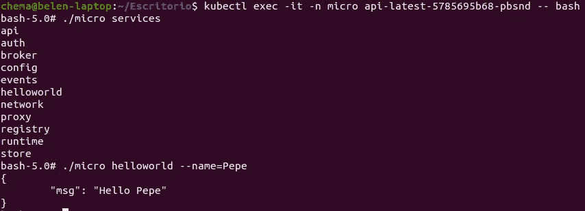
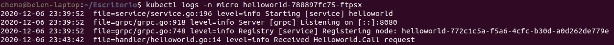

# Kubernetes 上的 Go Micro:入门

> 原文：<https://itnext.io/go-micro-on-kubernetes-getting-started-2959dd6c2d4f?source=collection_archive---------0----------------------->

**TL；DR** :如何在 Kubernetes 集群上开始开发和部署带有 Go Micro 生态系统的微服务。



Go 规则中的微服务！

# 介绍

[Go micro](https://micro.mu/) 是一个微服务生态系统，用于开发没有“胶水”样板代码(注册、认证、代理等)的微服务

只需关注您的业务逻辑代码(又名“处理程序”)。

有了它的最新版本 v3，开发微服务变得相当容易。

这是一个生态系统，因为 go-micro 超越了一个框架。它包括认证、代理(发布/订阅)、KV 存储、API 代理、gRPC 代理等几个核心服务。

默认的消息协议是 [gRPC](https://grpc.io/) 。

gRPC 使用基于数据模式、协议缓冲区的高效数据二进制编码。它最小化了消息处理及其大小。

您可以使用现成的核心微服务，也可以指定您自己的微服务(即 Kafka 作为代理)。



抄袭自微. mu 网站

Micro 是带着“特殊-半开源”许可证发布的。除了将业务产品作为服务(避免 AWS、GCP 等)，您可以做任何您想做的事情。类似于合流许可。

# 动机

我写了这个“入门”指南，因为有关于开始使用 Micro 进行开发或在本地环境中使用的文档，但没有关于使用 Kubernetes 的云的文档(至少在 v3 版本中)。

我们刚刚推出了一个“helloworld”微服务，并在我们的 Kubernetes 集群中访问它。

# 先决条件

你需要一个活跃的 Kubernetes 集群。

如果你还没有，并且想要一个在云中，关注[这篇文章](https://jmrobles.medium.com/how-to-create-a-kubernetes-cluster-with-rancher-on-hetzner-3b2f7f0c037a)，在 Hetzner 上创建一个便宜的 Kubernetes 集群。

[](https://jmrobles.medium.com/how-to-create-a-kubernetes-cluster-with-rancher-on-hetzner-3b2f7f0c037a) [## 如何创建一个库伯内特集群与赫茨纳牧场主

### TL；DR:15 分钟内，你就可以有一个实验室集群准备好测试或部署你的项目，既便宜又容易。

jmrobles.medium.com](https://jmrobles.medium.com/how-to-create-a-kubernetes-cluster-with-rancher-on-hetzner-3b2f7f0c037a) 

# 我们走吧！

我们开始在集群中安装“micro”。之后，我们编码并部署我们的“hello world”。最后，我们创建一个入口并测试它。

## 1.在我们的 K8S 集群中安装 Micro

您可以安装微与舵图表应用以下 YAML(它是相同的图表中包括)。

这个 YAML 创建几个角色绑定、PV、PVC，最后执行“微”作业。都在名称空间“micro”下。

**注**:对于 PV/PVC，使用“hcloud-storage”作为 CSI 驱动程序。这个驱动程序是针对 Hetzner CSI 插件的。换你的。

在我们用“应用”方式应用它之后

```
% kubectl apply -f micro-setup.yaml
```

我们可以发现核心微服务单元正在运行。



Rancher 的屏幕截图，带有微 pods 列表

听起来不错！

是时候给我们的“hello world”编码了。

## 2.构建“hello world”微服务

“Hello World”的代码包含在微文档中。

只需克隆库[https://github.com/micro/services](https://github.com/micro/services)并访问文件夹“helloworld”。

`main.go`很简单。

代码是不言自明的。

首先，我们创建一个名为“helloworld”、版本为“latest”的新服务(顺便说一句:“latest”不是版本，而是一个标签。请改用 [semver](https://semver.org/) 。

在第 19 行，我们将微服务器和处理程序注册到协议缓冲区(pb)存根中。我们现在谈谈这个。

最后，我们进入服务循环。

这里的关键是我们的协议缓冲微存根(API)和在处理程序中实现的方法(实现)。

关于 gRPC 我就不赘述了。如果你想知道更多，网上有很多信息。

在 gRPC (PB)中，一切都从协议规范开始。

对于我们的微服务,“原型”规范非常简单。

这个 API 定义只声明了一个方法，调用。我们只需传递一个“名字”,就会收到一条问候消息。

在生成存根之前，您需要安装`proto`工具及其插件(go 和 micro)。要安装它，只需执行下一个`go get`

```
% go get -u github.com/golang/protobuf/proto
% go get -u github.com/golang/protobuf/protoc-gen-go
% go get github.com/micro/micro/v3/cmd/protoc-gen-micro
```

(如果您在安装 protocol-gen-micro 时遇到问题，请设置`GO111MODULE=on`

我们为 Go stab 和微插件 stab 编译 API 规范，安装并执行以下命令。

```
% protoc --proto_path=. --micro_out=. --go_out=:. proto/helloworld.proto
```

如果一切顺利，这个命令会生成两个文件:`helloworld.pb.go`和`helloworld.pb.micro.go`。

只剩下看操作者了。

hander 只是实现了`Call`方法。它注册一条日志消息并返回一条问候消息。

现在我们可以编译它了。

```
% CGO_ENABLED=0 GOOS=linux GOARCH=amd64 go build -o helloworld *.go
```

并生成我们简单的 Docker 容器。

```
% docker build -t jmrobles/micro-helloworld .
```

在使用之前，我们需要推送至 Docker Hub 注册表(或任何你想要的东西)。

```
% docker push jmrobles/micro-helloworld
```

**注意**:如果想跳过容器生成，运行微服务，可以直接使用这个[容器](https://hub.docker.com/repository/docker/jmrobles/micro-helloworld)。

## 3.在 Kubernetes 的部署

在继续在 kubernetes 中安装 pod 之前，让我们看看微服务如何在 kubernetes 中相互通信。

微服务“环”中的微服务认证是使用 API 密钥和 API 秘密来完成的。



所有的“戒指”使用相同的钥匙

所有微服务使用相同的`MICRO_AUTH_PUBLIC_KEY`和`MICRO_AUTH_PRIVATE_KEY`。

您可以重用核心服务(例如 API)的秘密，或者复制并创建您自己的秘密。

我们的部署和服务 YAML。

这里重要的是微观环境变量。这些告诉你网络代理在哪里，认证等等。

**注意**:此环境变量未记录。它们不一定都是必要的，也可能会改变。最好有官方文档:)

我们应用它。

```
% kubectl apply -f deploy-helloworld.yaml
```

如果没有问题，我们的微服务就会运行。



它的日志必须类似于以下内容



是时候测试一下了！

## 4.从 CLI 测试

我们可以从任何服务容器中测试它。

只需执行一个 shell，登录并进行调用



刚刚好！

我们也可以检查日志。



## 5.通过带入口的 API 访问

最后，我们将通过 ingress 公开我们的微服务。

API 微服务允许通过 REST JSON 访问其他微服务。

自动地。您不需要编写任何进一步的样板代码！

在我的例子中，我使用 Let's 加密 SSL 证书(使用 cert-manager)。

这是我使用这项服务的入口

我们用 cURL 测试它

```
% curl "https://yourhost/helloworld?name=Pepe"
{"msg":"Hello Pepe"}
```

# 结论

我认为 Micro 是一个非常棒的微服务生态系统。很多使用它的微服务都在生产中。

然而，它的文献很少。

我希望你喜欢这个指南。我可能会写更多关于用这个框架开发微服务的内容。敬请期待！

如果你想了解更多关于 DevOps，Kubernetes，Docker 等等…关注我:)