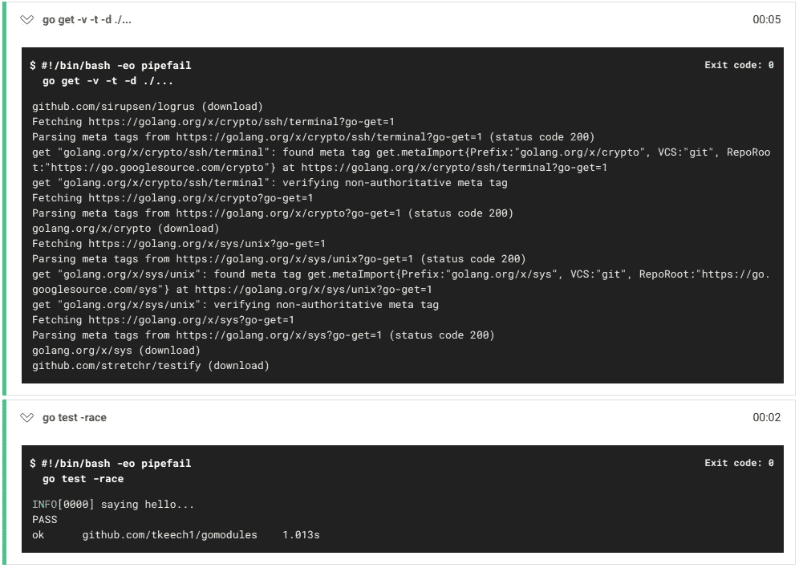
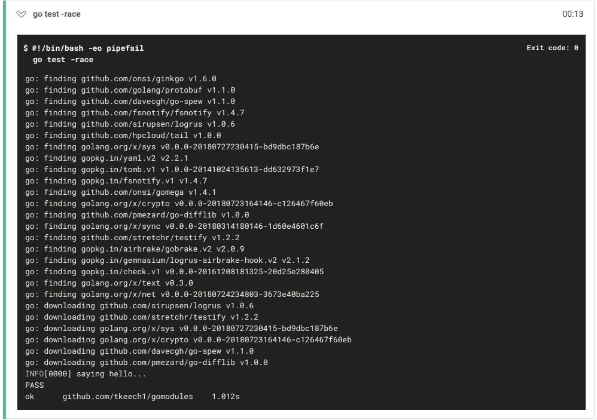

# Go 模块和 CircleCI

> 原文：<https://itnext.io/go-modules-and-circleci-c0d6fac0b000?source=collection_archive---------4----------------------->

我最近读了 [Dave Cheney 的帖子](https://dave.cheney.net/2018/07/16/using-go-modules-with-travis-ci)关于在 Travis CI 工作流中转换 httpstat 以使用 Go 1.11 的模块支持。Go 1.11 即将正式发布，所以现在是在 CircleCI 中开始使用 Go 模块的好时机，circle CI 是一个类似于 Travis CI 的持续集成和交付平台。

# **Go 模块**

Go 模块是相关 Go 包的集合。Go 1.11 为使用`go`命令处理模块提供了实验支持。

模块行为由环境变量`GO111MODULE`控制，可以设置为`on`、`off`或`auto`(默认)。当`GO111MODULE`设置为`off`时，`go`命令保持与先前版本相同的功能，并在构建期间使用`GOPATH`中的包。如果`GO111MODULE`被设置为`on`，则`go`命令会忽略`GOPATH`并要求使用模块。

将`GO111MODULE`设置为`auto`(或未设置)允许`GOPATH`和模块支持，但有一些限制。在这种模式下，`go`命令的行为由当前目录的位置决定。如果当前目录在`GOPATH`之外，并且包含一个`go.mod`文件，那么模块支持被启用。否则，`GOPATH`和 vendor 目录会像以前版本的 Go 一样使用。

有几篇关于使用 Go 模块和`go.mod`文件的好文章。更多信息请查看参考资料部分。

# CircleCI

让我们创建一个 Go 模块，并用 CircleCI 来说明 Go 1.11 中的`auto`模块行为。我们将从一个包含单元测试的非常简单的模块开始。该模块有两个外部依赖项，因此我们将看到依赖项管理在起作用。该示例的源代码可在 [Github](https://github.com/tkeech1/gomodules) 上获得。

首先，创建一个名为`helloworld.go`的文件，它包含以下内容:

```
package gomodules
import (
     log "github.com/sirupsen/logrus"
)func sayHello() string {
     log.Info("saying hello...")
     return "Hello, world"
}
```

让我们也为`helloworld.go`创建名为`helloworld_test.go`的测试:

```
package gomodulesimport (
     "testing"
     "github.com/stretchr/testify/assert"
)func Test_HelloWorld(t *testing.T) {
     tests := map[string]struct {
          expectedResponse string
     }{
          "success": {
                expectedResponse: "Hello, world",
          },
     }

     for name, test := range tests {
          t.Logf("Running test case: %s", name)
          response := sayHello()
          assert.Equal(t, test.expectedResponse, response)
     }
}
```

我们可以在 CircleCI 中执行 Go 1.10 的测试，方法是将下面的`config.yml`文件添加到项目中，并在 CircleCI 中配置 Github 存储库(有关在 CircleCI 中配置 Go 项目的更多信息，请参见参考资料部分)。

```
# Golang CircleCI 2.0 configuration file
version: 2
jobs:
  build-go1.10:
    docker:
      - image: circleci/golang:1.10
      working_directory: /go/src/github.com/tkeech1/gomodules
    steps:
      - checkout
      - run: go get -v -t -d ./...
      - run: go test -raceworkflows:
  version: 2
  build_and_test:
  jobs:
    - build-go1.10
```

此示例使用 CircleCI 工作流。工作流可以在每次构建期间并行执行多个作业。`steps`部分定义了每个任务运行的具体命令。在本例中，步骤如下:

*   将 Github 库签出到`working_directory`。在这种情况下，`working_directory`位于`GOPATH`上。
*   `go get`包和测试的依赖关系。
*   进行测试。



Go 1.10 的 CircleCI 构建结果

CircleCI 构建显示`go get`和`go test`工作步骤成功执行。我们有一个 Go 1.10 的工作版本。

# **Go 1.11 模块和 CircleCI**

现在我们将在不使用模块的情况下为 Go 1.11 添加一个 CircleCI 作业。我们可以使用与 Go 1.10 构建作业相同的配置，用 Go 1.11 映像替换 Go 1.10 映像。

```
# Golang CircleCI 2.0 configuration file
version: 2
jobs:
  build-go1.10:
    docker:
      - image: circleci/golang:1.10
      working_directory: /go/src/github.com/tkeech1/gomodules
    steps:
      - checkout
      - run: go get -v -t -d ./...
      - run: go test -race
  ***build-go1.11:
    docker:
      - image: circleci/golang:1.11-rc
      working_directory: /go/src/github.com/tkeech1/gomodules
    steps:
      - checkout
      - run: go get -v -t -d ./...
      - run: go test -race***workflows:
  version: 2
  build_and_test:
  jobs:
    - build-go1.10
    ***- build-go1.11***
```

要添加使用 Go 模块的新 CircleCI 构建，我们必须首先使用 Go 1.11 `go mod`命令初始化模块。不安装 Go 1.11 的方法之一就是使用 Docker。下面的命令启动一个 Go 1.11 Docker 容器，将本地源代码装入容器，并运行模块初始化命令。

```
docker run -it --rm -v $PWD:/opt golang:1.11-rc *go mod -init -module github.com/tkeech1/gomodules*
```

*更新(2018 年 8 月 7 日)—Go 的 beta3 版本使用以下命令初始化模块:*

```
docker run -it --rm -v $PWD:/opt golang:1.11-rc *go mod init github.com/tkeech1/gomodules*
```

模块初始化产生一个包含以下内容的`go.mod`文件:

```
module github.com/tkeech1/gomodules
```

让我们添加依赖项。许多`go`工具命令，如`build`、`run`和`test`是模块感知的，会将缺失的依赖项添加到`go.mod`文件中。除了添加缺失的依赖关系，`go mod -sync`命令还将删除不必要的依赖关系。您可以使用以下命令在 Docker 中运行它:

```
docker run -it --rm -v $PWD:/opt --workdir /opt golang:1.11-rc *go mod -sync*
```

*更新(2018 年 8 月 7 日)—Go 的 beta3 版本使用以下命令来同步依赖关系:*

```
docker run -it --rm -v $PWD:/opt --workdir /opt golang:1.11-rc *go mod tidy*
```

依赖关系现在列在`go.mod`文件中。

```
module github.com/tkeech1/gomodulesrequire (
 github.com/davecgh/go-spew v1.1.0 // indirect
 github.com/fsnotify/fsnotify v1.4.7 // indirect
 github.com/golang/protobuf v1.1.0 // indirect
 github.com/hpcloud/tail v1.0.0 // indirect
 github.com/onsi/ginkgo v1.6.0 // indirect
 github.com/onsi/gomega v1.4.1 // indirect
 github.com/pmezard/go-difflib v1.0.0 // indirect
 github.com/sirupsen/logrus v1.0.6
 github.com/stretchr/testify v1.2.2
 golang.org/x/crypto v0.0.0-20180723164146-c126467f60eb // indirect
 golang.org/x/net v0.0.0-20180724234803-3673e40ba225 // indirect
 golang.org/x/sync v0.0.0-20180314180146-1d60e4601c6f // indirect
 golang.org/x/sys v0.0.0-20180727230415-bd9dbc187b6e // indirect
 golang.org/x/text v0.3.0 // indirect
 gopkg.in/airbrake/gobrake.v2 v2.0.9 // indirect
 gopkg.in/fsnotify.v1 v1.4.7 // indirect
 gopkg.in/gemnasium/logrus-airbrake-hook.v2 v2.1.2 // indirect
 gopkg.in/tomb.v1 v1.0.0-20141024135613-dd632973f1e7 // indirect
 gopkg.in/yaml.v2 v2.2.1 // indirect
)
```

最后，通过向 config.yml 文件添加一个新作业，在 CircleCI 中创建 Go 1.11 模块构建配置。

```
# Golang CircleCI 2.0 configuration file
version: 2
jobs:
  build-go1.10:
    docker:
      - image: circleci/golang:1.10
      working_directory: /go/src/github.com/tkeech1/gomodules
    steps:
      - checkout
      - run: go get -v -t -d ./...
      - run: go test -race
  build-go1.11:
    docker:
      - image: circleci/golang:1.11-rc
      working_directory: /go/src/github.com/tkeech1/gomodules
    steps:
      - checkout
      - run: go get -v -t -d ./...
      - run: go test -race
***build-go1.11-gomodules:
    docker:
    - image: circleci/golang:1.11-rc
    working_directory: ~/github.com/tkeech1/gomodules
    steps:
    - checkout
    - run: go test -race***workflows:
  version: 2
  build_and_test:
  jobs:
    - build-go1.10
    - build-go1.11
    ***- build-go1.11-gomodules***
```

新工作有一些小变化:

*   没必要跑`go get`。`go test`将处理`go.mod`文件中列出的必要依赖项的下载。
*   `working_directory`位于`GOPATH`外

Docker 容器中的`GO111MODULE`环境变量是未设置的(默认为`auto`),并且有一个现有的`go.mod`文件，因此构建将使用 Go 模块。



带有模块的 Go 1.11 的 CircleCI 构建结果

在 CircleCI 输出中，我们看到运行`go test`导致构建下载了`go.mod`文件中列出的依赖项。现在我们有一个 CircleCI 工作流，在 Go 1.10、Go 1.11 和 Go 1.11 上用模块构建和测试一个小项目。

# 摘要

*   模块是 Go 1.11 中的一个实验性特性
*   环境变量`GO111MODULE`决定了 Go 1.11 模块支持的行为
*   CircleCI 工作流可以配置为使用传统的`GOPATH`方法和模块构建单个项目

我希望这有所帮助。感谢阅读。

# **资源**

[通过 Travis CI 使用 Go 模块](https://dave.cheney.net/2018/07/16/using-go-modules-with-travis-ci)

[Go 模块已经登陆](https://groups.google.com/forum/m/#!msg/golang-dev/a5PqQuBljF4/61QK4JdtBgAJ)

[版本化 Go 模块提案](https://github.com/golang/proposal/blob/master/design/24301-versioned-go.md)

[CircleCI 工作流程](https://circleci.com/docs/2.0/workflows/)

[在 CircleCI 中配置 Go 项目](https://circleci.com/docs/2.0/language-go/)