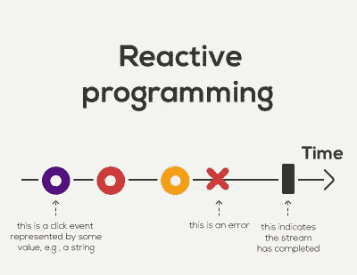
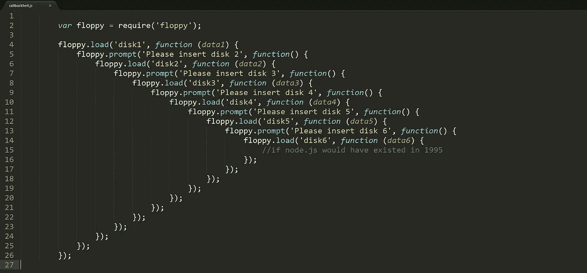
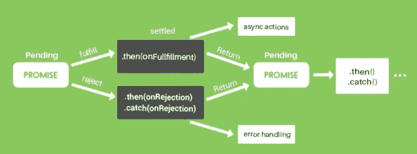
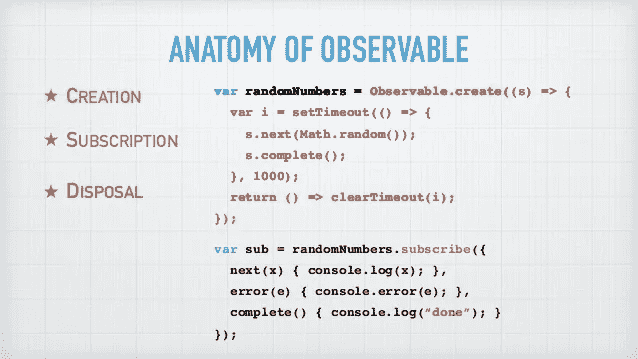
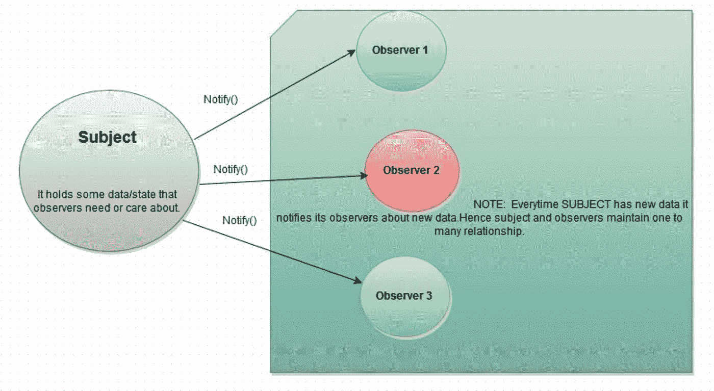
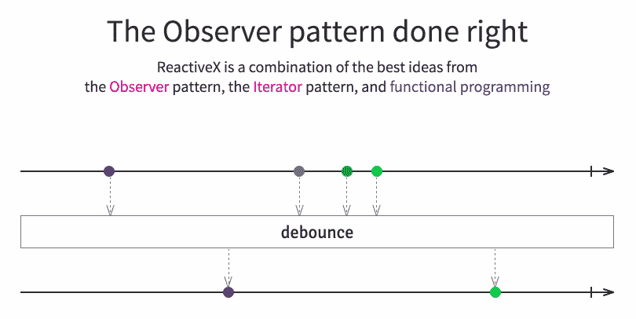
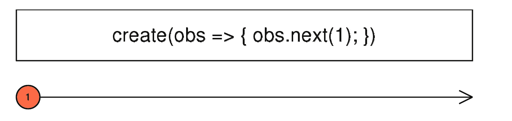
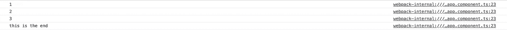
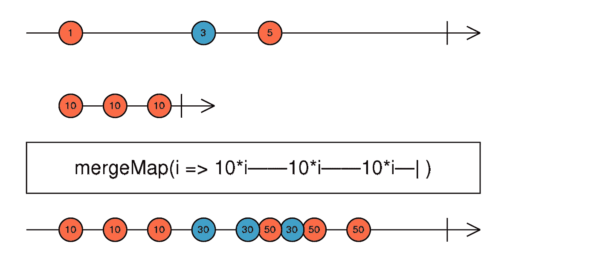

# 对 RXJS 做出反应

> 原文：<https://itnext.io/go-reactive-with-rxjs-c07dd3964cf2?source=collection_archive---------6----------------------->



[*点击这里在 LinkedIn 上分享这篇文章*](https://www.linkedin.com/cws/share?url=https%3A%2F%2Fitnext.io%2Fgo-reactive-with-rxjs-c07dd3964cf2)

我用反应式的方式编程已经快两年了，如果没有它，我几乎无法思考。反应式编码方式更清晰地代表了真实世界的场景。

我想写这篇文章作为一个引子，与那些想将他们的范式转换到反应式编码方式的人分享我的经验。

> 在计算领域，**反应式编程**是一种声明式**编程**范例，关注数据流和变化的传播。(来源维基百科)

## 先决条件

*   Javascript(如果你懂 javascript 会更好)
*   节点和国家预防机制
*   HTTP 和 Rest API
*   Javascript 框架(在本文中我将使用 angular 2x)

## 异步和反应式编程

> 异步编程是并行编程的一种形式，它允许一个工作单元独立于主应用程序线程运行。当工作完成时，它通知主线程(以及工作是完成还是失败)。使用它有许多好处，例如提高应用程序性能和增强响应能力。(来源 stackify.com)

简而言之，这就是异步编程。所以最初当我开始编码时，前端只是 html 页面。异步很好，但是当我转向 Angular js 并开始使用 **ng-repeat 时，**事情开始变得混乱。因为我的角度代码没有等待我的异步调用完成，我的页面只是空白…..真扫兴。

然后我们开始使用回调。回调只是代码，在特定操作完成后执行，就像 ajax 调用一样。

随着应用程序的进一步增长，这种方法无法扩展。现在，我们有依赖操作链，这导致了回调地狱。



搞什么鬼！….回调地狱

然后，我们进一步试图解决这个承诺。它们只是回调的更酷版本，带有一些定义良好的 api，如`then`和`catch`。

一个`Promise`代表一个在承诺产生时不一定知道的价值。它允许您将处理程序与异步操作的最终成功值或失败原因相关联。这使得异步方法像同步方法一样返回值:异步方法不是立即返回最终值，而是返回一个*承诺*在将来的某个时间提供该值。([来源](https://developer.mozilla.org/en-US/docs/Web/JavaScript/Reference/Global_Objects/Promise))

`Promise`处于以下状态之一:

*   *待定*:初始状态，既未履行也未拒绝。
*   *完成*:表示操作成功完成。
*   *拒绝*:表示操作失败。

在行业进一步发展之前，承诺是伟大的，现在是现实世界应用的时候了。我们需要持续的更新，而不仅仅是一次，就像承诺，发生一次就结束了。



承诺只会发生一次

那么，接下来是**可观察的，**只是可重用的承诺，在 then 方法之后继续监听。这就好像你甚至可以从可观察的事物中获取价值，如果被激发一次，可观察的事物发出新的价值。唯一的区别是 observable 方法拥有 subscribe 方法，而不是 then 方法。



## 观察者模式

[观察者模式](https://en.wikipedia.org/wiki/Observer_pattern)是一种软件设计模式，其中一个名为 subject 的对象维护一个名为 observer 的依赖者列表，并自动通知它们任何状态变化，通常是通过调用它们的方法之一。它主要用于实现分布式事件处理系统。



在本文的其余部分，我希望您将数据可视化为一系列事件或更新。好了，现在我们理解了异步 JavaScript 和反应式编程的基础。我们已经了解了从回拨到承诺再到可观察的演变。我们已经了解了数据流。



数据流就是实时数据的连续流动

# 让我们写一些代码

## 设置角度项目

如果你已经熟悉 angular，你会知道我们现在有 cli 来自动引导我们的项目。如果你没有它，你可以在你的终端上运行下面的命令来安装它。

```
sudo npm install -g @angualar/cli
ng new ngrxjs
cd ngrxjs
ng serve
```

现在，您可以访问 [http://localhost:4200](http://localhost:4200) 来查看您的 angular 项目是否准备好并提供服务(请等待上述任务完成后再进行导航)

## 创造一个可观察的

现在我们将创建我们的第一个可观察对象，使用最基本的操作符 create(这里有更详细的解释)。



请在新创建的项目中的 src/app/app.component.ts 文件中编写以下代码。

在第 16 行，我们创建了一个新的可观测值。简单地说，observable 是观察者设计模式中的主题，我们观察它们以发出任何更新。

在第 23 行，我们通过向它传递一个包含三个函数的 observer 对象来表示这是可观察的。

*   然后
*   错误
*   完成

这里将它们作为三个函数传递，这与在 observer 对象中传递这三个函数几乎相同。如果你回到第 17 行，我们触发 next()几次，所以每次我们在 observer 上触发 next 时，我们都会在 subscription next 中得到一个更新，这是第 24 行的方法，最后当 observer 上调用 complete 时，调用第三个方法来打印“这是结束”。

如果一切正常，并且您的服务器正在运行 http://localhost:4200 ，您应该会在浏览器控制台中看到下面的控制台日志输出。



## 科目

关于 observable 的一个重要的事情是，每次你创建它的一个实例。这意味着您不能共享或重用 observer。每个新的可观察对象将包含它自己的观察者，这些观察者不能相互作用。

您可以多次订阅同一个可观察对象，但每次订阅都是一个单独的实例，它们不会互相了解。

例如，在上面的代码中，如果你想跳出代码块 16–21，你不能执行 observer.next()。但是如果你想这样做，也就是说，想在任何时候触发 next。

为此，我们有**主题，**他们就像观察员，除了你可以在我们想下一个开火的时候开火。他们都是可观察的和观察者，所以你可以订阅并对他们开火。

在上面的代码中，你可以看到我们在第 17 行做了一个订阅，然后在它之外，我们下一个要发射。Subject 可以很方便地在我们需要的时候向所有观察者广播更新的值。

## 行为主体

行为主体就像带有额外特性的主体，在被实例化时需要一个初始值。在第一次订阅时，您可以获得该值，而在订阅后，您必须至少启动一次 next 才能获得订阅值

所以现在在第 18 行，订阅将得到一个初始值 100，甚至没有发出第一个下一个值。

## 重播主题

这看起来很好，但是在行为主体和主体中，你只能得到一个最新的值，但是如果你需要主体从一开始传递的所有值呢？不用担心，我们有 ReplaySubject，replaysubject 会保存所有的值，并在每个订阅中给出，即使 replaysubject 已完成。

在代码中，当我们通过在第 17、18 行触发 next 来发出值时，我们将在第 16 行打印这些值，但是对于第 19 行的主题或行为主题，我们将仅获得 4 个值，因为它们仅给出最新的值，但是在 replaysubject 中，我们将获得保存在 replay subject 中的所有以前的值。

# 经营者

到目前为止，我们采用的用例非常简单，但在实时情况下，我们可能需要改变或操纵从可观测值中获得的值。这里有一个问题，如果我们想从可观察的事物中获得价值，我们必须订阅它，一旦订阅，你的可观察的事物就失去了。然后，我们需要再次将该值包装在可观察值中并返回。哦，废话，对于同样的问题，它太复杂和容易出错了，我们有操作者操纵可观察的输出，并把它包装在新的可观察的自身中。

> 操作者就像瑞士军刀

## 拿

在上面的代码中，我们使用了 take 操作符，这是最简单的操作符之一。在这里，我们的可观察对象将在每 1 秒后发出下一个数字(由于创建可观察对象的间隔方式)，但 take 将只取前 5 个，然后停止，否则你的浏览器迟早会崩溃。

## 地图

现在，是我最喜欢的运营商，地图的时候了。如果你曾经使用过 Array.prototype.map，它几乎就是这样。只不过它映射了每个发出的可观察值，而不是数组元素，并将处理过的值包装在新的可观察值中。

## 过滤器

Filter 再次类似于 Array.prototype.filter，只是它只发出那些通过 filter 操作符中传递的 filter 函数的值。

在上面的代码中，我们将只在订阅中获得偶数的值，这就是 filter operator 所做的。

## 合并地图

到目前为止，我们只讨论了一个可观测的数据流，但是如果我们想要合并两个数据流呢？有很多操作符可以做到这一点，但是最简单的是 merge map。



在大理石图中检查这一点，看看两个数据流是如何合并成一个的，这就是合并图所做的。

在这个例子中，我们创建了两个 observables:一个立即发出字母，另一个每秒发出新的数字。因此，它接受每个发出的数值，并与数值的最新值合并。

## 开关图

可能有这样一种情况，你想要两个值，但是你不想为每一个单独的值激发可观察的。用例:当你在数据库中搜索一个字符串，但同时你改变了这个字符串。在这种情况下，您必须取消旧的请求并启动新的请求。除了取消之前的请求之外，用法与 mergemap 完全相同。

# 结论

这是所有的乡亲。还有很多运营商你可以上他们的官方[网站](http://reactivex.io/rxjs/)看看。这篇文章背后的主要思想是通过向开发人员介绍这个伟大的库来启发他们接受功能反应式编码方式。它真的可以让你的应用对实时数据更加敏感，并且高度可扩展。