# 去吧，计时器！

> 原文：<https://itnext.io/go-timer-101252c45166?source=collection_archive---------1----------------------->

## Go 计时器的详细信息以及来自 Kubernetes 的使用示例


来自 unsplash， [@Veri_Ivanova](https://unsplash.com/photos/p3Pj7jOYvnM)

`**Timer**`是 Go 众多巧妙设计之一。当实现单次或多次计时时，它只公开有限数量的 API，封装相对复杂的底层数据结构和并发操作。

在阅读 Kubernetes 调度程序的源代码时，我了解了更多关于 Go timer 的应用程序及其在`[kubernetes/utils](https://github.com/kubernetes/utils/)`中封装的附加功能。在这篇文章中，我想分享我所吸收的内容，并尝试涵盖它的所有实现，并使用 Kubernetes 源代码进行更多扩展。

# 如何使用计时器

Go-timer 是指[睡眠中的`Timer`，go](https://github.com/golang/go/blob/master/src/time/sleep.go) 。

## NewTimer 和 AfterFunc

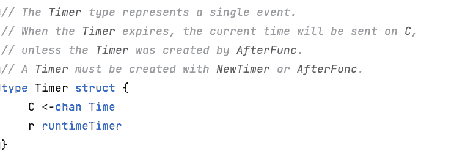

评论解释了它的用法。只能用`NewTimer`或`AfterFunc`创建。当计时器结束时，一个事件将被发送到`C`，然后我们可以通过`select`消费这个事件。参见下面的范例。

这里打印的是`default`，因为`select`在定时器触发之前已经执行过了。有两种常见的方法来纠正这一点。

*   直接阻塞程序，等待定时器被触发。
*   将`select`置于`for`循环中，以确保定时器的逻辑可以被触发。

还有一点需要注意的是`break`只能跳出`select`，导致 for 循环不停的执行。为了打破整个 for 循环，需要一个标签。但是，很多开发者不喜欢这种可读性低的方法，他们会转向解耦性更强的`AfterFunc`，通过`Callback`函数执行相关逻辑。

## 重置计时器

`NewTimer`和`AfterFunc`都是一次性执行，如果要多次使用，可以用`Reset`的方法重置定时器。让我们对上面的例子稍加修改，在`sleep`调用后添加以下几行来实现它。

```
c.Reset(1 * time.Second)
time.Sleep(2 * time.Second)
```

请记住，必须对已经执行或过期的计时器进行复位，这一点在[官方文件](https://pkg.go.dev/time#Timer.Reset)中有所标注。

> 对于用 NewTimer 创建的计时器，只能在通道耗尽的停止或过期计时器上调用 Reset。

最好的方法是`Stop`方法，除非你确定当你调用`Reset`时定时器已经被触发，就像上面的例子一样。

官方推荐

```
if !t.Stop() {
  <-t.C   // drain the timer if it is not stopped
}
t.Reset(d)
```

但是会出现“阻塞”

*   当定时器(用`NewTimer`创建)超时时，`Stop`也将返回 false，那么`<- t.C`将被阻塞，因为通道中没有值。
*   用`AfterFunc`创建定时器时，内部没有`chan`域，也没有清空通道的操作，代码也会被阻塞。

而`select`是最好的避免两种情况下的 bug。

```
if !t.Stop() {
   select {
     case <-t.C: *// try to drain the channel* default:
   }
}
t.Reset(d)
```

## 在...之后

除了`NewTimer`和`AfterFunc`之外的另一种触发定时器的方式是`time.After(d Duration)`，它直接返回定时器中的通道对象，而不是返回定时器对象，通常直接用在`select`中，作为一种故障保护手段，保证`select`语句不会一直被阻塞。常见的用法是

与额外创建一个定时器相比，这种方法更简单。但是当你在一个`select`子句中使用两个`After`时，可能会出现问题。等待时间更长的人可能永远没有机会执行。比如下面的代码只会打印`str`而不会堆叠`str`。

原因是在第一个`After`被执行后，两个`Afters`都将被重置，因此等待时间更长的计时器将永远不会被触发，除非您在循环之外定义计时器。

## 心脏

`Ticker`是无需手动复位即可重复执行的定时器。如果您将计时器视为 Kubernetes 中的作业对象，那么 Ticker 就是`CronJob`。

它的用法基本上和 Timer 一样，但是它的定义初始化了一个`period`来标记两次执行之间的间隔。并且记得单独初始化，而不是放入`select`中，否则会重复初始化，造成内存泄漏。见反面例子。

```
for {
   select {
   case <-time.Tick(1 * time.Second): *// memory leak* fmt.Println("repeat logic")
   }
}
```

# 什么是计时器

掌握了上面列出的 5 种方法，我们现在可以在大多数情况下优雅地使用定时器。那么定时器的实现呢？这并不简单，因为 Golang 将它封装得非常好。

`NewTimer`和`AfterFunc`代码向我们展示了实际实现计时器逻辑的是 [runtimeTimer](https://github.com/golang/go/blob/018b78cc5b4b08447076f143271c249c0dde1297/src/runtime/time.go#L18) 对象及其相关方法。

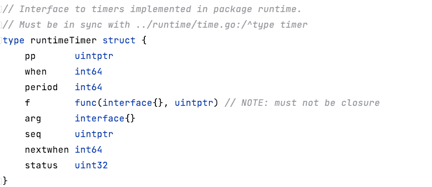

`sleep.timer`真正起作用的是什么

*   `when`，定时器被触发的时间。
*   `f`，回调执行方法。`NewTimer`采用`sendTime`方法简单地向通道发送当前事件，而`AfterFunc`执行一个 goroutine 调用`arg`中的方法。
*   `arg`参数，用于`f`的参数。一个通道传入`NewTimer`，一个`func`传入`AfterFunc`。

正如所见，底层的`runtimeTimer`本身不需要通道，所以`AfterFunc`的实现不是通过通道。

回到`runtimeTimer`，它在内部使用`puintptr`类型，本质上是一个指向当前`g`堆栈的指针。如果有兴趣，了解更多关于 [Go GMP 调度](https://laptrinhx.com/detailed-explanation-of-annual-best-golang-gmp-scheduling-1878446399/)的信息。

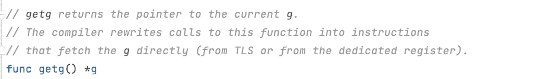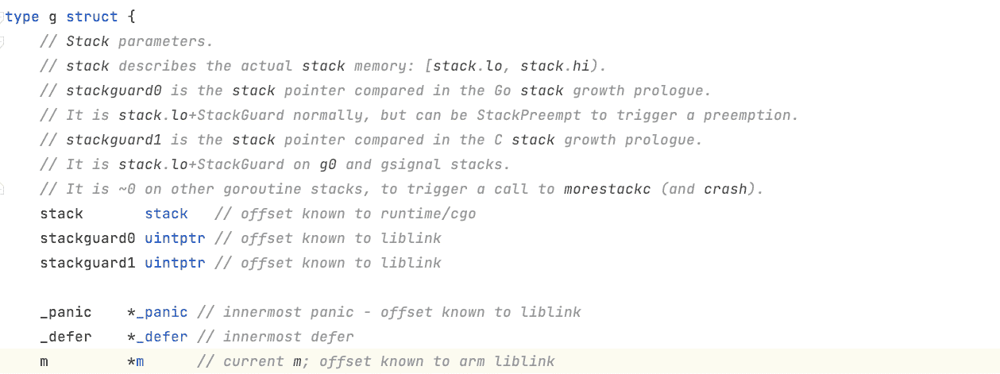

在复杂的`runtimeTimer`中，主要有三个逻辑与`time.Timer`有关。

*   **增加定时器**，其主要逻辑在`doaddtimer(pp *p, t *timer)`中。

类似于`btree`的结构在底层维护定时器的顺序，因此所有插入、执行和复位定时器的操作都涉及到“树”。一个父节点包含 4 个子节点，在执行`insert`时，需要确定新的定时器是否执行的更早。如果是，则需要替换当前父节点。这就是`siftupTimer`方法的工作原理。

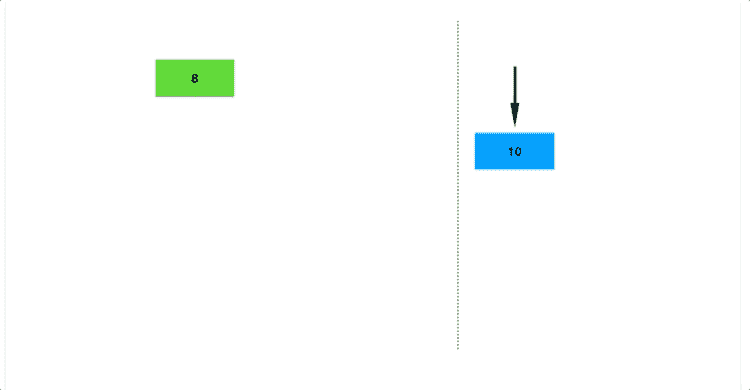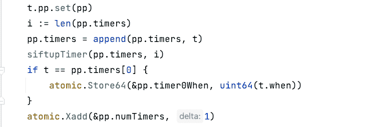

*   **执行定时器**。其主要逻辑发生在`runtimer(pp *p, now int64)`。

通过获取最近的定时器，`p`决定是否执行定时器，它将只在`Waiting`状态下执行定时器。

两个主要逻辑在于定时器执行。首先，确定是否需要重复。如果是，计算下一次执行时间，并将计时器添加到队列中。否则，删除计时器。

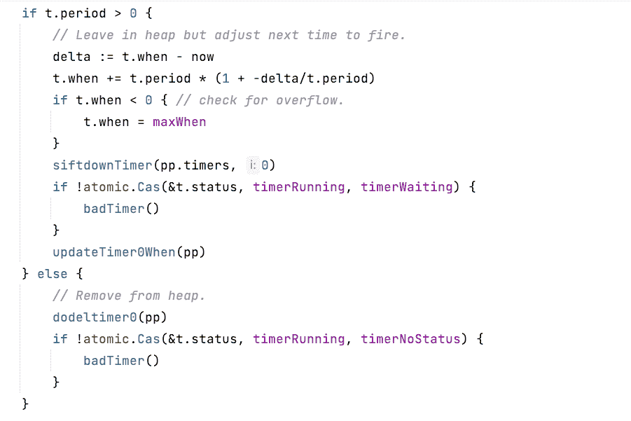

然后获取当前`P`，解锁并执行。

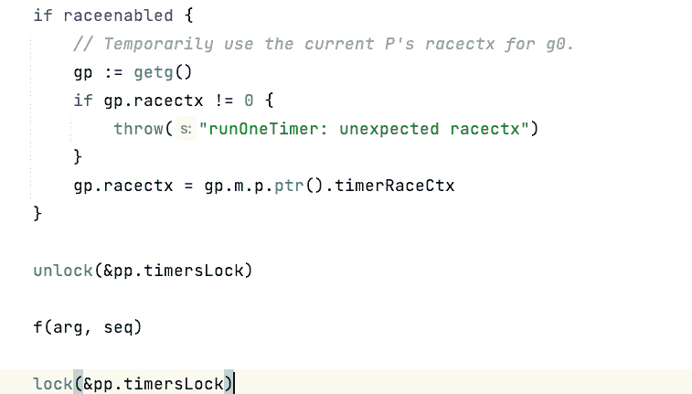

*   **修改定时器状态**。`Stop`和`Reset`将分别调用`stopTimer(t *timer)`和`resettimer(t *timer, when int64)`方法。前者执行删除逻辑，包括树节点的重新排列。后者确保只有当定时器处于`timerNoStatus, timerRemoved`状态时，它才能被重新排队，否则它将返回错误。这也是为什么在使用定时器之前必须执行`Stop`方法的原因。

# 扩展计时器

让我们来看看`timer`在 Kubernetes 中的一些有趣应用。

## 时钟。计时器

[时钟。Timer](https://github.com/kubernetes/utils/blob/master/clock/clock.go) 工具类在调度器中使用较多，是 Kubernetes 中 Go Timer 和 Ticker 的一个包，并增加了时间相关的参数，集所有功能于一身。从时钟接口的定义来看，`PassiveClock`包含了`Now`和`Since`两种常用的时间方法。

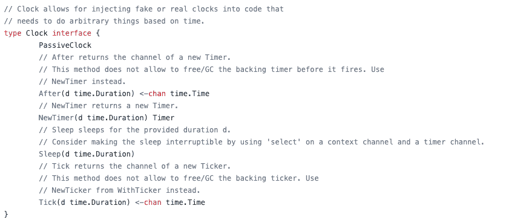

通过将 Clock 与`AfterFunc`和`NewTricker`组合成一个新的接口，可以支持不同的应用场景。另外，提供`[RealClock](https://github.com/kubernetes/utils/blob/3a6ce19ff2f91f3dc49243f90f7834a0f1e4aaf3/clock/clock.go#L85)`来实现所有相关的方法。

## 时间工作者

在[的 TimedWorker](https://github.com/kubernetes/kubernetes/blob/2a821d787b7f21fbb399b0a0bf6d3fa0c79f4293/pkg/controller/nodelifecycle/scheduler/timed_workers.go#L45) 中，直接使用`clock.Timer`，用`AfterFunc`初始化一个包含执行方法的 Worker。

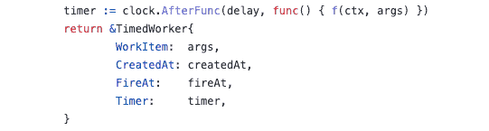

TimedWorker 通过一个 [TimedWorkerQueue](https://github.com/kubernetes/kubernetes/blob/2a821d787b7f21fbb399b0a0bf6d3fa0c79f4293/pkg/controller/nodelifecycle/scheduler/timed_workers.go#L76) 保存，最终在 TaintManager 中的[tainviewonqueue](https://github.com/kubernetes/kubernetes/blob/56062f7f4fc56e038f9ab99042457183896c47bb/pkg/controller/nodelifecycle/scheduler/taint_manager.go#L180)中使用。

调度器还使用`native time.Timer`在`[waitingPodsMap](https://github.com/kubernetes/kubernetes/blob/0b8a665d508a861713398d0480e4789802c70607/pkg/scheduler/framework/runtime/framework.go#L258)`中构建[插件映射](https://github.com/kubernetes/kubernetes/blob/ea0764452222146c47ec826977f49d7001b0ea8c/pkg/scheduler/framework/runtime/waiting_pods_map.go#L75)。这个 PluginMap 包含实现 CSI、CNI 和 CRI 接口的插件，并使调度器能够根据状态[允许](https://github.com/kubernetes/kubernetes/blob/ea0764452222146c47ec826977f49d7001b0ea8c/pkg/scheduler/framework/runtime/waiting_pods_map.go#L130)或[拒绝](https://github.com/kubernetes/kubernetes/blob/ea0764452222146c47ec826977f49d7001b0ea8c/pkg/scheduler/framework/runtime/waiting_pods_map.go#L152) pod。

## 补偿

你可能用过[抖动](https://github.com/kubernetes/kubernetes/blob/353f0a5eabe4bd8d31bb67275ee4beeb4655be3f/staging/src/k8s.io/apimachinery/pkg/util/wait/wait.go#L196)，一个 [utils/wait](https://github.com/kubernetes/kubernetes/blob/353f0a5eabe4bd8d31bb67275ee4beeb4655be3f/staging/src/k8s.io/apimachinery/pkg/util/wait/wait.go#L315) 包里的小工具。Backoff 也是 [utils/wait](https://github.com/kubernetes/kubernetes/blob/353f0a5eabe4bd8d31bb67275ee4beeb4655be3f/staging/src/k8s.io/apimachinery/pkg/util/wait/wait.go#L315) 包中的一个工具，但并不普遍。但是我们不应该在这里跳过它，因为它使用了`clock`。

当实现`Backoff`方法时，需要创建或重置定时器。

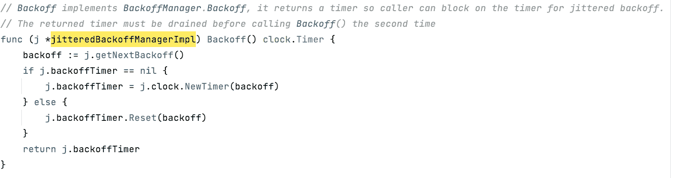

`[Poll](https://github.com/kubernetes/kubernetes/blob/353f0a5eabe4bd8d31bb67275ee4beeb4655be3f/staging/src/k8s.io/apimachinery/pkg/util/wait/wait.go#L442)`的方法也很实用。它可以在一定时间内周期性地执行某个`conditionFunc`(`interval`)，直到条件为真或超时。这里，定时执行和超时是由本机定时器实现的。

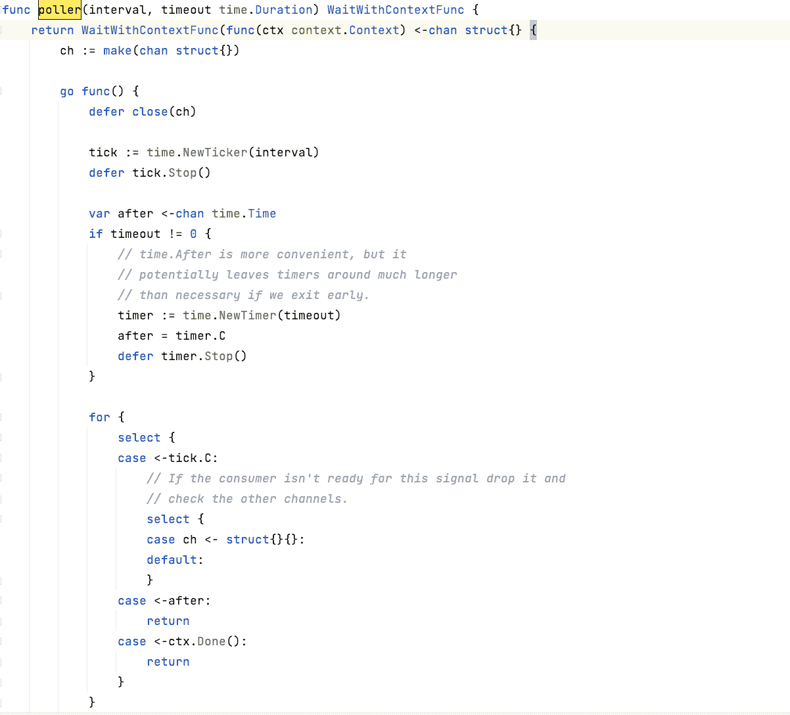

这个方法几乎包含了我们开头提到的标准`timer`和`ticker`用法。

*   定义一个 Ticker，它可以周期性地触发事件到`tick.C`，然后将事件发送到另一个通道。
*   定义一个定时器，包括超时，在 for 循环中使用`select`接收其通道。如果被触发，则返回。
*   从`contionFunc`监控上下文。一旦接收到一个`Done`事件，直接结束。

`timer`和`ticker`都增加了`defer Stop`调用，以避免因未被触发而导致内存泄漏。

## 长队

现在，来看一个用`clock`实现`workqueue`的客户端 go 的例子。细节在这个 [delayingQueue](https://github.com/kubernetes/kubernetes/blob/a88462e901710ab5df1fa6e99a046aa921dcdd55/staging/src/k8s.io/client-go/util/workqueue/delaying_queue.go#L30) 中，执行一个 [waitingLooop](https://github.com/kubernetes/kubernetes/blob/a88462e901710ab5df1fa6e99a046aa921dcdd55/staging/src/k8s.io/client-go/util/workqueue/delaying_queue.go#L70) 方法来决定队列中的作业是否需要被弹出执行。

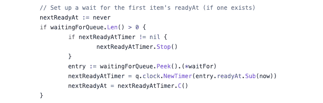

通过不断减少等待时间来定义一个新的`clock.Timer`。thank 然后监听计时器的通道，并最终将数据添加到队列中。

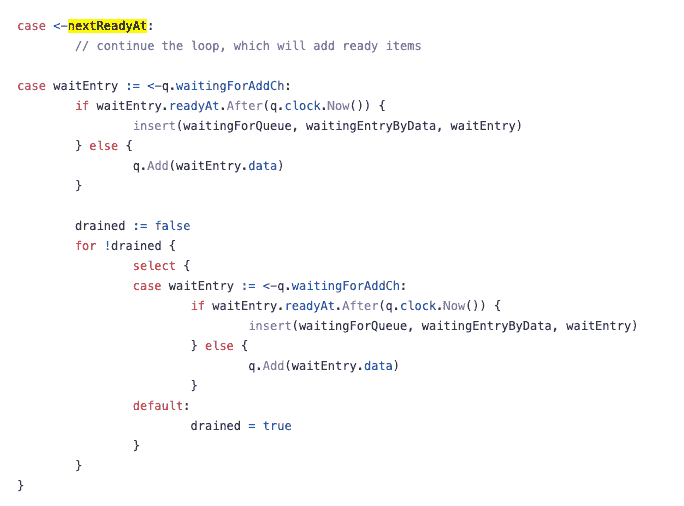

`Timer`在 Kubernetes 中被广泛使用，但不是那么统一，因为使用原生`timer`或`ticker`的旧代码没有被完全重构为`clock`，尽管`clock`已经可以覆盖所有的定时器应用场景。

# 结束了

`Timer`只是 Go 的一个小功能，但如何合理使用避免各种 bug，却绝非易事。在更多情况下，在涉及超时、定时执行或等待的情况下，用`timer`和动作组合编写逻辑是`timer`的最佳实践。

当然，还有更多值得探索的地方。但在此之前，使用它，掌握它。

感谢阅读！