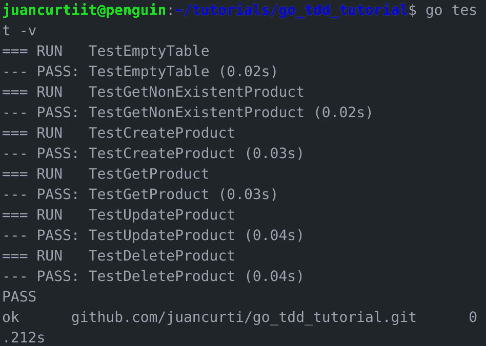

# Go 教程:使用 PostgreSQL 进行数据库查询[第三部分]

> 原文：<https://itnext.io/go-tutorial-database-queries-on-go-with-postgresql-part-iii-c8907729c2f?source=collection_archive---------3----------------------->


戈朗

# 使用 PostgreSQL 进行数据库查询

## 介绍

*注意:这是一个分为 3 部分的教程:*

1.  [安装围棋 ](https://medium.com/@juancurti.it/go-tutorial-getting-started-part-i-f992a711ba49?source=your_stories_page---------------------------)
2.  [*TDD 带 Go 和 PostgreSQL*](https://medium.com/@juancurti.it/go-tutorial-tdd-with-go-and-postgresql-part-ii-489c929f02c9?source=your_stories_page---------------------------)
3.  [*使用 PostgreSQL 进行数据库查询*](https://medium.com/@juancurti.it/go-tutorial-database-queries-on-go-with-postgresql-part-iii-c8907729c2f?source=your_stories_page---------------------------)

## 完成工作

在第二部分，我们最终为我们的方法编写所有的测试，特别是为我们的产品模型。回到我们的 model.go 文件，我们留下了许多“未实现”的消息，所以让我们修复它:

```
func (p *product) getProduct(db *sql.DB) error {
  return db.QueryRow("SELECT name, price FROM products WHERE id=$1",
        p.ID).Scan(&p.Name, &p.Price)
}func (p *product) updateProduct(db *sql.DB) error {
  _, err :=
        db.Exec("UPDATE products SET name=$1, price=$2 WHERE id=$3",
            p.Name, p.Price, p.ID)return err
}func (p *product) deleteProduct(db *sql.DB) error {
  _, err := db.Exec("DELETE FROM products WHERE id=$1", p.ID)return err
}func (p *product) createProduct(db *sql.DB) error {
  err := db.QueryRow(
        "INSERT INTO products(name, price) VALUES($1, $2) RETURNING id",
        p.Name, p.Price).Scan(&p.ID)if err != nil {
        return err
    }return nil
}func getProducts(db *sql.DB, start, count int) ([]product, error) {
  rows, err := db.Query(
        "SELECT id, name,  price FROM products LIMIT $1 OFFSET $2",
        count, start)if err != nil {
        return nil, err
    }defer rows.Close()products := []product{}for rows.Next() {
        var p product
        if err := rows.Scan(&p.ID, &p.Name, &p.Price); err != nil {
            return nil, err
        }
        products = append(products, p)
    }return products, nil
}
```

## 创建路线和处理程序

现在我们可以开始添加位于 app.go 文件中的路线和路线处理程序。为此，首先我们将向 app.go 添加 net/http、encoding/json 和 strconv 模块。

```
func (a *App) getProduct(w http.ResponseWriter, r *http.Request) {
    vars := mux.Vars(r)
    id, err := strconv.Atoi(vars["id"])
    if err != nil {
        respondWithError(w, http.StatusBadRequest, "Invalid product ID")
        return
    }

    p := product{ID: id}
    if err := p.getProduct(a.DB); err != nil {
        switch err {
        case sql.ErrNoRows:
            respondWithError(w, http.StatusNotFound, "Product not found")
        default:
            respondWithError(w, http.StatusInternalServerError, err.Error())
        }
        return
    }

    respondWithJSON(w, http.StatusOK, p)
}
```

这个方法使用 respondWithError 和 respondWithJSON 方法来处理错误和成功响应，所以让我们实现它们:

```
func respondWithError(w http.ResponseWriter, code int, message string) {
    respondWithJSON(w, code, map[string]string{"error": message})
}

func respondWithJSON(w http.ResponseWriter, code int, payload interface{}) {
    response, _ := json.Marshal(payload)

    w.Header().Set("Content-Type", "application/json")
    w.WriteHeader(code)
    w.Write(response)
}
```

现在我们可以实现 getProducts 处理程序了:

```
func (a *App) getProducts(w http.ResponseWriter, r *http.Request) {
    count, _ := strconv.Atoi(r.FormValue("count"))
    start, _ := strconv.Atoi(r.FormValue("start"))

    if count > 10 || count < 1 {
        count = 10
    }
    if start < 0 {
        start = 0
    }

    products, err := getProducts(a.DB, start, count)
    if err != nil {
        respondWithError(w, http.StatusInternalServerError, err.Error())
        return
    }

    respondWithJSON(w, http.StatusOK, products)
}
```

创建产品的处理程序:

```
func (a *App) createProduct(w http.ResponseWriter, r *http.Request) {
    var p product
    decoder := json.NewDecoder(r.Body)
    if err := decoder.Decode(&p); err != nil {
        respondWithError(w, http.StatusBadRequest, "Invalid request payload")
        return
    }
    defer r.Body.Close()

    if err := p.createProduct(a.DB); err != nil {
        respondWithError(w, http.StatusInternalServerError, err.Error())
        return
    }

    respondWithJSON(w, http.StatusCreated, p)
}
```

更新产品的处理程序:

```
func (a *App) updateProduct(w http.ResponseWriter, r *http.Request) {
    vars := mux.Vars(r)
    id, err := strconv.Atoi(vars["id"])
    if err != nil {
        respondWithError(w, http.StatusBadRequest, "Invalid product ID")
        return
    }

    var p product
    decoder := json.NewDecoder(r.Body)
    if err := decoder.Decode(&p); err != nil {
        respondWithError(w, http.StatusBadRequest, "Invalid resquest payload")
        return
    }
    defer r.Body.Close()
    p.ID = id

    if err := p.updateProduct(a.DB); err != nil {
        respondWithError(w, http.StatusInternalServerError, err.Error())
        return
    }

    respondWithJSON(w, http.StatusOK, p)
}
```

删除产品的处理程序:

```
func (a *App) deleteProduct(w http.ResponseWriter, r *http.Request) {
    vars := mux.Vars(r)
    id, err := strconv.Atoi(vars["id"])
    if err != nil {
        respondWithError(w, http.StatusBadRequest, "Invalid Product ID")
        return
    }

    p := product{ID: id}
    if err := p.deleteProduct(a.DB); err != nil {
        respondWithError(w, http.StatusInternalServerError, err.Error())
        return
    }

    respondWithJSON(w, http.StatusOK, map[string]string{"result": "success"})
}
```

## 定义路线

现在我们有了处理程序，我们实现一个方法 initializeRoutes 来指定路由名称和方法:

```
func (a *App) initializeRoutes() {
    a.Router.HandleFunc("/products", a.getProducts).Methods("GET")
    a.Router.HandleFunc("/product", a.createProduct).Methods("POST")
    a.Router.HandleFunc("/product/{id:[0-9]+}", a.getProduct).Methods("GET")
    a.Router.HandleFunc("/product/{id:[0-9]+}", a.updateProduct).Methods("PUT")
    a.Router.HandleFunc("/product/{id:[0-9]+}", a.deleteProduct).Methods("DELETE")
}
```

在 Initialize 方法的底部，我们调用 initializeRoutes:

```
a.initializeRoutes()
```

最后，我们完成了我们运行方法:

```
log.Fatal(http.ListenAndServe(":8010", a.Router))
```

如果现在我们用 go test -v 再次运行测试:



# 结论

本教程展示了如何使用测试驱动开发，使用 Gorilla Mux 和 PostgresSQL 通过 Go 语言构建 REST API。在测试你自己的代码的同时学习一门新的编程语言不仅会让你对你的代码有更多的控制，而且你还会通过测试来学习。这样你就可以在 编写测试之前开始思考如何防止你的代码失败。尽管存在人为错误，但测试是一种很好的实践。