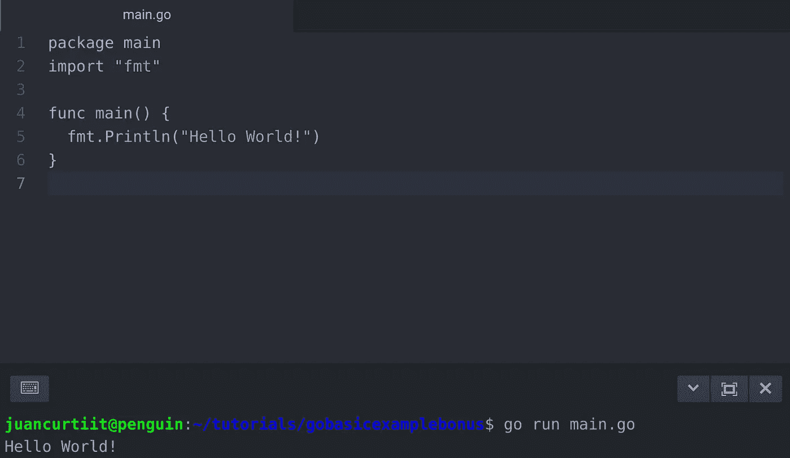

# Go 教程:入门[第一部分]

> 原文：<https://itnext.io/go-tutorial-getting-started-part-i-f992a711ba49?source=collection_archive---------5----------------------->


戈朗

# 简介:安装 Go

## 介绍

*注意:这是一个分为 3 部分的教程:*

1.  [安装围棋 ](https://medium.com/@juancurti.it/go-tutorial-getting-started-part-i-f992a711ba49?source=your_stories_page---------------------------)
2.  [*TDD 带 Go 和 PostgreSQL*](https://medium.com/@juancurti.it/go-tutorial-tdd-with-go-and-postgresql-part-ii-489c929f02c9?source=your_stories_page---------------------------)
3.  [*使用 PostgreSQL 进行数据库查询*](https://medium.com/@juancurti.it/go-tutorial-database-queries-on-go-with-postgresql-part-iii-c8907729c2f?source=your_stories_page---------------------------)

在 2020 年，学习围棋变得容易多了，有很多资源，这是一种正在迅速发展的语言，伴随着它的社区。对于那些还不知道是什么的人来说，Go 是由 Google 开发的一种编译的、静态类型的编程语言。用 Go 编写的应用程序的例子有 Docker 和 Kubernetes。

## 安装 Go

在我的例子中，我有一台 pixel book(i7–16GB RAM 版本)，所以我将遵循 Linux 的说明；对于操作系统的其余部分，在[https://golang.org/doc/install](https://golang.org/doc/install)上有详细说明。

首先，我们需要下载最新版本的 Go。我们用 wget 命令下载这个包，并将其解压缩到/usr/local 文件夹中:

```
wget -c https://dl.google.com/go/go1.14.2.linux-amd64.tar.gz -O - | sudo tar -xz -C /usr/local
```

然后我们需要更新路径。我们打开。bashrc 文件:

```
vi ~/.bashrc
```

我们添加以下几行:

```
if [ -d "/usr/local/go/bin" ] ; then
        PATH="$PATH:/usr/local/go/bin"
fi
```

别忘了用 wq 保存！命令，并重新加载它:

```
wq!
source ~/.bashrc
```

## 结论

搞定了。Go 已安装。在下一部分(链接在本文的顶部)，我们将开始一个新项目，使用测试驱动开发、PostgreSQL 和 Gorilla Mux。然而，出于本教程的目的，我们将创建一个基本的 Go 文件并编译它，以再次检查我们是否正确安装了所有的东西，这样我们就可以深入本教程了。

## 奖金:基本示例

我们将使用 Go 语言创建一个简单的 Hello World 来检查我们是否正确安装了所有的东西。创建一个新文件(main.go ),并添加以下代码:

```
package main
import “fmt”func main() {
 fmt.Println(“Hello World!”)
}
```

要在终端中执行代码，请键入:

```
go run main.go
```



如果“你好世界！”被打印出来，那么 Go 就可以正常工作了，我们可以按照教程来做了。**进入**下一部分(看我在那里做了什么？)来深入一个更实际的例子:用测试驱动开发编写的 CRUD API。