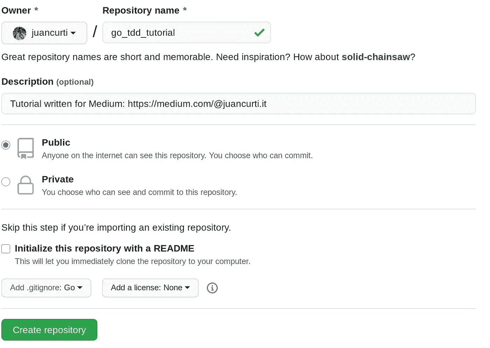
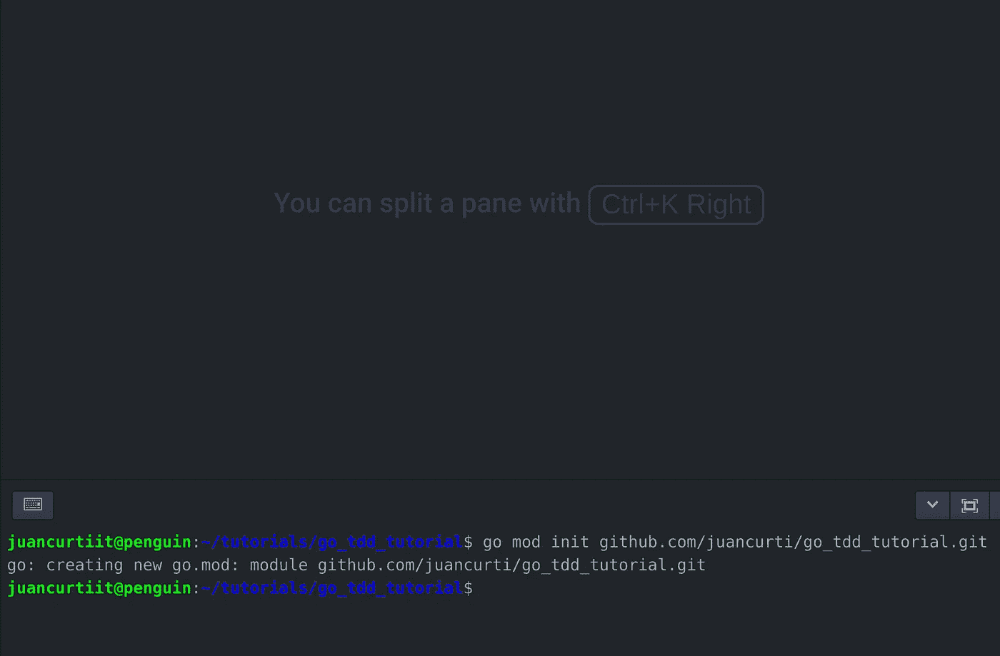
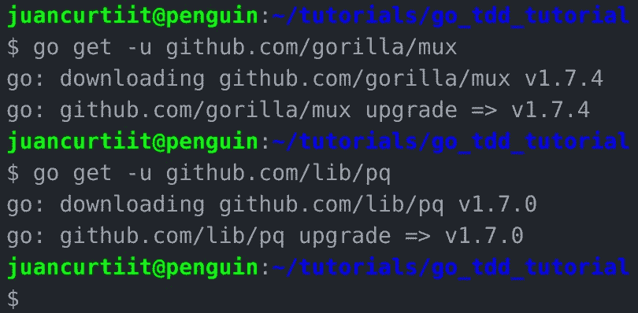
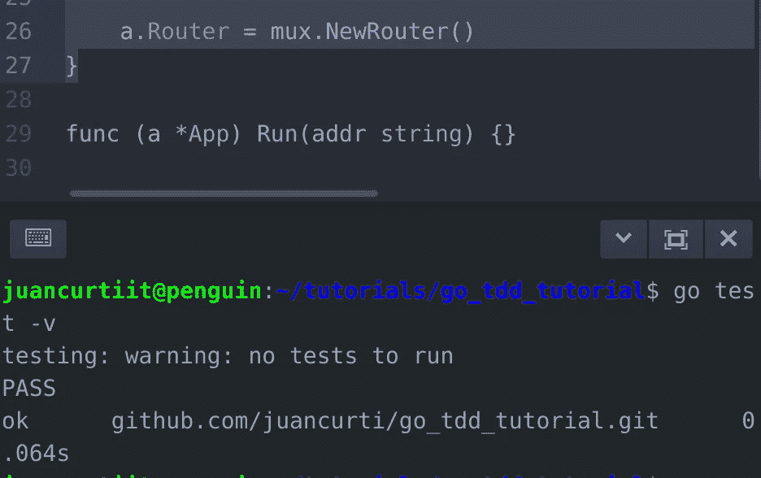
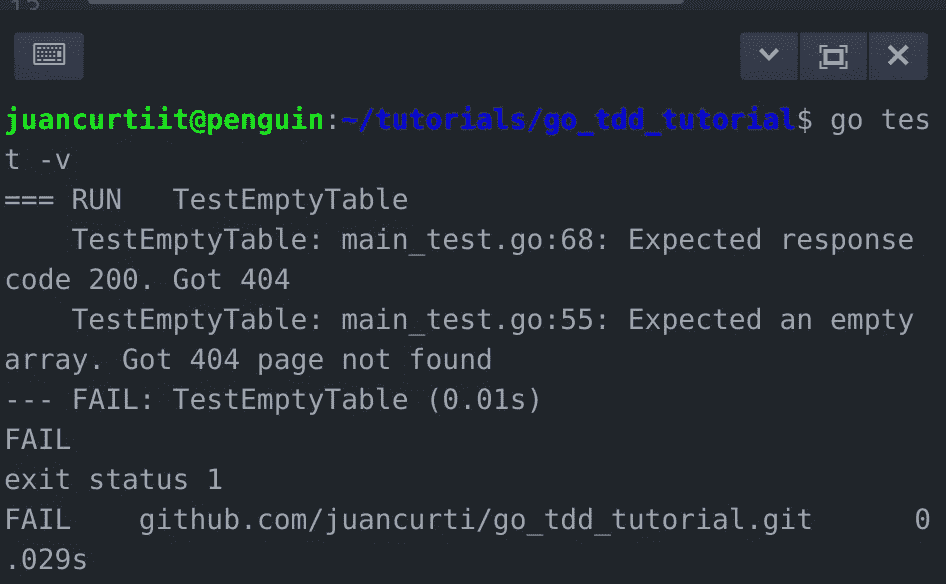

# Go 教程:使用 Go 和 PostgreSQL 的 TDD 第二部分]

> 原文：<https://itnext.io/go-tutorial-tdd-with-go-and-postgresql-part-ii-489c929f02c9?source=collection_archive---------1----------------------->


戈朗

# *带 Go 和 PostgreSQL 的 TDD*

## 介绍

*注意:这是一个分为 3 部分的教程:*

1.  [安装 Go](https://medium.com/@juancurti.it/go-tutorial-getting-started-part-i-f992a711ba49?source=your_stories_page---------------------------)
2.  [*TDD 带 Go 和 PostgreSQL*](https://medium.com/@juancurti.it/go-tutorial-tdd-with-go-and-postgresql-part-ii-489c929f02c9?source=your_stories_page---------------------------)
3.  [*使用 PostgreSQL 进行数据库查询*](https://medium.com/@juancurti.it/go-tutorial-database-queries-on-go-with-postgresql-part-iii-c8907729c2f?source=your_stories_page---------------------------)

# 我们要建造什么？

这个项目的范围是从头开始(从创建 git 存储库开始)构建一个 REST API 和 Go 的例子，包括路由、数据库获取(PostgreSQL ),并通过测试驱动开发开始。

## 用 Docker 启动 PostgreSQL

首先，我们需要在您的机器上安装 PostgreSQL。我更喜欢在 PostgreSQL 中使用 Docker 容器。安装数据库本身是一个不同的主题，因此我将简要解释如何使用 PostgreSQL 数据库启动 Docker 容器:

```
docker run -d -p 5432:5432 --name my-postgres -e POSTGRES_PASSWORD=12345 postgres
```

要访问数据库和终端，我们使用以下命令:

```
sudo docker exec -it my-postgres bash
psql -U postgres
```

如果我们想本地连接到 PostgreSQL 命令行，我们使用:

```
psql -h localhost -p 5432 -U postgres -W
```

## 我们一起去吧

我们将开始创建 Git 库，包括 Go .gitignore。我将使用 Github.com 作为个人选择。



下一步是克隆我们的 git 存储库，在我的例子中:

```
git clone [https://github.com/juancurti/go_tdd_tutorial.git](https://github.com/juancurti/go_tdd_tutorial.git)
```

然后，我们需要初始化我们的 Go 存储库，需要在我们的根文件夹中。这将创建一个 go.mod。键入以下命令，用您自己的命令替换 GITREPOSITORY，不带“https://”前缀:

```
go mod init github.com/GITREPOSITORY
```



现在我们需要获取将要使用的 Go 模块，在本例中是 Gorilla Mux 和 PostgreSQL。

```
go get -u github.com/gorilla/mux 
go get -u github.com/lib/pq
```



让我们首先为我们的应用程序创建一个 app.go 文件。在这个文件中，我们将定义一个结构(App)来保存对路由器和数据库的引用。为了有用和可测试，我们的应用程序结构需要两个方法来初始化和运行应用程序。

```
package mainimport (
 “database/sql”“github.com/gorilla/mux”
 _ “github.com/lib/pq”
)type App struct {
 Router *mux.Router
 DB *sql.DB
}func (a *App) Initialize(user, password, dbname string) { }
func (a *App) Run(addr string) {}
```

Initialize 方法获取与 PostgreSQL 数据库建立连接所需的参数，而 Run 方法启动应用程序。
我们还将创建一个 main.go 文件，这是应用程序的入口点，代码如下:

```
package mainimport “os”func main() {
 a := App{}
 a.Initialize(
   os.Getenv(“APP_DB_USERNAME”),
   os.Getenv(“APP_DB_PASSWORD”),
   os.Getenv(“APP_DB_NAME”),
 )
 a.Run(“:8001”)
}
```

为了保护我们的代码，大多数程序员都会同意，我们必须避免暴露代码中的凭证，这些凭证将被推送到 Github，并(可能)可供数百万人使用。我们将使用环境变量。然后，我们将在终端中键入以下命令来导出我们的凭据:

```
export APP_DB_USERNAME=postgres
export APP_DB_PASSWORD=
export APP_DB_NAME=postgres
```

最后，创建一个 CRUD 应用程序，我们需要一些被请求的东西。出于教程的需要，我们将使用通用的“产品”。为此，我们将添加一个包含以下内容的 model.go 文件:

```
package mainimport (
 “database/sql”
)type product struct {
 ID int `json:”id”`
 Name string `json:”name”`
 Price float64 `json:”price”`
}func (p *product) getProduct(db *sql.DB) error {
 return errors.New(“Not implemented”)
}func (p *product) updateProduct(db *sql.DB) error {
 return errors.New(“Not implemented”)
}func (p *product) deleteProduct(db *sql.DB) error {
 return errors.New(“Not implemented”)
}func (p *product) createProduct(db *sql.DB) error {
 return errors.New(“Not implemented”)
}func getProducts(db *sql.DB, start, count int) ([]product, error) {
 return nil, errors.New(“Not implemented”)
}
```

现在我们已经创建了基础模型，我们可以开始编写测试了。为了在开发过程中开始测试，我们可以针对数据库开始运行测试，特别是确保它被正确设置。我们将在 main_test.go 文件中使用 TestMain 函数，并使用“a”变量来表示我们想要测试的应用程序。我们将编写以下代码，然后我将解释我们刚刚编写的内容:

```
package mainimport (
 “os”
 “testing”
 “log”
)var a Appfunc TestMain(m *testing.M) {
 a.Initialize(
 os.Getenv(“APP_DB_USERNAME”),
 os.Getenv(“APP_DB_PASSWORD”),
 os.Getenv(“APP_DB_NAME”),
)ensureTableExists()
 code := m.Run()
 clearTable()
 os.Exit(code)
}func ensureTableExists() {
 if _, err := a.DB.Exec(tableCreationQuery); err != nil {
 log.Fatal(err)
 }
}func clearTable() {
 a.DB.Exec(“DELETE FROM products”)
 a.DB.Exec(“ALTER SEQUENCE products_id_seq RESTART WITH 1”)
}const tableCreationQuery = `CREATE TABLE IF NOT EXISTS products
(
 id SERIAL,
 name TEXT NOT NULL,
 price NUMERIC(10,2) NOT NULL DEFAULT 0.00,
 CONSTRAINT products_pkey PRIMARY KEY (id)
)`
```

在函数“ensureTableExists”上，我们确保我们想要测试的表是可用的。为了做到这一点，我们在创建 SQL 脚本时创建了一个常量。我们所有的测试都是通过调用 m.Run()来执行的，之后我们调用 clearTable()来清理数据库。

最后，我们需要在 app.go 中实现 App 的 Initialize 方法，建立与数据库的连接，初始化路由器。
我们需要先添加“fmt”和“log ”,以便开始初始化方法。

针对以下内容替换 app.go 上的导入:

```
import (
    "database/sql"
    "fmt"
    "log" "github.com/gorilla/mux"
    _ "github.com/lib/pq"
)
```

并替换以下初始化方法:

```
func (a *App) Initialize(user, password, dbname string) {
 connectionString := fmt.Sprintf(“user=%s password=%s dbname=%s sslmode=disable”, user, password, dbname)var err error
 a.DB, err = sql.Open(“postgres”, connectionString)
 if err != nil {
 log.Fatal(err)
 }a.Router = mux.NewRouter()
}
```

此时，如果我们执行以下命令，我们应该会看到“没有要运行的测试”:

```
go test -v
```



# 为 API 编写测试

为了开始处理请求，我们需要实现“net/http”库。为此，在 main_test.go 中，我们将其添加到导入中，如下所示:

```
import (
 “os”
 “testing”
 “log”"net/http"
"net/http/httptest"
)
```

让我们首先用一个空表测试对/products 端点的响应:

```
func TestEmptyTable(t *testing.T) {
    clearTable()

    req, _ := http.NewRequest("GET", "/products", nil)
    response := executeRequest(req)

    checkResponseCode(t, http.StatusOK, response.Code)

    if body := response.Body.String(); body != "[]" {
        t.Errorf("Expected an empty array. Got %s", body)
    }
}
```

该测试从 products 表中删除所有记录，并向/products 端点发送 GET 请求。我们使用两个助手方法，executeRequest 和 checkResponseCode:

```
func executeRequest(req *http.Request) *httptest.ResponseRecorder {
    rr := httptest.NewRecorder()
    a.Router.ServeHTTP(rr, req)

    return rr
}func checkResponseCode(t *testing.T, expected, actual int) {
    if expected != actual {
        t.Errorf("Expected response code %d. Got %d\n", expected, actual)
    }
}
```

如果您再次运行测试，您应该得到以下结果:



现在我们可以添加另一个测试了！这个函数将在获取一个不存在的产品时检查响应**(注意，在这种情况下，我们需要添加 encoding/json 模块，就像我们对 net/http)** 所做的一样)。

```
func TestGetNonExistentProduct(t *testing.T) {
    clearTable()

    req, _ := http.NewRequest("GET", "/product/11", nil)
    response := executeRequest(req)

    checkResponseCode(t, http.StatusNotFound, response.Code)

    var m map[string]string
    json.Unmarshal(response.Body.Bytes(), &m)
    if m["error"] != "Product not found" {
        t.Errorf("Expected the 'error' key of the response to be set to 'Product not found'. Got '%s'", m["error"])
    }
}
```

然后，我们添加另一个测试来创建一个产品(**实现字节模块**)(注意，当使用解组时，整数被转换为浮点数，所以当我们比较 id 和 1 时，我们需要使用 1.0)

```
func TestCreateProduct(t *testing.T) {
 clearTable()var jsonStr = []byte(`{“name”:”test product”, “price”: 11.22}`)
 req, _ := http.NewRequest(“POST”, “/product”, bytes.NewBuffer(jsonStr))
 req.Header.Set(“Content-Type”, “application/json”)response := executeRequest(req)
 checkResponseCode(t, http.StatusCreated, response.Code)var m map[string]interface{}
 json.Unmarshal(response.Body.Bytes(), &m)if m[“name”] != “test product” {
 t.Errorf(“Expected product name to be ‘test product’. Got ‘%v’”, m[“name”])
 }if m[“price”] != 11.22 {
 t.Errorf(“Expected product price to be ‘11.22’. Got ‘%v’”, m[“price”])
 }if m[“id”] != 1.0 {
 t.Errorf(“Expected product ID to be ‘1’. Got ‘%v’”, m[“id”])
 }
}
```

为了测试获取产品，我们将使用稍后将在**中使用的 helper 函数实现一个测试(注意，我们将使用 strconv 模块，我们需要像以前一样导入它)**:

```
func TestGetProduct(t *testing.T) {
    clearTable()
    addProducts(1)

    req, _ := http.NewRequest("GET", "/product/1", nil)
    response := executeRequest(req)

    checkResponseCode(t, http.StatusOK, response.Code)
}func addProducts(count int) {
    if count < 1 {
        count = 1
    }

    for i := 0; i < count; i++ {
        a.DB.Exec("INSERT INTO products(name, price) VALUES($1, $2)", "Product "+strconv.Itoa(i), (i+1.0)*10)
    }
}
```

要测试产品的更新:

```
func TestUpdateProduct(t *testing.T) {

    clearTable()
    addProducts(1)

    req, _ := http.NewRequest("GET", "/product/1", nil)
    response := executeRequest(req)
    var originalProduct map[string]interface{}
    json.Unmarshal(response.Body.Bytes(), &originalProduct)

    var jsonStr = []byte(`{"name":"test product - updated name", "price": 11.22}`)
    req, _ = http.NewRequest("PUT", "/product/1", bytes.NewBuffer(jsonStr))
    req.Header.Set("Content-Type", "application/json")

    response = executeRequest(req)

    checkResponseCode(t, http.StatusOK, response.Code)

    var m map[string]interface{}
    json.Unmarshal(response.Body.Bytes(), &m)

    if m["id"] != originalProduct["id"] {
        t.Errorf("Expected the id to remain the same (%v). Got %v", originalProduct["id"], m["id"])
    }

    if m["name"] == originalProduct["name"] {
        t.Errorf("Expected the name to change from '%v' to '%v'. Got '%v'", originalProduct["name"], m["name"], m["name"])
    }

    if m["price"] == originalProduct["price"] {
        t.Errorf("Expected the price to change from '%v' to '%v'. Got '%v'", originalProduct["price"], m["price"], m["price"])
    }
}
```

最后，为了测试产品的删除:

```
func TestDeleteProduct(t *testing.T) {
    clearTable()
    addProducts(1)

    req, _ := http.NewRequest("GET", "/product/1", nil)
    response := executeRequest(req)
    checkResponseCode(t, http.StatusOK, response.Code)

    req, _ = http.NewRequest("DELETE", "/product/1", nil)
    response = executeRequest(req)

    checkResponseCode(t, http.StatusOK, response.Code)

    req, _ = http.NewRequest("GET", "/product/1", nil)
    response = executeRequest(req)
    checkResponseCode(t, http.StatusNotFound, response.Code)
}
```

# 结论

这一章是关于编写测试方法的。在下一部分中，我们将实现数据库查询并通过所有这些测试。编写测试可能是乏味的工作，但是为了避免不必要的错误和人为错误，这是非常必要的。