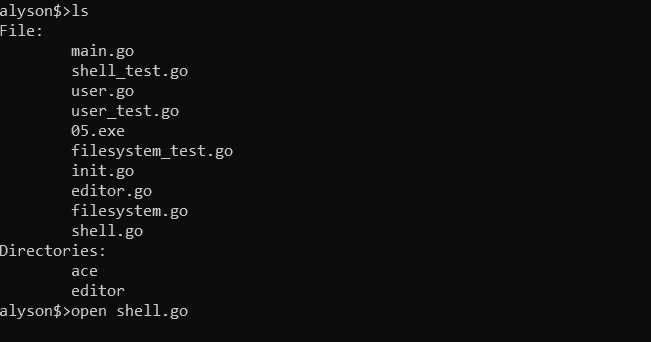
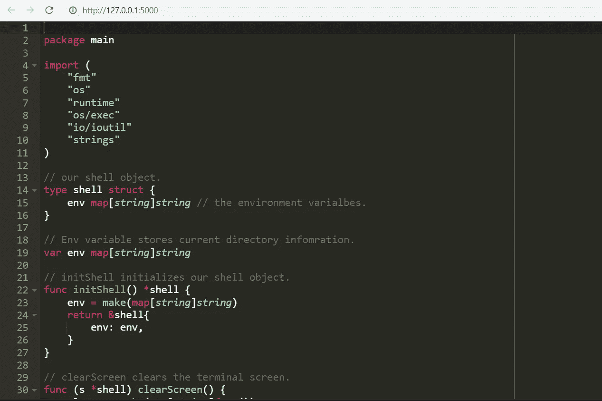
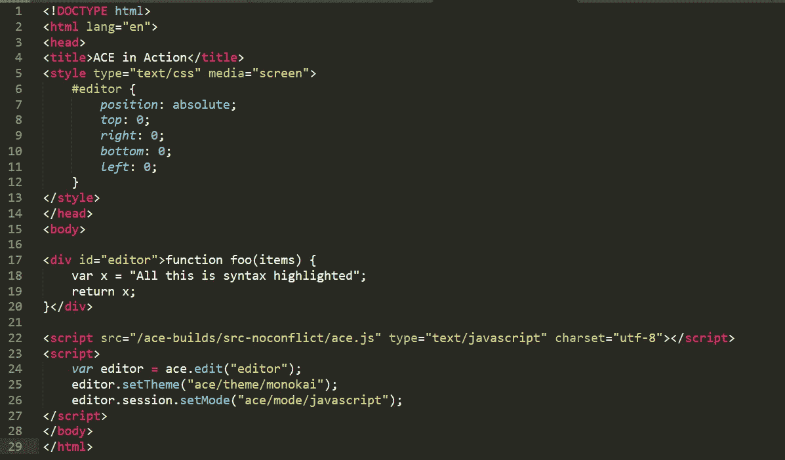
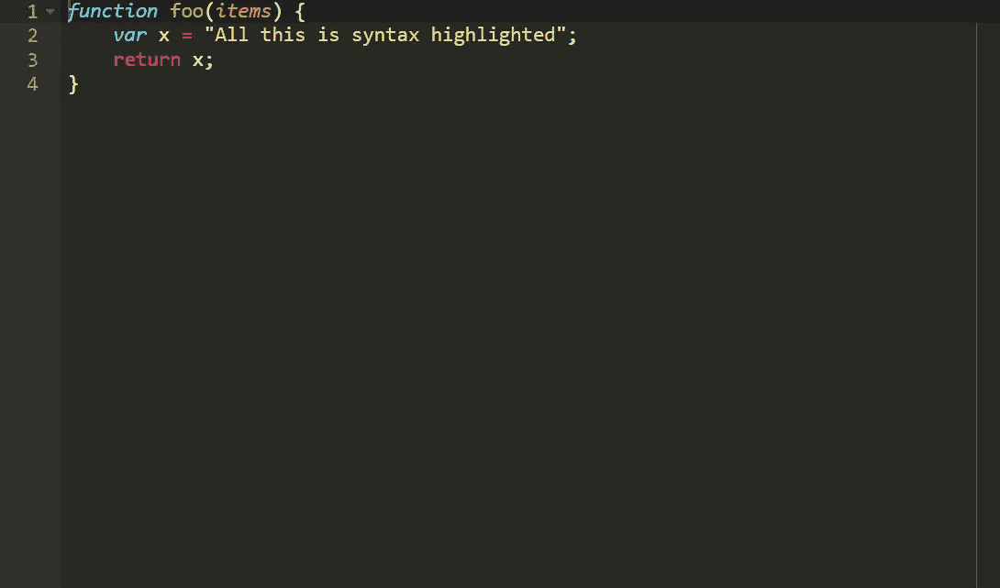

# 转到虚拟文件系统—添加文本编辑器

> 原文：<https://itnext.io/go-virtual-filesystem-adding-a-text-editor-176f082e0109?source=collection_archive---------1----------------------->

请将此视为项目中的项目，因为这将很难…


我们本周又回来了，读者！与我之前关于接下来会发生什么的声明相反，protobuf(协议缓冲区)本周将被搁置。我开始工作，但后来我开始玩角色 4，发现自己无法停止。扮演一个时间管理能力极差的人，我觉得很吸引人，很难让自己离开。

但是让我们进入本周的话题；文本编辑器。

有趣的是，我决定使用编辑器，因为它似乎比文件系统映像更容易；我真是太天真了。

# 屡试不爽的策略

1.  **拆开 kilo-in-go 并把它放进我的文件系统**

我对文本编辑器做了三次迭代；每一次都让我不断反思我将要被迫做的大量工作。我想到的第一个绝妙的主意是使用 kilo-in-go 编辑器(参见 repo:[https://github.com/bediger4000/kilo-in-go](https://github.com/bediger4000/kilo-in-go))，进入它的源代码，把它拆成碎片，然后把这些碎片直接重建到我的文件系统源代码中，我们就有了一个类似 vim 的编辑器。

理论上这是一个伟大的计划，如果不是因为 Windows 坚持要与众不同，我也不会得逞。是的，我完全被 Windows 和 Linux/Mac 之间的架构差异挫败了，因为让 kilo 编辑器工作的系统调用在 Windows 中根本不存在。

所以即使我把它集成到了，它也能在 Linux 上工作，但在 Windows 上不行。

**外卖**:

当我最终(可能)实现特定于操作系统的差异，使我的文件系统真正不可知时(参见文件路径中的`/`和`\\`差异)，为 Linux 用户添加 Kilo 编辑器，我仍然认为这是一个很酷的想法，也是一个有趣的周末项目。

**2。在浏览器窗口中运行编辑器(Flask 版本)**

我对 web 编程无法控制的恐惧让这种方法有点难以下咽，因为这似乎是唯一的选择。但是当我在最后期限(我完全知道我错过了)的时候，我选择了背叛你的信任和我自己的尊严，回到用 Python 写这一小段(毕竟在 Go 中不是那么虚拟的文件系统)。

这个计划有点复杂，因为将两种语言混合在一起看起来有点混乱和缓慢。控制流如下所示:

*   用户在文件系统中输入`open filename`。
*   目标文件的`content`字段的内容将被写入主机操作系统磁盘上名为`TEST`的本地文件。
*   使用 Golang 函数`exec.Command()`，Flask python 应用程序将在后台运行。
*   Flask 使用`ace`文本编辑器 JavaScript 库读取`TEST`文件的内容，并在`127.0.0.1:5000`在浏览器中显示。
*   当在浏览器中工作时，编辑器`Ctrl+S`被映射为将编辑器的内容发送到 Flask 后端，在那里它将被写入`TEST`。
*   在退出浏览器和 Flask 应用程序时，文件系统将恢复其执行，从`TEST`读取新保存的内容，并将其写入适当的`filename`文件结构的`content`字段。
*   `TEST`被删除。

到目前为止，除了关闭 Flask 应用程序的时刻，使用 Ctrl+C 将退出一切；包括文件系统。

最后，我无法摆脱不学习如何在 Go 中进行 web 开发的困境。因此，新的计划将是通过教程地狱去准备网络编程和快速训练蒙太奇后，是时候采取另一个尝试。

# 最终结果——一个有效的编辑器

最终结果还不错，它是这样运行的:



在文件系统 shell 中运行 open 命令



使用 ace 文本编辑器 Javascript 框架在浏览器中打开 shell.go。

就像这样，我们有一个全功能的文本编辑器，Ctrl+S 映射到文件保存，关闭浏览器选项卡也关闭文件。

## Go 网络服务器

使用我对 flask 服务器的相同想法，我的计划是做完全相同的事情，但是在 Go 中。这也可以让我去掉设计中很多丑陋的部分；一个很大的问题是那个讨厌的`TEST`文件，并且依赖于对它的读写。Go 中的一切将允许我们把一切都整齐地限制在文件系统内部的机制中。

所以现在，`open`将触发 web 服务器的启动，一旦我们首先确认我们想要编辑的文件存在。

```
func (fs  * fileSystem) open(filename string) error {
 if _, exists := fs.files[filename]; exists {
  editingFile = fs.files[filename]
  editor()
 } else {
  fmt.Println(filename, ": file doesn't exist.")
 }
 return nil
}
```

在上面的代码中，我们首先确定我们想要编辑的文件是否存在，如果存在，将它作为我们将要处理的文件赋给全局变量`editingFile`，然后最后调用恰当命名的`editor()`函数来完成剩下的工作。

## 文本编辑器服务器

我们的文本编辑器运行一个小型 web 服务器，它在端口 127.0.0.1:5000 打开，以文本编辑器的形式显示我们正在处理的当前文件的内容。

该功能由两个重要部分组成。第一个确保 Ctrl+C 在您的终端中被禁用。我发现这是一个有趣的用户体验问题，因为我测试它的朋友坚持在终端中使用 Ctrl+C 杀死文本编辑器。这当然只是退出了整个文件系统，所以我不得不用一个有用的终端消息完全禁止这种用法，如果你尝试…

```
Interrupt cancelled. Close text editor tab at :127.0.0.1:5000
```

编辑器的完整源代码如下。

```
func editor() {
 mux := http.NewServeMux()
 c := make(chan os.Signal, 1)
 signal.Notify(c, os.Interrupt)
 go func() {
  for sig := range c {
   fmt.Println("Interrupt cancelled. Close text editor tab at :127.0.0.1:5000;", sig)
  }
 }()openbrowser("[http://127.0.0.1:5000](http://127.0.0.1:5000)")
 server := http.Server{Addr: ":5000", Handler: mux}
 mux.HandleFunc("/", indexHandler)
 mux.HandleFunc("/save", saveHandler)
 mux.HandleFunc("/shutdown", shutDown)
 server.ListenAndServe()
}
```

浏览器的第一部分就是这样做的；它接受 SIGINT(信号中断)的值，即 Ctrl+C，并删除其功能。所以每次按 Ctrl+C 时，代码

```
fmt.Println("Interrupt cancelled. Close text editor tab at :127.0.0.1:5000;", sig)
```

改为运行。

下一个函数`openbrowser`负责在终端中输入`open filename`后立即在浏览器中打开编辑器。这是我发现的最自然的方法，我可以立即模拟打开一个文本编辑器。输入打开后导航只是觉得很傻，所以我把这个扔在那里。

最后几个组件是`handleFunc`方法。这些基本上将函数与它们各自的端点联系起来，因此任何时候这些 URL 被访问或以某种方式被请求，这些动作将触发这些提到的函数处理程序中的代码；`indexHandler`处理主文本编辑器，`saveHandler`处理文件的保存，`shutDown`处理关闭我们的编辑器并继续前进的时候关闭服务器。

为了避免这篇文章太长，成为另一个基本的 web dev Go 教程，我将在这里结束对一般服务器内容的描述，转到编辑器细节。如果你想了解更多关于 Go 的网页开发，我强烈推荐你在这里找到的新生科技的教程；[https://freshman.tech/web-development-with-go/](https://freshman.tech/web-development-with-go/)。我为这篇文章做了这篇文章，我可以说这是我做过的最好的文章之一。

好了，接下来讲一点 JavaScript。

## 让我们做一点网络开发

我认为有必要回顾一下我发现颇具挑战性的一些网络内容；同样部分是因为我缺乏浏览器方面的技能，也因为 ace 编辑器的 JS 库是一个美丽的、隐藏的、基本上没有文档记录的宝石，我希望给它一点曝光。

我不是在开玩笑，伙计们，我绝对喜欢这个图书馆。

因此，让我们稍微检查一下`ace`编辑器代码。

## 所有东西都是王牌

Ace JS 库允许你直接在你的网站上构建一个文本编辑器 UI，看起来和 Sublime Text Editor 的设计很相似。可以在这里找到:[https://ace.c9.io/](https://ace.c9.io/)。

ace 编辑器代码示例:



源代码



输出

当试图制作一个浏览器编辑器时，要记住的主要事情是首先能够模板化“源代码”部分，这样你的代码可以保持动态。想想在 Go 中使用类似于`jinja`的 Flask 或`template`包。您可以将上面 HTML 中第 17 到 20 行的代码替换为如下代码:

```
<div id="editor">{{ source_code }}</div>
```

附带的后端代码如下所示。

```
var source_code = open("source_file.go")
return Render("editor.html", source_code=source_code)
```

上面是写得很差的伪代码，只是为了让大家了解这是如何工作的，以及我是如何做到的。如果你以前从未使用过 Go 的模板系统，你需要做更多的工作，它看起来有点不同，但想法非常相似。

要说本文使用的具体代码，这个可以在`indexHandler`函数中找到；

```
func indexHandler(w http.ResponseWriter, r *http.Request) {
 buf := &bytes.Buffer{}

 source := &sourceCode{
  Code: string(editingFile.content),
  Ext: "golang",
 }
 err := tpl.Execute(buf, source)
 if err != nil {
  fmt.Println("Error")
  http.Error(w, err.Error(), http.StatusInternalServerError)
  return
 }
 buf.WriteTo(w)
}
```

重要的细节是`souceCode`结构初始化器和`tpl.Execute`行。简而言之；`sourceCode`对象将被传入 HTML，其值`Code`和`Ext`将是文本编辑器中的动态元素，负责显示打开文件的源代码，而`Ext`将负责根据您使用的语言分配正确的编辑器颜色和高亮显示。这里它被硬编码为`golang` …只是因为…

在 HTML 中；您可以分别在第 17 行和第 25 行找到它们(希望我没有在代码中的任何地方意外添加 ENTER)。

```
<div id="editor">{{ .Code }}</div>
...editor.session.setMode("ace/mode/{{ .Ext }}");
```

我添加的编辑器的另一个部分是重新映射 Ctrl+S 快捷键，当在浏览器中使用时，它会给你提供保存当前网页的选项。

这还不够，所以我把这个也改了。

## 快速储蓄

我既惊讶又不惊讶地发现，你可以覆盖像 Ctrl+S 这样永恒的东西，让它为你服务。它只需要一个 Ctrl+S 的映射，通过 AJAX 调用将编辑器 div ( `<div id="editro">`)的内容发送到一个端点(我想你是这么说的)。

事情是这样的

```
if ((window.navigator.platform.match("Mac") ? e.metaKey : e.ctrlKey)  && e.keyCode == 83) {
        e.preventDefault();
        console.log(editor.getValue())
        $.ajax({
            type: 'POST',
            url: '/save',
            contentType: 'application/json;charset=UTF-8',
            data: JSON.stringify({'data': editor.getValue()}),
            success: function() {
                console.log("success")
            }
        });
...
```

上面的代码首先检查是否同时按下了正确的键(确保 ctrl 被替换为 cmd，这取决于您是否在 Macbook 上工作)。

在那之后，保存在`editor.getValue()`中的编辑器的当前内容被传递到 AJAX post 请求中，并被发送到负责我们后端的`/save`端点的 URL。

我们的`/save`值的`saveHandler`功能在我们的 Go 后端看起来是这样的。

```
func saveHandler(w http.ResponseWriter, r *http.Request) {
        if r.Method == "POST" {
                var data map[string]string
                json.NewDecoder(r.Body).Decode(&data)
                editingFile.content = []byte(data["data"])
        }
}
```

这个函数在导航到`/save`端点或向其发出请求时运行。

在上面的例子中，我们检查了 POST 请求是否已经从前端发出(只有当我们按 Ctrl+S 时才会发生)。我们检查请求体的内容，其中有我们编辑过的源代码。然后，这段代码会覆盖它自己的先前版本，在上面的代码中，它存储在`editingFile.content`值中。

因此，我们的文件被保存，我们可以…

## 退出(及其工作方式)

另一件我不知道 JavaScript 能让你做的新事情。您可以在浏览器关闭时确定一个函数触发器。我真的只是需要 close 函数来恢复 shell 的功能(只要显示 127.0.0.1:5000 的选项卡没有正确关闭，shell 就会被阻止，不能退出——所以不能重定向，必须按“x”)。

这需要更多的 JQuery 技巧。

代码如下:

```
$(window).on("beforeunload", function() { 
        $.ajax({
                type: 'POST',
                url: '/shutdown',
                contentType: 'application/json;charset=UTF-8',
                data: JSON.stringify({'data':'exiting'})})    
    })
```

这里，我们将功能绑定到当前浏览器窗口的卸载行为；所以基本上当我们关上它的时候。我们还有另一个 AJAX 调用，这次是对`/shutdown`端点的调用。它只是关闭了保持编辑器运行的后端 web 服务器，并解除了 shell 的阻塞。

```
func shutDown(w http.ResponseWriter, r *http.Request) {
     if r.Method == "POST" {
        server.Shutdown(context.Background())
     }
 }
```

和以前一样的交易；当我们收到来自`/shutdown`端点的 post 请求时，我们触发服务器关闭，并将功能返回给 shell。

这就是我们文本编辑器的总体控制流程。

在最新版本的文件系统中尝试一下(在 Github repo 的`src/05`中)。运行文件系统，设置一个名称，并以任何文件名作为参数运行`open`。

我们的文本编辑器完成了。就这样，我们添加了最后一个函数来完善文件系统的版本 1。

# 最后冲刺

这有很多要经历，但在我决定是扩大还是停止这个项目之前，我们终于完成了最后一个功能。

到目前为止，我们的文件系统非常非常简单。我们一次只能有一个用户，我们只能读取文件和编辑现有的文件，没有任何安全性。

我们需要实现的最后一件事是可怕的文件系统映像保存，我想应该清理一下代码。在这里删除一个函数，在那里抽象一个方法…

总的来说，这个项目很有趣，但与我想象的最终结果相比，它也更基础。用一种全新的语言来写这本书很有趣，我也因为这一点对 Go 感到很舒服，并且很有效率。

那么，读者，在我们结束的时候，请继续读一会儿。

直到下周。

本文的链接一如既往:

迄今为止的进展；[https://github . com/alyson bee/govirtualfile system/tree/master/src/05](https://github.com/AlysonBee/GoVirtualFilesystem/tree/master/src/05)

Ace 文本编辑器 JS 库/框架；【https://ace.c9.io/ 号

新生科技——如何用 Go 构建你的第一个 Web 应用:【https://freshman.tech/web-development-with-go/ 