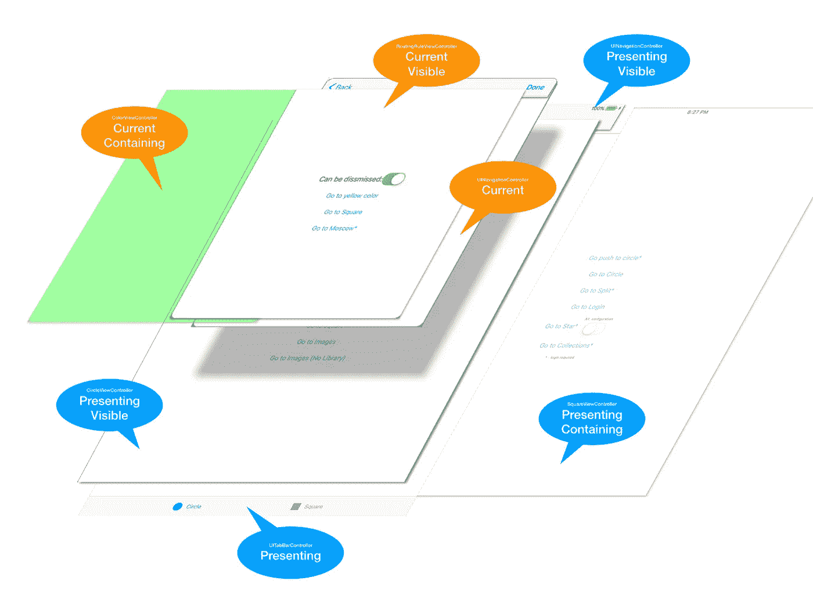

# 深入了解 RouteComposer 配置

> 原文：<https://itnext.io/going-deeper-into-the-routecomposer-configuration-3a54661bb16a?source=collection_archive---------3----------------------->

在我之前的[文章](https://medium.com/@eugenenekhoroshiy/composition-of-uiviewcontrollers-and-navigation-between-them-and-not-only-15b825da5ac)中，我带你了解了[route composer](https://github.com/ekazaev/route-composer)——我们在 iOS 应用程序中使用的库，用于处理合成、导航和深度链接任务。在这篇文章中，我将介绍这个库的一些棘手的元素。

# 路由器如何解析配置:

路由器从第一步开始一系列的步骤。如果这一步的查找器说这一步的 UIViewController 不存在，就继续下一步。它一直这样做，直到其中一个查找器说它已经找到了链中描述的`UIViewController`。然后，Router 开始通过步骤链向后移动，并开始使用其工厂为每个步骤创建`UIViewController`,并使用附加到该步骤的操作将其集成到堆栈中。

如果您开始认为用户可以在应用程序中的任何地方，并且已经收到了请求您的应用程序显示某个特定的`UIViewController`的通用链接，那么考虑如何配置到`UIViewController`的路由就更容易了。

# `StackIteratingFinder`选项:

使用`SearchOptions`可以改变`StackIteratingFinder`的行为。它们是:

*   `current`:最顶层的视图控制器
*   `visible`:如果视图控制器是一个容器，在它的可视视图控制器中搜索(例如:`UINavigationController`总是有一个可视视图控制器，`UISplitController`如果展开可以有 2 个可视控制器。)
*   `containing`:如果视图控制器是一个容器，搜索它包含的所有视图控制器(即当前可见的视图控制器之前的`UINavigationController`中的所有视图控制器)
*   `presenting`:在最顶层视图控制器下的所有视图控制器中搜索
*   `*presented*`:从所有呈现的视图控制器中提供的视图控制器中搜索(与`StackIteratingFinder`一起使用没有意义，因为它总是从最顶层的视图控制器开始，所以上面不会有任何视图控制器)

下图可能会帮助你想象示例应用程序中的`SearchOptions`:



如果你想让`StackIteratingFinder`在任何地方寻找想要的视图控制器，但是只有当它们可见时，它应该像下面这样设置:

```
ClassFinder<CircleViewController, Any?>(options: [.current, .visible, .presenting])
```

# 配置问答:

## 我有一些`UIViewController`作为根，我想把它换成`HomeViewController`:

*`*XibFactory*`*将从名为* `*HomeViewController.xib*`的 xib 文件中加载 `*HomeViewController*`*

***不要忘记，如果你使用抽象* `*Finder*` *和* `*Factory*` *的组合——你必须为其中一个* `*ClassFinder<HomeViewController, Any?>*`指定 `*UIViewController*` *和* `*Context*`的类型**

## **如果在上面的配置中，我将`RootViewControllerStep`替换为`CurrentViewControllerStep`，会发生什么？**

**如果用户不在模式化呈现的某个`UIViewController`中，它将工作。如果是，则`ReplaceRoot`不能替换模态显示的`UIViewController`，导航失败。如果您希望这种配置在所有情况下都有效，您应该向路由器解释它应该从根视图控制器开始构建堆栈。那么路由器将消除根视图控制器之上的所有模态视图控制器(如果有的话)。**

## **我想将`AccountViewController`推入屏幕上出现的任何`UINavigationController`(即使`UINavigationController`处于某种模式下`UIViewController`):**

***这里为什么用* `*NilFactory*` *？也就是说:到处寻找* `*UINavigationController*` *，如果找不到就不要创建(这种情况下路由会失败)。* `*NilFactory*` *通常必须伴随着* `*NilAction*` *就好像工厂没有创造任何东西。它不应集成到堆栈中***

## **如果`UIViewController`出现在屏幕上，则应将其推入任意一个`UINavigationController`中，如果不是模态显示:**

## **我想在选项卡中显示带有`HomeViewController`和`AccountViewController`的`UITabBarController`:**

## **我想使用自定义的`UIViewControllerTransitioningDelegate`和`PresentModally`动作:**

## **如果用户在另一个选项卡中，或者即使用户在某个有模式呈现的`UIViewController`中，我也想导航到`AccountViewController`:**

***这里为什么用* `*NilFactory*` *？我们不需要构建任何东西:在依赖的* `*tabScreen*` *配置中会构建* `*AccountViewController*` *。参见上面的* `*tabScreen*` *配置。***

## **我想强制呈现`ForgotPasswordViewController`，但是在`UINavigationController`中的`LoginViewController`之后:**

***通过以上配置，您可以使用* `*Router*`导航至两个屏幕**

## **如果在上面的配置中，我用`RootViewControllerStep`替换`CurrentViewControllerStep`，会发生什么？**

**它将会工作，但是这意味着路由器必须从根`UIViewController`开始构建堆栈，所以如果用户处于某个模态呈现的`UIViewController`中——路由器将在开始导航之前关闭它。**

## **这个应用有一个标签栏控制器，里面有`HomeViewController`和`BagViewController`。用户应该能够使用标签栏手动导航到行李。但是如果他们点击`HomeViewController`中的“去包”按钮，应用程序应该有模式地显示`BagViewController`。如果必须使用通用链接将用户发送到袋子，也会发生同样的情况。**

**实现这种配置有两种方式:**

1.  **使用`NilFinder`,这意味着路由器永远不会在屏幕上找到现有的`BagViewController`,而总是会创建一个新的并以模态显示。然而，这有一个缺点:如果用户已经在模态呈现的`BagViewController`中，然后他点击推送通知，再次将他深度链接到包，路由器将构建另一个`BagViewController`并在顶部模态呈现它。**
2.  **稍微调整`ClassFinder`，这样它将忽略没有模式化显示的`BagViewController`，并在配置中使用它:**

**我会很高兴你的意见和建议。**

**PS:如果你喜欢这个库，别忘了在 [GitHub](https://github.com/ekazaev/route-composer) 上给它一颗星！**