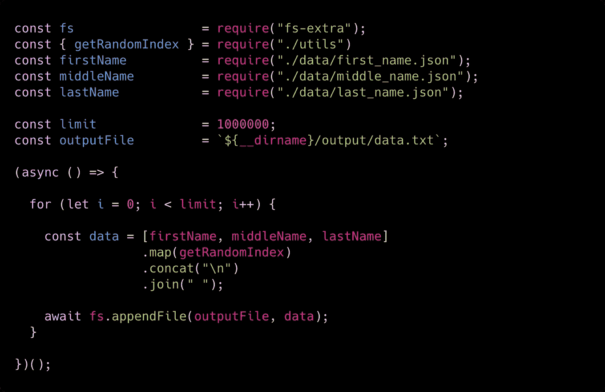
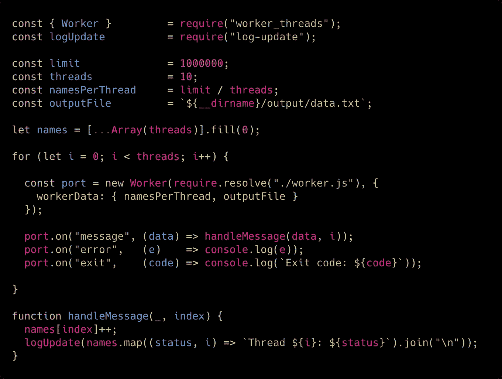
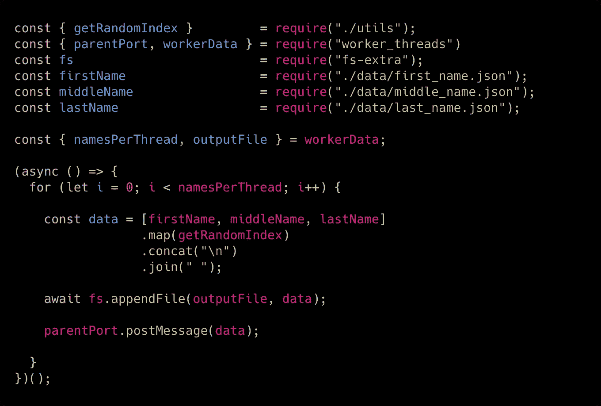

# 使用 Node.js 实现多线程

> 原文：<https://itnext.io/going-multithread-with-node-js-492258ba32cf?source=collection_archive---------2----------------------->

Node.js 因为它的设计受到了很多批评。
来自 **Java** 、 **C、**或 **Python** 等编程语言，Node.js 不直接访问线程似乎有些奇怪。我们如何同时处理事情？

在 Node.js 11 之前，我们实际上可以使用**集群**模块运行并发/并行代码，如前一篇文章 中的 [**所示。
但是如果我们在只有一个内核的服务器上，我们该怎么做呢？**](https://medium.com/free-code-camp/how-to-scale-your-node-js-server-using-clustering-c8d43c656e8f)

在 Node.js 11 中，我们有 **worker_thread** 模块，它允许我们在一个内核上产生多个线程。我们实际上可以在 Node.js 10 中使用这个带有`--experimental-worker`标志的模块，但是在 Node.js 11 中，我们最终可以避免它！

# 一个简单的用例

我们需要创建一个包含 100 万用户的文件，包括他们的名字、中间名和姓氏。我发现了这个神奇的 GitHub repo，它提供了一个名、中间名和姓的数组。我们将在项目中使用这些 JSON 文件:

 [## 多米尼克·塔尔/random-name

### 在 GitHub 上创建一个帐户，为 dominictarr/random-name 开发做贡献。

github.com](https://github.com/dominictarr/random-name) 

让我们使用以下文件夹结构创建一个新项目:

所以让我们从`main.js`文件开始:

如你所见，我们正在使用`fs-extra`包。它就像`fs`模块一样工作，但是为每个函数返回一个承诺。它解决了那种操作带来的一个大问题:内存使用。事实上，如果我们试图用 Node.js 打开太多文件，就会产生错误并杀死主进程，因为它无法处理同时打开的所有文件(并耗尽内存)。在我们的`for`循环中，`await`将停止循环，直到操作结束:这样，我们每次迭代都只有一个打开的文件。

让我们看看`utils/index.js`文件:

这里我们只是从数组中获取一个随机值。当我们需要获得一个随机的名字、中间名或姓时，这非常有用。

在我的机器(2016 MacBook Pro，2,7 GHz 英特尔酷睿 i7，16GB RAM)上运行上面的代码，需要 3 分 32 秒才能完成任务。让我们看看如何使用 Node.js 工作线程来提高性能！

# 走向多线程

为了对这个简单的程序采用多线程的方法，我们需要在我们的代码库中做一些改变。让我们从`main.js`文件开始:

首先，我们需要从`worker_threads`模块导入`Worker`类。这将允许我们在任何时候产生一个新的工作者。然后我们可以设置生成几个线程:在这种情况下，我决定只生成 10 个线程。
我们需要计算每个线程应该生成多少个名字；这很简单。我们只是将所需名称的总数除以线程数。对于每个线程，我们需要产生一个新的`Worker`。如您所见，它的代码将位于`worker.js`文件中。
我们将向我们的新`Worker`发送一个有效载荷，告诉它应该创建多少个名字以及把它们放在哪里(输出文件)。
我们将继续监听错误和退出，因此我们将跟踪我们的工人内部发生了什么。

现在让我们看看`worker.js`文件是如何工作的:

基本上和原来的`main.js`文件代码一样。每次我们存储一个新名字，我们都把它发送回主线程，所以它会跟踪我们线程内部发生了什么。

结果呢？我们做同样的操作只用了 1 分 24 秒！**比单线程版本快 37%**！

# 其他使用案例

当您需要执行 CPU 密集型任务时，工作线程是一个惊人的解决方案。它们使得与文件系统相关的操作更快，并且在您需要执行任何并发操作时帮助很大。最重要的是，正如我们之前所说，它们也可以在单核机器上工作，因此它们可以在任何服务器上提供更好的性能。

我实际上在一次大规模上传操作中使用了**工作线程**，我必须检查数百万用户并将他们的数据存储到数据库中。采用多线程方法，运算速度比单线程快 10 倍左右。

我还使用**工作线程**进行图像操作。我必须从一张图像中构建三个缩略图(不同尺寸)，多线程方法再次帮助了我，节省了操作时间。

正如你所看到的，**工人线程**模块可以帮助你提高性能，所以让我知道它是否在某些方面帮助了你！

