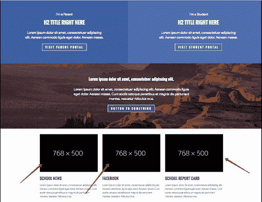

# Golang 图像生成器在运行时(图标，水印，调整图像大小)。

> 原文：<https://itnext.io/golang-image-generator-in-runtime-favicon-watermark-resizing-images-3a298b7b17af?source=collection_archive---------2----------------------->

使用 Go，您可以在运行时创建图像文件。找到下面的小列表，观察它可能有用的情况。

1.  Favicon
2.  像素跟踪器
3.  占位符
4.  水印
5.  图像大小调整

# **1。图标**

Go 应用程序通常被认为是为内部和/或外部服务提供内容的服务器部分。让一个外部程序(包装器)返回响应是一种很好的做法——一种只给出所需有效负载的逃避，特别是没有特定于 web 的请求。在从客户端到服务器端的特定于 web 的请求中，我指的是 favicon 请求和各种清单，它们通常被认为是“前端”类型的资源。也就是说，在大多数情况下，同样的专家做项目的“前端部分”并对他们的工作负责。

但是，如果你的 Go 应用程序也能够自己给出图标和清单，那会怎么样呢？不仅仅是静态的 favicon 和 manifest 文件，而是在运行时生成/创建这些字节数组。这将允许我们的应用程序不依赖于这些静态文件。

当然，您可以发送一个静态文件作为响应:

但是我们想动态地创建一个 favicon。至少有两种类似的方法可以动态创建一个 favicon:

*   第一种方法

*   第二种方法

# **2。像素跟踪器**

像素跟踪器广泛用于交通仲裁。

# **3。占位符**

使用占位符的示例



为了生成占位符，我们将使用与固定大小图像相同的方法，但是能够添加文本和改变图像和字体的大小。

首先，让我们定义需求:

*   我们收到以下形式的输入请求:

```
/WIDTH/HEIGHT/COLOR/TEXT/TEXT_COLOR/FONT_SIZEFor example: 
/600/200/622E68/Placeholder (stub)/FFFFFF/60
```

*   文字应该放在图片的中间。
*   文本来自客户端的请求，或者格式为:“宽度 x 高度”。
*   文本必须是拉丁文和西里尔文字
*   我们提供默认参数
*   我们输出图片的字节

首先让我们制作一个颜色解析包。在传入的请求中，color 是一个十六进制表示的字符串。其他“颜色格式”是不期望的。

下面的图像包:

地址请求的结果(url)

```
[http://localhost:8080/600/200/622E68/Placeholder (заглушка)/FFFFFF](http://localhost:8080/600/200/622E68/Placeholder%20(%D0%B7%D0%B0%D0%B3%D0%BB%D1%83%D1%88%D0%BA%D0%B0)/FFFFFF)
```


对于这种请求:

```
http://localhost:8080/480/200
```


# **4。水印**

水印可能对以下情况有用:

*   在发布的图像上注明版权所有者
*   您可以在图像中添加广告文本
*   图像的用途及其使用限制

例如，指定该图像或照片只能用于特定目的和/或在有限的时间内使用。

# **5。调整图像大小**

特别是，该平台需要存储一组不同大小和格式的图像。

有时你需要改变尺寸的设置。在这种情况下，您需要调整新尺寸的大小，并可能删除其他尺寸。

实现调整大小有两种可能的情况:

*   一次性(按需调整整个集合的大小)
*   动态(运行时调整大小)

一次性调整大小有一个难以忍受的优势——我们一次调整所有或部分图像的大小(例如，一天一次)。在这种情况下，我们需要磁盘空间。快速磁盘离客户端和热数据(映像)更近。

动态图像尺寸调整允许你为所有的“尺寸调整”释放空间，而不用担心它们的相关性。但是在这种情况下，我们需要计算资源，调整“缓存”层的大小可以“转移”到更靠近客户端的位置，并且大小集可以随时更新。

换句话说，理想的选择(对于资源)是混合调整大小:我们选择需要动态或一次性调整大小的数据。还有，如果你经常改变图片的大小和格式，动态调整大小更适合你(如果你有计算资源的话)。我建议对您计划的需求和容量进行计算。

**注**

**所有代码示例仅供参考。因此，您需要测试并调整这种方法以适应您的需求和目标。**