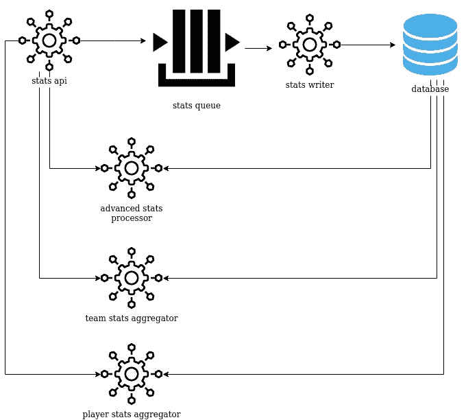

# Golang、微服务和 Twirp

> 原文：<https://itnext.io/golang-microservices-and-twirp-5ef495278ddf?source=collection_archive---------0----------------------->


CP3 在行动

在这篇博文中，我想谈谈 API，以及在使用微服务时如何设计 API。

先决条件:
1。**戈朗**——[https://golang.org/doc/install](https://golang.org/doc/install)2。 **Protobuf 编译器—**[https://grpc.io/docs/protoc-installation/](https://grpc.io/docs/protoc-installation/)

该项目的源代码可以在[这里](https://github.com/subzero112233/golang-twirp)找到

## **打碎整块石头**

直到最近，构建应用程序的主要方法是创建一个处理多个相关任务的单层且不可分割的单元。这是独石图案。

这种模式在当时是最常见的，在很多情况下仍然有效，并且在今天的行业中仍然被广泛使用。

但是，这种方法有一些缺点:
1。你的代码库变得巨大
2。你违反了 SRP 原则——一个组件应该做一件事，并且做好。
3。组件是紧密耦合的。
4。Monoliths 在开发和产品运营方面都不能很好地扩展——所有的东西都是在同一块上运行和开发的。
5。漏洞、数据泄露和安全漏洞的高风险—有安全漏洞吗？你的整个应用程序都受到了影响。

如今，市场迫使你快速行动，打破常规，改变方向，扩大规模，并且不惜一切代价随时待命。
为了满足这些需求，软件行业开始采用一种新的方法——微服务。

微服务允许你拥有一个高度可维护和可测试的软件，它是松散耦合和独立部署的。小团队可以拥有一个或几个微服务，按照自己的节奏开发，使用自己选择的语言和框架。

对我来说，整体服务与微服务之争的答案是**视情况而定。我不打算在这个范围内讨论这个问题，但是每个都有它自己的优点和缺点。**

# **用例**

一家公司有一个 [SaaS](https://en.wikipedia.org/wiki/Software_as_a_service) 的产品，并向用户公开了一个 REST API。
产品已经发展壮大，他们目前使用的整体架构已经不再能满足他们的目标:
-交付新功能花费的时间太长了。
-一些组件需要不同的语言来更好地执行。
-另一个组件需要扩展，但它有点小，您不想扩展整个应用程序。
可以有相当多的原因。

所以他们决定将整块分成 5 个微服务和一个队列。



`stats api`将从不同种类的源接收请求，请求不同类型的数据。
此外，我们不想给我们的数据库带来太大的压力，所以我们在`stats api`和`stats writer`之间放置了一个队列，它将分批写入数据库，每批 10 个条目。

其他组件收到诸如“我想比较 Devin Booker 和 Chris Middleton”的请求，因此它们必须从数据库中获取数据并进行一些高级计算。
这种请求是由用户发起的，必须在几秒钟或更短的时间内返回，所以我们必须保持它们同步。

# 好吧，怎么回事？

开发人员和架构师选择 RESTful APIs 作为服务间通信的方式是很常见的，但是我想解释一下为什么 REST 可能是我最后选择的选项之一。

## 休息

如今最常见的 API 实现叫做 [**REST**](https://www.ics.uci.edu/~fielding/pubs/dissertation/rest_arch_style.htm) **。** REST 是**RE**presentational**S**state**T**transfer 的缩写。

REST 依赖于无状态的客户机-服务器协议，其中客户机和服务器完全分离(关注点分离)。
缓存可以用来提高网络效率和性能。

REST APIs 有一个统一的接口，允许应用程序独立发展，而无需将应用程序的服务、模型和动作与 API 层紧密耦合。

REST APIs 也是由约束组件行为的层次结构层组成的，这样每个组件就不能看到它们正在交互的直接层之外的内容。

由于这些原因，REST APIs 在过去的十年中因其可伸缩性、性能和易用性而广受欢迎，几乎每个人都在使用它们。

听起来像是该走的路，对吧？嗯，不一定。

# 为什么 REST APIs 不总是正确的选择

## **服务对服务通信**

除了面向公众的 API，现在的交流完全是内部的，服务对服务，没有人参与。当你有以下情况时，休息是个不错的选择。需要支持不同类型的客户端:浏览器、手机等。
2。希望你的请求-响应是人类可读的。
3。需要一个标准的、被广泛采用的接口和消息格式。
4。需要支持大量的语言和库。

这些在这里都不适用或不需要。

## **代码生成**

REST APIs 的代码生成需要您使用第三方工具，并且本身不受支持。例如，当 Go 中没有用于生成完全兼容的 [OAS3](https://swagger.io/specification/) 客户端的库时，这可能非常有限。

## **JSON**

JSON 是迄今为止 REST APIs 最流行的数据格式，但是有几个限制:
a. **无模式**:我们的数据库有模式，我们的代码是以保留模式的方式编写的，那么为什么我们可以接受没有模式的数据格式呢？
* JSON 有模式验证器，但它们并不常用，并且作为外部库提供，需要额外的代码。

b.**速度**:除了用 JS 编写的浏览器、服务器端等 JavaScript 原生环境，JSON 序列化最多可以比 protobuf 慢 [6 倍](https://auth0.com/blog/beating-json-performance-with-protobuf)。
二进制序列化往往比文本序列化更快。

c.**大小:** JSON 会产生一个比二进制替代品更大的对象。

c.**额外代码:** JSON 需要样板代码来序列化/反序列化数据，但是你写的代码越多，潜在 bug 的表面就越大。此外，你在浪费时间编写与业务无关的代码。

e.**数据类型:** JSON 只支持有限数量的数据类型:
字符串、数字、布尔、空、对象、数组。

f.**向后兼容:** JSON 不是向后兼容的。

## **可维护性:**

考虑上面的图表，哪种请求方法对获取玩家的数据最有意义

```
POST /stats/:name
PUT /stats/:name
```

应该发送什么标头、查询参数和/或请求正文？
应该有什么反应？我们如何交流错误？有太多的问题要问，太多的决定要做。

开发人员可能必须通读 API 文档，这些文档必须由某个人编写，并且通常还要阅读应用程序的代码，以了解端点实际上是如何工作的。同样，我们不得不花费宝贵的时间。

# **输入 RPC**

本质上，RPC 使一台机器上的程序能够调用连接到网络的另一台机器上的子例程。RPC 更多的是关于动作，而 REST 是关于资源。

RPC 服务可以更简单，性能更好，但代价是灵活性和独立性。对于服务对服务的通信，这是非常好的。

# RPC 在 Go 中

虽然 Go 中有其他 RPC 框架，但除非我真的不得不使用，否则我会使用 [Twirp](https://github.com/twitchtv/twirp) ，原因如下:
1 .非常简单的设置。这对我最重要。
2。同时支持 http1.1 和 http2.0
3。同时支持 Protobuf 和 JSON
4。易于调试

gRPC 应该得到一个荣誉奖，并且肯定有它自己的位置，特别是当你需要双向流、长时间连接和客户端负载平衡的时候。
gRPC 的缺点是经常会遇到问题，需要第三方，如 [grpc-gateway](https://github.com/grpc-ecosystem/grpc-gateway) 、 [grpc-web](https://github.com/grpc/grpc-web) 等等。

## 原蟾蜍

Protobuf 是 Google 编写的一种数据序列化机制，并且变得非常流行。它是开源的，也是语言和平台中立的。
Protobuf 使用二进制传输格式，这意味着它不是人类可读的，但也意味着它消耗更少的空间和带宽，消耗更少的 CPU。
Protobuf 相比其他类型有以下优势:
1 .有一个模式
2。就是更快更小
3。向后兼容
4。内置了验证和可扩展性。支持更多的数据类型

为了比较 Twirp 和 REST，我编写了这个[基本应用程序](https://github.com/subzero112233/golang-twirp)，用于通过 RPC 和 REST 发送/检索玩家数据。

REST 的实现很简单，可以在这里找到，让我们直接进入 twirp。

首先，让我们看看我们的`stats.proto`文件:

这个文件以结构化的格式为我们的消息建模，这里我们以请求-响应格式定义我们的 RPC 服务。

例如:`AddStats`函数接收`AddStatsRequest`消息，它基本上是一个`Stats`消息的数组，并返回一个`AddStatsResponse`格式的消息，在本例中是一个字符串。

## 如何生成原型文件

为此，我们需要安装这两个生成器:
`go install github.com/twitchtv/twirp/protoc-gen-twirp
go install google.golang.org/protobuf/cmd/protoc-gen-go`

从原型文件中生成`.go`文件:
确保`$GOPATH`指向您的 golang 安装目录，在我的例子中是`/usr/local/go`。
然后运行:
`protoc --proto_path=$GOPATH/src:. --twirp_out=../ --go_out=../ rpc/stats/stats.proto`

两个新文件:`stats.pb.go`和`stats.twirp.go`，包含客户端和服务器实用程序。
另一件需要提及的重要事情是我们需要在代码中实现的`StatsService`接口。
在这里(去掉转换部分以缩短主旨):

让我们看看它是如何工作的。
首先，需要启动服务器。
`~ $ go run cmd/main.go`

现在发送请求。首先是**的 AddStats** ，然后是**的 GetStats** 。我已经创建了一个示例客户端实现来演示这些请求:

如您所见，请求就像常规函数调用一样被发送！

`~ $ go run example/example.go
status:”success”
stats:{player_name:”Reggie Jackson” minutes:32.9 field_goals:14 field_goal_attempts:20 three_pointers_made:4 three_pointer_attempts:7 free_throws_made:6 free_throw_attempts:6 offensive_rebounds:1 defensive_rebounds:3 assists:6 steals:1 turnovers:2 personal_fouls:3 points:38 game_date:{seconds:1625916051}}`

另一件很酷的事情是，我们还可以使用 curl 来发送请求。这对于调试和初始设置非常方便:

为了测试性能差异，我创建了两个测试文件(`rest_test.go`、`twirp_test.go` ):
、`~ $ go test -bench=. -benchtime=5000x
goos: linux
goarch: amd64
pkg: github.com/subzero112233/golang-twirp
cpu: Intel(R) Core(TM) i7–8550U CPU @ 1.80GHz
BenchmarkRestAdd-8 5000 533270 ns/op
BenchmarkRestGet-8 5000 475062 ns/op
BenchmarkTwirpAdd-8 5000 90284 ns/op
BenchmarkTwirpGet-8 5000 91833 ns/op
PASS
ok github.com/subzero112233/golang-twirp 5.966s`

在较小的有效负载上，这种差异可能不太显著，但仍然足够显著，可以在必要时使用 RPC。

感谢阅读。