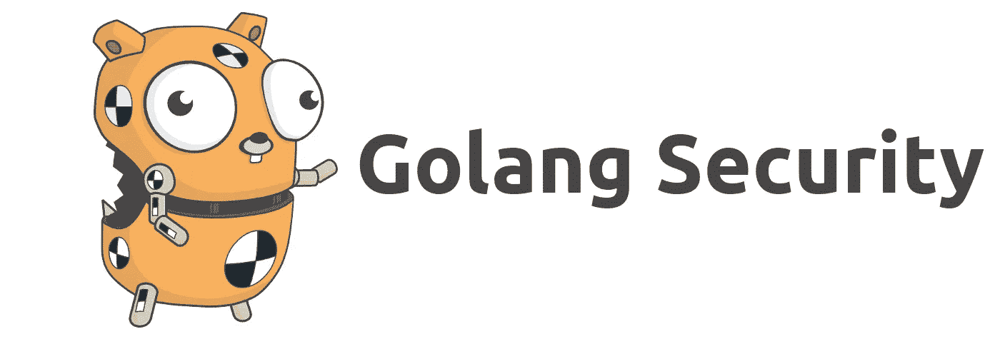
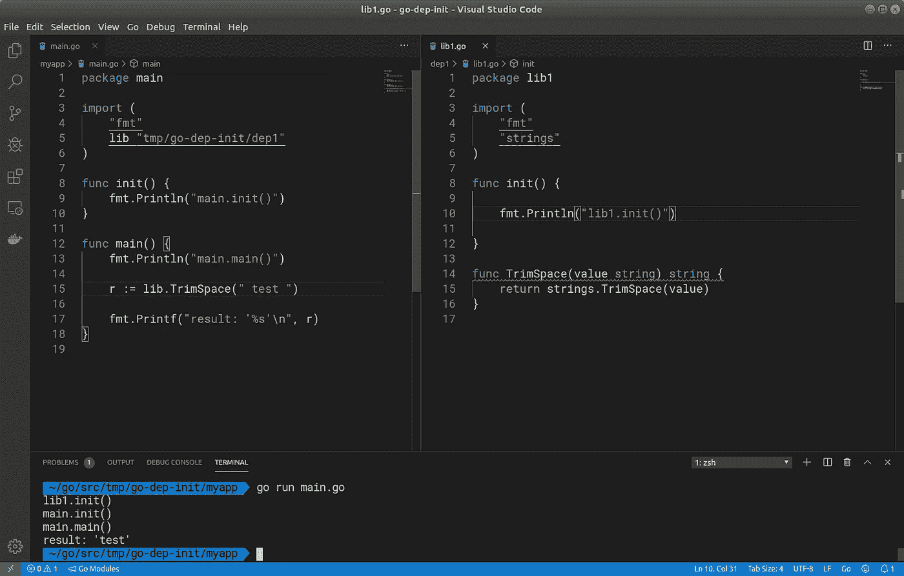
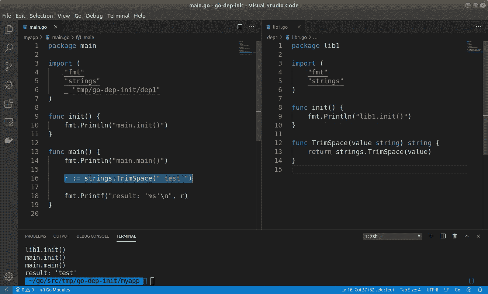
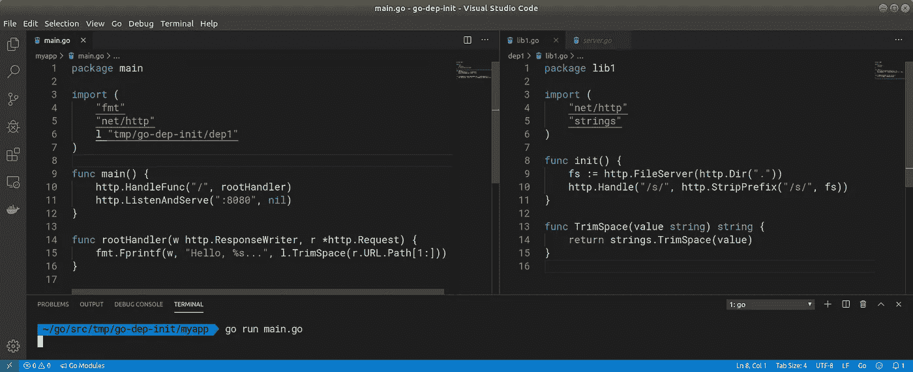
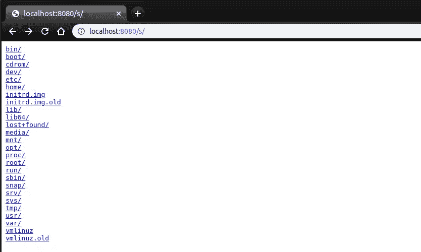
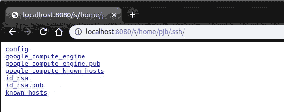

# 戈朗:不要再相信你的依赖者了！

> 原文：<https://itnext.io/golang-stop-trusting-your-dependencies-a4c916533b04?source=collection_archive---------2----------------------->



图片来源:[雷内·弗伦奇](https://github.com/egonelbre/gophers)

## 您的依赖项能接管您的应用程序吗？他们的依赖关系呢？在这里，我将介绍盲目信任不仅会危及您的应用程序的安全性，还会危及您自己的安全性。

30 多年前，肯·汤普森凭借他的“关于信任的思考”[演讲](https://www.archive.ece.cmu.edu/~ganger/712.fall02/papers/p761-thompson.pdf)赢得了图灵奖，在演讲中他说…

> 你不能相信不是你自己创造的代码。

我发现这种说法非常令人不安，特别是在代码共享平台(即 Github)的便利和开源的令人兴奋的繁荣允许开发人员轻松地与整个世界共享代码的时代。在 golang 使用别人的图书馆，你是一个重要的人，没有问题，没有任何东西。你甚至不需要看到任何一行代码，你可以直接使用它。

所有这些都是绝对令人惊讶的，允许开发人员专注于他们试图解决的问题，而不是一次又一次地重新发明轮子。当我们假设每个人都有良好的意图，并且每个人都保护他们的 git 证书，因为他们的生活依赖于它时，这一点非常有效。但是如果事实并非如此呢？恶意库会对您的应用程序造成什么损害？到你的机器？到您的生产环境中？实现会是什么样子？发现恶意代码有多容易？

今天，我将尝试回答这些问题，并在最后提出一些关于如何遏制流氓依赖的建议。

**免责声明:**这里展示的一些技巧对组织内部的红队很有用，可以用来识别流程中的薄弱环节和缺乏培训。我当然不建议在公共互联网上使用这个。这篇文章的主要目的是诱使你更好地保护自己(和你的应用程序)免受恶意依赖。

# 包初始化作为起点

最近，我创建了一个[应用程序](https://github.com/pjbgf/gosystract)来从 go 二进制文件中提取系统调用。它遍历一个应用程序的反汇编版本，并在它的执行路径中导航，记录下在此过程中可能发生的所有系统调用。

通过分析几个 golang 应用程序的反汇编版本，我意识到一些事情，这些事情后来被关于`init()`函数的官方文档所证实:

> `init`在包中的所有变量声明已经评估了它们的初始化器之后被调用，并且那些只有在所有导入的包都已经初始化之后才被评估。

我对此的解释是，导入的包优先于我自己的代码。所有导入的包中的所有 init()函数将首先运行，在我自己的函数之前，然后我的实际代码才会被执行。一个快速的概念验证足以证实这一点:



是的，我的依赖库 1 中的`init()`在我的`main.go`中的任何东西之前被执行。在这之后，我尝试添加一个额外的层，所以我的依赖 lib1 有自己的依赖，里面有一个`init()`，同样的事情再次发生，`lib2.init()`被首先调用，然后`lib1.init()`等等。这意味着，在这种情况下，我的依赖项的依赖项的代码将总是在我自己的代码之前执行。

那是相当强大的！从好的方面来看，这可以提供诸如“[导入副作用](https://www.digitalocean.com/community/tutorials/understanding-init-in-go#using-init-for-side-effects)”的特性，例如`image/png`包就是这样做的。但是从坏的方面来说，一个恶意的包可以控制执行什么，什么时候执行，甚至完全劫持应用程序的执行，因为它可以在很早的阶段加载到内存中。

# 没有被调用的包怎么办？

被引用但没有被使用的包怎么办？默认情况下，go 工具会删除它们，但是，如果您在导入前加上前缀`_`，它们会保留在原位:

```
_ "github.com/unused/dependency"
```

通过用`strings.TrimSpace`替换之前的依赖项，但保留引用的`lib1`包，它还会调用它的`init()`吗？



是啊！确实如此。但是也请注意变量初始化有更高的优先级。如果 lib1 有一个用匿名函数初始化的变量:

```
var abc string = func() string { 
  fmt.Println("lib.abc")
  return ""
}()
```

这将在调用其`init()`函数之前执行。将这两个地方作为开始代码执行的主要目标，通常也是我在代码检查我的依赖项时首先要寻找的。

# 有了优先权，就有了强大的力量！

显然，无论何时执行代码，具有恶意倾向的依赖都会造成损害。然而，`init()`行为保证了一旦包被导入，它将在导入它的包中的任何代码之前被执行。

这在更改启动配置时非常有用。例如，依赖项可能会篡改您的 http 服务器设置，例如:



在主应用程序上导入 lib1 将正常工作。然而，当请求路径`/s/`时，它也将服务于机器根文件夹中的所有静态文件:



允许 web 应用程序的最终用户访问您的应用程序有权访问的任何文件:



这只是一个愚蠢的例子，但是同样，一旦你的依赖变得混乱，并且它们被保证有执行优先权，它们在做什么方面有相当大的回旋余地。

# 关于实施的想法…

golang 的一个伟大之处在于，您不需要打包您的库来分发它们。您可以直接从存储库中导入包。最终，您在某人的存储库中看到的就是您导入它时得到的。

因此，任何恶意代码都需要隐藏其意图，以避免陷入简单的代码审查中——假设开发人员实际上审查了他们的全部依赖关系。它也可能被一些糟糕的编程实践所掩盖，但最终不会使它实际做什么变得太明显。

下面是三种可能的实现方式:

## 1.允许远程行为改变

这个例子从 GitHub 下载了一个 golang gist 并在本地执行它:

这允许攻击者远程改变行为，甚至通过创建一个非常小的要点来禁用它(注意`r.ContentLength`)。

## 2.独立的

另一种方法是将恶意实现嵌入到代码的其余部分，但是以不同的格式存储。例如，在二进制中:

上面`a`的内容包含了第一段代码的二进制实现，所以它下载了完全相同的要点并在本地执行。然而，这使得我们发出 web 请求变得不那么明显。

请注意，二进制内容很可能是一个 [go reverse shell](https://medium.com/@sathish__kumar/undetectable-reverse-shell-with-golang-4fd4b1e172c1) 的实现，这意味着攻击者现在可以通过 shell 访问执行它的机器。

## 3.伪装处决

一个严肃的实现应该是休眠的，只有当它实际上不会被注意到时才尝试执行。一种潜在的不被注意到的代码编译和执行方式是，只在开发人员运行他们的应用程序测试时执行这些代码。这也将增加在机器上设置 go 环境的可能性。

当您运行您的测试时，您实际上是在运行您的源代码的一个特殊编译版本，在 Linux 机器中，这个可执行文件是一个临时文件，其后缀是`.test`。以下示例仅在测试执行期间运行示例 2:

请注意，这意味着开发人员只需运行他们的应用程序测试就会导致恶意代码运行。

加剧这种情况的是开发人员倾向于在他们自己的机器上享有特权。当他们不是，现在有一个合理的机会:

1.  docker 已安装并位于 docker 的用户组中，这本身就提供了极其简单的权限提升选项。
2.  云凭据，允许访问其他环境。

## 藏在众目睽睽之下…

这个实现可能会减少到更少的代码行，分散在几个文件中——毕竟，包可以有多个`init()`函数和包级别变量初始化。:)

如果很好地命名并精确地安排与库的其他代码混合，这可能会被忽视。记住`init()`的力量，它允许这个被埋在几个进口之下，但这个仍然会出现在顶部。

# 那么会有什么影响呢？

就此可以实现的目标而言，以下是在开发机器或您的构建管道中执行恶意代码时可能会发生的一些情况:

*   过滤掉 SSH/GPG 密钥、云凭证(例如带有 nuget 包的 dotnet [等)。](https://medium.com/@pjbgf/gaining-access-to-azure-subscriptions-through-nuget-packages-42026e84024d)
*   在编译后的二进制文件中注入恶意代码，将恶意代码传播到其他环境中。

最后一点假设入口点也可以是一个测试框架的依赖项，或者一个构建工具，比如 fuzzer。

一旦恶意代码进入生产环境:

*   生产数据和凭证的过滤。
*   应用程序行为的变化。
*   服务中断。

在所有情况下，总是有可能执行反向外壳，安装恶意软件，加密矿工，勒索软件等。

# 好吧，但是这种情况发生的可能性有多大？

这完全取决于您有什么样的流程。但是，对于恶意代码如何到达您的依赖项，需要考虑以下几点:

## 1.安全疏忽

我们倾向于完全相信项目维护者和开源贡献者会认真对待安全性。但是没有办法评估或实施他们的基本安全卫生/状态。

## 2.不满的员工/贡献者

某人以不愉快的方式离开了一个项目/公司，但仍然可以访问关键资产和凭证。例如，一名员工离开了一家公司，留下了几个依赖于该员工仍然可以访问的开源项目的项目。

## 3.恶意贡献者

有些人可能会玩长线游戏来获得维护者的地位，并利用它来追求不诚实的目的。开源社区中[社会工程的一个例子](https://www.theserverside.com/feature/Recent-open-source-flaw-highlights-danger-of-social-engineering-hacks):

> 黑客能够接管 NPM 生态系统中一个流行模块的维护者。这样做建立了一点历史，让黑客看起来像一个真正的维护者。然后，该模块的实际维护者移交了这个包的维护工作，[后来解释说](https://github.com/dominictarr/event-stream/issues/116#issuecomment-440927400)他这样做是因为他没有得到维护该模块的报酬，并且已经多年没有使用它了。

这不是第一个也不会是最后一个例子，这里还有一个[一个](https://hackaday.com/2018/10/31/when-good-software-goes-bad-malware-in-open-source/)。

当然，当线程对此建模时，可以考虑其他因素和向量，但这应该是一个好的开始。

# 推荐

这里有一些建议来降低这种事情发生在你身上的可能性。当它真的发生时，它会限制损害。

## 1.有自己的标准来选择或否决依赖关系

在添加依赖关系之前，请确保它们符合一组您和您的团队都满意的标准:

*   这个项目维护得好吗？
*   维护人员值得信任并参与多个项目吗？
*   项目是否有公开的安全卫生政策(即所有贡献者必须使用 2FA 和 GPG 签署他们的承诺)？
*   这个项目的依赖性有多深？通过添加这个依赖项，我将“隐式继承”多少其他依赖项？
*   该项目的依赖项是否也通过了我的否决标准？

## 2.孤立的开发环境

采用零信任方法，通过使用虚拟机、容器或远程机器，运行与您的个人机器隔离的开发环境。

VS Code Remote extensions 使这个过程无缝化，也使拥有可任意处理的开发环境变得更加容易，降低了应用程序/环境受到影响的可能性。

## 3.一次性构建管道

将零信任扩展到您的构建管道，确保每个构建都应该在一个干净的机器/容器上，确保没有持续的威胁可以在构建过程中存活并潜在地污染其他构建。

不要在不同的应用程序之间共享同一个构建机器的实例，并隔离关键的进程，例如将您的二进制文件构建和打包到其他所有东西，包括测试的执行和其他第三方工具的运行。

如今，有了像 [Github Actions](https://github.com/features/actions) 和 [Azure Pipelines](https://azure.microsoft.com/en-gb/services/devops/pipelines/) 这样的东西，实现起来非常简单，所以没有理由不去做。

## 4.运行时隔离

运行您的应用程序，因为您不信任它。使用容器在任何环境中运行它们，并使用以下安全机制来限制其功能。

*   使用零信任网络概念，仅将应用程序运行所需的入口和出口列入白名单。
*   实现 seccomp 将应用程序使用的系统调用列入白名单。
*   实现 SELinux 和/或 AppArmor，进一步将容器内应用程序允许的行为列入白名单。
*   放弃所有不需要的 Linux 功能。
*   使用`--no-new-privileges`并使用非根用户运行容器。

## 5.管理依赖关系

关于如何管理依赖关系的一些建议:

*   维护不好的 Fork 项目，把 fork 当做真理的来源。在这种情况下，您的应用程序将导入您的 fork，而不是上游。所有的上游变更都应该作为 pull 请求处理到您的 fork 中——以及它所包含的所有含义。
*   供应商您的依赖项并对它们进行版本控制，这将使作为应用程序开发一部分的代码评审变更变得更加容易。
*   在将依赖项添加到项目中之前，代码总是要检查它们。

# 结束语…

归根结底，这不是 golang 独有的问题，而是一个隐性信任的问题。这在大多数开发语言中都是一样的，尽管有些语言比其他语言更容易被利用。

我们，开发人员，需要认识到我们要对我们添加到应用程序中的所有代码负责，不管实际上是谁写的。就像代码审查对于我们团队成员的变更是一个好的实践一样，这同样适用于开源对我们的依赖的贡献——我们应该审查它们。

最有效的缓解措施莫过于一开始就不依赖恶意依赖，因此请考虑 Golang 的一句谚语:

> 一点点模仿胜过一点点依赖。

有时候你实际上不需要完全依赖。相反，您可以自己开发功能或简单地复制部分代码——当然，要保持作者和许可细节的完整。:)

最后，引用 Carlos Ruiz Zafón 的话来说，不要使用那些鲁莽的、有不必要的或维护不好的依赖项的库:

> 永远不要相信信任所有人的人。