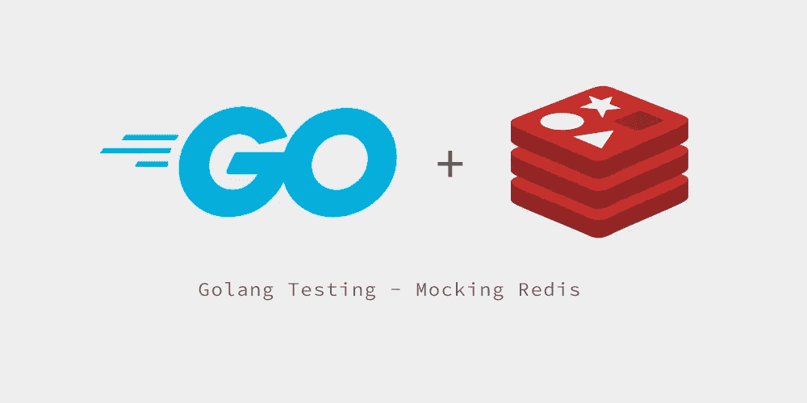

# Golang 测试—模拟 Redis

> 原文：<https://itnext.io/golang-testing-mocking-redis-b48d09386c70?source=collection_archive---------1----------------------->



当测试我们的应用程序时，我们经常有很多外部依赖，并且我们经常不在有空间启动 Redis、MySQL 等的环境中运行我们的测试。

最近，我试图解决我的一个应用程序需要 Redis 连接的问题，但我不想在运行测试时保持 Redis 服务器运行，我觉得这是不必要的。

我偶然发现了一个优雅的解决方案:【https://github.com/alicebob/miniredis

这个库在您的应用程序中构建了一个 Redis 兼容的服务器，当您在任何环境中运行测试时，您都可以使用它而不依赖于它。这太完美了！

假设在您的应用程序中，您正在使用一个`redisClient`，它在您的包范围内是全局可用的:

*在这种情况下，我们使用* `*github.com/go-redis/redis*` *作为我们选择的 Redis 库。*

```
package main

import (
    "log"
    "github.com/go-redis/redis"
)

var redisClient *redis.Client

func main() {
    redisClient = newRedisClient()

    doSomeRedisStuff()
}

func doSomeRedisStuff() bool {
    _, err = redisClient.Get("data").Result()

    return err != redis.Nil
}

func newRedisClient() *redis.Client {
    redisClient := redis.NewClient(&redis.Options{
        Addr:     "localhost:6579",
        Password: "", // no password set
        DB:       0,
    })
}
```

正如您在我们的`main`中看到的，我们正在创建一个 Redis 客户端并连接到一个本地服务器。

在我们的测试中，我们不需要真正的联系。

因此，我们可以在测试设置中使用`miniredis`来模拟它:

```
package main

import (
    "testing"
    "time"
    "github.com/alicebob/miniredis"
    "github.com/stretchr/testify/assert"
)

var redisServer *miniredis.Miniredis

func testDoRedisStuffDataExists(t *testing.T) {
    setup()
    defer teardown()

    redisClient.Set("data", "something here", time.Minute)

    result := doSomeRedisStuff()

    assert.True(t, result, "We expect the 'data' to be in Redis")
}

func testDoRedisStuffDataDoesNotExist(t *testing.T) {
    setup()
    defer teardown()

    result := doSomeRedisStuff()

    assert.False(t, result, "We expect the 'data' to not be in Redis")
}

func mockRedis() *miniredis.Miniredis {
    s, err := miniredis.Run()

    if err != nil {
	panic(err)
    }

    return s
}

func setup() {
    redisServer = mockRedis()
    redisClient = redis.NewClient(&redis.Options{
	Addr: redisServer.Addr(),
    })
}

func teardown() {
    redisServer.Close()
}
```

正如您所看到的，在创建模拟的“miniredis”时，我们得到了一个服务器实例，它为我们提供了必要的信息，我们可以在创建 redis 客户机时将这些信息传递给新的客户机选项。然后，我们可以继续使用 Redis 客户机，就像使用真正的 Redis 连接一样。

*我希望这对你有所帮助！如果您发现上述示例有任何问题，请告诉我；我没有运行它们。它们更像是一个例子。*