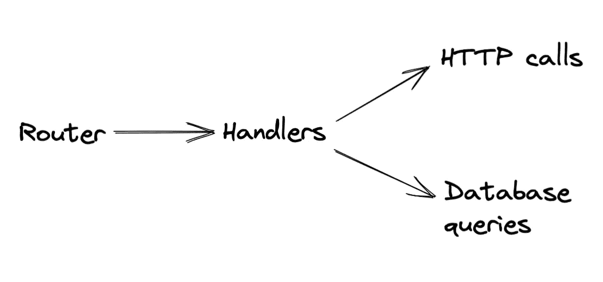
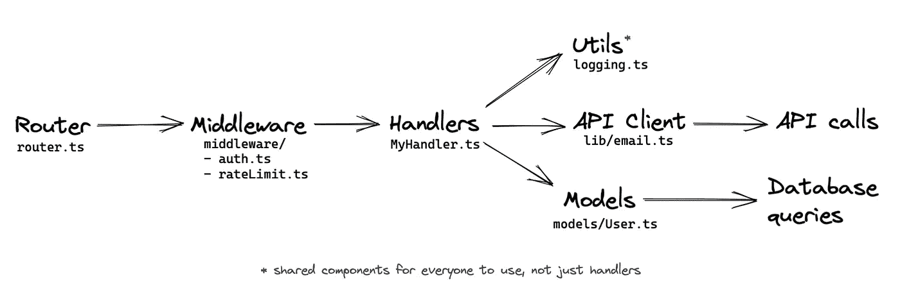
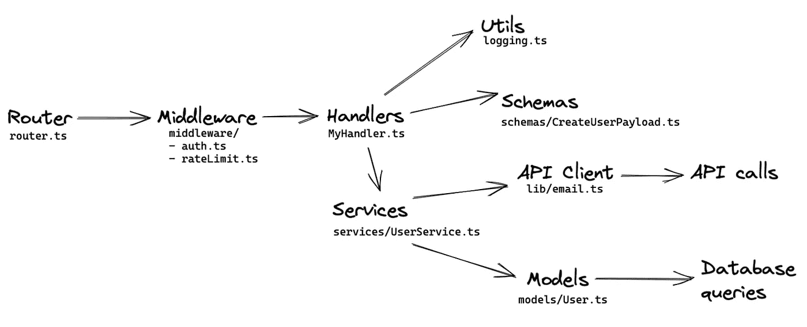
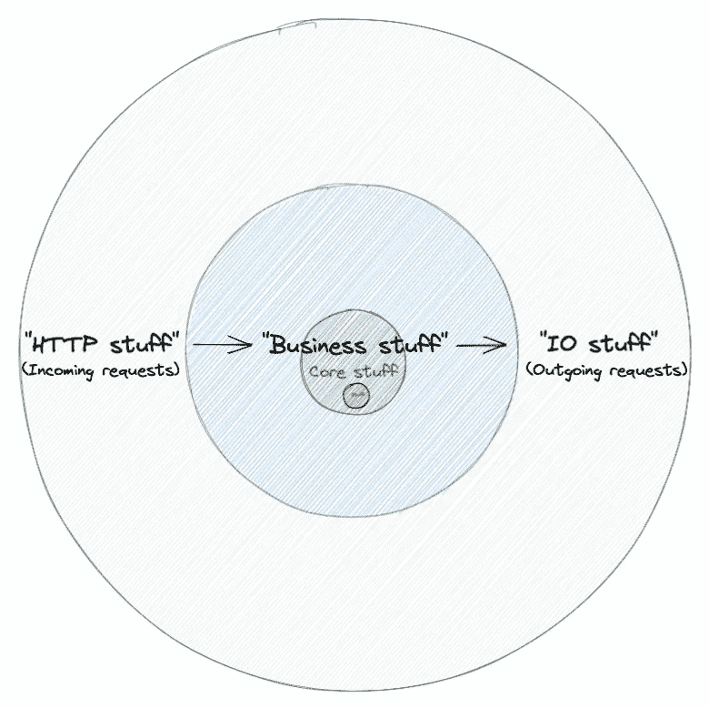

# 对于 Django 或 Node.js 这样的 web 后端来说足够好的软件架构

> 原文：<https://itnext.io/good-enough-software-architecture-for-web-backends-like-django-or-node-js-5eb9159acf86?source=collection_archive---------0----------------------->

## 随着项目的增长，您可以迭代地采用它

有很多关于软件架构的文章，尤其是关于 web 后端的文章。有许多命名约定和许多不同的语言和框架。然而，我认为事情已经平静下来，我们在所有地方都有一些非常相似的模式。我想分享一下关于提供 API 和/或 HTML 视图的标准 web 后端的“足够好”的架构的想法。我们会像大多数项目一样从小处着手，然后逐渐扩大。

请记住:当我们开始向架构添加更多组件时，重要的是要意识到不是每个特性都需要遵循架构。甚至一个更大的项目可能包含一些 API，这些 API 只是一个控制器中的几十行代码，没有太多的结构。那很好。运用常识并尝试在你的项目中可行的方法是很重要的。

# 基础知识:安装 web 库或框架的好处

大多数时候，web 后端是从选择一种语言和某种 web 工具箱开始的。一些人开始精益&意思是，其他人选择一个成熟的框架。两者通常都提供了一组很好的基本功能:

*   **路由器**允许配置不同路径的 HTTP 请求如何传递到**处理器**，然后处理器处理请求&响应。
*   **处理程序** *(比如在 Express 中)* 通常被称为*视图* (Django)或*控制器* (Rails)。它们可能是类或函数。通常，关键是它们以某种方式接收 HTTP 请求，并应该创建一个响应。
*   将原始 HTTP 请求基本解析为平台特定的数据结构，反之亦然，将响应数据结构格式化为原始 HTTP 响应。
*   处理程序的各种增强，通常作为中间件:授权、许可、速率限制、web 安全特性等。这些通常是内置包和类似“插件”的包的组合。
*   可选的: **ORM** 或某种数据**模型**抽象，通常与数据库表一一对应。与 Rails 或 Django 等框架一样，web 库通常假设您将自己推出一些东西。例如，使用 Express，您可以安装 Knex、Slonik 或 TypeORM。

# 第一次迭代

有了这些基础，我们就有了一个典型的后端应用程序的一些基本构建块，它可能看起来像一个微服务(nanoservice？)或 FaaS 函数。

网络后端的简单模型。

在非常早期的阶段，结束在处理程序中编写业务逻辑和 HTTP/DB 调用只是为了让某些东西工作，这可能是好的。

然而，在大多数框架和设置中，您会希望将数据库查询组织到单独的模型中，并使用一些助手调用其他服务(现在让我们称它们为“API 客户机”)。

一个更现实的简单网络应用。

现在我们开始看起来像一个真正的应用程序；请求通过中间件路由到处理程序，处理程序使用不同的助手来完成重要的事情。

# "输入验证"

哦，我们的应用程序只是在处理程序中有一些特别的代码来检查输入的数据。让我们改变这一点，开始用**模式**解析[，不要验证](/parse-dont-validate-incoming-data-in-typescript-d6d5bfb092c8)数据。在 Django 中，我们可以使用[表单](https://docs.djangoproject.com/en/3.2/topics/forms/)或[序列化器](https://www.django-rest-framework.org/api-guide/serializers/)，在 JS 中我们可以安装 [Yup](https://github.com/jquense/yup) ，在 TypeScript 中我们可以添加 [runtypes](https://github.com/pelotom/runtypes) 、 [io-ts](https://github.com/gcanti/io-ts) 或 [ajv](https://ajv.js.org) 。或者，如果我们快被铁锈弄疯了，现在是时候加上 [Serde.rs](https://serde.rs) (❤).

最基本的一点是，让我们使用一个系统来根据声明性模式一致地检查数据，这样就很好了。

# “商业逻辑”

在 Django 中有一个叫做“胖模特”的概念，这是一个例子，在我们注意到它并不真正起作用之前，我们可能会做一段时间。从长远来看，业务逻辑不太适合我们的模型(为什么？这将在下一节讨论)。我们也不想将业务逻辑保留在我们的处理程序中，因为它们已经失控了。所以我们开始将业务逻辑转移到它自己的位置，我们称之为**服务。**

处理者的工作开始是协调:确保数据被解析成我们的业务逻辑服务想要消费的东西，并且正确的服务被调用。

模型和处理程序并没有完全解决这个问题，所以我们引入了包含我们的业务逻辑的服务。

*(为了清楚起见:在上面的图片中，Utils 可以在任何地方使用，模式也可以在 API 客户端或服务中使用……但是，我们将在下一节讨论这个问题)*

# 对象相关阻抗不匹配和可测试性

随着我们的服务，一个新的问题开始出现。我们的业务逻辑与我们的模型/数据库表所代表的类型不太一样。事实是，数据库希望以一种特定的方式对数据进行建模，这种方式可能与我们的应用程序代码和业务逻辑希望使用的方式一致，也可能不一致。这个问题也被称为[物体相关阻抗不匹配](https://en.wikipedia.org/wiki/Object%E2%80%93relational_impedance_mismatch)。换句话说，模型通常与 DB 表是 1:1 的映射关系，但是业务逻辑喜欢玩别的东西。(这也是为什么“胖模特”的方法并不奏效)。

同时，可测试性还存在另一个问题:如果我们的业务逻辑直接调用做网络 IO 的东西，我们需要在测试中做很多副作用的修补。这当然可以用像 DI 这样的模式来解决，正如我以前在“[TypeScript](/lean-dependency-injection-in-typescript-fb2101c70419)中的 Leaner 依赖注入模式”中所写的。然而，如果我们使用 DI，那么我们需要注入一些东西。

所以我们决定将“数据库内容”和“其他网络 IO 内容”转移到**连接器**(有些人可能会说*选择器*或*存储库*或一些返回 *IO 单子*的疯狂的东西😏或者可能是“数据层”)。

纯粹的、可测试的服务。连接器的副作用。管理人员感觉就像协调员……或者通常被称为控制者。

一些有趣的事情已经开始发生:*关注点分离*。

*   **处理程序**(或控制器)只是协调使用…
*   **服务**包含核心业务逻辑，但不产生任何副作用，不像…
*   **连接器**包含我们纯净而美丽的应用程序与外部世界的集成。将 IO 移到程序的边缘是个好主意！
*   模式在处理程序中使用，但是我们的连接器也可以使用它们。这样我们就可以确定来自四面八方的数据就是我们所想的。
*   **模型、API 客户端**已经成为**连接器**的实现细节，并且隐藏在我们的核心业务逻辑之外。需要更换我们的第三方电子邮件提供商，或者将一些数据转移到柱状数据库？应该没什么大问题。

感觉对许多用例来说已经足够好了？至少这是一个很好的心智模型，在传统的、现代的 web 后端中有不同的部分。实际上，我们这里提供的概念有许多不同的变体，但我希望这至少能帮助读者在了解更复杂的项目时，有一些简单的思路。在接下来的章节中，我们会给出更多的想法，告诉你下一步该怎么做。

# 额外收获:谁喜欢洋葱？

HTTP 请求进来，逻辑发生，请求被发送到其他地方，HTTP 响应出去。

这里有一个例子，我们在这里描述的也与[洋葱架构](https://en.wikipedia.org/wiki/Hexagonal_architecture_(software))概念有关。

毕竟，我们确实将逻辑放在了“服务”中，并将传入和传出的 IO 留在了边缘。

然而，这可能是一个更学术的好奇心，因为可能没有必要在短期内将“HTTP stuff”更改为“CLI stuff”适配器:)

# 附录

## 进口周期的恼人问题

遵循这种模式，您可能会注意到您想要开始调用服务内部的其他服务(或者控制器内部的控制器？).这可能是有用的，但是，它最终也会导致导入周期。这里的解决方案可能是采用一个具有延迟加载和自动注入的成熟的 DI 框架。或者，您可以将服务中的公共代码提取到一个单独的助手中，这样就不需要导入另一个服务。

## **高级模式:不可变模式、审计日志、事件源…**

在我以前写的一篇流行的文章中，“ [CRUD tables must die](/crud-tables-need-to-die-93d213b0d18a) ”(是的，这是 clickbaity)，我为传统的、可变的“CRUD table”提供了不同的选项，以满足不能用更新覆盖数据的业务需求。由于我们的连接器实际上是与数据存储无关的，所以本文中介绍的架构模型可以适应不同的技术。您的数据可能在 SQL 数据库中，甚至就在 API 后面。这可能会导致连接器提供的方法发生一些变化，但是仍然可以遵循一般的架构模式。

## 服务、连接器变得太大…现在怎么办？

关于服务(或连接器)要意识到的一件事是，它们可能会调用大量代码，然后在其他地方组织这些代码。也许您的业务逻辑包含大量不平凡的代码？按照你认为合适的方式，把它组织到一个子模块，新的包/库，文件夹中！最终，服务将只是大量复杂性的 API。

对于需要使用 TCP 套接字的专有客户端的连接器来说也是如此，或者可能存在大量与从高性能和专业数据源读取数据相关的逻辑，例如 Kafka 流。

我们在这里描述的架构可能只是一个开始…