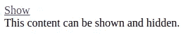

# 良好的分离:HTML5 数据属性概括了 JavaScript 模块

> 原文：<https://itnext.io/good-separation-html5-data-attributes-to-generalise-javascript-modules-cac36a13cb72?source=collection_archive---------2----------------------->


分离和连接

如果您正在编写 JavaScript 来处理现有的 HTML，您可以有效地利用 [HTML5](https://www.w3schools.com/tags/att_global_data.asp) `[data](https://www.w3schools.com/tags/att_global_data.asp)` [属性](https://www.w3schools.com/tags/att_global_data.asp)来使您的代码通用化；也就是说，不是为 HTML 唯一部分编写的。

有许多公共库使用这种技术，并真正展示了拥有通用代码的价值，这些代码的行为可以由 HTML 定制。我最喜欢的例子是[欧芹](http://parsleyjs.org/)，一个表单验证库，它在你的 HTML 表单上初始化，并从`data`属性中获取所有的配置和行为。

首先，快速回顾一下什么是`data`属性。HTML5 允许您向任何元素添加以`data-`开头的属性，这实质上允许您指定定制的但仍然有效的属性。例如:

```
<div id="mydiv" data-info="some info about this div">...</div>
```

这很有用，因为页面上的任何 JavaScript 都可以从中提取信息*，或者将信息*存储在这些标签的*中。这允许 HTML 作者指定信息，通用 JavaScript 库可以使用这些信息来确定如何在该页面上表现。*

让我们做几个实际例子来看看这一点。

# 控制文本突出显示的方式

假设我们想要一个非常简单的 JavaScript 库，当你将鼠标悬停在文本块上时，它可以高亮显示文本块，并且我们想要文本块告诉我们要高亮显示什么颜色。

也许这在 CMS 中很有用，我们希望内容作者可以控制高亮颜色。或者可能文本的颜色来自数据库，我们无法提前知道它以将其包含在我们的 CSS 中。

我们的 HTML 可能是这样的:

```
<div class="highlightable" 
     data-highlight="#ff0000">
        Highlight this text
</div>
```

我们的第一步是想出一个可以读取`data-highlight`属性并适当设置`div`背景的函数。大概是这样的:

```
function(element) {
  var jqel = $(element);
  var colour = jqel.attr("data-highlight");
  jqel.css("background-color", color);
}
```

这需要一个 DOM 元素，并使用 jQuery 首先提取`data-attribute`的值，然后将其设置为 CSS 中的`background-color`。

让我们立即将它包装在一个 jQuery 事件处理程序中，这样我们就可以看到它的运行:

```
$(".highlightable").on("hover", function() {
  var jqel = $(this);
  var colour = jqel.attr("data-highlight");
  jqel.css("background-color", color);
});
```

我们用类`highlightable`将**悬停**事件绑定到页面中的元素，并使用 jQuery 提供的`this`替换了`element`的显式传递。

如果你实现了这一点，当你悬停在它上面时，你会立即看到元素改变了颜色，但当你再次移开鼠标时不会；它会一直高亮显示。

这给了我们一个使用属性在元素中存储数据的借口。

我们将通过使用 jQuery 的快捷方式将事件处理程序绑定到`mouseenter`和`mouseleave`事件来实现这一点:

```
$(".highlightable").on("hover", 
  function() {
    // function for mouseenter
  },
  function() {
    // function for mouseleave
  }
});
```

第一个函数在鼠标进入元素区域时运行，第二个函数在鼠标离开元素区域时运行。

现在，我们增加了设置高光的功能，以记录元素的原始颜色:

```
$(".highlightable").on("hover", 
  function() {
    var jqel = $(this); var originalColour = jqel.css("background-color");
    jqel.attr("data-original", originalColour); var highlightColour = jqel.attr("data-highlight");
    jqel.css("background-color", highlightColour);
  },
  function() {
    // function for mouseleave
  }
});
```

当第一个函数运行时，它将首先从元素的 CSS 中提取当前颜色，并将其存储在`data-original`下的元素中，然后继续设置高光。在 DOM 中，我们的`div`现在看起来像这样:

```
<div class="highlightable" 
     data-highlight="#ff0000"
     data-original="#ffffff"
     style="background-color: #ff0000">
        Highlight this text
</div>
```

为了处理`mouseleave`事件，我们需要做的就是反转这个过程:

```
$(".highlightable").on("hover", 
  function() {
    var jqel = $(this); var originalColour = jqel.css("background-color");
    jqel.attr("data-original", originalColour); var highlightColour = jqel.attr("data-highlight");
    jqel.css("background-color", highlightColour);
  },
  function() {
    var jqel = $(this);
    var originalColor = jqel.attr("data-original")
    jqel.css("background-color", originalColour);
  }
});
```

我们现在已经扩展了我们的第二个函数来读回`data-original`的值，并将 CSS 恢复到原来的颜色。

# 显示和隐藏页面部分

让我们做一个稍微复杂一点的工作示例，它来自您最终必然会遇到的真实世界用例:基于按钮点击显示和隐藏页面部分。

我们将首先想象一下，允许我们这样做的 HTML 看起来会是什么样子。类似于:

```
<a href="#" 
  data-blink="controller" 
  data-blink-controls="my-content"
  data-blink-init="hidden">
    Show
</a><div data-blink="container" data-blink-id="my-content">
  This content can be shown and hidden.
</div>
```



上面的 HTML 在你的浏览器中是什么样子

首先要注意的是，我们已经开始将单词`blink`包含到我们的数据属性中。这样做的原因是为了给我们的通用应用程序提供一个名称空间，我们称之为“blink”。这意味着如果页面上有其他库的其他数据属性，我们可以避免应用程序意外地被它们绊倒。这是值得遵循的一般良好实践。

这里我们定义了一个锚标签，它有三个属性，都是我们的应用程序特有的(也就是说，它们不是 HTML 的特殊特性):

*   **data-blink = " controller "**—这告诉我们，锚标签是我们的应用程序将称为“控制器”的东西，也就是说，它将控制显示/隐藏
*   **data-blink-controls = " my-content "**—这告诉我们链接将显示/隐藏的内容的 id
*   **data-blink-init = " hidden "**—这告诉我们最初应该隐藏内容

然后我们有一个`div`,它也有一些属性

*   **data-blink="container"** —这告诉我们这是我们想要显示/隐藏的内容的容器
*   **data-blink-id = " my-content "**—这给了容器一个 id，我们可以通过它找到容器。

我们想要的行为是，当你点击“显示”链接，然后相关的容器将出现，链接将被“隐藏”所取代。然后，当你点击“隐藏”相关的容器将消失，链接将再次显示“显示”。

让我们一步一步地构建这个代码。在这篇文章的最后是完整的功能代码片段。

首先，为页面上的代码建立框架:

```
<script type="application/javascript">
    function *init*() {
        // implementation will go here
    }

    jQuery(document).ready(function($) {
        *init*();
    });
</script>
```

现在我们将实现`init`函数，它将分两部分工作:

1.  将页面设置为初始状态
2.  添加事件处理程序来显示/隐藏容器

下面是实现初始状态设置的代码块:

```
function *init*() {
    var controllers = *$*("[data-blink=controller]");
    for (var i = 0; i < controllers.length; i++) {
        var controller = *$*(controllers[i]);
        var id = controller.attr("data-blink-controls");
        var initialState = controller.attr("data-blink-init");
        var container = *$*("[data-blink-id=" + id + "]");
        if (initialState === "hidden") {
            container.hide();
        } else if (initialState === "shown") {
            container.show();
        }
    }
}
```

更详细地解释一下:

```
var controllers = *$*("[data-blink=controller]");
for (var i = 0; i < controllers.length; i++) {
    var controller = *$*(controllers[i]);
```

通过使用基于属性的选择器，它可以找到所有声明自己是应用程序的“控制器”的页面元素。然后我们遍历每个控制器，在这个例子中我用 for 循环部分是为了显式，部分是因为我是老式的。

```
var id = controller.attr("data-blink-controls");
var initialState = controller.attr("data-blink-init");
```

它读取数据属性以获取该元素控制的容器的 id，并找出我们希望该容器的初始状态。

```
var container = $("[data-blink-id=" + id + "]");
if (initialState === "hidden") {
  container.hide();
} else if (initialState === "shown") {
  container.show();
}
```

最后，我们获得容器的句柄，并根据所需的初始状态显示或隐藏它。

接下来，我们需要将一个事件处理程序绑定到我们的控制器，它将触发显示或隐藏机制。同样，这里是全文，然后我们将更详细地浏览:

```
function *init*() {
    var controllers = *$*("[data-blink=controller]");

    // ... init code from above
controllers.on("click", function() {
        var controller = *$*(this);
var id = controller.attr("data-blink-controls");
        var state = controller.attr("data-blink-state");
        var initialState = controller.attr("data-blink-init");
if (state === undefined) {
            state = initialState;
        }
var newState = state === "hidden" ? "shown" : "hidden";
var container = *$*("[data-blink-id=" + id + "]");if (newState === "hidden") {
            container.hide();
            controller.html("Show");
        } else if (newState === "shown") {
            container.show();
            controller.html("Hide");
        }
controller.attr("data-blink-state", newState);
    });
}
```

关注这个`init`功能的新部分，然后:

```
controllers.on("click", function() {
    var controller = *$*(this);
```

在 **click** 事件上绑定一个函数，从 jQuery 的`this`引用中获取控制器的句柄。

```
var id = controller.attr("data-blink-controls");
var state = controller.attr("data-blink-state");
var initialState = controller.attr("data-blink-init");
```

从控制器中提取我们想要的三个属性:

*   控制器控制的容器的 id
*   容器的当前状态(注意这可能还没有设置)
*   容器的初始状态(如果没有设置当前状态，我们可能会使用它)

```
if (state === undefined) {
    state = initialState;
}
```

如果未设置，则默认状态为初始状态

```
var newState = state === "hidden" ? "shown" : "hidden";
```

确定新的状态是什么；以此为借口，使用[三元运算符](https://developer.mozilla.org/en-US/docs/Web/JavaScript/Reference/Operators/Conditional_Operator)而不是更长形式的 if/else，将状态从一个翻转到另一个。

```
var container = *$*("[data-blink-id=" + id + "]");
if (newState === "hidden") {
    container.hide();
    controller.html("Show");
} else if (newState === "shown") {
    container.show();
    controller.html("Hide");
}
```

获取对容器的引用，然后做两件事:

*   将可见性设置为“显示”或“隐藏”
*   更新控制器的文本，使其显示适当的动作词。也就是说，如果控制器是隐藏的，让链接显示“显示”，如果是显示的，让链接显示“隐藏”。

```
controller.attr("data-blink-state", newState);
```

最后，我们设置或更新控制器上的`data-blink-state`属性，这样我们就知道容器处于什么状态，以备将来参考。


我们完全实现的使用数据属性的显示/隐藏功能

我们已经看到了如何利用 HTML5 数据属性实现一些小特性。这些特性都不是革命性的，当然，如果没有这些属性，您可以用不同的方式实现它们。不过，我希望您已经感受到了这种方法的威力。它不仅为您提供了一种实现特性的简洁方式，还允许您编写通用特性，这些特性可以被不需要理解代码本身如何工作的 HTML 作者所利用。

*理查德是* [*山寨实验室*](https://cottagelabs.com) *的创始人和高级合伙人，这是一家专注于数据生命周期所有方面的软件开发咨询公司。他偶尔会在推特上发*[*@ Richard _ d _ Jones*](https://twitter.com/richard_d_jones)

PS —这是完整的显示/隐藏脚本，供您开始使用:

```
<a href="#"
   data-blink="controller"
   data-blink-controls="my-content"
   data-blink-init="hidden">
    Show
</a>
<div data-blink="container" data-blink-id="my-content">
    This content can be shown and hidden.
</div>

<script type="text/javascript" src="jquery.min.js"></script>

<script type="application/javascript">
    function *init*() {
        var controllers = *$*("[data-blink=controller]");
        for (var i = 0; i < controllers.length; i++) {
            var controller = *$*(controllers[i]);
            var id = controller.attr("data-blink-controls");
            var initialState = controller.attr("data-blink-init");
            var container = *$*("[data-blink-id=" + id + "]");
            if (initialState === "hidden") {
                container.hide();
            } else if (initialState === "shown") {
                container.show();
            }
        }

        controllers.on("click", function() {
            var controller = *$*(this);

            var id = controller.attr("data-blink-controls");
            var state = controller.attr("data-blink-state");
            var initialState = controller.attr("data-blink-init");

            if (state === undefined) {
                state = initialState;
            }

            var newState = state === "hidden" ? "shown" : "hidden";

            var container = *$*("[data-blink-id=" + id + "]");

            if (newState === "hidden") {
                container.hide();
                controller.html("Show");
            } else if (newState === "shown") {
                container.show();
                controller.html("Hide");
            }

            controller.attr("data-blink-state", newState);
        });
    }

    jQuery(document).ready(function($) {
        *init*();
    });
</script>
```