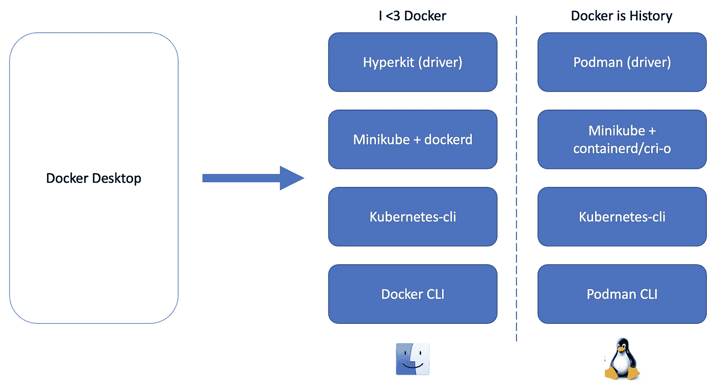
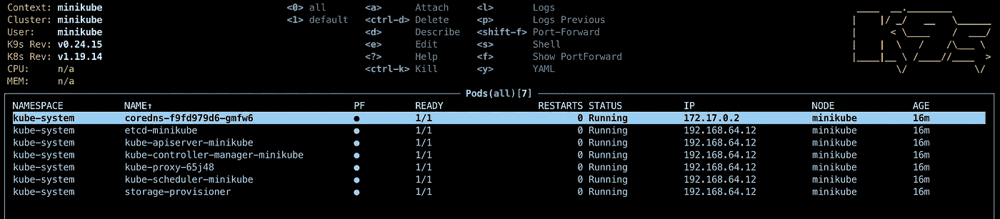

# 再见 Docker 桌面，你好 Minikube！

> 原文：<https://itnext.io/goodbye-docker-desktop-hello-minikube-3649f2a1c469?source=collection_archive---------0----------------------->



我用 Docker 桌面在 Mac 上启用 Docker 和 Kubernetes 已经有一段时间了。即使它疯狂的吞噬 CPU 和内存，让粉丝疯狂。随着“在你的脸上”弹出来迫使升级 Docker 和软件许可证的变化，是时候去别处寻找本地 Kubernetes 开发需求了。

这篇文章只关注 Mac。如果你已经在 Linux 上试过了，让我知道效果如何。

> 你在苹果 M1 硅(ARM64)吗？跳转到帖子末尾，获取 M1 的具体说明。

# 卸载 Docker 桌面

我们先从移除 Docker 桌面开始。

```
brew uninstall docker
```

这将不仅淘汰 Docker，还会淘汰 Hyperkit、Docker 守护进程(允许构建映像)、Docker CLI(与守护进程交互)、Kubernetes 集群和 kubectl 二进制文件(除非您单独部署了它们)。如果你没有使用家酿，然后卸载相应的工具。

让我们把这些工具一件一件拿回来。

# 安装 Hyperkit

对于 Mac 上的本地 Kubernetes 集群，Hyperkit 仍然是一个可行的选择。让我们安装它。

```
brew install hyperkit
```

确保它安装正确。

```
❯ hyperkit -v
hyperkit: 0.20200908Homepage: [https://github.com/docker/hyperkit](https://github.com/docker/hyperkit)
License: BSD
```

# 安装 Docker CLI

我们想摆脱 Docker 桌面，但不是 Docker 本身。Docker 仍然是一个有用的开源容器管理工具，如果你有一堆 Docker 文件要处理，Docker CLI 会很有用。

```
brew install docker
```

> 注意:不要运行`brew install --cask docker`。这将安装 Docker 桌面，我们将回到我们开始的地方！

这将安装 Docker CLI，但不会安装 Docker 守护程序(`dockerd`)。你可以通过运行`docker info`看到这一点。

```
❯ docker info
Client:
 Context:    default
 Debug Mode: falseServer:
ERROR: Cannot connect to the Docker daemon at unix:///var/run/docker.sock. Is the docker daemon running?
```

# 安装 Kubectl

```
brew install kubectl
```

这里没什么好说的。

# 安装 Minikube(和 Docker 守护进程)

随着 Hyperkit 的部署，我们已经准备好部署 Kubernetes 集群，并在这个过程中获得一个 Docker 守护进程。

```
brew install minikube
```

在我们开始使用 Kubernetes 集群之前，需要了解一些有用的信息:

## 使用什么驱动程序？

换句话说，我们是在虚拟机、容器中部署 Kubernetes，还是直接部署裸机？根据操作系统的不同，这里有各种选项。我们将使用 Mac 版的 Hyperkit 驱动程序(AMD64)和 M1 版的 Podman 驱动程序(见本文末尾)。

## 使用什么容器运行时？

可用选项——docker、containerd 和 CRI-o。Containerd 是一个不错的选择，因为 Kubernetes 本身正在放弃 Docker，转而支持 container d。但是因为我们希望 docker 守护进程能够构建 Docker 映像，所以让我们使用 Docker。

## 设置 CPU、内存限制

就像 Docker Desktop 一样，设置正确的 CPU 和内存限制是明智的，尤其是如果您打算运行许多 pods 的话。

```
minikube config set cpus 6
minikube config set memory 12g
```

最后，让我们开始 Kubernetes 集群。

```
❯ minikube start --kubernetes-version=v1.19.14 --driver=hyperkit --container-runtime=docker
```

使用标志`--kubernetes-version`来部署特定的 Kubernetes 版本。放下标记，简单地部署最新版本。我根据需要部署了一个旧版本。

以下是上述命令的输出:

```
😄  minikube v1.23.0 on Darwin 11.5.2
    ▪ MINIKUBE_ACTIVE_DOCKERD=minikube
✨  Using the hyperkit driver based on user configuration
👍  Starting control plane node minikube in cluster minikube
💾  Downloading Kubernetes v1.19.14 preload ...     
    > preloaded-images-k8s-v12-v1...: 470.78 MiB / 470.78 MiB  100.00% 6.17 MiB
🔥  Creating hyperkit VM (CPUs=6, Memory=12288MB, Disk=20000MB) ...
❗  This VM is having trouble accessing [https://k8s.gcr.io](https://k8s.gcr.io)
💡  To pull new external images, you may need to configure a proxy: [https://minikube.sigs.k8s.io/docs/reference/networking/proxy/](https://minikube.sigs.k8s.io/docs/reference/networking/proxy/)
🐳  Preparing Kubernetes v1.19.14 on Docker 20.10.8 ...
    ▪ Generating certificates and keys ...
    ▪ Booting up control plane ...
    ▪ Configuring RBAC rules ...
🔎  Verifying Kubernetes components...
    ▪ Using image gcr.io/k8s-minikube/storage-provisioner:v5
🌟  Enabled addons: storage-provisioner, default-storageclass❗  /usr/local/bin/kubectl is version 1.22.1, which may have incompatibilites with Kubernetes 1.19.14.
    ▪ Want kubectl v1.19.14? Try 'minikube kubectl -- get pods -A'
🏄  Done! kubectl is now configured to use "minikube" cluster and "default" namespace by default
```

> 如果您在本地运行`dnsmasq`,集群内的 DNS 解析可能会出现故障。你可以卸载它，也可以将`listen-address=192.168.64.1`添加到`dnsmasq.conf`中。更多信息可以在[这里](https://minikube.sigs.k8s.io/docs/drivers/hyperkit/)找到。

已经设置了上下文。我们可以用`kubectl`检查集群，如下所示:

```
❯ minikube kubectl get nodes
NAME       STATUS   ROLES    AGE    VERSION
minikube   Ready    master   7m6s   v1.19.14
```

因为我们已经部署了 kubectl 二进制文件，所以我们可以直接使用它。

此时，我们有了一个 Kubernetes 集群，当我们使用 Docker 驱动程序时，Docker 守护进程也在运行。在使用守护进程之前，让我们设置环境变量。

```
eval $(minikube docker-env)
```

让我们确认 docker 守护进程是可访问的。

```
❯ docker info
Client:
 Context:    default
 Debug Mode: falseServer:
 Containers: 14
  Running: 14
  Paused: 0
  Stopped: 0
 Images: 10
 Server Version: 20.10.8
 Storage Driver: overlay2
  Backing Filesystem: extfs
 ...
```

这是 K9S 的 Minikube 集群的样子。



新安装的 Minikube 集群的 K9S 快照

# 需要 Docker 作曲吗？

使用以下命令安装 Docker Compose:

```
brew install docker-compose
```

# 在 Minikube 外部公开服务

对于本地开发，通常通过浏览器或 CLI 从笔记本电脑访问服务。端口转发始终是一个选项，但有时入口或负载平衡器是有用的。让我们看看他们如何与 Minikube 一起工作。

## 处理入口资源

我们有一个 Kubernetes 集群，可以在其中部署我们的应用程序。但是我们如何访问入口资源呢？Minikube 有一个带插件的回答。

```
❯ minikube addons enable ingress
    ▪ Using image k8s.gcr.io/ingress-nginx/controller:v1.0.0-beta.3
    ▪ Using image k8s.gcr.io/ingress-nginx/kube-webhook-certgen:v1.0
    ▪ Using image k8s.gcr.io/ingress-nginx/kube-webhook-certgen:v1.0
🔎  Verifying ingress addon...
```

这将部署 Nginx 入口控制器。更重要的是，它会将 Nginx 服务部署为`NodePort`，并将 Minikube IP 直接指向 Ingress。先找到 IP 再说。

```
❯ minikube ip
192.168.64.12
```

让我们在端口 80 上调用上面的 IP，应该会得到 Nginx 的响应。

```
❯ curl [http://192.168.64.12](http://192.168.64.12)
<html>
<head><title>404 Not Found</title></head>
<body>
<center><h1>404 Not Found</h1></center>
<hr><center>nginx</center>
</body>
</html>
```

请记住，Ingress 在 DNS 上工作，它应该解析为 Minikube IP。如果其中一个后端服务调用该 DNS，除非明确配置，否则它将失败。又一个救星！

```
❯ minikube addons enable ingress-dns
    ▪ Using image cryptexlabs/minikube-ingress-dns:0.3.0
```

这将在 Kubernetes 集群内的 Minikube IP 上启动一个 DNS 服务器。还需要自定义解析器来强制自定义 TLD 的 DNS 解析(如。测试，不要使用。本地)被重定向到上面启动的 DNS 服务器。Minikube Ingress DNS 文档很好地解释了这一点。按照这里的步骤，您将拥有一个带有自定义 DNS 的工作入口设置。

## 负载平衡器服务

部署负载平衡器类型的服务并从主机访问它，就像在云中部署一样，这不是很好吗？多亏了`metallb`插件，这很简单。

```
minikube addons enable metallb
```

这将部署另外两个 pod，它们负责为负载平衡器服务分配外部 IP。否则，服务将永远拥有`pending`外部 IP。

在使用`metallb`之前还有一个步骤。默认情况下，`metallb`无法知道哪些 IP 范围可分配给负载平衡器服务。运行以下命令以提供一个范围。

```
❯ minikube addons configure metallb
-- Enter Load Balancer Start IP: 192.168.64.5
-- Enter Load Balancer End IP: 192.168.64.15
    ▪ Using image metallb/speaker:v0.9.6
    ▪ Using image metallb/controller:v0.9.6
✅  metallb was successfully configured
```

根据您的 Minikube IP，分配包含 Minikube IP 的小范围 IP。现在，每当您部署负载平衡器服务时，将分配此范围内的一个 IP。

# 其他问题

## 登录到远程注册表

你可能仍然有旧的`~/.docker/config.json`，将`credsStore`设置为`osxkeychain`或`desktop`。这在新的设置中不起作用。要解决这个问题，让我们安装 Docker 凭证助手。

```
brew install docker-credential-helper
```

凭证将像以前一样储存在 MacOS 钥匙串中。如果这不起作用，一个快速的解决方法是删除`~/.docker/config.json`文件并再次登录注册中心。

## 保留 Docker 映像和永久卷声明

*增加了 2021 年 9 月 7 日*

Docker Desktop 的一个优点是，您可以关闭 Kubernetes 集群，稍后再启动它，并使用相同的 Docker 映像和持久卷运行您的 pods。例如，在 Kubernetes 中运行本地数据库时，这很有用。让持久卷在重启时可用是很方便的。

使用 Minikube，如果我用`minikube stop`关闭集群(和 Hyperkit VM ),它会删除 Docker 映像和所有持久卷。真烦人。幸运的是，Minikube 提供了一种防止删除的方法。我们可以*暂停*它，而不是停止 Kubernetes 集群和 Hyperkit 虚拟机。

```
minikube pause
```

该命令终止 Kubernetes 集群，但不删除 Hyperkit 虚拟机。这释放了更多的 CPU，同时仍然保留所有 Docker 映像和持久卷。但是等等，还有更好的！它不会停止 docker 守护程序。所以你可以继续使用 Docker CLI，只是别忘了用`eval $(minikube docker-env)`设置 Docker 环境。

当您想继续在 Kubernetes 集群上工作时，运行以下命令:

```
minikube unpause
```

你将会得到所有的系统舱，包括插件。这甚至适用于笔记本电脑重启！

## 码头集装箱装订线

*增加了 2021 年 9 月 7 日*

Reddit 的好朋友指出，Docker 容器中的绑定挂载`(-v)`在 Minikube 和 Docker 设置中不能开箱即用。这是 Docker 容器的常见操作，应该可以正常工作。

由于使用了中间 Hyperkit 虚拟机，因此安装卷需要两步操作。首先，让我们将笔记本电脑上的磁盘挂载到 Hyperkit VM。

```
minikube mount /myvolume:/test
```

这将在 Hyperkit VM 中的路径`/test`处挂载本地文件夹`/myvolume`。该进程仍处于活动状态，因此您应该不去管这个终端。

在另一个终端中，运行 Docker 容器并将`/test`卷绑定到容器中的一个路径。

```
docker run --rm -it -v /test:/inside busybox /bin/sh
```

这将把`/test`卷挂载到 Hyperkit VM 容器内的路径`/inside`上。实际上，这使得容器内笔记本电脑上`/myvolume`下的所有文件和文件夹都处于读写模式。太棒了。

# 苹果硅 M1 怎么样？

*增加了 2022 年 2 月 5 日*

上个月，我终于买到了苹果 M1！从那时起，我一直试图找出一种不使用 Docker 桌面运行 Minikube 的方法…直到现在:)

基于 ARM64 的苹果 M1 面临一些挑战。出乎意料的是，Hyperkit 对 M1 不起作用，而且[可能永远也不会对](https://github.com/moby/hyperkit/issues/310#issuecomment-1003707160)起作用。我们需要一个替代工具来创建虚拟机。波德曼出场。

根据他们的[网站](https://podman.io)，波德曼是 Docker 的直接替代者。字面`alias docker=podman`。令人兴奋的消息是，波德曼增加了对苹果 M1 公司的支持！我们将使用 Podman machine(与 docker machine 相似)特性使我们自己成为一个虚拟机。在引擎盖下，波德曼和 Docker Desktop 都使用 QEMU 施展他们的魔法。

先装波德曼。

```
brew install podman
```

创建具有所需规格的虚拟机。

```
❯ podman machine init --cpus 6 --memory 12288 --disk-size 50 --image-path next
Downloading VM image: fedora-coreos-35.20220131.1.0-qemu.aarch64.qcow2.xz: done
Extracting compressed file❯ podman machine start
INFO[0000] waiting for clients...
INFO[0000] listening tcp://127.0.0.1:7777
INFO[0000] new connection from  to /var/folders/2x/wz0vrff903q0p3lpn959b8zw0000gn/T/podman/qemu_podman-machine-default.sock
Waiting for VM ...
Machine "podman-machine-default" started successfully
```

使用 Podman 服务的根目的地需要一个小的调整，以使其与 Minikube 一起工作。如果没有这个调整，Minikube 将失败，并显示“错误:请求的 cgroup 控制器“cpu”不可用:OCI 运行时错误”。

```
❯ podman system connection default podman-machine-default-root❯ podman system connection list
Name                          Identity                                          URI
podman-machine-default        /Users/x/.ssh/podman-machine-default  ssh://core@localhost:57623/run/user/1000/podman/podman.sock
podman-machine-default-root*  /Users/x/.ssh/podman-machine-default  ssh://root@localhost:57623/run/podman/podman.sock
```

波德曼准备好了。下一步是使用 Podman 驱动程序启动 Minikube 集群。只需运行下面的命令。

```
❯ minikube start --kubernetes-version=v1.22.5 --driver=podman --container-runtime=cri-o -p minipod
😄  minikube v1.28.0 on Darwin 12.6.1 (arm64)
🆕  Kubernetes 1.25.3 is now available. If you would like to upgrade, specify: --kubernetes-version=v1.25.3
✨  Using the podman (experimental) driver based on existing profile
👍  Starting control plane node minikube in cluster minikube
🚜  Pulling base image ...
E1218 00:06:49.506418   69295 cache.go:203] Error downloading kic artifacts:  not yet implemented, see issue #8426
🔄  Restarting existing podman container for "minikube" ...
🎁  Preparing Kubernetes v1.22.5 on CRI-O 1.24.3 ...
E1218 00:06:57.412980   69295 start.go:130] Unable to get host IP: RoutableHostIPFromInside is currently only implemented for linux
🔗  Configuring CNI (Container Networking Interface) ...
🔎  Verifying Kubernetes components...
    ▪ Using image gcr.io/k8s-minikube/storage-provisioner:v5
🌟  Enabled addons: storage-provisioner, default-storageclass🏄  Done! kubectl is now configured to use "minikube" cluster and "default" namespace by default
```

这样，我们就有了一个运行在苹果 M1 上的 Minikube 集群，而不需要 Docker 桌面！

# 结论

在一个周日下午花了几个小时后，我对这里的布置很满意。我们去掉了 Docker Desktop，代之以 Hyperkit(M1 的 Podman)和 Minikube。我们仍然可以使用 Docker API 在本地 Kubernetes 集群中管理 Docker 文件和部署应用程序。最重要的是，笔记本电脑正在愉快地运行，额外的资源可以被 Slack、Notion 和其他电子应用程序使用；-)

# 资源

1.  [容器运行时简介](https://www.ianlewis.org/en/container-runtimes-part-1-introduction-container-r)
2.  [Minikube 文档](https://minikube.sigs.k8s.io/docs/)
3.  [波德曼文档](https://docs.podman.io/en/latest/)