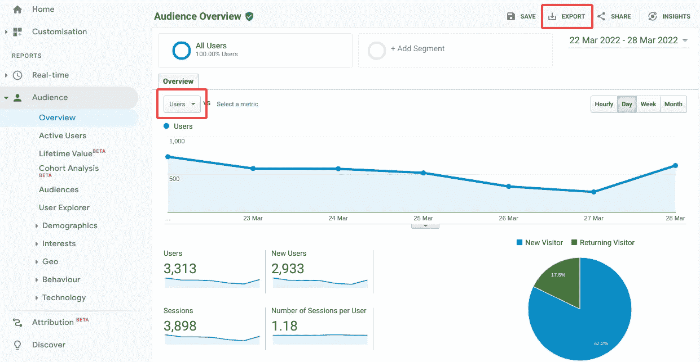
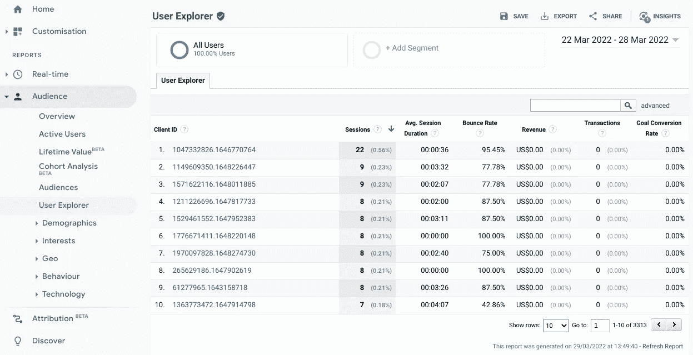
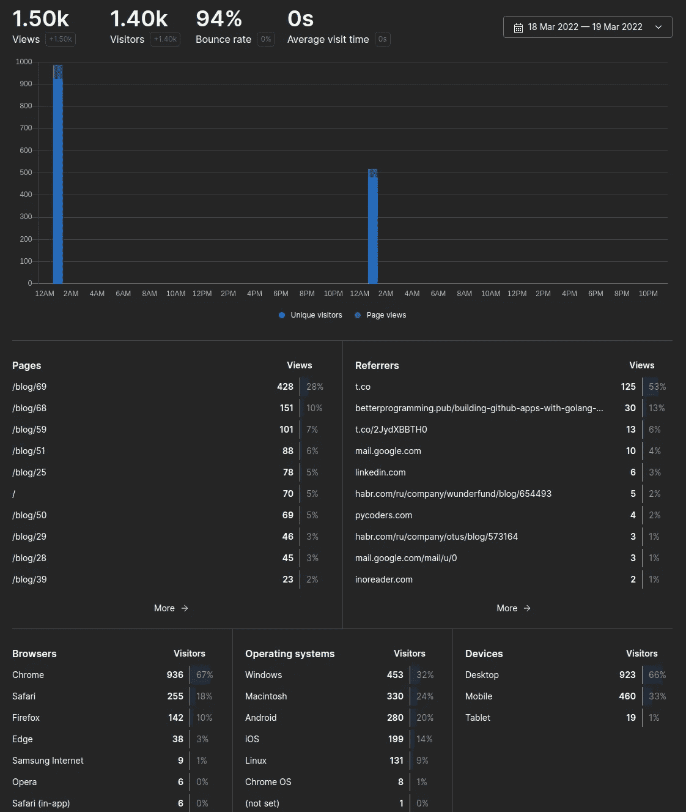

# 再见，谷歌分析——为什么以及如何离开这个平台

> 原文：<https://itnext.io/goodbye-google-analytics-why-and-how-you-should-leave-the-platform-a1b60b878a79?source=collection_archive---------0----------------------->

## 是时候告别谷歌分析平台，在为时已晚之前迁移到更好的解决方案了

照片由[马克西姆·伯格](https://unsplash.com/@maxberg?utm_source=unsplash&utm_medium=referral&utm_content=creditCopyText)在 [Unsplash](https://unsplash.com/?utm_source=unsplash&utm_medium=referral&utm_content=creditCopyText) 拍摄

随着最近发生的与*谷歌分析*平台相关的事件，很明显，我们许多人从谷歌分析迁移到不同平台的时候到了。

在这篇文章中，我们将回顾*“为什么？”*，以便您可以做出是否需要迁移的明智决定，以及*“如何迁移？”*从 Google Analytics 迁移——快速轻松地将您的数据迁移到不同的分析平台，没有太多麻烦。

# 为什么？

为什么现在突然到了抛弃谷歌分析的时候了？

有两个主要原因可以解释你为什么想这么做。首先，多个欧盟国家的法院裁定，在欧盟使用谷歌分析是非法的。这是因为欧盟公民的数据被转移到美国，这违反了 GDPR 规则。这些裁决目前适用于法国和奥地利，但是预计 2022 年将会有更多的裁决。因此，除非谷歌决定很快在欧盟运行 GA 基础设施，否则你可能很快就会陷入法律困境。

最近，美国和欧盟领导人就跨大西洋数据隐私达成了[协议](https://www.nytimes.com/2022/03/25/business/us-europe-data-privacy.html)，这可能会缓解这个问题，但数据隐私倡导者可能不会满意，并将在法庭上对此提出质疑。

迁移出平台的另一个原因是[谷歌从 2023 年 7 月 1 日开始反对*通用分析*](https://blog.google/products/marketingplatform/analytics/prepare-for-future-with-google-analytics-4/) 。你可以按照谷歌的建议将你的 GA 属性迁移到 GA4，但这里的问题是你的旧数据不会移动，你将无法比较或回顾比方说 2 年前的分析，这很糟糕。

*“一石二鸟”*的解决方案是选择一个隐私友好的平台，在这个平台上你不需要担心 GDPR 规则，并从 GA 提取和移动你的数据到所述平台，完全拥有你的数据，不必担心谷歌随时随地贬低他们(这是[非常常见的](https://killedbygoogle.com/))。

# 怎么会？

如果您决定想要或需要迁移，那么我在这里向您介绍一个简单的工具和过程，用于导出您的分析数据并将其转换为适合其他平台的格式。

[*GA 提取器*](https://github.com/MartinHeinz/ga-extractor) 可以帮助你从 Google Analytics 中提取任何分析数据，而无需接触 API。除了执行基本的数据导出之外，它还可以将数据转换成除默认 JSON 之外的其他格式——也就是说，一种可读性更强的 CSV 格式，可用于数据分析或 SQL，适合直接迁移到其他平台。

让我们看一些例子。要安装该工具，只需运行:

在那里，您可以像这样设置它:

在上面的命令中，可以看到需要提供*服务账号密钥*文件(`--sa-key-path`)和*表 ID* ( `--table-id`，也称为*视图 ID* )。您可以使用[存储库自述文件](https://github.com/MartinHeinz/ga-extractor#readme)或 [PyPI 页面](https://pypi.org/project/ga-extractor/0.1.1/)中的指南获得这些值。

运行这个命令将在`~/.config/ga-extractor/...`的应用程序配置目录中生成一个配置文件。您可以通过运行`ga-extractor auth`来验证该工具是否可以通过 Google API 进行身份验证。

如果您不确定要选择哪些指标和维度，那么您可以使用带有`FULL`或`BASIC`选项的`--preset`标志来为您设置指标和维度。

配置好工具后，您现在可以运行提取:

现在，如果 Google API 产生的数据格式不适合您的需要，那么您可以使用`migrate`命令提取并转换成 CSV 或 SQL 格式:

CSV 比默认输出更具可读性，而 SQL 可用于迁移到其他平台。这里的 SQL 是为鲜味分析量身定制的，但经过一些调整，它可以应用于其他平台，这些平台可以跟踪会话和页面浏览量以及所有常用指标。

请注意，`migrate`命令会覆盖之前配置的度量和维度，这样它就可以产生有意义的结果。

如果您没有很多数据或者您觉得上面的内容对您来说太麻烦了，那么您还可以从 GA web 控制台导出一些表和视图。您可以导出许多高级/复杂的内容，但在离开 GA 之前，您肯定希望得到的最基本的东西是页面浏览量和用户会话信息。

要导出页面浏览量或任何汇总指标，您可以导航至*受众*和*概览*，从下拉列表中选择所需指标，然后点击导出:

用户导出—按作者分类的图像

要导出单个会话，您可以导航到*受众*和*用户浏览器*，然后单击导出:

会话导出-按作者分类的图像

你可以从控制台上获得更多的东西，我推荐你看看这篇文章，它提供了很好的概述。

# 可供选择的事物

既然您已经导出了数据，或者您可能决定不使用 GA，甚至不获取数据，那么是时候选择新的平台了。有许多好的隐私友好、开源、便宜/免费的 GA 替代方案。我不会一一赘述，因为有很多关于这方面的文章，比如[这一篇](https://stackdiary.com/open-source-analytics/)列出了一系列开源选项。

如果您使用上面介绍的`ga-exporter`工具导出数据，您可以选择将其转换为可以轻松插入到 *Umami* 中的格式，这使其成为简单的迁移目标。如果你想测试一下，那么你可以用 *Docker* 启动服务，如 [docs](https://umami.is/docs/install) 中所述，添加你的网站，如[这里所示](https://umami.is/docs/add-a-website)，然后插入之前导出的数据:

然后，您可以查看仪表板，它应该像这样显示您的数据:

鲜味仪表板-作者图片

鲜味是我的迁移目标，但是您可能有不同的偏好和需求。不过，在选择目标平台时，有一点要记住，那就是完整的数据*【所有权】，这对于避免供应商锁定非常重要，否则，如果将来再次出现需求，就很难进行迁移。因此，我建议寻找一个平台，它可以轻松地以实用的格式导出完整的分析数据，以便轻松地分析您的数据或迁移到其他地方。*

# *结束语*

*即使你决定此时不想或不需要离开谷歌分析，探索一些替代方案也是一个好主意。您可能不需要任何高级 GA 特性，并且您可能会意识到替代方案实际上更适合您的需求。*

*也没有必要害怕自己托管分析引擎。许多开源解决方案可以在几分钟内启动，并且只需要很少的运行资源。正如您在本文前面所看到的，即使是数据迁移也非常简单。如果这是您想要走的路，但是这里提供的提取器工具不支持您想要迁移到的目标平台，或者您有一些反馈要分享，那么请随意在 [GitHub 仓库](https://github.com/MartinHeinz/ga-extractor)中创建问题，我一定会尽力帮助您。*

**本文原帖*[*martinheinz . dev*](https://martinheinz.dev/blog/71?utm_source=medium&utm_medium=referral&utm_campaign=blog_post_71)*

*[成为会员](https://medium.com/@martin.heinz/membership)阅读 Medium 上的每一个故事。**你的会员费直接支持我和你看的其他作家。**你还可以在媒体上看到所有的故事。*

* [## 通过我的推荐链接加入媒体-马丁·海因茨

### 作为一个媒体会员，你的会员费的一部分会给你阅读的作家，你可以完全接触到每一个故事…

medium.com](https://medium.com/@martin.heinz/membership)* 

*你可能也喜欢…*

* [## 用 Python 探索 Google Analytics 实时数据

### 使用 REST API 和 Python 充分利用所有 Google Analytics 特性和数据

towardsdatascience.com](https://towardsdatascience.com/exploring-google-analytics-realtime-data-with-python-8625849c7d7a)  [## 让你的网站快速运行的简单技巧

### 使用这些快速简单的技巧来优化您的 web 应用程序的大小和性能，使它尽可能快！

itnext.io](/the-simple-tricks-to-make-your-website-blazing-fast-2e7f725574df)*