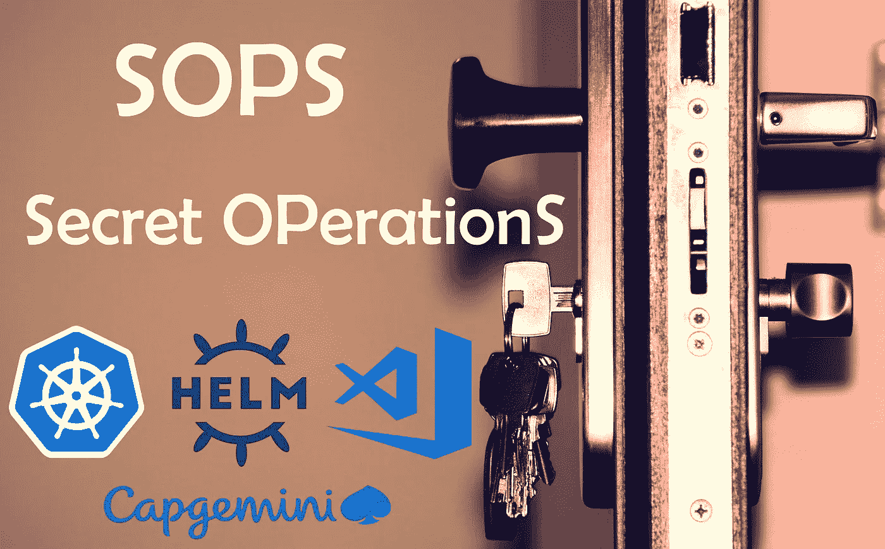
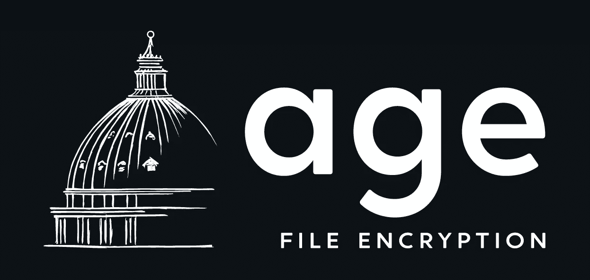

# 再见密封的秘密，你好 SOPS

> 原文：<https://itnext.io/goodbye-sealed-secrets-hello-sops-3ee6a92662bb?source=collection_archive---------0----------------------->



## 本教程将为您提供在 shell、Kubernetes、Helm 和 Visual Studio 代码中设置 sop 的所有步骤和命令。

我们假设您在 Windows 上使用 WSL 作为 Linux 环境。我们将在两者中设置标准操作程序。

想一头扎进去吗？点击[这里](#8f5b)直接跳转到安装部分。

安装盖:

*   壳
*   舵
*   Visual Studio 代码

# 什么是 sop

Sops 是一个能够加密配置文件的二进制程序。但是 Sops 理解格式(JSON、YAML、INI 等),并且只加密每一行的值(在一个键/值对中),而不是加密整个文件。

> 目的是将包含敏感信息的加密配置存储到您的版本系统(Git、SVN 等)中，然后能够毫不费力地使用这些加密文件。

sop 提供了以下优势:

1.  加密值而非密钥
    –即使加密也能保留文件结构
2.  将加密文件安全保存到 Git
3.  无缝编辑加密文件
    –Sops 将在您最喜欢的文本编辑器中打开文件的未加密版本
    –保存时，文件将自动使用新内容重新加密
4.  加密特定的密钥，而不是整个文件
    –非常适合包含少量敏感信息的长配置文件。
5.  使用所有的配置文件，而不仅仅是 Kubernetes 的秘密
    ——可以加密你的头盔的`values.yaml`文件，以安全地存储其中的敏感数据(密码等)
6.  Kubernetes 中不需要后端
    -唯一的要求是在本地安装 sop
    -管理加密文件将在本地完成
7.  所有主要工具都有插件来支持 sop 工作

## Sops 加密示例

假设我们有这个经典的 Kubernetes 秘密。秘密值不加密，而只编码为 base64。

```
**apiVersion**: v1
**data**:
  **secret_value**: U29wcyBydWxlcw== 📖
**kind**: Secret
**metadata**:
  **creationTimestamp**: null
  **name**: my-secret
  **namespace**: default
```

接受 sop 后，你会得到:

```
**apiVersion**: ENC[AES256_GCM,data:PFk=,iv:,[...]tag:G9mg==,type:str]🔒
**data**:
    **secret_value**: ENC[AES256_GCM,data:Ex2KhoAlCG4w==,[...]🔒
**kind**: ENC[AES256_GCM,data:eW1JrnrV,[...]🔒
**metadata**:
    **creationTimestamp**: null
    **name**: ENC[AES256_GCM,data:fkWXVtQS/C62,iv:GCTfamtu4ixP4w=[...]🔒
    **namespace**: ENC[AES256_GCM,data:J96kuhjMUA==,iv:QZMnvDGqX[...]🔒
**sops**:
[...]
```

如您所见，所有的值都被加密了。但是密钥仍然是明文。

sop 也可以根据你给它的密钥加密特定的值。
这里，假设我们想要**仅**加密“secret_value”密钥:

```
**apiVersion**: v1📖
**data**:
    **secret_value**: ENC[AES256_GCM,data:9VBm+32QSCOaU+9exohSg==[...]🔒
**kind**: Secret📖
**metadata**:
    **creationTimestamp**: null
    **name**: my-secret📖
    **namespace**: default📖
**sops**:
[...]
```

只有“secret_value”值被加密。文件的其余部分保持不变。

# 为什么我们不再使用密封的秘密

## 它是做什么的？

我们已经使用密封机密一年了，但现在是改变的时候了。这项(很酷的)技术允许你在磁盘上加密一个 Kubernetes 秘密，然后在 GIT 上提交。这样，即使黑客得到了你的存储库，他也无法访问你的秘密内容。

## 为什么不完美？

SealedSecret 对于很多用例来说都很棒。但在我们看来，它确实有些不足:

*   必须在集群中安装后端
*   证书轮换可能会变得复杂
*   默认加密模式不允许将机密从一个名称空间移动到另一个名称空间
*   在 Kubernetes 集群上，生成的秘密仍然是明文

**但是最有问题的部分是……**

> 我们将敏感数据以纯文本形式存储在舵图中，例如舵图的“values.yaml”中的密码。**这根本不在保密范围内。**

# 安装标准操作程序

## 在 WSL 上安装 Sops 二进制文件

下载 linux 的二进制文件:[https://github.com/mozilla/sops/releases](https://github.com/mozilla/sops/releases)

```
$ wget <URL_OF_THE_BIN_FROM_GITHUB>
$ sudo mv sops-<VERSION> /usr/local/bin/sops
```

## 安装年龄



Sops 本身并不加密。它利用了其他加密技术，如 PGP、AGE、GCP KMS、Azure key vault、Hashicorp Vault 等

由于 PGP 有点过时，我们将安装新的版本:**年龄**

年龄是加密文件的工具。它不关心文件本身的格式。为了只加密文件的值或部分，我们需要依赖 sop。年龄只是 Sops 会用的一个工具。

让我们安装年龄…

```
$ AGE_VERSION=$(curl -s "[https://api.github.com/repos/FiloSottile/age/releases/latest](https://api.github.com/repos/FiloSottile/age/releases/latest)" | grep -Po '"tag_name": "(v.*)"' |grep -Po '[0-9].*[0-9]')$ curl -Lo age.tar.gz "[https://github.com/FiloSottile/age/releases/latest/download/age-v${AGE_VERSION}-linux-amd64.tar.gz](https://github.com/FiloSottile/age/releases/latest/download/age-v${AGE_VERSION}-linux-amd64.tar.gz)"$ tar xf age.tar.gz$ sudo mv age/age /usr/local/bin$ sudo mv age/age-keygen /usr/local/bin
```

## 生成公钥和私钥

既然 Age 已经安装，您必须创建一个公钥和一个私钥。

```
$ age-keygen -o key.txt$ cat key.txt
# created: 2022-07-30T17:02:43+02:00
# public key: age1rdje4gwnm2cc6uu6lvggzjj8gktu4cw5ng8yyjhrluwvqq387cls58dsy4
AGE-SECRET-KEY-18LMDYJRYZMRM52CYQA9MZW79M85CPR0HJHCASXF5ADT03KJ290HS88599E$ mkdir ~/.sops$ mv ./key.txt ~/.sops
```

由 Age 创建的▶️The 私钥和公钥存储在文件`key.txt`中。我们将这个文件移动到主文件夹中的一个`.sops`目录中。

为了告诉 sop 一切都在哪里，将这些 ENV 变量添加到您的 shell 配置中(`~/.bashrc`或`~/.zshrc`

```
export SOPS_AGE_KEY_FILE=$HOME/.sops/key.txt
export EDITOR=nano # Replace by your favorite editor
```

在继续之前不要忘记`source`您的 shell 配置文件，或者至少打开一个新的 shell。

## 测试 sop 和 Age 正在工作

让我们加密一个文件…

```
# Creating a test file
$ echo "my-key: my-value" > config.yaml# Encrypting the file
sops --encrypt --age $(cat ~/.sops/key.txt |grep -oP "public key: \K(.*)") ./config.yaml
```

▶️:我们使用了`--age`参数来指定使用什么公钥。这里，我们依靠 bash 在运行时替换出现在`key.txt`中的公钥。

现在，要将文件保存到磁盘，只需简单的右重定向即可:

```
$ sops --encrypt --age $(cat ~/.sops/key.txt |grep -oP "public key: \K(.*)") ./config.yaml > config_enc.yaml$ cat config_enc.yaml
my-key: ENC[AES256_GCM,data:Jw1oRQcV8=,tag:Tzd/oUQ[...]==,type:str]
sops:
[...]# Edit the file using Sops
$ sops config_enc.yaml
<Your favorite editor should have opened>
<The file in front of you should be unencrypted>
<When saving, modifications you made will be encrypted>
```

> 动态解密和重新加密是一个极好的特性。你甚至不知道文件被加密了。都是自动的！

# 配置工具

## 向您的解释器添加别名

这应该可以毫不费力地在 bash 和 zsh 上运行。

由于加密文件的语法有点繁琐(因为你必须将 Age 公钥传递给 Sops ),我们准备了一个别名，可以添加到你的`.bashrc`或`.zshrc`

```
function cypher {
    filename=$(basename -- "$1")
    extension="${filename##*.}"
    filename="${filename%.*}"
    sops --encrypt --age $(cat ~/.sops/key.txt |grep -oP "public key: \K(.*)") $2 $3 $1 > "$filename.enc.$extension"
}
```

请记住，在尝试新别名之前，请始终`source`保存您的个人资料。

**用法:**

```
# Creating test files
$ echo "some_key: some_value" > test_alias.yaml# Encrypting
$ cypher test_alias.yaml$ ls
test_alias.enc.yaml
```

您也可以更新别名以就地编辑文件，而不生成新文件。这应该是这样的:

```
function cypher_inplace {
    sops --encrypt --in-place --age $(cat ~/.sops/key.txt |grep -oP "public key: \K(.*)") $2 $3 $1
}
```

要仅加密文件的一部分，必须使用正则表达式显式密钥。你**不需要**成为正则表达式大师来实现这一点。看看这个例子:

```
$ echo "key1: value1" >  test_regex.yaml
$ echo "key2: value2" >> test_regex.yaml
$ echo "key3: value3" >> test_regex.yaml$ cat test_regex.yaml
key1: value1
key2: value2
key3: value3$ cypher test_regex.yaml  --encrypted-regex='^(key1|key3)$'$ cat test_regex.enc.yaml
key1: ENC[AES256_GCM,[...]tag:qHy9z22CIxcb9ykpPAWikQ==,type:str]
key2: value2
key3: ENC[AES256_GCM,data:3Faqn,[...]tag:1VB3/wrLekmg==,type:str]
```

如您所见，只有`key1`和`key3`的值被加密。`key2`一直保持原样。

> 您可以添加任何想要的键，用`|`分隔。例如`--encrypted-regex='^(<a_first_key>|<a_second_key>|<a_third_key>)$`

## 为 Visual Studio 代码安装 sop

正如我们所见，Sops 允许无缝编辑加密文件。Visual Studio 代码也可以做到这一点，只要它有一个 Sops 插件。

1.  下载适用于 Windows 的 Sops 二进制文件(或者任何运行 VS 代码的操作系统)
    -[https://github.com/mozilla/sops/releases](https://github.com/mozilla/sops/releases)
2.  将二进制文件添加到操作系统路径
    ——在 Windows 上是`c:\Windows\system32`
    ——将其重命名为`sops.exe`
3.  在 VScode 上，下载 Sops 插件 [@signageos/vscode-sops](http://twitter.com/signageos/vscode-sops) 。
    -你不需要这么做，但是，要在 VScode 中配置插件，请转到`file > preferences > settings > plugins > Sops`
4.  将安装在 linux (WSL)上的密钥复制到 Windows 分区

```
$ mkdir /mnt/c/Users/<YOUR_WINDOWS_USERNAME>/AppData/Roaming/sops/age -p$ cp ~/.sops/key.txt /mnt/c/Users/<YOUR_WINDOWS_USERNAME>/AppData/Roaming/sops/age/keys.txt
```

▶️路径`AppData/Roaming/sops/age`是 VSCode 期望你的密钥所在的地方。如果需要，可以在插件设置中进行配置。

## 安装舵的标准操作程序

Sops 的一个很大的优点是，你可以把纯文本的敏感数据放在你的舵图的`values.yaml`中，然后简单地让 Sops 加密文件。

❗因此，该文件不能直接与头盔一起使用，因为它本身不能读取加密文件…
▶️️这就是为什么你应该安装这个头盔插件。它允许使用所有经典的 helm 命令，但当遇到加密文件时，它会自动解密并继续安装过程。

```
$ helm plugin install [https://github.com/jkroepke/helm-secrets](https://github.com/jkroepke/helm-secrets) --version v3.14.0
```

要使用这个插件，你只需在 helm 二进制文件后添加单词`secrets`。
例如，当安装带有加密`values.yaml`的舵图时:

```
$ helm secrets install minecraft-server itzg/minecraft
```

## 为 Kubectl 安装 sop

目前还没有什么好的解决方案来混合 kubectl 和 sops。但是通过管道将 sop 输出到`kubectl apply`非常简单。

```
$ sops -d <ENCRYPTED_FILE>.yaml | kubectl apply -f -
```

感谢您遵循本教程。如果这有助于您设置 Sops 安装，请考虑提供👏。

作者:艾米莉·兰斯洛特

[堆栈溢出](https://stackoverflow.com/users/5512455/doctor)

需要 Kubernetes 上的服务功能？不要再说了！现在就结帐 [Gitfaas](https://github.com/rememberSoftwares/gitfaas) ！对所有人免费，对所有人开源。