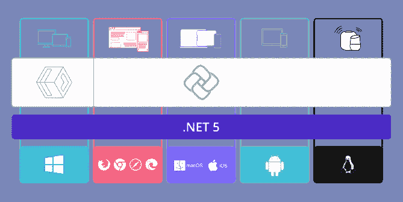

# 再见，夏玛琳。形式

> 原文：<https://itnext.io/goodbye-xamarin-forms-f41723fb9fe1?source=collection_archive---------0----------------------->

TL，DR: [Uno 平台](https://platform.uno/)是我所希望的一切 Xamarin。表格应该是。有鉴于此，请告诉我为什么一个人要为。网毛伊岛。

Uno 平台架构(信用 Uno 平台)

2012 年，我听说了这个新平台，叫做 Xamarin。当时，它被定位为 Mono(面向大众的 C#)的重新命名，强调 iOS 和 Android。作为一个小开发人员，维护多个冗余的代码库曾经是(现在仍然是)我最大的痛点——所以我很感兴趣。

2013 年，我付钱给我的一个好朋友，让他深入研究一下。他创造了一些基准(启动时间，渲染时间等。)的应用程序比 Xamarin 营销中发现的任何东西都更真实。iOS 的表现很棒。安卓——没那么多，但还可以忍受。有人承诺会让 Android 变得更好，所以我们决定向前一步，开发一些应用。

然后，2015 年，Xamarin。形式是足够的噪音，我想我会尝试一下。尽管 Xamarin 允许我们编写一次业务逻辑，但这只是构建我们的应用程序的一小部分工作。Xamarin。Forms 电梯间推介是“所有设备的一个代码库”。

然而，我很快发现 Xamarin.Forms 有很多问题。

首先是 Xamarin。Forms 当时的理念是“让 iOS 应用看起来像 iOS 应用，让 Android 应用看起来像 Android 应用”。换句话说，他们知道标准化 UI 需要大量的工作，所以他们不会去费心。如果你想要平台之间的一致性，你将不得不付出汗水。

接下来，我在 Android 和 iOS 中习惯的许多东西都不在 Xamarin 中。表单的抽象用户界面。举几个例子。

*   9 片图像
*   SVG 图像
*   长按手势
*   自定义字体
*   多分辨率/多平台图像管理
*   标签的标记支持
*   分段按钮
*   弹出窗口作为第一类元素
*   多对象剪贴板支持/应用程序间数据共享
*   PNG 和 PDF 生成
*   印刷

上面的清单消耗了我三年时间的大部分。与此同时，Xamarin 的 UWP 支持和 Tizen 一样上线了(仍然没有客户询问 Tizen)。一旦上面的列表完成，我的 UI 代码被移植，我就有了一些很棒的 iOS 和 UWP 应用。然而，异羟肟酸。Android 应用程序的形式很糟糕(现在依然如此)。启动时间很糟糕，更重要的是，视图渲染比没有表单的 Xamarin 慢了一个数量级。

AOT 编译和启动分析缓解了这个问题，但是，即使到今天，Android 的性能仍然很糟糕。即使在高端设备上，Android 操作系统也经常会终止这些应用程序，因为它们的响应速度不够快。

除此之外，我和我的客户想要我们的应用程序的 WASM 版本。有传言说要移植 Xamarin。表格从一开始就交给了 WASM，但从未和官方声明过。然后，在 2017 年 6 月，弗兰克·克鲁格出版了 [Ooui](https://github.com/praeclarum/Ooui) — Xamarin。给 WASM 的表格！弗兰克建造了一个杰作——优雅而富有表现力。让我说清楚。Frank 给了我对 Xamarin.Forms 的希望，要不是 Ooui，我早就放弃 Xamarin 了。表单并放弃了跨平台开发。

但是，缺点从未消失，Xamarin 的重点总是在其他地方。Android 更新继续发生，但性能并没有得到任何改善。Frank 放弃了 Ooui 的工作(这只是一个概念验证，对吗？).我花了整整三个月的时间试图提高 Android 的性能，但没有成功。比起 Ooui，Xamarin 似乎[对 Blazor](https://docs.microsoft.com/en-us/mobile-blazor-bindings/) 更感兴趣。

与此同时，2018 年 10 月， [Uno 平台宣布他们拥有 WASM](https://platform.uno/blog/introduction-to-webassembly-for-the-uno-platform-part-1/) 。很快，他们就有了复杂的现实世界演示应用程序来证明这一点。

所以，在 2020 年春天，我参加了(实际上)Uno Conf。我的首要任务是:Uno 的 Android 性能如何。在花了几个小时听了关于构建工具和工具包的演讲后，会议结束了。我没有答案，越来越怀疑。然而，有一个虚拟的会后社交活动，我可以在那里会见其他与会者。一过了小贩，我就遇到了卡尔·德·比利。我和卡尔分享了我使用 Xamarin 的经验。Forms Android 并询问 Uno 是否会有所不同。

卡尔非常专业，但他也给了我足够的信息，让我知道去哪里戳。接下来的一周，我进行了大量的实验，并完全被我所学到的东西震惊了——没有重大的修改，Xamarin。表单永远无法构建高性能的 Android 应用程序。为什么？因为 Android 中托管(C#)和原生代码(Java)之间的切换比其他平台差~ 10 倍。对 Xamarin 来说不成问题。安卓应用，因为用了安卓布局引擎。然而，Xamarin。Android 的表单是使用 Xamarin 构建的。用于视图实例化和布局的 Forms 托管代码。Forms 在其他平台上可以)，这导致托管和本机之间的切换增加了 10 秒、100 秒、1000 秒、10000 秒。这在 Xamarin 的演示应用中并不是太大的问题，但在更真实的 listview 应用中，这个纸牌屋会在自身重量下倒塌。这就是我的安卓应用糟糕的原因。

8 月份开始迁移我的工程分析代码库，其中 78k 行是 UI 代码。我不是 UWP 开发商，所以有一个上升曲线。12 周后，一个完成的测试版应用程序在 WASM 运行！当它退出测试后，我会在这里放一个链接。我一路走来学到的东西:

*   UWP 调试是可耻的。如果说收养 UWP 失败的原因只有一个，那就是这个。然而，Uno 给了你一个机会，它允许你瞄准许多其他平台，在这些平台上这不是问题。
*   Windows Community Toolkit 非常棒——感谢 Uno 对它的支持。
*   窗户。不支持绘图。然而，Uno 的 SkiaSharp 支持足以弥补这一差距。
*   非常清晰和明确的规格是优诺最大的资产。“正确的方法”是毋庸置疑的。不幸的是，出于实际原因，Uno 有时不得不偏离 UWP。一旦你感觉到那些偏差在哪里，你很快就会意识到 Uno 的架构和 UWP 一样好(或者可能更好)。
*   性能:毫无疑问，Uno 更好。我的 Android 应用程序的 Uno 版本是 jank-free！
*   需要做更多的工作来允许资产被放置在一个共享项目中，并且可以被所有平台项目访问。例如，设置自定义字体会导致许多特定于平台的工作可以自动化。我对 Xamarin 对这个问题的解决方案不感兴趣，我希望 Uno 能想出一种方法，从开发者的角度来看，就像他们在构建 UWP 应用程序一样。
*   本质上，仍在发展中的 Uno 框架比 Xamarin 有更多的功能。Forms / Xamarin.Essentials
*   Uno 的 web 解决方案很大程度上是受 Ooui 的启发——这意味着一个非常精简的实现。

一个意想不到的发现:我的 UI 代码从 Xamarin 的 78k 行。表单代码到 19k 行的 Uno 代码！引用 Todd Wiley 的话:“我最喜欢的键是[delete]键”。

总结一下:我一直在开发 Xamarin。自 2015 年年中以来，几乎是 Xamarin。表单的初始状态。从根本上说，它有两个问题，对于除了最简单的应用程序之外的所有应用程序来说都太严重和太基本了:

*   Xamarin 的建筑。表单 Android 平台
*   对 WASM 过于复杂的做法:glomming 要么 [BlazorMobile](https://github.com/Daddoon/BlazorMobile) 要么 Uno。Wasm，而不是像 Ooui 这样更直接的东西。

。NET Maui 是 Xamarin.Forms 的未来，除非我错过了什么(如果有，请告诉我)。NET Maui 没有解决这些基本问题。没有他们的固定，我只是看不到 Xamarin。表单/。NET Maui 比 Uno 平台更有价值。