# 谷歌广告——插播广告

> 原文：<https://itnext.io/google-admob-interstitial-ad-3680790694df?source=collection_archive---------4----------------------->

G oogle AdMob 是一个强大的跨平台应用和网站商业化平台。市场上有很多广告类型。例如横幅广告、插播广告、原生广告和奖励广告。

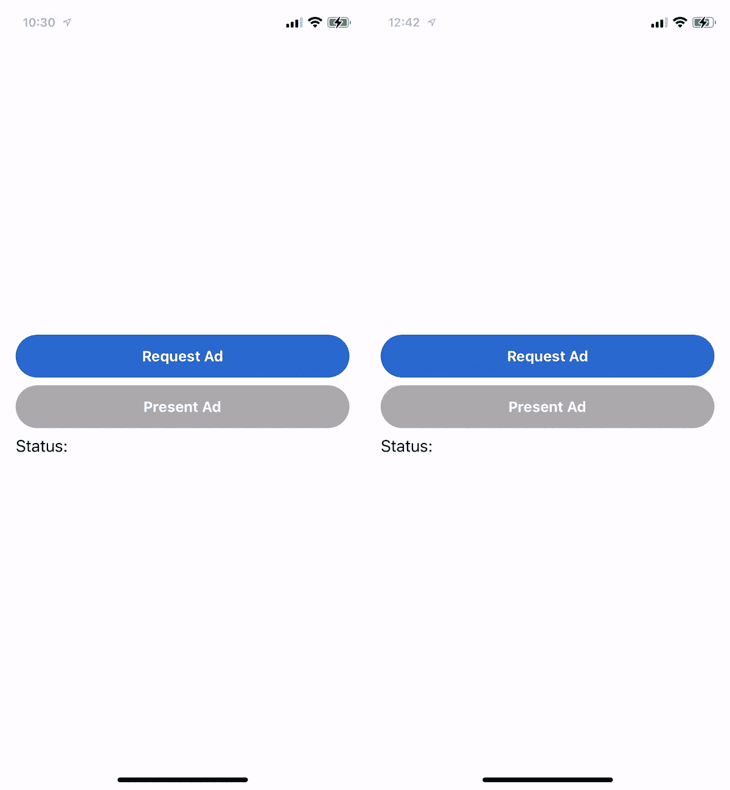

左图:富媒体插播广告；右图:视频插播广告

插播广告是一种全屏广告，提供不同类型的信息，包括文本、图像、富媒体和视频。谷歌还为应用程序所有者提供了**频率上限**，以控制在一定时间内发送给每个用户的插播广告的最大数量。应用所有者可以在 [AdMob 控制台](https://admob.google.com/home/)配置它们，应用开发者可以在开发期间使用 samplead 单元绕过这一限制。

本文将简要介绍如何在 AdMob 控制台上设置和通过 iOS 应用程序演示插播广告的细节。开始吧！

# AdMob 控制台—为插播广告设置

1.  登录 [AdMob 网站](https://admob.google.com/home/)，在 **Apps > Ad** units 标签页创建一个广告单元。

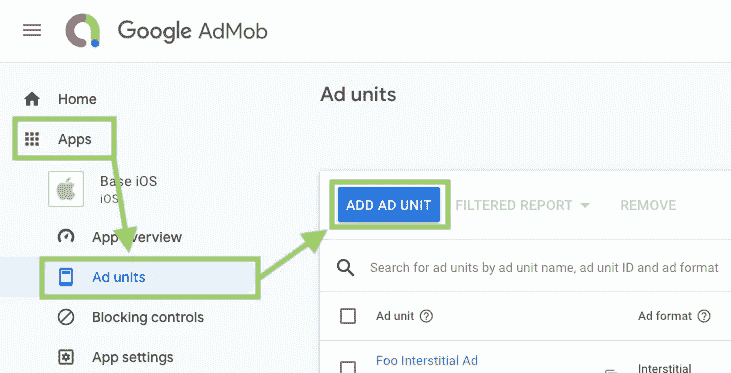

2.在下一页选择**填隙式**。

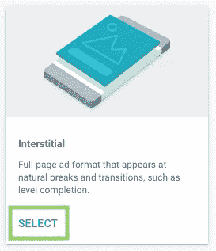

3.填写广告单元名称，并根据需要定制高级设置。

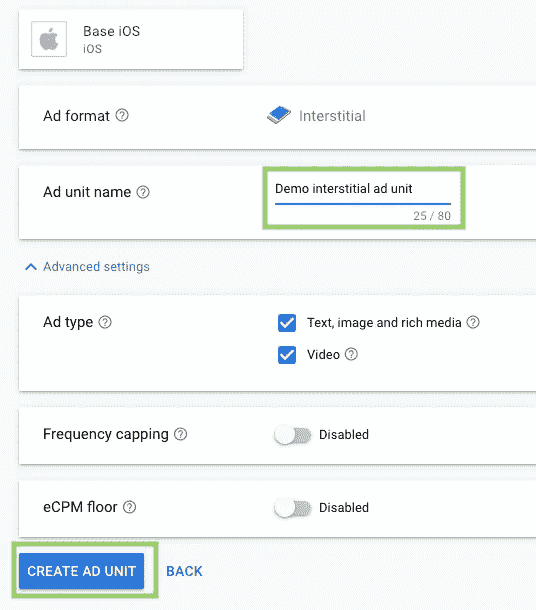

4.尽可能确保应用 ID 和间隙广告单元的安全。

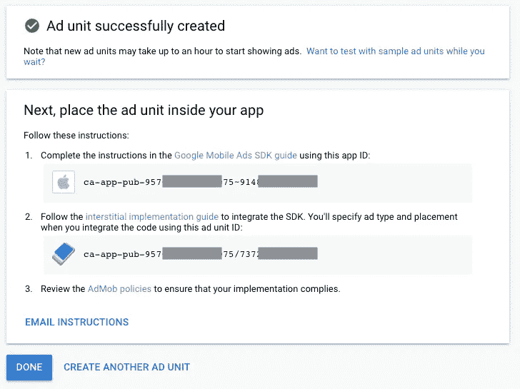

一个**应用 ID** 和一个**广告单元 ID** 被创建，并且应该被传递给开发者以在代码中实现它们。为了防止异常和恶意的广告流量，建议尽可能保证它们的安全**。当谷歌怀疑广告请求来自机器人而不是真实用户时，你的 AdMob 账户将被暂停。**

应用 ID 和广告单元 ID 经常被开发者混淆。它们可以通过唯一的分隔符来区分。应用 ID 由`~`分隔，广告单元 ID 由`/`分隔。

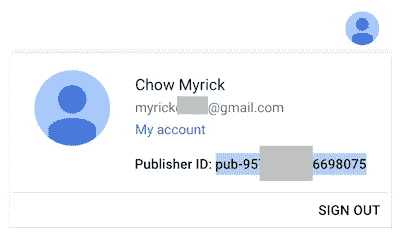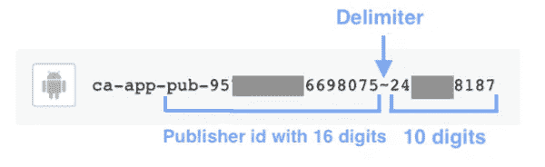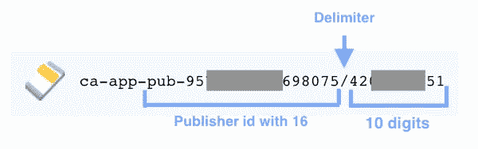

> 请记住，谷歌需要很长时间来处理你的广告单元请求。上面写着“最多一小时”，但波动很大。我以前的一个项目需要大约 ***4 个小时*** *！所以，请耐心等待广告单元的申请。
> 开发时也建议使用* [*样本 ad 单元 ID*](https://developers.google.com/admob/android/test-ads#sample_ad_units)*:* ***1。富媒体:"*ca-app-pub-3940256099942544/1033173712*"
> 2。视频:“*ca-app-pub-3940256099942544/8691691433*”***

# iOS 应用项目(6 个步骤)

## 1.将 AdMob 应用程序详细信息添加到 info.plist

以上代码仅用于演示目的。请将第 7 行的值替换为您在之前的会话中显示的 AdMob 应用 id。

## 2.通过 CocoaPods 添加 Google Ads SDK 依赖项“Google-Mobile-Ads-SDK”

运行`pod install`将依赖项安装到项目中。

## 3.应用开始时的 SDK 初始化

## 4.设置一个`GADInterstitial`实例

将`GADInterstitial`实例设置在`UIViewController`级别对于防止被释放是必要的。

在开发阶段，开发者可能需要在很短的时间内请求大量的插播广告，超过了频率上限。此外，**谷歌会屏蔽某些被认为是机器人的用户！**因此，在开发期间使用样品 ad ad 单元是先进的:

1.  **富媒体**:*ca-app-pub-3940256099942544/1033173712*
2.  ****视频**:*ca-app-pub-3940256099942544/8691691433***

## ***5.设置`GADInterstitial`的代表***

## ***5.从 AdMob 服务器请求插播广告***

## ***6.向用户展示广告***

***呈现插播广告是直截了当的，如第 3 行所示。然而，有两种可能的情况是不能正确显示插播广告:***

1.  ***插播广告只有在 AdMob 服务器向 app 端返回广告详情时，即触发`GADInterstitialDelegate`的`interstitialDidReceiveAd`回调后，才能呈现。更多细节见第 2 行。***
2.  ***每个`GADInterstitial`实例只能出现一次。为了呈现另一个插播广告，应用程序必须初始化另一个`GADInterstitial`实例，并再次向谷歌请求广告。更多细节见第 4 行。***

## ***一体化代码:***

# ***GADInterstitialDelegate 的详细信息(整个广告流程的流程图)***

***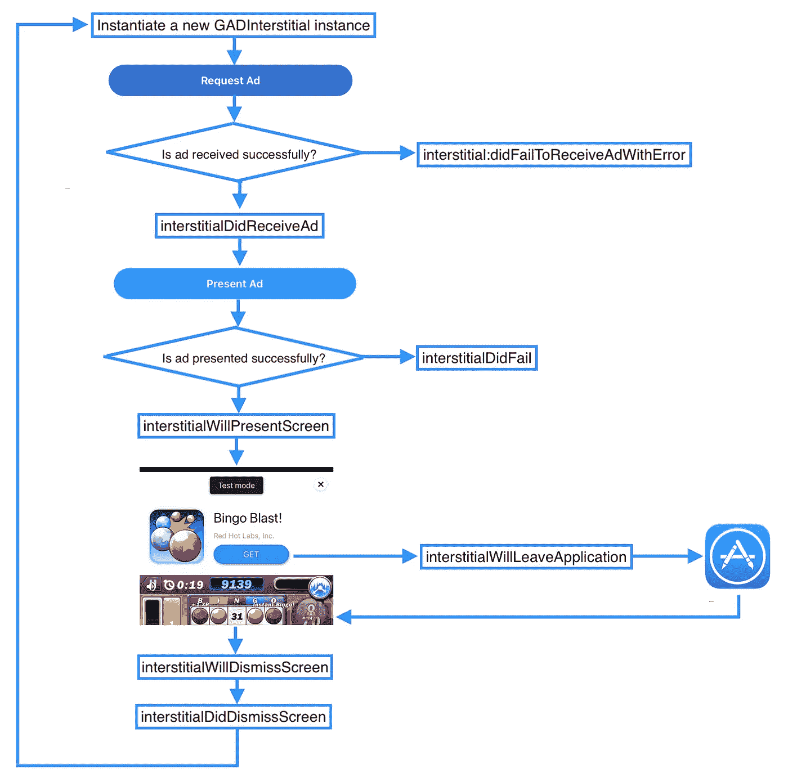***

***`GADInterstitialDelegate`共有 7 次回调:***

1.  ***[interstitialDidReceiveAd](https://developers.google.com/admob/ios/api/reference/Protocols/GADInterstitialDelegate#-interstitialdidreceivead:)—从 AdMob 服务器成功返回 Ad 时调用***
2.  ***[interstitial:didFailToReceiveAdWithError](https://developers.google.com/admob/ios/api/reference/Protocols/GADInterstitialDelegate#-interstitial:didfailtoreceiveadwitherror:)—在从 AdMob 服务器请求 interstitial ad 的过程中出现意外错误时调用。***
3.  ***[插播广告将出现屏幕](https://developers.google.com/admob/ios/api/reference/Protocols/GADInterstitialDelegate#-interstitialwillpresentscreen:) —当前`UIViewController`能够并且将要出现插播广告。***
4.  ***[interstitialdifailtopresentscreen](https://developers.google.com/admob/ios/api/reference/Protocols/GADInterstitialDelegate#-interstitialdidfailtopresentscreen:)—当前`UIViewController`无法呈现插播广告***
5.  ***[间隙广告应用](https://developers.google.com/admob/ios/api/reference/Protocols/GADInterstitialDelegate#-interstitialwillleaveapplication:) —用户点击了间隙广告，系统会将用户重定向到应用商店或当前应用之外的其他地方。***
6.  ***[interstitialwilldismisscreen](https://developers.google.com/admob/ios/api/reference/Protocols/GADInterstitialDelegate#-interstitialwilldismissscreen:)—用户点击了消除按钮，interstitial ad 将被消除。***
7.  ***[interstitialdiddismisscreen](https://developers.google.com/admob/ios/api/reference/Protocols/GADInterstitialDelegate#-interstitialdiddismissscreen:)—广告从屏幕上完全消失***

# ***频率封顶***

***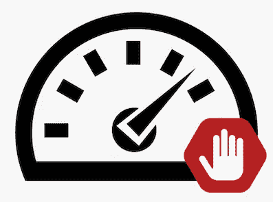***

***谷歌为应用程序所有者提供了一个选项，以控制每个用户在特定时间长度内请求的插播广告的最大数量(单位为分钟、小时或天)。由于每个应用可能有多个插播广告单元，因此该限制可以应用于特定的广告单元或整个应用。***

## ***请记住:***

1.  ***用户将在应用中看到的插播广告数量取决于**广告单元级别**和**应用级别频率上限**。因此，整个应用程序的频率上限应大于每个广告单元的频率上限。***
2.  ***谷歌可能需要一天时间来更新频率上限。***
3.  ***最大频率上限是每个可用时间长度 60 次展示。***

***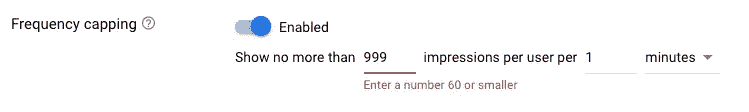***

## ***广告单位级别的频率上限设置:***

***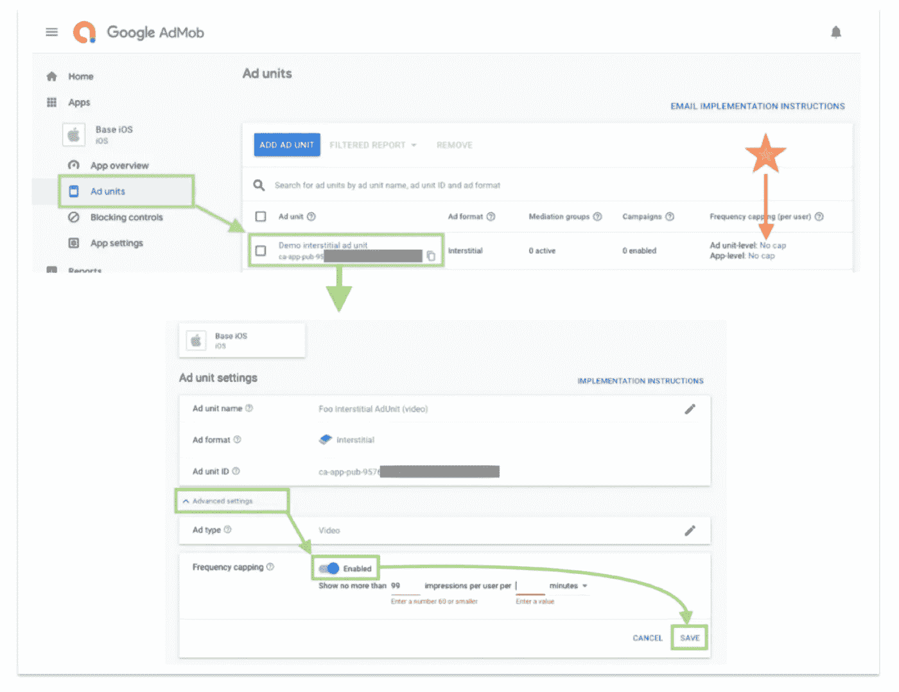***

## ***应用程序级别的频率上限设置:***

***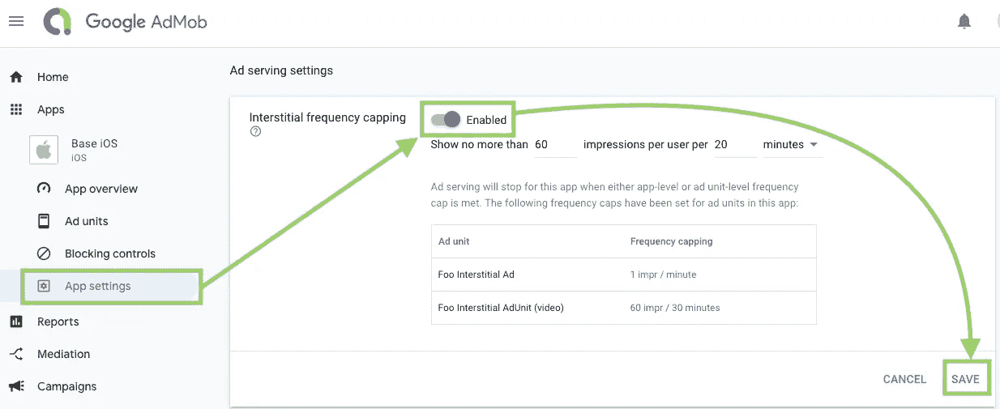***

# ***展示插播广告的技巧***

1.  ***暂停应用程序音频输出，以防止与视频或音频格式的插播广告重叠***
2.  ***应用程序应该更好地预加载一个插播广告，并在准备就绪后立即呈现给用户。***
3.  ***我们不应该提出一旦从谷歌服务器返回的插播广告。我们应该注意 UX，在合适的时候展示广告，比如在完成一项任务之后。***

# ***摘要***

1.  ***Google AdMob 向市场提供横幅广告、插播广告、原生广告和奖励广告。填隙式是覆盖整个屏幕的一种。***
2.  ***插播广告可以是富媒体或视频类型。***
3.  ***频率上限可以根据广告单元或应用 id 限制显示给每个用户的最大展示次数。***
4.  ***样本广告单位应在开发阶段用于绕过频率上限和谷歌流量检查。***
5.  ***`GADInterstitialDelegate`由 7 个用于监测间质性 ad 状态的有用回调组成。***
6.  ***只有从 AdMob 服务器成功返回广告详细信息时，才能显示插播广告。它在自己的生命周期中只能显示一次。***

# ***您可能想阅读:***

*** [## Android 应用中的 AdMob 入门

### 谷歌 AdMob 是跨平台应用和网站商业化的绝佳工具。让我们看看如何在您的……

medium.com](https://medium.com/firebase-developers/android-firebase-admob-all-in-one-2c981275559d)*** 

# ***参考***

1.  ***间隙广告官方文件***

*** [## 间隙广告| iOS |谷歌开发者

### 插播广告是全屏广告，覆盖在应用程序的界面上，直到被用户关闭。他们是典型的…

developers.google.com](https://developers.google.com/admob/ios/interstitial#create_an_interstitial_ad_object) 

2.Google AdMob 官方文档

 [## Google AdMob -移动应用货币化

### 使用应用内广告从您的移动应用中获得更多收入，获得可操作的见解，并通过以下方式发展您的应用…

admob.google.com](https://admob.google.com/home/?gclid=CjwKCAiA2O39BRBjEiwApB2Ikg3zI5O7x5IGw69ssQlPaaTTdpJLZ6hBkgq1p8wy4n9gGmAYPkNPCRoCOwwQAvD_BwE) 

3.间质 ad 单位的频率上限

 [## 为应用和广告单元设置间隙频率上限

### 插播广告频率上限让你可以限制同一个人插播广告的次数。当你…

support.google.com](https://support.google.com/admob/answer/6244508?ctx=tltp?ctx=tltp&visit_id=637402459105975105-2310547431&rd=1) 

欢迎您关注我，在[Twitter @ myrik _ chow](https://twitter.com/myrick_chow)获取更多信息和文章。感谢您阅读这篇文章。祝您愉快！😄***