# Google Apps 脚本:创建有状态的 Gmail 插件

> 原文：<https://itnext.io/google-apps-script-creating-stateful-gmail-add-ons-part-one-89186ae17f7e?source=collection_archive---------3----------------------->


照片由 [rawpixel](https://unsplash.com/@rawpixel?utm_source=medium&utm_medium=referral) 在 [Unsplash](https://unsplash.com?utm_source=medium&utm_medium=referral) 上拍摄

嘿，你好！—我已经键入了一些关于我发现 Google Apps 脚本以及我为什么开始使用它的背景和故事。如果你感兴趣，请继续阅读。否则，向下滚动“志愿者注册”演示和教程。

我在 2018 年的前三个月探索了 [**Flutter**](https://flutter.io/) 和 [**Dart**](https://www.dartlang.org/) **，** Google 针对原生 app 开发的跨平台解决方案。大约一个月后，我决定向当地开发商寻求指导。通过联系谷歌的 flutter 邮件列表，我设法联系了当地的 GDG 分会，并获得了 Portland Flutter Meetup 的赞助，该会议现在每月举行一次，并将对公众免费开放。

我在谷歌的 Flutter 团队工作的经历非常棒，所以我请求我的雇主允许我在我们公司带头开发一个本地应用程序。我被赋予了一项任务，正如他们在泰国所说的一样，相同但不同。

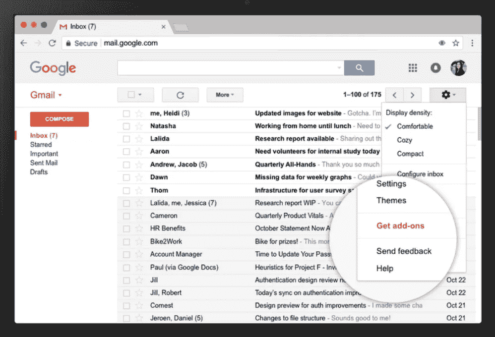

图片来自[谷歌博客](https://blog.google/products/g-suite/do-more-your-inbox-gmail-add-ons/)

我了解到我们将为我们的约会安排软件开发一个 [**Gmail 插件**](https://developers.google.com/gmail/add-ons/) 。这是我第一次听说附加产品；它们是运行在 Gmail 和 Google Drive 服务中的微型程序，比如表格、文档、幻灯片和表单。我也不熟悉编程语言， [**Google Apps 脚本**](https://developers.google.com/apps-script/) ，以及支持它的 IDE。

" G***aoogle Apps 脚本*** *是一种* ***JavaScript 云脚本语言*** *，它提供了简单的方法来* ***自动化跨 Google 产品和第三方服务的任务，并构建 web 应用*** *。"*

Gmail 插件开发工具是免费的，并附带了可靠的[文档](https://developers.google.com/gmail/add-ons/)，加上[三个示例应用程序](https://developers.google.com/gmail/add-ons/samples)可供使用。作为一名 javascript 开发人员，我发现 Apps 脚本直观且易于使用。

# **第一部分——准备工作**

# 开始为 Gmail 插件编程的第一步

如果这是你第一次使用谷歌插件，你可以从他们网站上的[快速入门教程](https://developers.google.com/gmail/add-ons/guides/quickstart)中学到很多基础知识。您可以在本地或浏览器中开发附加组件。如果要在本地开发，就需要[节点](https://nodejs.org/en/)和[扣](https://github.com/google/clasp)。查看此[项目演示](https://github.com/gsuitedevs/gmail-add-ons-samples/tree/master/github)以获取本地附加开发的说明。

我将为浏览器内的开发提供指导，以保持所涉及的技术数量最少。您将需要一个 [Github](https://github.com) 帐户来克隆这个库。一旦你熟悉了基础知识，按照这些简单的步骤开始教程。

# 关于“志愿者注册”演示应用程序

**应用概要:**在这个演示中，用户已经注册了一个贸易展览，并且将代表他们的公司自愿上一天或一夜的班。

**应用程序功能:**这款应用程序展示了几个 Gmail 附加功能，包括多卡导航、具有持久状态的表单输入检索(用户属性存储)和一个“确认”按钮，该按钮将用户数据打印为固定的电子邮件回复。

**应用程序 UI:** 该应用程序由两张卡片(如下所示)组成，标题中有一个通用设置图标(三点),用于导航。

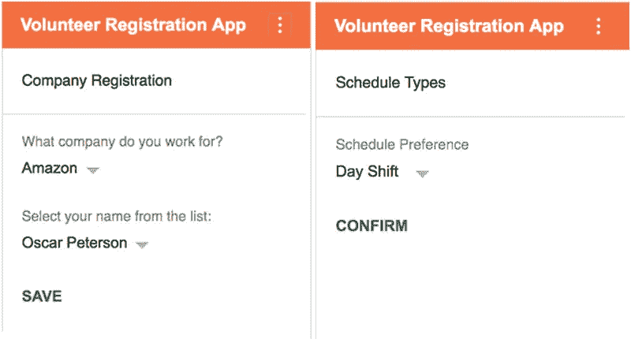

这是志愿者注册应用程序的双卡用户界面(Google Apps 脚本演示)

**应用程序 UX:** 选择他们工作的公司，这使得员工列表出现在下拉菜单中。这些设置被保存，用户导航到一张新的卡，在那里他们可以选择志愿上白班或夜班。完成后，他们进行确认，插件将创建一个带有预设回复的电子邮件回复。

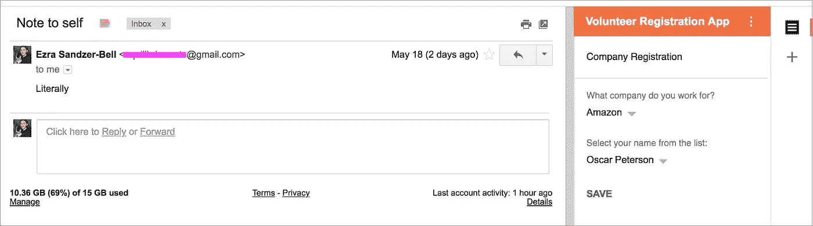

**第一张卡片:**用户已经从亚马逊选择了奥斯卡·皮特森，但是还没有点击保存。


**第二张卡:**用户保存设置，选择夜班，点击确认。生成电子邮件回复。

# 如何在没有卡扣的情况下安装 Gmail 插件演示

**步骤 1)** [克隆这个“Gmail 插件状态演示”Github Repo](https://github.com/ezrasandzerbell/Gmail-addon-stateful-demo)

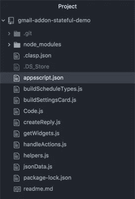

这是克隆的插件演示，在 [Atom 文本编辑器](https://atom.io/)中查看

**步骤 2)点击此处:** [**创建一个新的谷歌脚本**](https://script.google.com/macros/create)

**步骤 3)在 IDE 中，单击“查看”并选择“显示清单文件”以显示当前的 appscript.json 文件。**

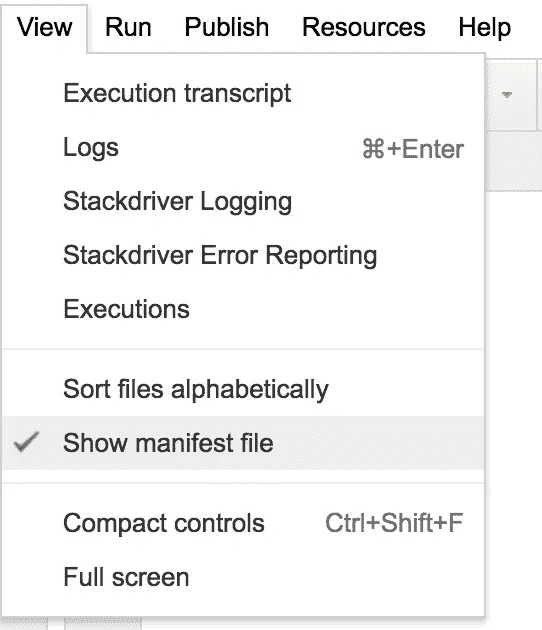

**步骤 4)从克隆的 repo 中复制 appscript.json 内容，并将其保存在此 Google IDE 的 appscript.json 清单文件中。**

**步骤 5)在** **appscript.json 中，复制并定位** [**oAuthScopes 属性**](https://developers.google.com/gmail/add-ons/concepts/scopes) 。这些作用域在**应用安全中扮演着重要的角色。谷歌明确表示，搜索范围应该限制在绝对必要的范围内。**

在这个演示中，选择的 **oAuthScopes** 启用持久状态管理(script.storage)并允许应用程序创建电子邮件响应。enabledAdvancedServices 公开了 gmail 插件库。

```
{
  "timeZone": "GMT",
  "dependencies": {
    **"enabledAdvancedServices": [{
      "userSymbol": "Gmail",
      "serviceId": "gmail",
      "version": "v1"
    }]**
  },
  **"oauthScopes": [ "**[**https://www.googleapis.com/auth/script.storage**](https://www.googleapis.com/auth/script.storage)**",  "**[**https://www.googleapis.com/auth/gmail.addons.execute**](https://www.googleapis.com/auth/gmail.addons.execute)**",  "**[**https://www.googleapis.com/auth/gmail.addons.current.message.metadata**](https://www.googleapis.com/auth/gmail.addons.current.message.metadata)**","**[**https://www.googleapis.com/auth/gmail.addons.current.message.action**](https://www.googleapis.com/auth/gmail.addons.current.message.action)**","**[**https://www.googleapis.com/auth/gmail.addons.current.action.compose**](https://www.googleapis.com/auth/gmail.addons.current.action.compose)**"]**...}
```

**第 6 步)**接下来，使用**文件*新建>脚本文件*到**到*创建八个新的脚本文件，分别以*命名。js* 文件(例如 *code.js、helpers.js 等*)。注意，IDE 使用了一个*。gs* 扩展名而不是 *.js.**

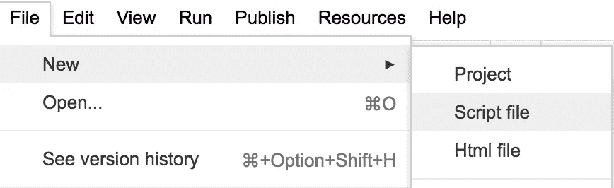

**第 7 步)**复制。js 代码从每个文件转换到相应的。gs 文件。保存所有文件。您的界面应该如下所示:

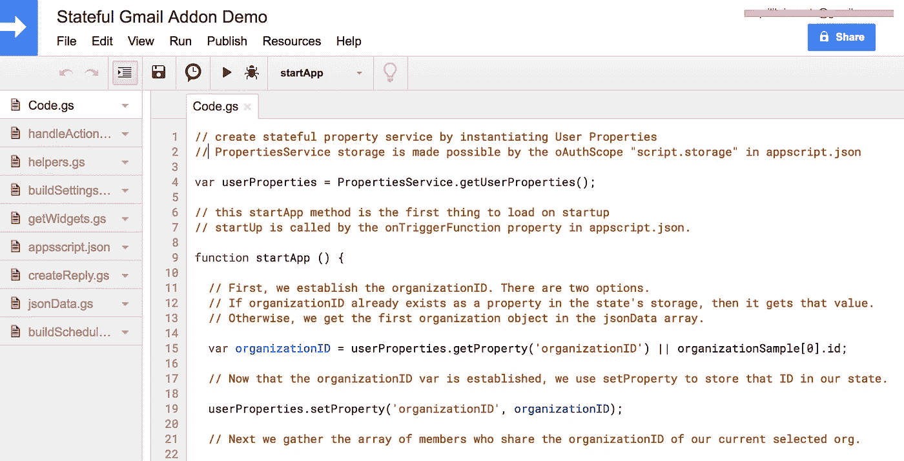

八个脚本文件(。gs)和 appscript.json 清单文件都已被创建、更新和保存。

**步骤 8)** 现在您的应用程序已经配置好了，转到 ***从清单*** 发布>部署，并从头部部署获取您的**部署 ID** 。下面的截图将带你浏览一下:

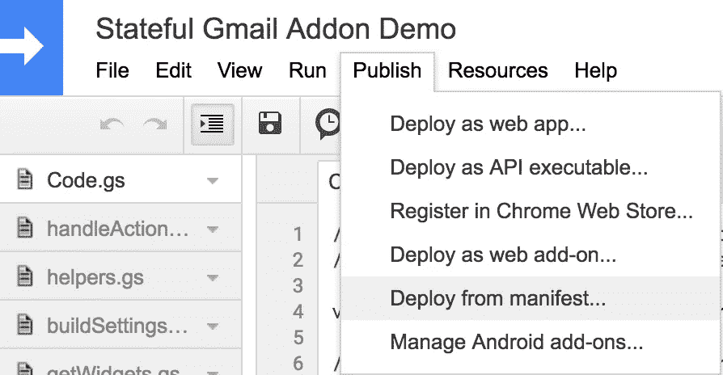

选择发布>从清单部署

如下所示，您可以简单地点击“获取 ID ”,然后复制部署 ID。成功复制 ID 后，点击关闭按钮。

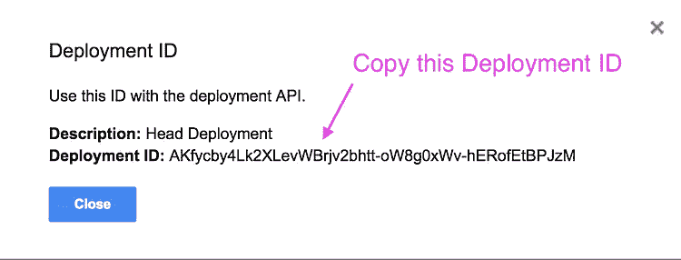

**步骤 9)点击此处:** [**打开您的 Google 附加组件设置**](https://mail.google.com/mail/u/0/#settings/addons)

该信息图显示了 Google 附加组件设置屏幕。一次走一步；启用开发者加载项，然后粘贴部署 ID 并安装应用程序。它应该会出现

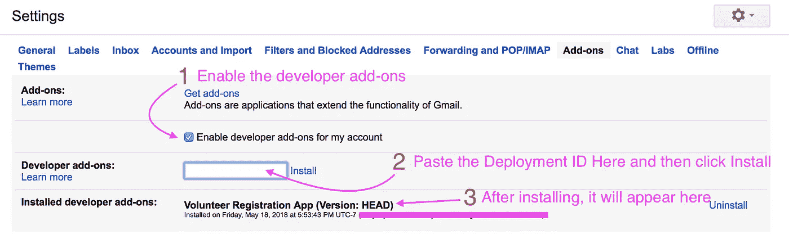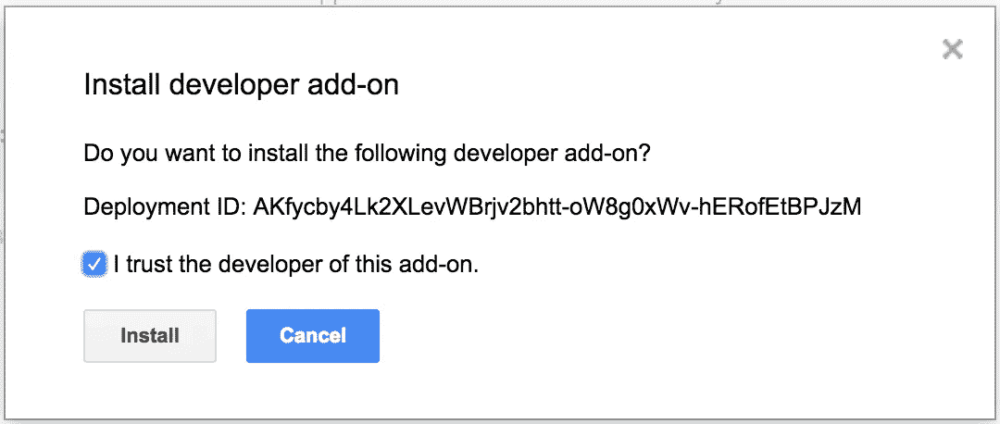

一旦你点击安装，谷歌将要求你确认你是否信任该插件的开发者。

# **成功！**

如果您正确遵循了所有步骤，应用程序应该会正确安装，您可以开始使用它了。回到你的 Gmail 账户，打开某人发来的邮件。几秒钟后，您的邮件右侧会出现一个图标。这是您的附加边栏！

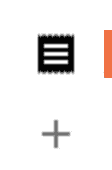

单击上面显示的图标打开演示应用程序。您也可以点击“+”来探索其他已发布的附加组件！

# 第二部分——理解代码

现在我们已经安装了应用程序，我们可以开始查看应用程序本身了。让我们回到 appscript.json 文件:

```
"gmail": {
    "name": "Volunteer Registration App",
    "logoUrl": "[https://www.gstatic.com/images/icons/material/system/1x/receipt_black_24dp.png](https://www.gstatic.com/images/icons/material/system/1x/receipt_black_24dp.png)",
    "contextualTriggers": [{
      "unconditional": {
      },
     ** "onTriggerFunction": "startApp"**
    }],...
```

这里的关键属性是 **onTriggerfunction** 。它的值被设置为启动整个应用程序的函数。你可以叫它任何东西，所以我把它命名为 startApp。打开 **code.gs** 文件，定位 startApp 函数。如果您想随时查看记录器的日志文件，只需选择 ***查看>日志:***

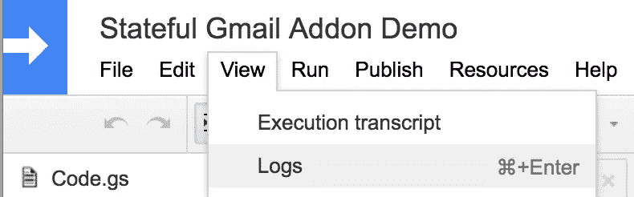

在本教程中，我直接在代码中做了注释。请跟随理解每个功能背后的逻辑:

```
function startApp () { **// First, we establish the organizationID. There are two options. 
  // If organizationID already exists as a property in the state's storage, then it gets that value. 
  // Otherwise, we get the first organization object in the jsonData array.** 

  var organizationID = userProperties.getProperty('organizationID') || organizationSample[0].id;

  **// Now that the organizationID var is established, we use setProperty to store that ID in our state.**

  userProperties.setProperty('organizationID', organizationID);

  **// Next we gather the array of members who share the organizationID of our current selected org.** 
  var members = memberSample.filter(function(member){
    return member.organization_id === organizationID
  });

 **// logs are used throughout these docs for testing purposes.** 

  Logger.log("first member on startApp: " + members[0].name)

 **// We get a current Member ID, either from the state or from the first  member in our members array.**

  var memberID = userProperties.getProperty('currentMemberID') || members[0].id;

  userProperties.setProperty('currentMemberID', memberID);

  Logger.log("memberID on startApp: " + memberID)

 ** // Finally, the scheduleOptions from appscript.json are filtered by organization id to provide our schedule array.**

  var schedules = scheduleOptions.filter(function(schedule){
    return schedule.organization_id === organizationID
  });

  var scheduleID = userProperties.getProperty('currentScheduledID') || schedules[0].id;

  userProperties.setProperty('currentScheduleID', scheduleID);

  Logger.log("schedules[0].name on startApp: " + schedules[0].name);
  Logger.log("schedules[1].name on startApp: " + schedules[1].name);

 **// return the function located in buildSettingsCard.gs, which loads the first card based on our stateful data**

  return buildSettingsCard()

}
```

每次应用程序启动时，都会加载这个 startApp 函数。当我们在页面间导航时，它不运行。如您所见，我们测试了 userProperties 存储中的现有状态。如果没有，我们设置属性默认值。最后，我们返回一个名为 **buildSettingsCard()** 的函数，它位于。同名的 gs 文件。

```
**// Build Settings Card**function buildSettingsCard() {

  **// create a new card**
  var card = CardService.newCardBuilder();  

  **// Set name and header title on card** 
  card.setName("SettingsCard").setHeader(CardService.newCardHeader().setTitle('Company Registration'));

 **// newCardSections are a that Widgets can be painted onto**
  var sectionSettings = CardService.newCardSection();

 **// get organization object**
  var organization = getObjectByID(organizationSample, userProperties.getProperty('organizationID'));
  Logger.log("Current Organization on buildSettingsCard: " + organization.name);**// get scheduleID**

  var schedules = scheduleOptions.filter(function(schedule){
    return schedule.organization_id === organization.id
  });

  var scheduleID = userProperties.getProperty('currentScheduledID') || schedules[0].id;

  userProperties.setProperty('currentScheduleID', scheduleID);  

 **// get the current member associated with current organization**
  var currentMember = getObjectByID(memberSample, userProperties.getProperty('currentMemberID'));
  Logger.log("Current Member Name on buildSettingsCard: " + currentMember.name);

 **// get currentMembers to be displayed on the member select menu**

  var currentMembers = memberSample.filter(function(member){
    return member.organization_id === userProperties.getProperty('organizationID');
  });

  Logger.log("name of member 1 associated with current organization name on buildSettingsCard: " + currentMembers[0].name);
  Logger.log("name of member 2 associated with current organization name on buildSettingsCard: " + currentMembers[1].name);
 **// Add widgets to the Settings card section 

  // Add the organization select menu widget to the card**

  sectionSettings.addWidget(getOrganizationSelectMenu(organizationSample, organization || organizationSample[0]));

 **// check that there are members associated with the current organization. If so, display the member select menu widget on the card**

  if (currentMembers.length > 0) { 

    sectionSettings.addWidget(getMembersSelectMenu(currentMembers, currentMember || memberSample[0]));
  } else {
    sectionSettings.addWidget(CardService.newTextParagraph().setText("No Members Available"));
  };

 **// btnSaveSettings is a button located at the bottom of the card
  // actSaveSettings a newAction that triggers a function called buildScheduleTypes. 
  // buildScheduleTypes is located in the corresponding buildScheduleTypes.gs file**

  var actSaveSettings = CardService.newAction()
        .setFunctionName('buildScheduleTypes');
  var btnSaveSettings = CardService.newTextButton()
        .setText("Save")
        .setOnClickAction(actSaveSettings);

 **// add the button** 

  sectionSettings.addWidget(btnSaveSettings);**// Return and build the card**

 return card.addSection(sectionSettings).build();

}
```

这是你第一次看到一张新的卡片，并在其中一个部分添加了小部件。CardService 小部件是 Google 附加组件的核心特性。这个卡上的最后一个小部件是 btnSaveSettings，它被配置为运行 buildScheduleTypes 函数，位于。同名的 gs 文件:

```
**// Build Schedule Types**function buildScheduleTypes(e) {

  var currentMemberID = userProperties.getProperty('currentMemberID');

  Logger.log("current member id: " + currentMemberID);

  **
  // re-establish state variables for local scope**var currentSchedules = scheduleOptions.filter(function(schedule){
    return schedule.organization_id === userProperties.getProperty('organizationID')
  });

  Logger.log("first schedule on currentSchedules: " + currentSchedules[0].name);

 **// create card and give it header title, establish section** 
   var cardScheduleTypes = CardService.newCardBuilder()
  .setName("ScheduleCard")
  .setHeader(CardService.newCardHeader().setTitle("Schedule Types"));

  var sectionSchedules = CardService.newCardSection();
 **// add widgets to card section for Schedule types**

  if (currentSchedules.length != 0) { 
    sectionSchedules.addWidget(getScheduleSelectMenu(currentSchedules));
  } else {
    sectionSchedules.addWidget(CardService.newTextParagraph().setText("No Schedule Types Available"));
  }
 **// Print-to-Email Button (see createReply.gs)** 

  var action = CardService.newAction().setFunctionName('createReply');  

  sectionSchedules.addWidget(CardService
                    .newTextButton()
                    .setText('Confirm')
                    .setComposeAction(action, CardService.ComposedEmailType.REPLY_AS_DRAFT));

  return cardScheduleTypes.addSection(sectionSchedules).build();  

}
```

**测试驱动开发**

应用程序中的每个操作都与一个具有一系列数据日志的功能相关联。你可以在不同的阶段测试这个应用程序:初始启动，从下拉菜单中选择，导航到一个页面，使用通用设置链接，点击“确认”按钮。

当您在应用程序脚本 IDE 中查看日志时，尝试在一个选项卡中打开您的 Gmail 帐户。这样你就可以向前和向后移动。如果您想了解不同方法的行为方式以及它们在哪里被调用，这些 Logger.log()测试会非常有帮助。

# 总结一下:

本文的主要目的是向您介绍 Google Add-Ons，并向您展示一个工作演示，展示选择表单及其 REPLY_AS_DRAFT 特性的组合。如果你想对应用程序有一个更细致的了解，请查看应用程序中的所有文件。

你可以在 Github [这里](https://github.com/gsuitedevs/gmail-add-ons-samples)找到更多谷歌附加示例应用。如果你喜欢这篇文章，并想阅读作者的更多内容，请参见下面的颤振文章:

> [**用颤振创造旋转木马(由颤振出版。**IO)](https://medium.com/flutter-io/creating-a-carousel-with-flutter-adf9a756e949)
> 
> [**颤动:Pinterest 风格的照片网格**](https://medium.com/@ezra_69528/flutter-pinterest-style-photo-grids-b99289584b71)

再次感谢您的阅读，请随时在下面留下您的任何想法、反馈、建议、问题或喜爱的附加内容！