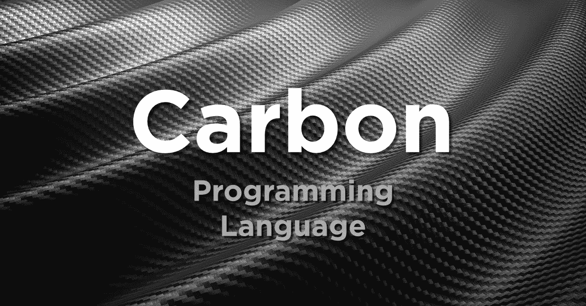

# 谷歌碳与苹果斯威夫特

> 原文：<https://itnext.io/google-carbon-vs-apple-swift-9df8262342c8?source=collection_archive---------0----------------------->

## Carbon 能像 Swift 取代 Objective-C 那样取代 C++吗？



碳编程语言实际上是一些非常酷的消息！一个早期的实验版本刚刚在 2022 年 7 月 19 日被丢弃。我不会重复典型的新闻发布的东西，而是集中在我对谷歌的这种新语言的看法。

Carbon 正在遵循一种我们已经多次看到的编程趋势，即采用一种成熟的行业语言，并以最小的阻抗失配来制作它的现代版本。基本上，这意味着新语言保留了遗留语言的重要语义，因此您可以轻松地重用所有现有代码。以下是这种方法的一些语言组合示例:

*   [Swift](https://developer.apple.com/swift/) —一种在 Objective-C 运行时之上实现的语言，具有现代类型安全和函数式编程支持。
*   [Kotlin](https://kotlinlang.org) —一种与 Java 平滑集成的 JVM 语言。与 Swift 惊人的语法相似性。
*   [Elixir](https://elixir-lang.org)—Erlang 虚拟机之上的 Ruby 语法语言，允许您毫不费力地重用 Erlang 代码。
*   [Zig](https://ziglang.org)—c 的替代产品。与 c 相同的数据布局。相似的内存管理模型和二进制接口。c 可以调用 Zig 代码。

我们还可以添加大量针对 JavaScript 的 transpilers(源代码到源代码的编译器)，比如 [TypeScript](https://www.typescriptlang.org) 。

所有这些语言都是为了与另一种语言紧密集成而设计的，而不仅仅是一些基本的外部函数接口。例如，Java 和 Python 可以调用 C 代码，但这并不意味着它们可以直接替代 C。有相当多的粘合代码需要编写。更进一步，你不希望 C 调用 Python 或者 Java 代码。那将会令人作呕。

苹果曾试图让人们从 Objective-C 迁移到 Java 和 Ruby，但这两种方法都不奏效。大量的投资存在于高质量的 Objective-C 库上，这些库不能在 Java 和 Ruby 中使用，否则会很笨拙。原因很简单，因为这两种语言在设计时都没有考虑到 Objective-C。有一个光荣的尝试叫做 [Ruby Motion](http://www.rubymotion.com/developers/guides/manuals/cocoa/runtime/) ，它在 Objective-C 运行时之上构建了 Ruby，以便更好地集成。

最后，真正起作用的是从头开始创建一种现代语言，专门设计来与 Objective-C 运行时紧密集成。这种方法造就了 Swift。

作为一名长期的 Objective-C 开发人员，我不得不说这真的有了回报。事实上，这种经历非常美妙。我可以在 Objective-C 类上分离出单独的方法，将它们重写为 Swift 代码，重新编译，运行，然后看到一切都像以前一样工作。通常情况下，重写是一个大的，精心策划的项目，有很多痛苦。

有了 Swift，你几乎可以随心所欲地移动。你甚至不需要做全端口。您可以保留一半很少单独编辑的代码，不进行移植。

在经历了将几个 iOS 应用程序移植到 Swift 的过程后，我对移植到更现代的语言的好处做了许多积极的观察。我已经看过了 Carbon 的[语言规范，这让我得出结论，任何人将他们的 C++代码移植到 Carbon 都会体验到很多我在从 Objective-C 移植到 Swift 时所体验到的好处。](https://github.com/carbon-language/carbon-lang/tree/trunk/docs/design#hello-carbon)

让我们回顾一下这些好处。

## 在 C++项目中引入碳元素的好处

根据我对 Swift 的体验和我看到的 Carbon 相对于 C++提供的特性，你应该把这理解为*有根据的推测*。当我阅读 Carbon 的功能集时，很难不注意到它与 Swift 惊人的相似之处:

*   不再有空指针。请改用可选类型。
*   模式匹配
*   可卡因上的标记结合或替代枚举，也称为总和类型。
*   数据必须正确初始化

还有许多句法上的相似之处。这里有一个碳代码的例子:

```
// Carbon code
**import** Console;

// Prints the Fibonacci numbers less than `limit`.
**fn** Fibonacci(limit: i64) {
  **var** (a: i64, b: i64) = (0, 1);
  **while** (a < limit) {
    Console.Print(a, " ");
    **let** next: i64 = a + b;
    a = b;
    b = next;
  }
  Console.Print("\n");
}
```

请注意它与 Swift 代码有多么相似，后者做同样的事情:

```
// Swift code
**import** Foundation

// Prints the Fibonacci numbers less than `limit`.
**func** fibonacci(limit: Int64) {
  **var** (a, b) : (Int64, Int64) = (0, 1)
  **while** a < limit {
    print(a, " ")
    **let** next: Int64 = a + b
    a = b
    b = next
  }
  print("\n");
}
```

Carbon 和 Swift 都使用关键字`var`和`let`来开始声明一个变量，并使用冒号`:`来分隔变量名和类型。

```
// Carbon variable
**var** x: i64 = 42;

// Carbon constant
**let** y: f64 = 13.31;

// Swift variable
**var** x: Int64 = 42;

// Swift constant
**let** y: Float64 = 13.31;
```

底线是有很多相似之处，这意味着它帮助我衡量相对于 C++编程 Carbon 的感觉。我已经知道 Swift 相对于 C++和 Objective-C 的感受了。

## 通过移植到 Carbon 来捕获 bug

当我将 Objective-C 代码移植到 Swift 时，我得到了严格的 Swift 类型检查器的大量帮助。有时，我觉得 Swift 类型检查器就像一个纳粹营指挥官，但它在发现更骑士的 Objective-C 类型检查器忽略的偷偷摸摸的错误方面很出色。这不仅仅是使用错误类型的问题。更多的是捕获没有初始化或者初始化顺序错误的变量。它可能是很少采用代码路径的代码，类型系统会警告这些代码路径会导致失败。

一旦您开始看到这些好处，您就会迷上移植。我怀疑许多 C++开发人员一旦尝试 Carbon，就会被类似的经历所吸引。通过了解一门新语言如何帮助发现错误并提高代码质量，他们将会被说服。

## 扩大开发人员基础

我从移植到 Swift 中注意到的另一个因素是，它扩大了对代码库感兴趣并有能力做出贡献的人群。Swift 对许多开发人员来说更有趣，也更容易理解。它也更容易学习。这意味着更多的人加入了这个项目，并且变得更有动力。

让我们面对现实吧:C++并没有真正出现在今天人们的议事日程上。它已经成为一种古怪的专业语言，需要多年的训练才能完全掌握。像 Carbon 这样的语言可以给开发者一直回避的停滞不前的项目注入活力。

## 为什么不用 Rust，Go 或者 Swift？

开发人员一直在绑定流行的 C/C++库。然而，这与直接替代完全不同。通常，当您让两种语言互操作时，我们只支持每种语言的一个子集。对于其他任何东西，你都必须编写粘合代码或者自动生成代码。Rust、Go 和 Swift 不容易重用高阶 C++类型，C++也不容易利用这些其他语言的高阶抽象。

Rust 和 C++之间的关系可能有点像 Scala 和 Java。尽管 Scala 运行在 JVM 上，但它并不能与 Java 顺畅地互操作。据我所知，Java 开发人员不容易访问和使用 Scala 功能。Kotlin 特别受欢迎，因为匹配 Java 的语义并使集成更紧密是一个明确的目标。因此，科特林更接近碳的目标。事实上，Carbon 的设计者对互操作性的目标做了一些澄清。例如，他们希望我们能够无缝地使用常见的 C++类型:

> 像 std::vector <t>这样的 C++类模板应该可以在没有包装器代码或运行时开销的情况下使用，并且可以将 Carbon 类型作为 t 来传递。用 Carbon 接口包装 std::vector <t>也应该很容易，以便在惯用的 Carbon 代码中透明地使用。</t></t>

他们希望实现我在将 Objective-C 代码迁移到 Swift 时所做的事情，即在移植的所有阶段保持功能完整的软件正常运行。

> 与 C++的互操作性将在 Carbon 中频繁使用，无论是 C++开发人员尝试 Carbon，增量迁移大型 C++代码库，还是继续长期使用 C++库。在所有情况下，必须能够编写零开销的可互操作代码；不得要求复印件。

## 如果这是个好主意，为什么不早点实现呢？

我觉得这是一个很棒的问题。碳之类的东西早就应该出现了。我认为这需要时间的原因有几个。早在 20 世纪 90 年代，我们就设想像 Java 和 C#这样的语言会取代 C++。垃圾收集和托管运行时风靡一时。人们认为像 C++这样的手动内存管理的语言没有前途。

几年过去了，我们意识到关于垃圾收集的想法是错误的。现代语言，如 Go、Julia、Swift、Rust 和 Nim，采用了完全不同的内存管理方法。Rust 基本上是在做 C++的类型安全版本。从技术上讲，Swift 有一个 GC，但它都是在编译时战略性地放置的自动引用计数(ARC)。去和朱莉娅有什么我们更通常认为有垃圾收集器。然而，他们并不使用它们，任何类似 Java 的东西。两者都更积极地使用堆栈分配。这些语言还被设计成推动代码对大型连续内存块进行更少和更多的分配。Go 和 Julia 通常会分配一个数组，比如说一次分配一百万个对象。Java 将进行一百万次分配，数组中的每个对象一次。

因此，C++替代品的概念需要时间来发展。早期的尝试是 D，但它是垃圾收集语言。C++是一种非常复杂的语言，直到 LLVM 和 clang 等可靠的基础设施出现，开发某种新的 C++才是一件疯狂的事情。尝试这种方法的第一种语言会更简单，这是有道理的。Objective-C 是比 C++简单得多的语言。制造 Swift 的任务因此变得更加容易。

Zig、Odin 和 V 等语言的另一个典型目标是 C 语言，因为它简单得多。

制作 Elixir 也是可行的，因为 Erlang 是一种动态语言。动态语言往往更容易接口，因为它们是基于消息传递的。这意味着你不需要处理复杂的二进制应用程序接口。

为了让 Carbon 发生，我们必须首先从 Swift、Kotlin、Rust 和其他语言中吸取教训。这些语言让人们确信，这种项目是有意义的，是可以成功的。

## 这个项目让我兴奋的是什么

我刻意避免接触 C++代码。然而，我仍然知道有很多真正高质量的 C++库，它们具有大量的强大功能。作为跨平台 GUI 库，还是很难打败 [Qt](https://www.qt.io) 的。像碳这样的东西会让 Qt 更实用。我还预测, [Qt 公司](https://www.qt.io)将会看到将他们的代码库的重要部分迁移到 Carbon 的好处。

还有一些知名的项目如[可视化工具包](https://vtk.org)和游戏引擎如 [Godot](https://godotengine.org) 都是用 C++写的。有了 Carbon，向 Godot 添加插件和扩展就变得可能，而不必受 C++的影响。

还要记住，Carbon 团队正在开发能够自动将 C++代码翻译成 Carbon 代码的工具。通常，这样的翻译会很难看。但是，如果语言语义相似，比如翻译可能不会太难看。

## 为什么碳会失效

苹果控制了 Objective-C，并主导了使用它的平台。当苹果说 Swift 是未来时，开发者很容易就能加入进来。他们知道这将会发生，因为苹果在 Mac 世界发号施令。没有人控制 C++，因此也没有大公司来告诉开发人员未来会怎样，他们需要加入进来。

因此，碳排放有可能导致鸡生蛋还是蛋生鸡的问题。没有足够的人迁移。如果没有一个足够大的社区，其他人就看不到它值得追求。

## 你的想法？

让我听听你的想法？你认为碳会对 C++世界有益吗？碳有成功的机会，还是注定要失败？你认为这种语言怎么样？这是一个好的设计吗？