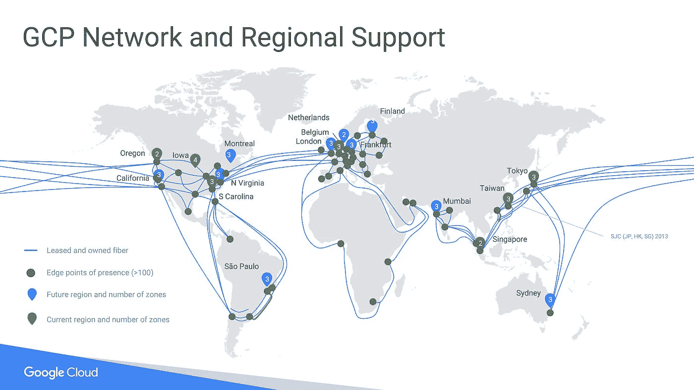
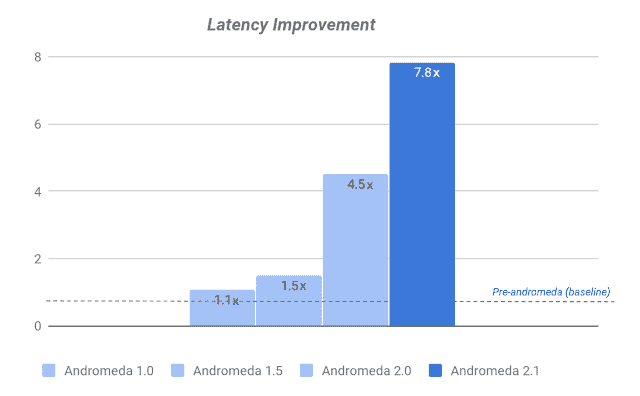
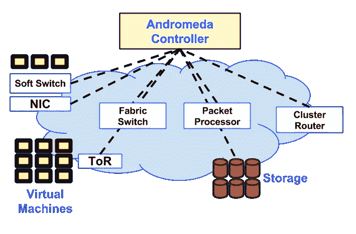
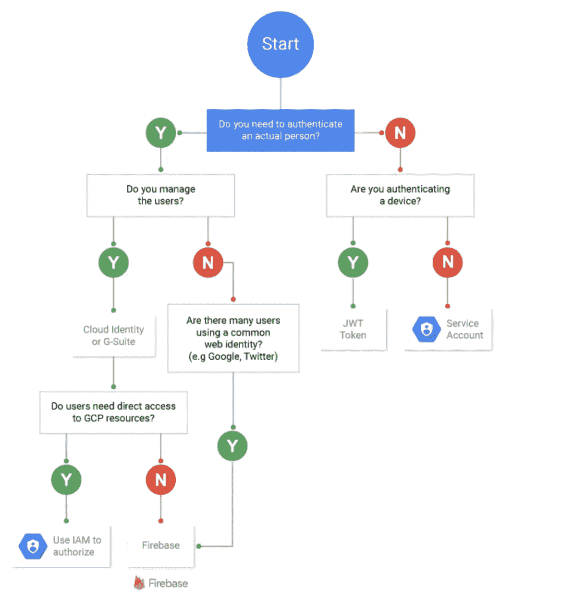

# 谷歌云相对于 AWS 的优势

> 原文：<https://itnext.io/google-cloud-advantages-over-aws-28751469e570?source=collection_archive---------0----------------------->

# 介绍

这个帖子不是关于[**GCP**](https://cloud.google.com/)**vs**[**AWS**](https://aws.amazon.com/)。有很多[文章](https://www.datamation.com/cloud-computing/aws-vs-azure-vs-google-cloud-comparison.html)比较两个云[提供商](https://kinsta.com/blog/google-cloud-vs-aws/)。我主要是一个 AWS 用户，但最近我一直在与 GCP 合作，尽管 AWS 更成熟，有更多的服务，但 GCP 有几个服务和几个优势，这使它成为某些用例的更好提供商。**本文简要总结了 GCP 相对于 AWS 的优势**。

如果你是 AWS 用户，**谷歌**有一篇很好的 [**文章**](https://cloud.google.com/docs/compare/aws/) 解释了两者的异同，所以**我会把重点放在我认为 GCP 超越 AWS 的地方，以及我认为 GCP 可能是更好选择的用例上。**

# 网络堆栈

这是 GCP 大放异彩的领域。它使用**谷歌的**全球超低延迟内部网络。

GCP 使用全球 [**SDN** ，](https://en.wikipedia.org/wiki/Software-defined_networking)代号 [**仙女座**](https://cloud.google.com/blog/products/gcp/andromeda-2-1-reduces-gcps-intra-zone-latency-by-40-percent) 提供了令人难以置信的性能，专门针对**低延迟微服务和大数据处理**。

[**GCP**的 VPCs****](https://cloud.google.com/vpc/docs/vpc) 是全球性的，如果你愿意，你可以跨不同地区定义它们，整个网络是软件定义的，提供了极大的灵活性。您的 [**负载平衡器**](https://cloud.google.com/load-balancing/) 在边缘位置工作，提供全球负载平衡和自动扩展。

仙女座菌株性能

有了 GCP，你可以很容易地用地理分布数据建立一个全球基础设施，非常容易。这对于其他云提供商来说非常困难。

仙女座建筑

# 开发者体验

虽然我主要是 AWS 用户；作为一名开发人员，我必须承认我更喜欢和 GCP 一起工作。 [**cli**](https://cloud.google.com/sdk/gcloud/) 很棒，它一致、快速、易用；您也可以非常容易地访问 alpha 和 beta 特性。

控制台体验可能是所有云提供商中最好的，特别是由于 [**云外壳**](https://cloud.google.com/shell/docs/) ，在那里您可以直接从您的浏览器获得一个终端，并从浏览器安全地连接到**虚拟机**，而无需设置任何 SSH 密钥，这太棒了！。

**GCP** [**虚拟机**](https://cloud.google.com/compute/docs/instances/) 启动**非常快**，比 AWS 快得多，这使得横向扩展特别灵敏。定价更容易理解，你可以定制你想要的 CPU 和内存数量，这非常方便！。GCP 允许几乎所有的实例类型连接 GPU。这可以将任何标准或定制实例转变成 ML 就绪的 VM。

得益于 [**云身份**](https://cloud.google.com/identity/) ，身份管理工作非常出色。它与 [**G 套件**](https://gsuite.google.com/) 集成，并提供单点登录( **SSO** )，因此不需要使用其他解决方案，如 [OneLogin](https://www.onelogin.com) ，这些解决方案在其他云提供商中非常受欢迎。

最后，大部分服务都提供了 [**模拟器**](https://cloud.google.com/bigtable/docs/emulator) 。这太棒了，现在我可以在我的笔记本电脑上测试我的所有应用程序，而不需要使用任何第三方工具或复杂的集成。

# 发布/订阅

AWS 提供了许多消息服务，如 SQS、SNS、Kinesis、Event Bridge、Kafka 等，而 GCP 只有 [**pub/sub**](https://cloud.google.com/pubsub) 。老实说，你不需要其他任何东西，这是一个非常好和便宜的服务，可以用于从数据流到微服务的广泛用例。这是一个**全球服务**，它可以扩展到处理大量数据，速度非常快。

Pub/Sub 是**非常容易集成和易于使用的**，它支持许多客户端和协议；它还为消费者提供了两种模式:**推拉**。最重要的是，**非常具有成本效益**。也是完全**无服务器**！

# 数据库

谷歌的一切都是关于数据的，他们非常擅长管理和扩展大数据，为每个用例提供灵活的解决方案

我应该使用哪个数据库？

特别是，他们提供了 3 种解决方案，在我看来，没有其他竞争对手，这就是**大数据**解决方案。其他云提供商的公司正在建立 [**数据湖**](https://en.wikipedia.org/wiki/Data_lake) 来将大量数据存储到像 **S3** 这样的廉价存储中，以达到成本效益；使用传统框架如[**Spark**](https://spark.apache.org/)on[**EMR**](https://aws.amazon.com/emr/)对其进行处理和优化，使其能够使用格式如 [**Parquet**](https://parquet.apache.org/) 从 S3 查询。

维护一个数据湖是很复杂的，尤其是当你的数据经常变化的时候。这可能会变得难以管理，并最终变得昂贵。如果我们可以将大数据存储在可扩展且经济高效的数据库中，这不是很好吗？这会容易得多。客人什么？GCP 有一些很好的选择。虽然**对象存储总是要便宜得多**，但这 3 种解决方案也适用于大数据，只要它不是太大。

## 大桌子

[**大表**](https://cloud.google.com/bigtable/) 是完全托管的 **NoSQL** 数据库。可能和 AWS [**DynamoDB**](https://aws.amazon.com/dynamodb/) 比较，但又不一样。DynamoDB 是一个 NoSQL，可以扩展到处理数百万笔交易，但每个项目只能存储 400Kb，它的目标不是处理大数据。另一方面，大表是一个 Pb 级的数据库。它提供一致的低于 10 毫秒的延迟，因此它非常**快速和可靠**。它易于扩展并且成本效益高。

## 大查询

[**big query**](https://cloud.google.com/bigquery/)**是 GCP** 的黄金产品，很难解释它到底是什么，因为它是一个相当大的产品。它被定义为:

> 一个无服务器、高度可扩展且经济高效的云数据仓库，旨在帮助您快速做出明智的决策，从而轻松实现业务转型

最接近的 AWS 产品是 [**红移**](https://aws.amazon.com/redshift/) 和红移 [**光谱**](https://aws.amazon.com/blogs/aws/amazon-redshift-spectrum-exabyte-scale-in-place-queries-of-s3-data/) 。BigQuery 是无服务器的，它可以扩展到查询大量数据，它内置了 ML 和 BI 模型，可以用于大量的用例。我喜欢 BigQuery 的一点是，你可以用它做几乎任何事情，你可以存储日志或账单信息。它比 BigTable 有更高的延迟，但也更便宜一些。

作为 BI 的数据仓库，Redshift 可能更好，但对于 AI 和 ML BigQuery 更好。

## 扳手

[**Cloud Spanner**](https://cloud.google.com/spanner/) 是一个完全托管的、可扩展的关系数据库服务，用于区域和全球应用数据。我觉得其他云提供商没有类似这个的 DB。它是巨大的，但也是完全相关的。它允许您在大规模环境下使用常规 SQL，并具有强大的一致性事务。你还记得 SQL 和 NoSQL 之间的权衡吗？嗯，**现在他们都不在了**，你可以在全球范围内使用 SQL 和 scale，但是要付出代价，不便宜。

# ML/AI

谷歌有最好的 [**ML 平台**](https://cloud.google.com/ai-platform/docs/technical-overview) 。它为所有类型的用户和用例提供了工具。从用于深度学习的低级虚拟机到高级 API。服务数量庞大。

AWS 正在慢慢赶上，由于有了[**【SageMaker】**](https://aws.amazon.com/sagemaker/)的帮助，它已经非常接近 GCP 的产品，但 GCP 仍然提供了一套更新更精确的工具。它提供了专门从事深度学习的[VM](https://cloud.google.com/tpu/)，与 Kubernetes 的高度集成，ML 培训等等。

# 库伯内特斯

关于 [**Kubernetes**](https://kubernetes.io/) ，不多说了， **GCP** 相比其他云提供商更占上风。**它比其他云提供商更便宜、更新、更快、更易于使用**。 [**GKE**](https://cloud.google.com/kubernetes-engine/) 可能是世界上最好的云服务，因为它的灵活性和价格。它允许从本地轻松迁移到云。它安全、易于设置、提供强大的自动缩放功能，并且易于监控。

最棒的是，GCP 支持 Kubernetes，并提供了一个友好的生态系统来运行几乎任何工作负载，从微服务或数据流到大数据管道。Kubernetes 生态系统非常庞大，所有这些工具都在 GCP 得到了验证和测试。

AWS 更关注无服务器，而 GCP 关注 Kubernetes，这两项技术都很棒。我最近写了一篇 [**文章**](/scaling-my-app-serverless-vs-kubernetes-cdb8adf446e1) 比较这两种选择。

# 费用

总的来说，GCP 比其他云提供商便宜，因为它总是取决于你使用的服务和你如何使用它们。如果你使用 Kubernetes 他们 **GCP** 在成本效率方面将是一个明显的赢家。

在计算和存储成本方面，它也是**明显的赢家。** GCP 为折扣长期使用提供了更好的方法，而且 [**可抢占**](https://cloud.google.com/preemptible-vms/) 虚拟机非常便宜。

在可抢占的虚拟机上运行的 GKE 集群的价格很难超越。

# 用例

AWS 仍然是最好的云提供商，它拥有比 GCP 更成熟的产品和更多的服务。它还拥有庞大的用户群和更好的支持。如果您有疑问，请使用 AWS。亚马逊在追赶 GCP ML 功能方面做得很好，也降低了一些服务的成本；但是我仍然相信，对于某些用例，GCP 可能是更好的选择:

*   **机器学习**，特别是**深度学习**或者用 Kubernetes 的时候。
*   **大数据流处理**拜 Pub/Sub 和[数据流](https://cloud.google.com/dataflow/) 。由于网络堆栈，GCP 的延迟更低，管道运行更快，成本更低。对于批处理，两个提供者都一样好。
*   **分布式实时系统**。如果你的微服务需要极低的延迟，Google **SDN** + pub/sub 是一个很好的解决方案。比如 [**围棋**](https://golang.org/) [**微服**](/grpc-go-microservices-on-kubernetes-bcb6267e9f53)+[**gRPC**](https://grpc.io/)跑得真快。还有， [**Akka**](https://akka.io/) 非常适合 GCP。
*   **Kubernetes** 。这是 GCP 的主要优势，如果你想要一个低成本高效运行的便携式基础设施， **GKE** 是一个很好的工具。对于**无服务器来说，** **AWS** 可能是更好的选择。
*   **全球大数据数据库**。如果你不想使用数据湖，而想大规模存储大数据，那么**扳手**或**大表**是令人惊叹的数据库，可以让你的生活变得轻松许多。

简而言之，**如果你想要在 Kubernetes 上运行快速低延迟的微服务和/或你有大量数据，那么考虑 GCP。**

# 结论

我强烈建议尝试这些服务，并在两个平台上开发小型 POC，以获得两个平台上的实践经验。两个提供商都有一个慷慨的免费层。不要只考虑顾问的报告，你需要做自己的判断，并尝试两种平台。

我个人喜欢 Kubernetes，它使你的代码可以跨供应商移植，使得在供应商之间切换变得更加容易。

如果你是 AWS 用户，首先阅读 [**平台概述**](https://cloud.google.com/docs/overview/) ，然后查看 [**最佳实践**](https://cloud.google.com/docs/enterprise/best-practices-for-enterprise-organizations) 。之后再看 AWS [**专业人员**](https://cloud.google.com/docs/compare/aws/) 指南。

**GCP** 也非常容易 [**安全**](https://www.assured.se/2019/12/19/gcp-security/) 比 AWS 更容易管理。最后，看看 GCP 提供的所有服务**，它正在迅速赶上。**

**我认为我们有几个选择是很好的，**竞争是好的**，我们正处于软件开发的伟大时刻，所以无论你选择哪个平台，它都将是一个好平台。只要记住最重要的资产是什么，并对其进行投资:**开发者**！**

**我希望你喜欢这篇文章。欢迎发表评论或分享这篇文章。跟随[***me***](https://twitter.com/JavierRamosRod7)*进行未来岗位。***