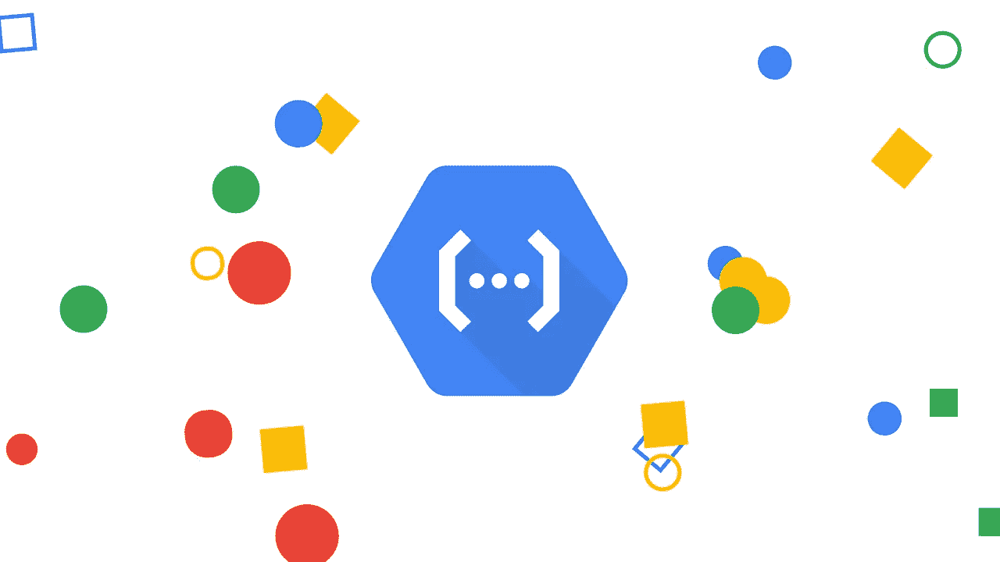
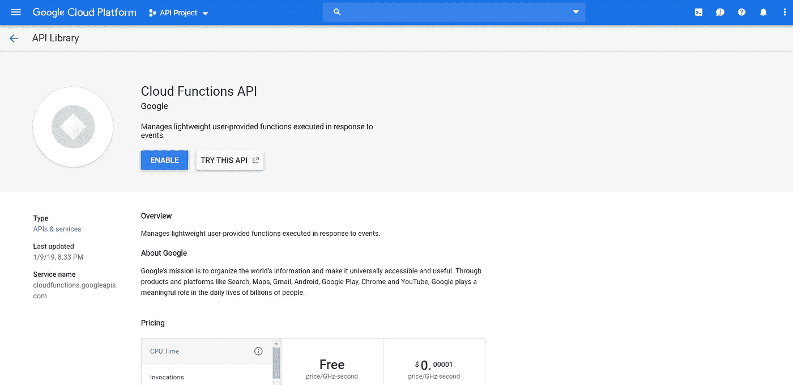
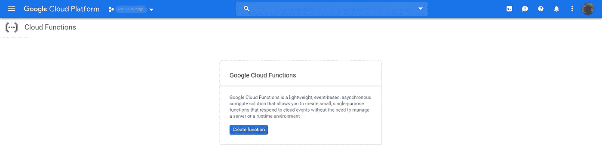
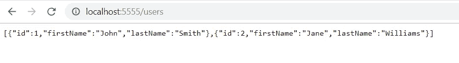
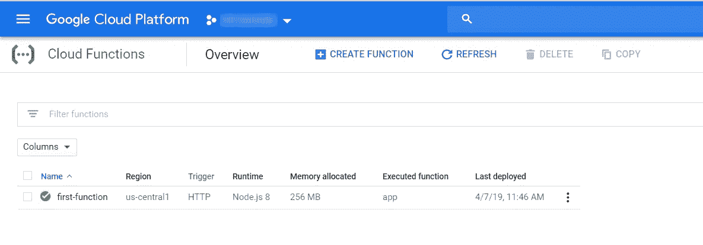

# 谷歌云功能，Node.js 和 Express

> 原文：<https://itnext.io/google-cloud-functions-node-js-and-express-aea4a2a9ba3a?source=collection_archive---------1----------------------->



> 如果您想直接跳到代码，请查看我的 [Github](https://github.com/wesley-haigh/gcp-cloud-functions-example) 以获得本文中使用的完整源代码。

谷歌云无服务器产品的核心是[谷歌云功能](https://cloud.google.com/functions/)。这款谷歌云产品让你不用担心服务器供应、配置自动伸缩等问题。在本文中，我们将了解如何使用 Google Cloud Functions、 [Node.js](https://nodejs.org) 和 [Express](https://expressjs.com/) 快速轻松地创建微服务。

# 先决条件

在开始之前，您需要确保您已经在您的机器上安装了[节点](https://nodejs.org/en/download/)，您已经创建了 [Google Cloud 项目](https://console.cloud.google.com)，并且您已经安装了 [Google Cloud SDK](https://cloud.google.com/sdk/) 。

要验证节点是否已安装，请运行以下命令。您应该会看到已安装的节点版本的输出。

```
npm -v
node -v
```

您可以使用类似的命令来验证 Google Cloud SDK 是否已经安装。

```
gcloud --version
```

# 设置 Google 云

一旦您创建了您的谷歌云项目，我们就可以启用云功能 API。在[谷歌云控制台](https://console.cloud.google.com)中导航至**API&服务**，然后在库中搜索**云函数 API** 。您应该会发现自己出现在类似于下图的屏幕上。继续并启用 API。



您可能还在此屏幕上看到了云功能的自由层。这对于我们能够创建自己的微服务(作为本文的一部分)来说已经足够了。

要验证您是否准备好开始构建和部署您的云功能，请导航到控制台中的**云功能**页面，您应该会看到您能够创建云功能。



# 创建快速应用程序

为了初始化应用程序，我们将使用`npm`工具为我们创建`package.json`，然后我们将创建一个文件，我们将自己编写代码。

或者，您可以使用[快速生成器工具](https://expressjs.com/en/starter/generator.html)。这将创建项目的框架，并且是创建 Express 应用程序的最快和最简单的方法。然而，这会生成大量本文不需要的文件。

导航到终端中的新文件夹，并运行以下命令。

```
npm init
```

按照屏幕上的提示，点击回车键跳过问题。您现在应该看到您的目录中有一个`package.json`。

接下来我们将安装 Express 并保存到我们的`package.json`中。

```
npm install express --save
```

最后，我们将创建我们的`index.js`文件。这将是我们编写代码的地方。

```
nano index.js
```

现在我们准备开始编码。打开你最喜欢的代码编辑器，我们就可以开始了。

将以下代码添加到`index.js`

现在，您可以通过以下方式运行您的应用:

```
node index.js
```

现在你应该在终端中看到`Server running on port 5555`。恭喜你！您已经创建了您的第一个快速应用程序！唯一的问题是，如果你去 [http://localhost:5555](http://localhost:5555) 你不会看到任何东西，因为我们没有配置应用程序来监听请求。

让我们用下面的代码修改我们的`index.js`来创建一些端点:

再次运行该应用程序，您应该能够访问[http://localhost:5555/users](http://localhost:5555/users)并看到我们的用户列表。



我们的第二个端点演示了如何在 Express 中使用路径参数，因此如果您转到[http://localhost:5555/users/2](http://localhost:5555/users/2)，您将看到我们的用户“Jane Williams”。

# 部署到云功能

现在让我们将我们的应用程序部署到云功能中。要部署我们的应用程序，我们只需要一个命令。在我们的应用程序的根目录下运行命令:

```
gcloud functions deploy first-function --runtime nodejs8 --trigger-http --entry-point app
```

这将需要几分钟的时间来运行，但完成后，您应该会在控制台中看到以下内容。

```
Deploying function (may take a while - up to 2 minutes)...done.
httpsTrigger:
  url: https://us-central1-<GCP-PROJECT-ID>.cloudfunctions.net/first-function
labels:
  deployment-tool: cli-gcloud
name: projects/<GCP-PROJECT-ID>/locations/us-central1/functions/first-function
runtime: nodejs8
```

让我们分析一下我们简单运行过命令。在`gcloud function deploy`之后，下一个参数是你的函数名。`--runtime`标志告诉 GCP 你的应用需要哪个运行时，你应该检查你的 node 版本并确保你使用了合适的运行时。`--entry-point`标志指向`index.js`中的出口，这是函数的入口点。更多关于`gcloud`命令的信息可以在[这里](https://cloud.google.com/functions/docs/deploying/filesystem)找到。

在您部署了您的函数之后，您应该能够在 Google Cloud 控制台中看到它，并且您可以通过转到`https://us-central1-<GCP-PROJECT-ID>.cloudfunctions.net/first-function/users`来调用您的函数



就是这样！我们已经成功地在谷歌的云功能上创建并部署了我们的第一个微服务。

你可以在我的 [Github](https://github.com/wesley-haigh/gcp-cloud-functions-example) 中找到这篇文章的完整源代码。

编码快乐！