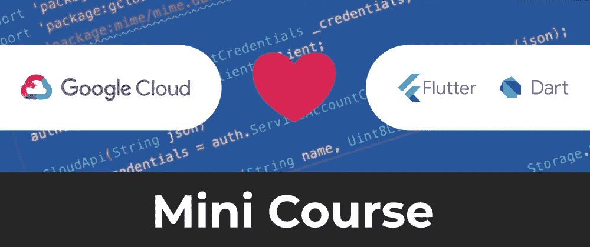

# Google 云平台和 Flutter 迷你课程发布！

> 原文：<https://itnext.io/google-cloud-platform-and-flutter-mini-course-released-9193efebb8b0?source=collection_archive---------1----------------------->

## 两全其美！了解如何构建图片上传应用程序



成为一名全栈开发人员需要接触应用程序开发栈的所有层。这包括前端、后端、数据库和基础设施。

Google Cloud Platform 是 Google 和外部业务使用的一套云计算服务，用于运行各种软件。该平台包含相关服务，使我们能够有效地构建全栈应用。

在这个迷你课程中，我们将使用几个 Dart 包构建一个图片上传移动应用程序，主要是 [gcloud](https://pub.dev/packages/gcloud) 和 [googleapis_auth](https://pub.dev/packages/googleapis_auth) 。这些包提供了一组用于连接 Google 云平台服务的助手类。

我们将使用 [Flutter SDK](https://flutter.dev) 来构建我们的移动应用程序，因为它为构建跨平台移动应用程序提供了一组非常棒的功能和工具。使用 Flutter 也是有意义的，因为它也是用 Dart 编写的😉

# 入门指南

我们需要建立一个[谷歌云平台](https://cloud.google.com)账户。它是免费设置的，目前他们提供 300 美元的信用 90 天。这将使您有足够的时间使用云存储服务将图像上传到。

视频内容如下:

*   [00:19](https://www.youtube.com/watch?v=CV0vGWDtCR0&t=19s) 应用程序演示
*   [00:57](https://www.youtube.com/watch?v=CV0vGWDtCR0&t=57s) 创建谷歌云项目
*   [01:32](https://www.youtube.com/watch?v=CV0vGWDtCR0&t=92s) 创建一个云存储桶
*   [02:11](https://www.youtube.com/watch?v=CV0vGWDtCR0&t=131s) 设置依赖关系
*   [02:43](https://www.youtube.com/watch?v=CV0vGWDtCR0&t=163s) 执行图像拾取器
*   [06:31](https://www.youtube.com/watch?v=CV0vGWDtCR0&t=391s) 创建您的 IAM 服务帐户
*   [07:51](https://www.youtube.com/watch?v=CV0vGWDtCR0&t=471s) 实现 CloudApi 服务类
*   将 IAM 凭证加载到 CloudApi 服务中
*   [11:01](https://www.youtube.com/watch?v=CV0vGWDtCR0&t=661s) 向谷歌云存储提出请求
*   [12:10](https://www.youtube.com/watch?v=CV0vGWDtCR0&t=730s) 为图像设置正确的内容类型
*   [14:31](https://www.youtube.com/watch?v=CV0vGWDtCR0&t=871s) 在图像上设置自定义元数据
*   [15:08](https://www.youtube.com/watch?v=CV0vGWDtCR0&t=908s) 实现加载和上传状态
*   [16:59](https://www.youtube.com/watch?v=CV0vGWDtCR0&t=1019s) 设置铲斗访问权限

一旦你建立了一个 Google 云平台账户，通过运行以下命令创建一个 Flutter 项目:

```
$ **flutter create** new_project
```

在您的 **pubspec.yaml** 文件的`dependencies`键下添加以下包:

```
dependencies:
  gcloud: ^0.7.3
  googleapis_auth: ^0.2.12
  image_picker: ^0.6.7+10
  mime: ^0.9.7
```

然后运行`pub get`来更新你的包。设置完成后，请查看课程中的完整演示。

**→** [**观看全程迷你课程**](https://youtu.be/CV0vGWDtCR0)

# 相关小型课程

*   [全栈颤振和 MongoDB 云迷你课程](https://creativebracket.com/fullstack-flutter-mongodb-mini-course/)

# 分享是关怀🤗

如果你喜欢读这篇文章，请通过你的社交媒体账户分享。 [**订阅 YouTube 频道**](https://youtube.com/c/CreativeBracket) 获取演示如何用 Dart 和 Flutter 构建全栈应用的教程。

[**订阅时事通讯**](http://eepurl.com/gipQBX) 获取我的免费 35 页**Dart**电子书入门，并在新内容发布时得到通知。

**喜欢，分享** [**关注我**](https://twitter.com/creativ_bracket) 😍有关 Dart 的更多内容。

*原载于*【creativebracket.com】