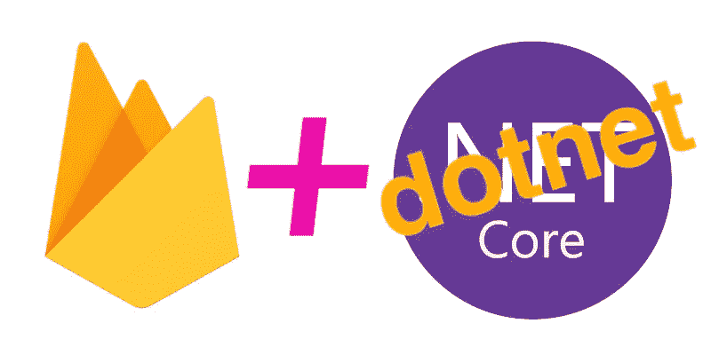
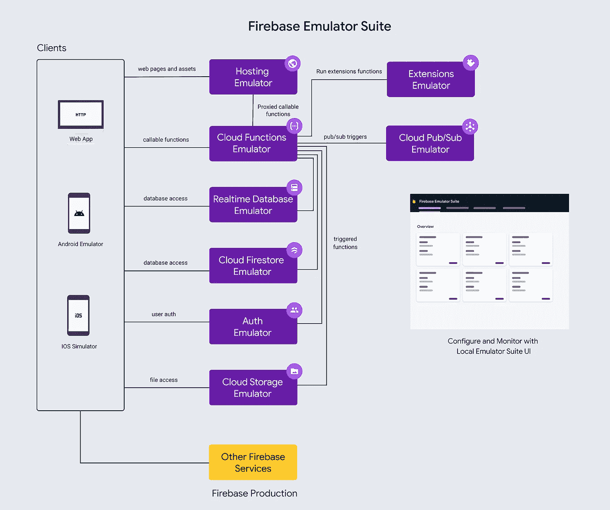
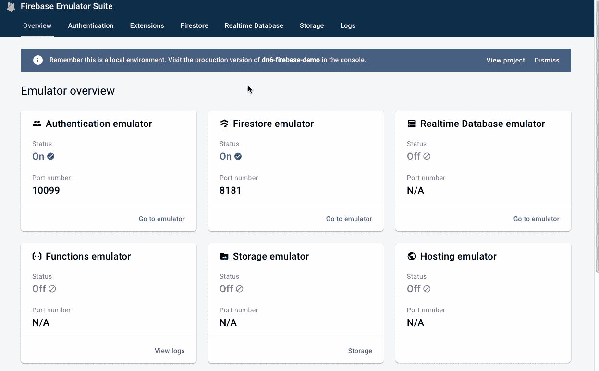
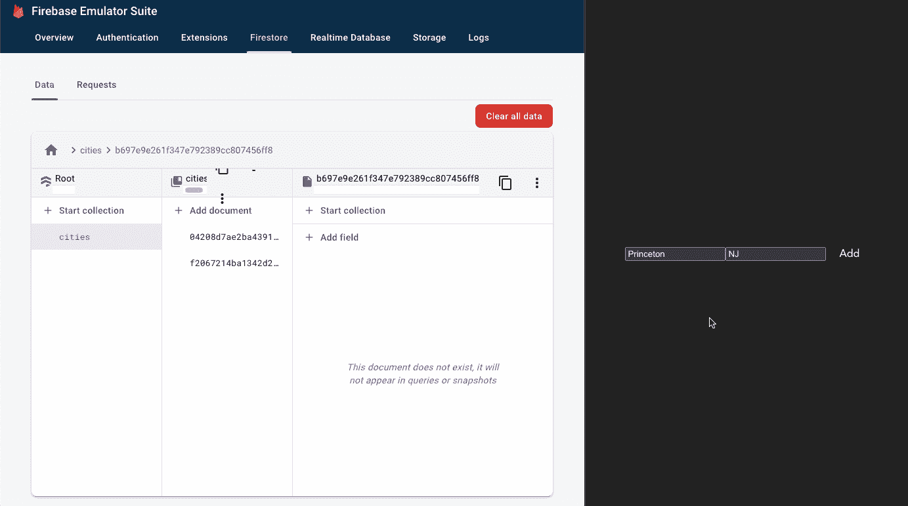
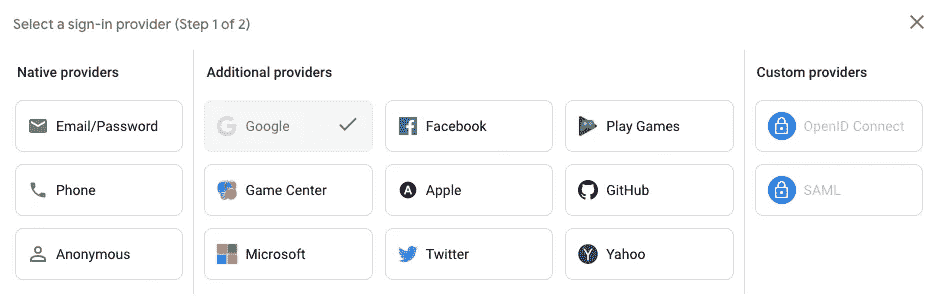
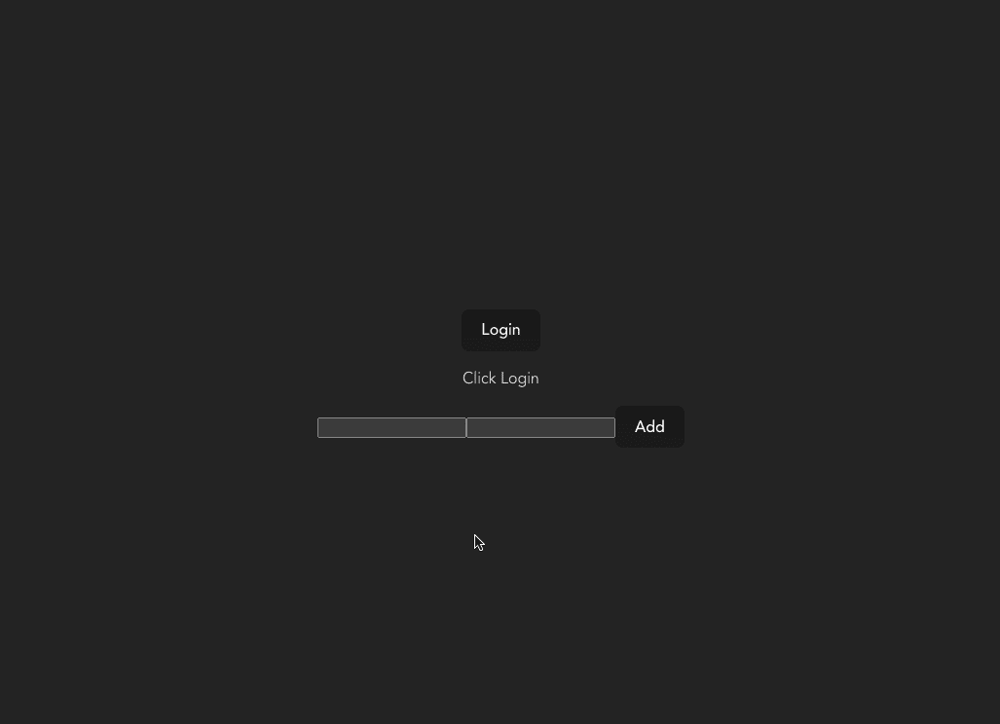
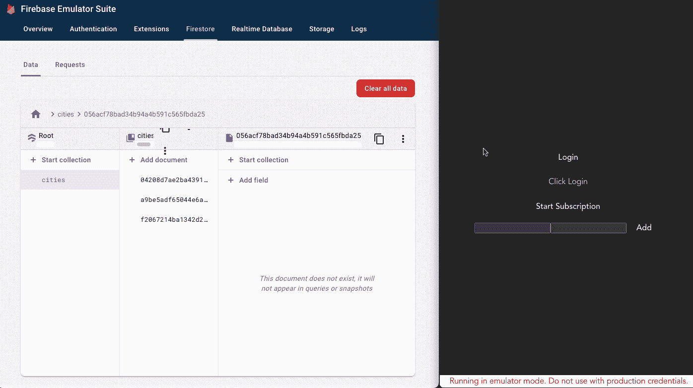

# Google Firebase with dotnet6

> 原文：<https://itnext.io/google-firebase-with-dotnet-6-f8a4a62db0b1?source=collection_archive---------0----------------------->



使用带有 dotnet6 和 Vue 的本地仿真器开始使用 Google Cloud Firebase

谷歌 ***Firestore*** 是一个面向文档的数据库，作为 ***Firebase*** 产品的一部分，它具有一些用于构建现代应用的简洁功能。

如果你以前没有使用过 [Google Firebase](https://firebase.google.com/) ，它是一个品牌下的一套 PaaS 工具，包括:

*   类似于 AWS Cognito 或 Azure AD B2C 的身份管理服务
*   类似于 AWS DocumentDB 或 Azure CosmosDB 的文档数据库
*   与数据库的实时同步类似于 AWS AppSync 和 DynamoDB(除了没有 GraphQL)
*   与谷歌云功能运行时的集成
*   与谷歌云存储集成

在大多数方面，我发现它在表面上与 [AWS Amplify](https://docs.amplify.aws/) 在概念上相似。现在与两者都合作过，他们在实践中感觉非常不同。

Supabase 是另一个具有免费层的替代方案，它标榜自己是“开源 Firebase 替代方案”,但却用 NoSQL 数据库替换 Postgres。如果您更喜欢使用关系数据，那么可以看一看。([注意，实时代理还没有准备好生产](https://github.com/supabase/realtime))。

此图显示了 Firebase 本地仿真器的各个部分，提供了主要体系结构组件的高级视图:



谷歌 Firebase 仿真器套件组件。

[Firebase 的免费层非常慷慨](https://firebase.google.com/pricing)，在你需要的时候仍然能够扩展的同时，提供了很多构建辅助项目的空间。值得注意的是，它不包括计算(函数)，但根据 CloudSQL 的定价，使用函数或云运行的计算可能是构建云应用程序的较小部分。

我们将通过一个具有实时订阅、身份验证和后端 API 调用的端到端示例来了解如何使用 Google Firebase 和 dotnet6 构建实时 web 应用程序，包括设置和与本地仿真器的集成。

如果你想直接跳到工作代码，完整的回购可以在这里找到:

[](https://github.com/CharlieDigital/dn6-firebase) [## GitHub-Charlie digital/dn6-firebase:一个展示如何将 dotnet6 与 Google 整合的知识库…

### 此 repo 提供了使用的快速入门:如果您想自己设置，请按照以下步骤操作。💡这些…

github.com](https://github.com/CharlieDigital/dn6-firebase) 

先决条件:

*   设置 Google 云帐户
*   [为您的操作系统下载并安装 dot net SDK](https://dotnet.microsoft.com/en-us/download)
*   下载并安装[节点](https://nodejs.org/en/download/)和[纱线](https://classic.yarnpkg.com/lang/en/docs/install/#mac-stable)

我们还需要下载并安装[Firebase CLI](https://firebase.google.com/docs/cli#install_the_firebase_cli)和 [Firebase 模拟器](https://firebase.google.com/docs/emulator-suite/connect_and_prototype) (macOS 说明如下；请参见上面的 Windows 链接):

```
curl -sL https://firebase.tools | bash
firebase --version                    firebase login
```

# 工作空间设置

我们将首先通过为后端 API 和前端应用程序创建目录来设置我们的工作区:

```
mkdir dn6-firebase      **# Create our working directory**
cd dn6-firebase
mkdir api               **# Create a directory for our dotnet6 api**
mkdir web-vue           **# Create a directory for our Vue front-end.**
dotnet new gitignore    **# Create a gitignore file at the root**
git init                **# Initialize git at the root****# Initialize a minimal dotnet6 web API in C#** cd api
dotnet new webapi -minimal**# Create a new Vue application with TypeScript**
cd ../web-vue
yarn create vite . --template vue-ts
```

设置好目录后，从工作区的根目录运行`firebase init`,并按照提示进行操作:

```
# **? Which Firebase features do you want to set up for this directory?**
Emulators: Set up local emulators for Firebase products# **? Please select an option**
Create a new project# **? Please specify a unique project id**
dn6-firebase-demo
```

您 ***必须*** 创建一个项目；否则，应用程序初始化将会失败。不用担心，在 Google Cloud 中，你不用调配任何服务***；你只需要创建项目(我还不知道这是否是硬性要求，因为我们只使用模拟器，但一个小时的折腾也不能解决它！).***

继续模拟器的设置，现在只选择**认证**和 **Firestore** :

```
# **? Which Firebase emulators do you want to set up?**
Authentication Emulator
Firestore Emulator# Accept the defaults or enter custom ports and enable the admin UI
# I'm using **8181** for the Firestore port and **10099** for Authentication
# The defaults are **8080** and **9099**
# Select a port for the admin UI like **9898**
# When prompted, download the emulators
```

现在，我们可以使用以下命令启动模拟器:

```
firebase emulators:start
```

如果一切顺利，模拟器的管理用户界面可从以下网址获得:

```
[http://localhost:**9898**](http://localhost:9898)
```

# **c#中的后端 API**

让我们从构建后端 API 开始。我们的应用程序将简单地捕获一个城市列表。

> 你可能会问为什么要用 Firebase 构建后端？毕竟，你可以从前端直接与 Firestore 交互。然而，有几个很好的理由:
> 
> -如果您需要或期望与外部 API 交互，或者利用发布/订阅队列来管理并发性，或者使用任务队列来调度工作，您将需要一个后端 API。
> 
> -如果您的数据模型中有复杂的业务逻辑或规则，很难或不可能在 Firestore 规则文件中表达。
> 
> -如果您的数据模型包含您想要控制写入的信息(在规则文件中也是可能的，但是在代码中更容易管理)。
> 
> 此外，使用管理 SDK 绕过了安全规则，这是有好处的，因为 Firestore 安全策略文件可以只关注读取场景。这可以被认为是[命令查询责任分离或 CQRS](https://martinfowler.com/bliki/CQRS.html) 。将更新逻辑放在后端 API 上还允许更好地记录突变，而不必引入前端记录库。
> 
> 这个例子当然可以在没有后端 API 的情况下完成，但是这个练习的一部分是证明如何与后端 API 交互的 auth 模型。但是也要记住，这打破了 Firebase 的离线用例。

首先，我们需要添加 Firestore 包:

```
cd api
dotnet add package Google.Cloud.Firestore
```

我们将从创建代表城市的 C#记录类开始。

注意 Google Firestore SDK 要求我们提供一个无参数的构造函数:(当然你也可以使用一个普通的类。

现在，我们可以使用 dotnet 6 的最小 API 样式添加我们唯一的路由:

在第 8 行，我们指定数据库连接构建器应该使用模拟器。

如果您以前没有使用过 dotnet，或者已经有几年没有使用过了。NET”，一定要看看 dotnet 6。如果你想了解更多关于 dotnet 6 minimal web APIs 的信息，[请访问文档](https://learn.microsoft.com/en-us/aspnet/core/fundamentals/minimal-apis?view=aspnetcore-6.0)。

现在要运行它，我们需要确保向运行时发出信号，表明我们正在使用仿真(参见上面的**第 8 行**):

```
**FIRESTORE_EMULATOR_HOST="localhost:8181"** dotnet run
```

在 Windows 上，设置环境变量或使用启动配置文件。

随着模拟器的启动和 API 的运行，我们现在可以测试它了:

```
curl -v http://localhost:20080/city/add/CA/Los**%20**Angeles
```



在模拟器的管理界面中检查我们的第一条记录

# Vue + TypeScript 中的前端

对于前端，我们将构建一个简单的 Vue 应用程序，我们在前面用 Vite 初始化了它(repo 中还包含一个 React 应用程序)。

替换`App.vue`的内容:

一个简单的，有两个输入和一个按钮的准系统 UI

现在我们可以输入一个城市名、一个州名，然后点击按钮来调用我们的 API:



通过调用我们的 dotnet web API，通过我们的简单 UI 添加一条新记录。

🎉

# 添加身份验证

Firebase 支持各种身份验证来源，包括:



支持的身份验证提供程序

在我使用过的 SSO 联合网关中，包括 AWS Cognito 和 Azure AD B2C，Firebase 的体验是迄今为止最流畅的。

首先，我们需要将 Firebase 包添加到我们的前端:

```
cd web-vue
yarn add firebase
```

此时，我们必须用上游(云托管)运行时初始化应用程序。否则，我们会遇到以下错误:

```
No Firebase App '[DEFAULT]' has been created - call Firebase App.initializeApp() (app/no-app).
```

登录 [Firebase 控制台 UI](https://console.firebase.google.com) ，点击**项目设置**(cog 图标)注册一个应用，在底部找到**你的应用**部分。您可以将客户端应用程序命名为您想要的任何名称(现在这并不重要)，您将得到如下内容:

```
# None of these values are secret; they end up compiled into the
# output package.
const firebaseConfig = {
  apiKey: "AIzaSyBa_VDckwNQ2OaooVRoSJY",
  authDomain: "dn6-firebase-demo.firebaseapp.com",
  projectId: "dn6-firebase-demo",  
  storageBucket: "dn6-firebase-demo.appspot.com",
  messagingSenderId: "87796597610",
  appId: "1:87796597610:web:c8d363161b2ead61811b13"
};
```

现在更新 app 代码，添加一个按钮来触发我们的`firebaseLogin`功能:

查看 Google 身份验证流程可爱模拟:



模拟器允许我们创建新的帐户或使用以前创建的帐户。

此时，我们在前端有了一个 JWT 令牌，我们可以通过`Authorization`头将它发送给我们的后端 API:

在第 9 行，我们使用前面捕获的 authToken。

# 后端验证

当我们现在进行 API 调用时，它将包含`Authorization`头，我们现在可以通过验证令牌在后端验证请求。

首先添加一个用于 JWT 处理的包:

```
cd api
dotnet add package Microsoft.AspNetCore.Authentication.JwtBearer
```

接下来，我们在路由处理程序中添加了`[Authorize]`属性:

参见第 2 行，我们在其中添加了授权指令。

如果我们在添加了默认的身份验证和授权中间件之后现在进行 API 调用，调用将会失败，并出现一个`401 Unauthorized`。

下一步是配置中间件来处理管道中的 JWT 令牌验证。

请特别注意第**行第 12** 行的语句，在这里我们在开发中将`RequireSignedTokens`设置为`false`，因为我们从仿真器获得的令牌没有经过签名。

我们的 API 调用又一次像预期的那样工作了！

# 实时订阅

将 Firebase 与 Firestore 结合使用的一个好处是支持数据库外的实时订阅。用过 AWS Amplify (AppSync + DynamoDB)和 Firestore 之后，我更喜欢 Firestore 而不是 Amplify。

对于 Amplify，实时更新是通过为订阅构建 GraphQL 查询来完成的，而对于 Firestore，这是一个简单的基于路径的条件查询。我不是 GraphQL 冗长的超级粉丝，所以 Firestore 的简单方法是受欢迎的！

应该注意的是 [AppSync 在订阅的动态授权方面还有一些差距](https://github.com/aws-amplify/amplify-category-api/issues/389#issuecomment-1216720699)，而 [Firestore 的基于路径的策略](https://firebase.google.com/docs/firestore/security/rules-conditions)在我看来更容易推理和使用。(更不用说 AppSync 中更高级的场景需要使用 Apache Velocity 模板语言)。

让我们看看我们的 Firestore 订阅活动:

我们 App.vue 的一个片段；我们将通过点击按钮开始订阅，因为我们需要先进行身份验证。

首先为`City`添加一个接口，我们将使用它来输入我们的后端数据。

(在**第 9 行**上)，我们再次将我们的客户端指向模拟器(在实际代码中，您会希望在这行代码周围添加一个条件)。

最后，我们创建函数来开始订阅并更新模板:

***轰*** 🤯：



Auth first 获得一个令牌来进行订阅 API 调用。注意数据库和前端之间的实时交互。

请注意，一旦我们连接了订阅，它也会自动执行指定的查询并初始化我们的视图。

通过对我们的 dotnet 6 web API 的 API 调用在前端添加一个新的城市会使它立即出现在数据库中，从而将更新推送到我们的前端。同样，在后端删除一个城市会立即反映在我们的 UI 中。


# 包裹

网上有大量的旧文档和示例，但很少有真正的使用前端和后端 API 从端到端使用仿真器的示例。老实说，Google docs for Firebase 在这方面也有所欠缺，尤其是在如何连接模拟器方面提供了非常糟糕和不完整的指导。

也就是说，与我使用 AWS Amplify 的体验相比，模拟器本身的完整性和易用性令人惊叹；我根本没有*期望*认证*也能与仿真一起工作。非常聪明的模仿完整流程的方法，谷歌。*

*同时，[我仍然在等待一个可以在 M1](https://github.com/Azure/azure-cosmos-db-emulator-docker/issues/17#issuecomment-1064292225) 🫤上运行的 CosmosDB 模拟器(给我一些爱，微软；我好想用 CosmosDB！).*

*谷歌 Firebase 是门票吗？被 Amplify 烧过一次之后，我有点厌倦了不做更多的实验就一头扎进去。有一些关于操作[的问题需要注意，比如批量删除](https://firebase.google.com/docs/firestore/manage-data/delete-data#node.js_2)。*

*在这方面，Supabase 值得一看，因为它提供了一个免费的、经过验证的关系 Postgres 后端，但其中的一些文档似乎也不可靠，而且明显不够成熟。*

*在 Azure 上，我需要使用 SignalR hubs，它对前端 websocket 信令提供了更多的控制(与 Socket.io 相同的范例)，但很快就会变得昂贵，并且缺乏 CosmosDB emulator for M1 令人恼火。*

*这个实验还有趣的是 Vue 实现比 React 实现干净多少(也许有人能告诉我哪里做错了！)*

*TBD 现在，但我非常喜欢看到这一点，我希望你会发现它有用！*

****在 Twitter 上标记我***[***@ chrlschn***](https://twitter.com/chrlschn)*