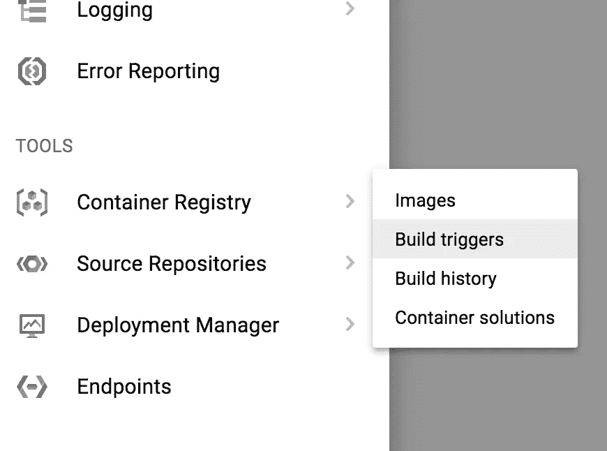
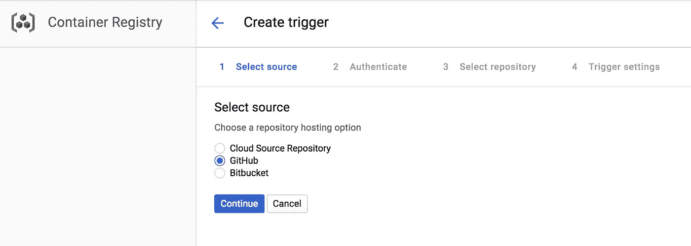
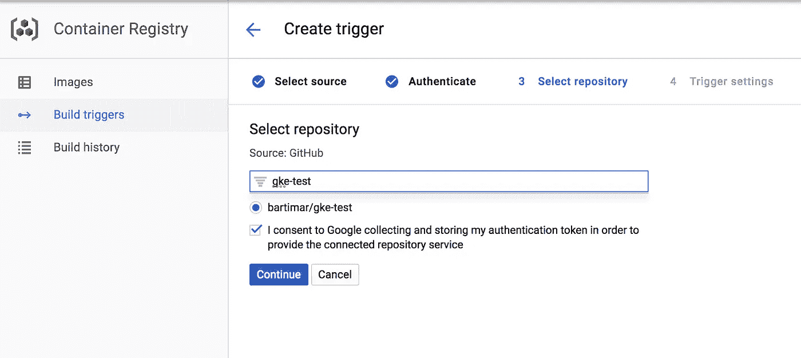
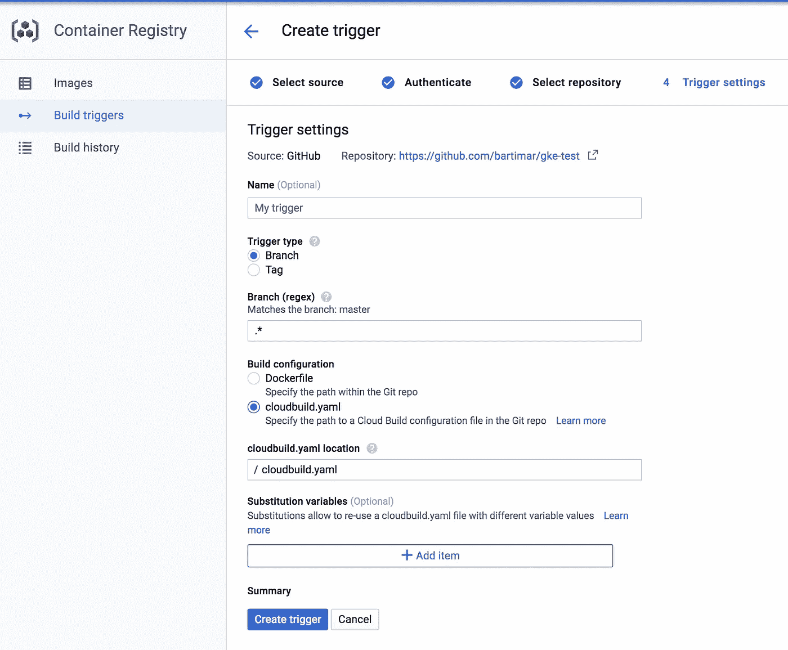
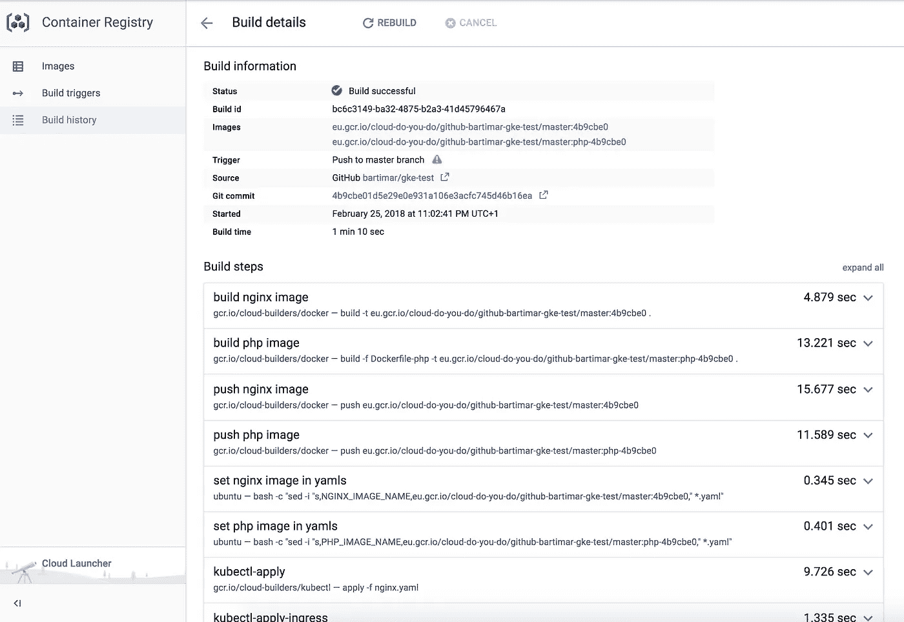
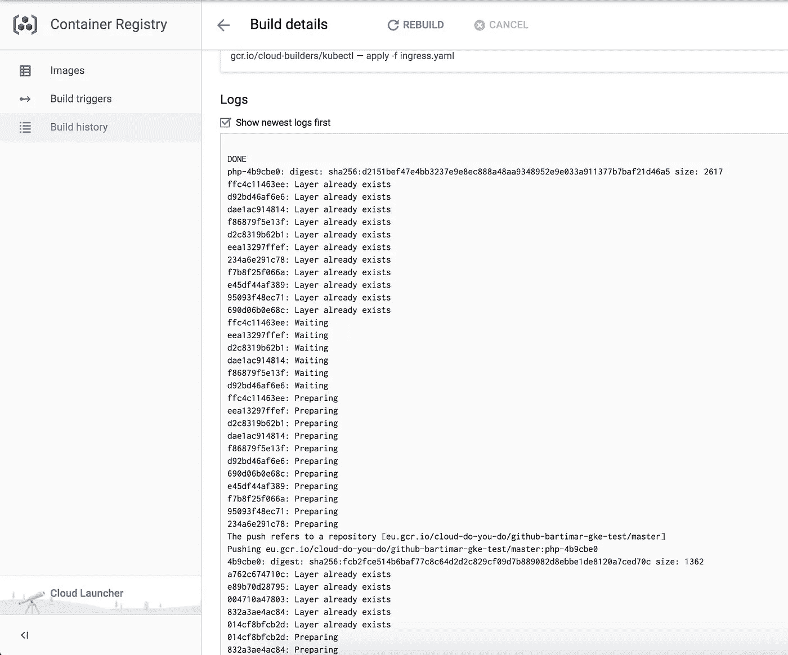

# Google Kubernetes 引擎+ Google Cloud Builder + GitHub，轻松快捷地实现 CD 管道

> 原文：<https://itnext.io/google-kubernetes-engine-google-cloud-builder-github-for-easy-and-quick-cd-pipeline-8aca663f1118?source=collection_archive---------3----------------------->

我爱谷歌云平台。我爱谷歌 Kubernetes 引擎。我也喜欢 GitHub。但我需要一个快速的 CD 管道，以方便自动化的应用程序部署。设置整个 Jenkins CI 或使用一些付费管道作为服务需要太多的时间、精力和金钱。Google Cloud Builder 来了(目前是测试版)。

我有一个简单的无状态 php 应用程序，运行在 nginx 和 Docker 容器中的 php-fpm 上，在 GitHub 上用 git 版本化。我需要的是把它快速廉价地部署到 GKE。

打开构建触发器。它应该在 Google 控制台——工具——容器注册表——构建触发器中(但是，你知道，他们每周都会改变用户界面，所以它可能在其他地方)

将您的 GitHub 帐户与 GCP 联系起来

导入您的回购

设置触发器

选择 cloudbuild.yaml，您可以在其中将您的 [CI/CD 管道定义为代码。](https://cloud.google.com/container-builder/docs/create-custom-build-steps)

我知道这很难看。我需要一个快速的解决方案，而不是一个漂亮的。

我需要从不同的 Docker 文件构建两个 Docker 映像，将它们推送到 Google Container Registry，模板化 kubernetes 部署清单，在 GKE 上部署它们(kubectl apply)并为外部 http 流量创建一个入口资源。

在我推送到 repo 之后，构建会自动开始

我看到了 git 提交和导致触发的动作，管道步骤，花费的时间，构建的总时间，链接到 GCR 的图像。并记录:

一切都是不可变的，我可以很容易地将部署回滚到带有 git 提交 id 的标记图像。我可以在构建历史中重新构建构建。[入口 DNS 记录自动推送到 CloudFlare。](https://medium.com/@marekbartik/google-kubernetes-engine-with-external-dns-on-cloudflare-provider-24beb2a6b8fc)

我必须创建自己的部署/服务/入口/任何 kubernetes 清单，并且必须用 sed(这非常难看，语法也不总是有效)将它们模板化。Google Cloud Builder 还处于测试阶段，肯定还有很多需要改进的地方。模板和 GKE 集成会很好(手动库应用，srsly？)来拥有。以及部署策略选择和更简单的配置？如果你正在寻找一个类似的，更成熟的服务，看看 https://www.shippable.com/。

查看回购来源:[https://github.com/bartimar/gke-test](https://github.com/bartimar/gke-test)

编辑:查看这个神奇的 github 报告，独一无二的凯尔西·海塔尔在谷歌云构建器上有很棒的教程[https://github.com/kelseyhightower/pipeline](https://github.com/kelseyhightower/pipeline)