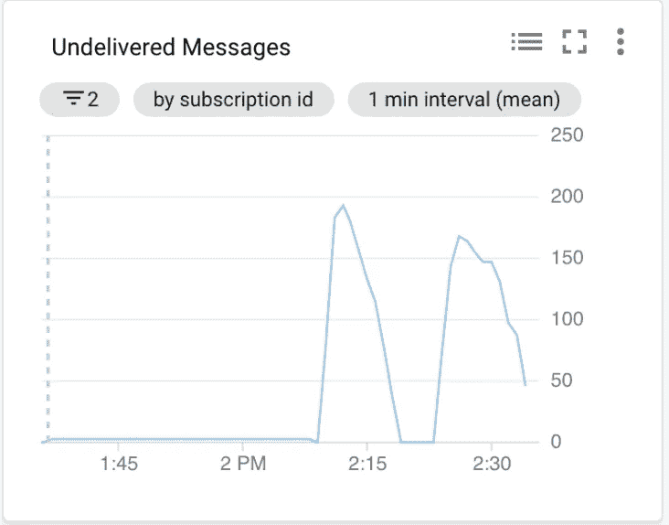
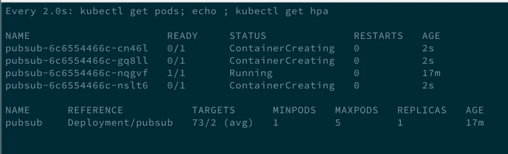
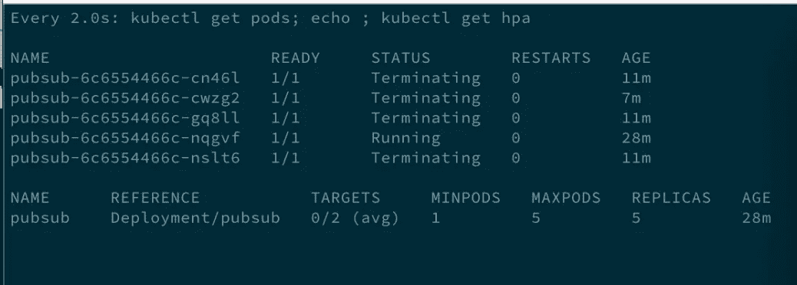

# Google Kubernetes 引擎——具有来自 PubSub 的外部指标的 HorizontalPodAutoscaler

> 原文：<https://itnext.io/google-kubernetes-engine-horizontalpodautoscaler-with-external-metrics-from-pubsub-28780c300305?source=collection_archive---------5----------------------->

在某些用例中，基于 cpu 使用率的水平扩展并不真正有效。假设你在 Kubernetes 有一个消费者工人池。消费者从 PubSub 主题中提取消息。当队列填满时，我们希望有更多的工作人员快速处理消息。另一方面，当队列为空时，我们不想为闲置的大型工作池付费。借助在 GKE 上运行的 PubSub Stackdriver metrics 适配器，我们可以轻松地自动扩展我们的工人池，以实现最小的延迟和最大的成本效益。

# 使用外部指标自动扩展部署

本教程演示了如何根据 [Stackdriver](https://cloud.google.com/stackdriver/) 中可用的指标自动扩展您的 GKE 工作负载。

如果您希望基于 Kubernetes 工作负载导出的指标或附加到 Kubernetes 对象(如 Pod 或 Node)的指标进行自动扩展，请访问[使用自定义指标进行自动扩展部署](https://cloud.google.com/kubernetes-engine/docs/tutorials/custom-metrics-autoscaling)。

该示例显示了基于[云发布/订阅](https://cloud.google.com/pubsub/)中未送达消息数量的自动缩放，但是该说明可以应用于 Stackdriver 中可用的任何指标。



堆栈驱动云发布/订阅监控

# 提供 GCP 资源

我们将在这里使用 terraform 来提供所有必要的 GCP 资源。集群和节点池的定义在文件 [main.tf](https://raw.githubusercontent.com/marekaf/gke-hpa-stackdriver-pubsub/master/main.tf) 中。确保按照 README 中的所有步骤为 terraform 创建一个服务帐户，并拥有创建所有资源所需的所有权限。

然后运行:

```
terraform init
terraform plan -out planfile
terraform apply planfile
```

PubSub 主题将被命名为“echo”，对它的订阅为“echo-read”。如果您已成功运行 terraform apply，则已经提供了此功能。

```
resource "google_pubsub_topic" "echo" {
  name = "echo"
}

resource "google_pubsub_subscription" "echo" {
  name  = "echo-read"
  topic = "${google_pubsub_topic.echo.name}"

  ack_deadline_seconds = 20
}
```

# 部署 Stackdriver 指标适配器

确保您已经安装了 kubectl，并且您可以[访问集群](https://cloud.google.com/kubernetes-engine/docs/how-to/cluster-access-for-kubectl)。

部署 stackdriver 适配器:

```
kubectl create -f https://raw.githubusercontent.com/GoogleCloudPlatform/k8s-stackdriver/master/custom-metrics-stackdriver-adapter/deploy/production/adapter.yaml
```

# 部署 HPA 和部署

以下是 HPA 的定义:

```
apiVersion: autoscaling/v2beta1
kind: HorizontalPodAutoscaler
metadata:
  name: pubsub
spec:
  minReplicas: 1
  maxReplicas: 5
  metrics:
  - external:
      metricName: pubsub.googleapis.com|subscription|num_undelivered_messages
      metricSelector:
        matchLabels:
          resource.labels.subscription_id: echo-read
      targetAverageValue: "2"
    type: External
  scaleTargetRef:
    apiVersion: apps/v1
    kind: Deployment
    name: pubsub
```

我们将根据来自我们的 *echo-read* 订阅的外部指标*pubsub . Google APIs . com | subscription | num _ un delivered _ messages*，在 1 到 5 个副本之间自动缩放。

目标值是 2 封未送达邮件。但是它实际上意味着什么呢？

例如:假设我的部署当前正在运行 **3** 个副本，我的队列从 6 个未送达的消息增加到 8 个。
我每个副本有 8/ **3** =2.6 条未送达的消息。
达到阈值并触发向外扩展到 **4 个**副本，每个副本将有 8/ **4** =2 条未送达的消息，并且符合所需的 targetAverageValue 值。
如果我有 50 封未送达的邮件，我将有 5 个副本，因为这是我的最大值。
如果我有 0 封未送达的邮件，我将有 1 个副本，因为这是我的最小值。

*scaletargerref*是我正在自动缩放的资源的引用。它是在文件 [pubsub-deployment.yaml](https://raw.githubusercontent.com/marekaf/gke-hpa-stackdriver-pubsub/master/pubsub-deployment.yaml) 中定义的部署。

使用将要自动扩展的部署来部署 HPA:

```
kubectl apply -f  pubsub-hpa.yaml
kubectl apply -f  pubsub-deployment.yaml
```

# 测试一下！

向主题发布一些消息

```
for i in {1..200}; do 
  gcloud pubsub topics publish echo --message=”Autoscaling #${i}”
done
```

并观察集群资源的神奇表现

```
watch 'kubectl get pods; echo ; kubectl get hpa'
```



饱和队列上的横向扩展



在空队列上放大

# 摘要

有了这个简单的设置，你就有了一个相当不错的水平自动缩放设置。丑陋的事情是自己运行 stackdriver 适配器，至少 HPA 控制器是 GKE 的一部分，并且完全为您管理。
HPA 的另一个优点是[您可以在同一个 HPA 资源中使用多个指标](https://cloud.google.com/blog/products/gcp/beyond-cpu-horizontal-pod-autoscaling-comes-to-google-kubernetes-engine)(甚至是自定义/外部/cpu 的组合)，并且您的部署将根据其中任何一个指标达到的阈值进行扩展。

# 链接

[https://github.com/marekaf/gke-hpa-stackdriver-pubsub](https://github.com/marekaf/gke-hpa-stackdriver-pubsub)

[https://cloud . Google . com/kubernetes-engine/docs/tutorials/authenticating-to-cloud-platform](https://cloud.google.com/kubernetes-engine/docs/tutorials/authenticating-to-cloud-platform)

[https://cloud . Google . com/kubernetes-engine/docs/tutorials/external-metrics-auto scaling](https://cloud.google.com/kubernetes-engine/docs/tutorials/external-metrics-autoscaling)