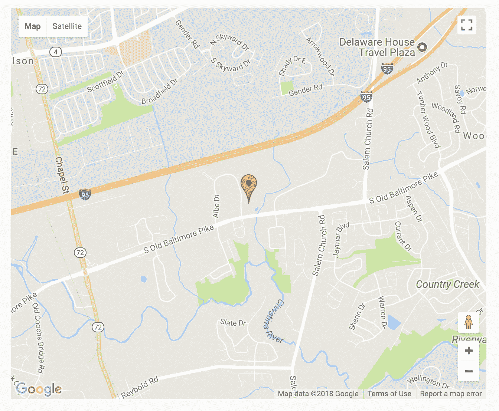
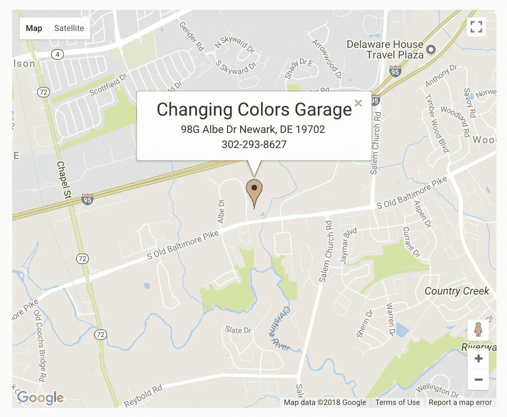

# google-maps-react 使得向 react 应用添加 Google Maps Api 变得轻而易举

> 原文：<https://itnext.io/google-maps-react-makes-adding-google-maps-api-to-a-react-app-a-breeze-effb7b89e54?source=collection_archive---------0----------------------->


克里斯·劳顿在 [Unsplash](https://unsplash.com?utm_source=medium&utm_medium=referral) 上拍摄的照片

包含谷歌地图 Api 实际上比听起来容易得多。这主要归功于 Fullstack React 创建的名为`[google-maps-react](https://github.com/fullstackreact/google-maps-react#infowindow--sample-event-handler-functions)`的 npm 包。我目前正在将谷歌地图整合到我正在创建的网站中。所以，事不宜迟，让我们开始吧。

首先做一些快速设置。假设您已经使用`create-react-app`创建了您的应用程序。是时候安装`google-maps-react`了。我将使用`yarn`。在你的终端中运行`yarn add google-maps-react`即可。是时候创建我们的组件了。

```
import React from 'react';
import { GoogleApiWrapper, InfoWindow, Map, Marker } from 'google-maps-react';import Paper from 'material-ui/Paper';
import Typography from 'material-ui/Typography';
import { typography } from 'material-ui/styles';class GoogleMapsContainer extends React.Component {
  constructor(props) {
    super(props);
    this.state = {
      showingInfoWindow: false,
      activeMarker: {},
      selectedPlace: {}
    }
    // binding this to event-handler functions
    this.onMarkerClick = this.onMarkerClick.bind(this);
    this.onMapClick = this.onMapClick.bind(this);
  } onMarkerClick = (props, marker, e) => {
    this.setState({
      selectedPlace: props,
      activeMarker: marker,
      showingInfoWindow: true
    });
  } onMapClick = (props) => {
    if (this.state.showingInfoWindow) {
      this.setState({
        showingInfoWindow: false,
        activeMarker: null
      });
    }
  } render() {
    const style = {
      width: '50vw',
      height: '75vh',
      'marginLeft': 'auto',
      'marginRight': 'auto'
    } return (
      <Map
        item
        xs = { 12 }
        style = { style }
        google = { this.props.google }
        onClick = { this.onMapClick }
        zoom = { 14 }
        initialCenter = {{ lat: 39.648209, lng: -75.711185 }}
      >
        <Marker
          onClick = { this.onMarkerClick }
          title = { 'Changing Colors Garage' }
          position = {{ lat: 39.648209, lng: -75.711185 }}
          name = { 'Changing Colors Garage' }
        />
        <InfoWindow
          marker = { this.state.activeMarker }
          visible = { this.state.showingInfoWindow }
        >
          <Paper>
            <Typography
              variant = 'headline'
              component = 'h4'
            >
              Changing Colors Garage
            </Typography>
            <Typography
              component = 'p'
            >
              98G Albe Dr Newark, DE 19702 <br />
              302-293-8627
            </Typography>
          </Paper>
        </InfoWindow>
      </Map>
    );
  }
}export default GoogleApiWrapper({
    api: (process.env.GOOGLE_API_KEY_GOES_HERE)
})(GoogleMapsContainer)
```

所以对于一个简单的谷歌地图 Api 来说，这就是你所需要的全部代码。如果你没有注意到，我也使用材质 UI 作为我的 CSS 框架。我的`GoogleMapsContainer`组件包含了全部内容。`Map`不言自明，它就是谷歌地图本身。就是你在地图上看到的红色标记。



side note——我很快设置了 css，将地图放在本教程页面的中央。

`InfoWindow`如果点击标记，将显示标记的相关信息。



现在是点击功能。`onMarkerClick`用于显示`InfoWindow`，`onMapClicked`用于完成后移除`InfoWindow`。

使用这个软件包，您还可以做更多的事情。但是这是一个简单的用例，可以用来在你的个人网站中开始实现谷歌地图。下次见。

[](https://medium.com/@acodercalledcole/membership) [## 通过我的推荐链接加入媒体-布雷特科尔

### 作为一个媒体会员，你的会员费的一部分会给你阅读的作家，你可以完全接触到每一个故事…

medium.com](https://medium.com/@acodercalledcole/membership)