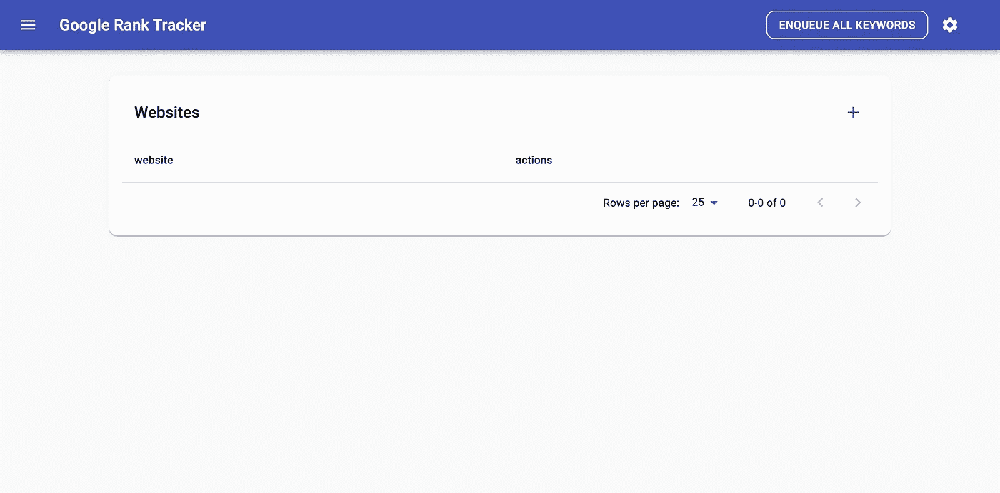
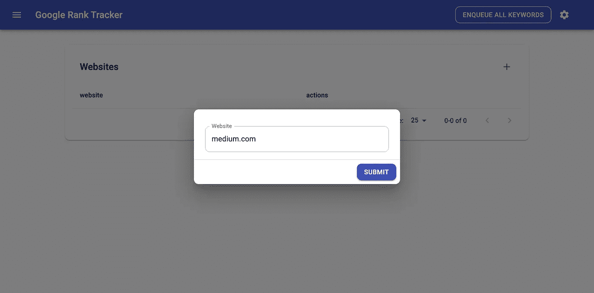
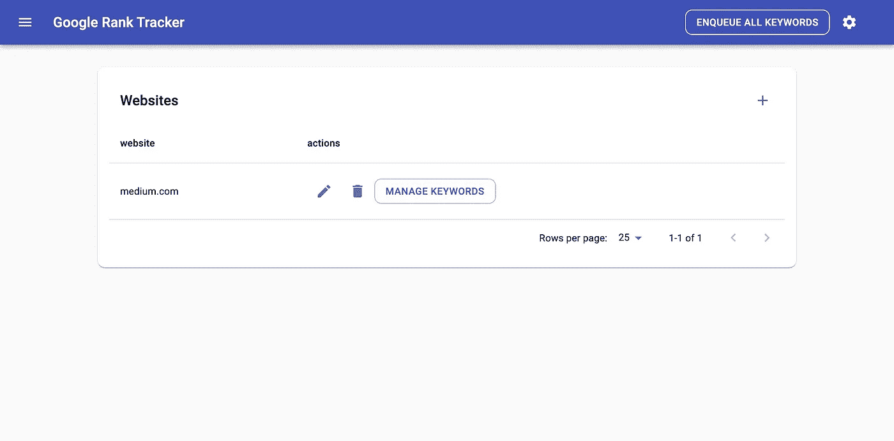
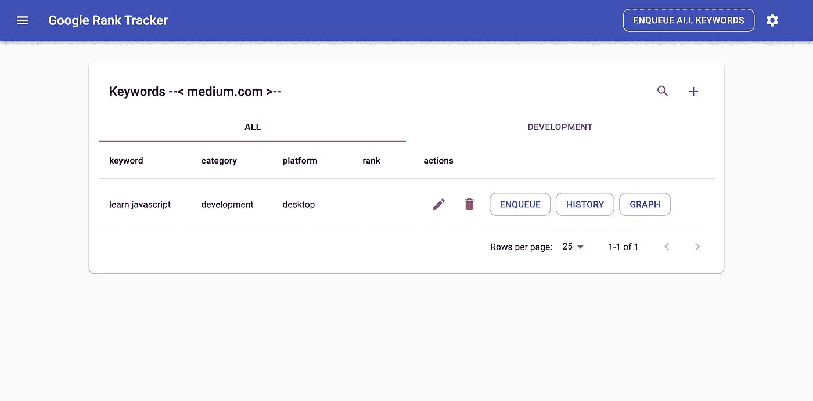
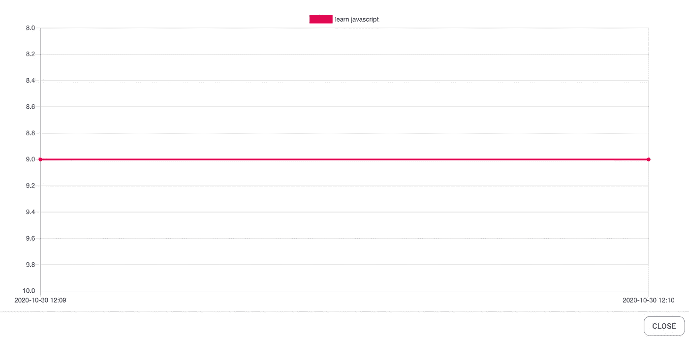

# 谷歌排名跟踪|跟踪你的网页在谷歌搜索结果中的排名进度

> 原文：<https://itnext.io/google-rank-tracker-track-your-pages-rank-progress-in-google-search-results-95ac9f064b4a?source=collection_archive---------1----------------------->


你是搜索引擎优化专家吗？你想跟踪你的网页在谷歌搜索结果中的排名吗？如果是的话，这篇文章是给你的。

我将向您介绍一个应用程序，帮助您跟踪您的网页排名。

# 先决条件

要安装这个应用程序，你需要在你的机器上安装 **Docker 引擎**和 **Docker Compose** 。

## 码头引擎

要安装 Docker 引擎，请访问此文档:

[https://docs.docker.com/engine/install](https://docs.docker.com/engine/install/)

## Docker 撰写

要安装 Docker Compose，请访问此文档:

[https://docs.docker.com/compose/install](https://docs.docker.com/compose/install/)

# 装置

安装并运行 Docker 后，您可以使用以下命令安装并运行该应用程序:

```
git clone [https://github.com/mohsensaremi/google-rank-tracker.git](https://github.com/mohsensaremi/google-rank-tracker.git)
cd [google-rank-tracker](https://github.com/mohsensaremi/google-rank-tracker.git)
docker-compose up
```

提取图像和运行应用程序需要一些时间，所以请耐心等待。

运行应用程序后，请访问

[http://localhost:3000](http://localhost:3000/keywords/5f9bd0a6e18cf3001c479618)

# 如何使用

首先，你需要将你的网站和关键词添加到应用程序中。

**应用程序将在每天 00:00 更新一次网页排名。**

你可以手动获取关键词排名，但这不是必须的。

# **示例**

这是申请的第一页:



您可以点击表格右上角的加号按钮来添加您的网站:



添加您的网站后，点击**管理关键词**按钮。


您可以点击表格右上角的加号按钮添加您的关键字:



就是这样！

您可以继续添加所有关键词。

点击**入队**按钮，可以手动获取关键词排名。


**图**按钮显示关键词排名进度。



# 技术要点

docker-compose 文件包含以下图像:

## 蒙戈

这是数据存储。

## 蒙古快报

用于监控数据存储。

## 硒/集线器和硒/节点铬

我们用这张图片打开浏览器，在谷歌上搜索，找到排名。

## 兔子 q

这是按顺序排列页面的队列。

## mohsensaremi/谷歌-排名-跟踪-后端

后端管理所有的工作。

## mohsensaremi/谷歌-排名-跟踪-前端

使用应用程序的用户界面。

# **源代码**

您可以在此处访问源代码:

[](https://github.com/mohsensaremi/google-rank-tracker) [## mohsensaremi/谷歌排名跟踪器

### 此时您不能执行该操作。您已使用另一个标签页或窗口登录。您已在另一个选项卡中注销，或者…

github.com](https://github.com/mohsensaremi/google-rank-tracker)