# 谷歌登录尽可能深入——iOS

> 原文：<https://itnext.io/google-sign-in-as-deep-as-possible-ios-b35e3cf03ecf?source=collection_archive---------4----------------------->

## 谷歌登录可以让用户通过他们的谷歌帐户登录到我们的应用程序。不再需要额外的账号和密码！

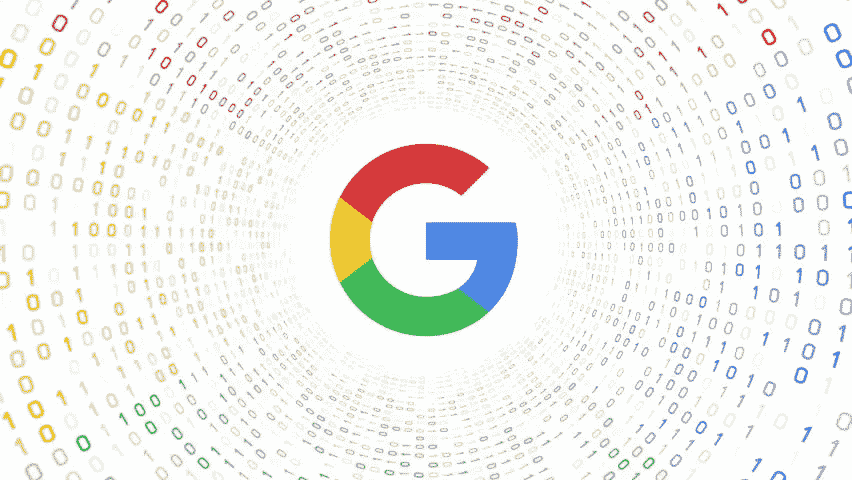

oogle 登录是许多现代移动应用程序中的一个著名功能。它提供了一个简洁易用的 API，用于将授权过程委托给 Google 网站和服务器。谷歌为应用开发者处理安全问题。开发人员只需要遵循 7 个步骤来实现整个登录过程。

在我上次的实现中发现了一个有趣的技巧——`AppDelegate`中的`[application(_:open:options:)](https://developer.apple.com/documentation/uikit/uiapplicationdelegate/1623112-application)`函数从未被触发，即使它是官方文档中规定的必需设置。为什么？下面来看看。

## 步骤 1)通过 CocoaPods 安装 Google Sign-In SDK


在`Podfile`添加`GoogleSignIn`依赖，在终点与`pod install`一起运行。

## 步骤 2)设置 OAuth 客户端 ID

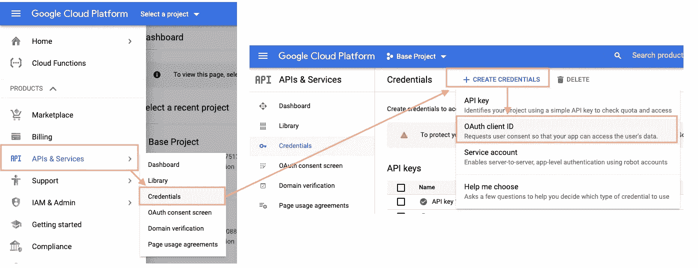

转到 Google 云平台控制台并导航到:

API & Services
>凭证
> +创建凭证
> OAuth 客户端 ID

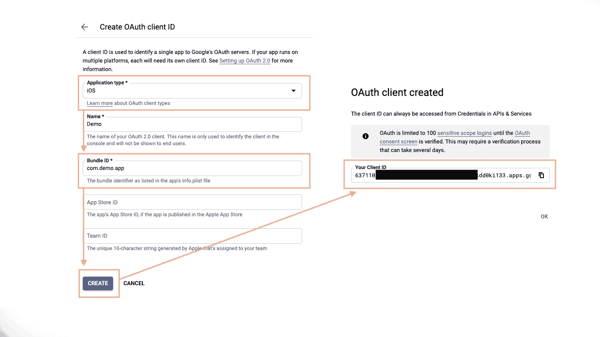

填写必要的信息并创建您唯一的客户 ID。这是在应用程序启动时初始化 GoogleSignIn SDK 所必需的，请参考步骤 6)。

## 步骤 3)添加谷歌登录按钮

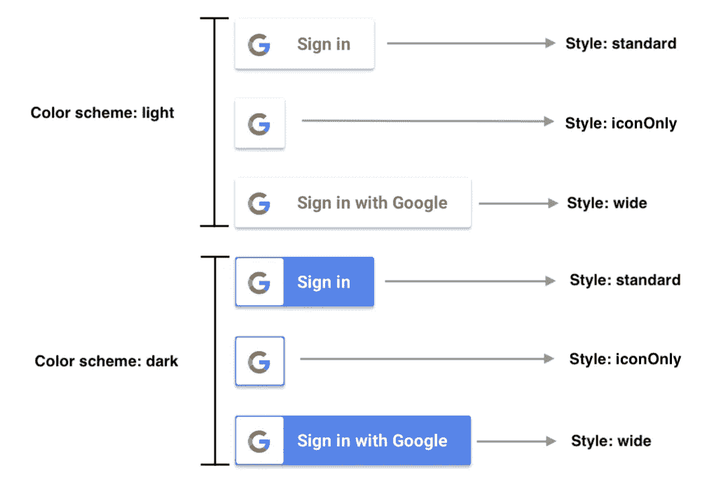

SDK 总共提供了六种类型的 Google 登录按钮。我们可以通过设置`GIDSignInButton`的`colorScheme`和`style`属性来配置它的外观。

使用`GIDSignInButton`的一个优点是它有一个默认的触发自动登录功能的内部触发动作。开发人员不需要自己声明点击动作。

## 步骤 4)设置和处理自定义 URL 方案

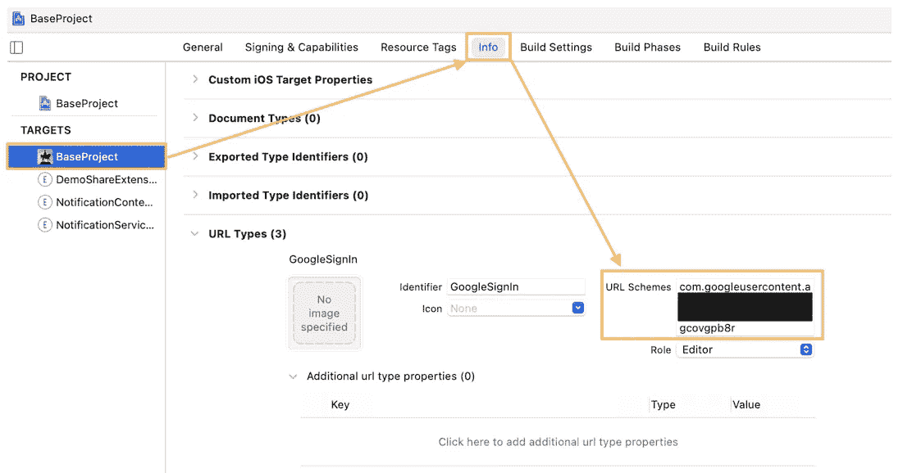

将 URL 方案添加到项目信息

根据[官方文档](https://developers.google.com/identity/sign-in/ios/start-integrating#add_a_url_scheme_to_your_project)，开发人员必须导航到“**信息**”选项卡的“ **URL 类型**”会话，并使用反转的 OAuth 客户端 ID 创建一个新的 URL 类型。例如:

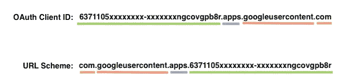

之后，我们需要处理启动我们的应用程序的 URL 的数据。`handle(url: URL)`函数为我们检索并处理 URL 中的有用信息。

由于我们的应用程序中可能有多个登录方法，我们应该像这样小心处理它们:

# 在此深思！🤔

Xcode 项目中 URL 方案的目的是什么？这个什么时候触发？谁来触发？

URL 方案是我们应用程序的入口点。例如，如果一个应用程序有一个 URL 方案`com.demoScheme`，其他应用程序(例如 Safari)可以通过类似`com.demoScheme://action`的链接启动我们的应用程序。

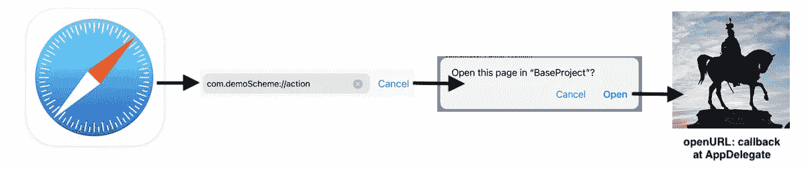

为简单起见，我们的应用程序将认证过程委托给另一个可信任的应用程序，例如脸书、推特、雅虎！以及 Instagram app 等。在代理获得身份验证状态后，它将数据传递回我们的应用程序以进行进一步的操作。以脸书 app 为例:

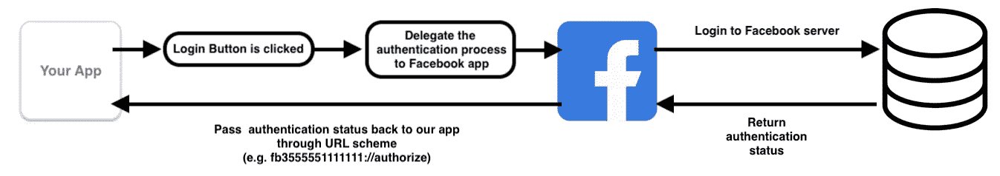[](/swift-facebook-ios-login-sdk-dada412d8341) [## Swift —脸书 iOS 登录 SDK

### 脸书 SDK 允许用户登录并授予应用程序权限，以便从脸书检索个人信息…

itnext.io](/swift-facebook-ios-login-sdk-dada412d8341) 

此时此刻，我们来思考一下哪个 app 可以为谷歌用户提供授权服务。我已经尝试了 [Google](https://apps.apple.com/us/app/google/id284815942) 、 [Gmail](https://apps.apple.com/us/app/gmail-email-by-google/id422689480) 和 [YouTube](https://apps.apple.com/us/app/youtube-watch-listen-stream/id544007664) 应用程序，但它们都无法完成认证任务。在 StackOverflow 搜索了一段时间后，得到的答案是…[**自 2019 年 4 月**](https://support.google.com/googlecurrents/answer/9195133?hl=en#:~:text=Help%20CenterAnnouncements-,Shutting%20down%20Google%2B%20for%20consumer%20(personal,accounts%20on%20April%202%2C%202019&text=In%20December%202018%2C%20we%20announced,product%20that%20meets%20consumers'%20expectations.)起已经终止的“Google+”。换句话说，目前没有更多的应用程序会触发 Google 身份验证任务的项目 URL 方案。

那么，为什么 Google 仍然在官方文档中保留这个回调，并在我们没有将客户 URL 方案添加到项目中时抛出一个运行时错误呢？我有一个猜测。谷歌将此作为后备计划，并确认一旦未来发布任何 Google+继任者，市场上的每个应用都可以准备就绪。🤔 💰💰💰💰

## 步骤 5)实现 GIDSignInDelegate

`GIDSignInDelegate`有两个重要功能:

1.  `didSignInFor` —当用户完成登录过程或在登录过程中遇到错误时调用
2.  `didDisconnectWith` —当应用程序与用户的谷歌账户断开时调用。如果用户将其从 Google 帐户网站断开，这将不会被触发。

## 步骤 6) Google 登录基本设置

我们需要设置 Google 登录客户端 ID(在第 2 步中检索)，并将`GIDSignInDelegate`设置为`GIDSignIn`共享实例，以便正确获得回调。

## 步骤 7)检索个人信息

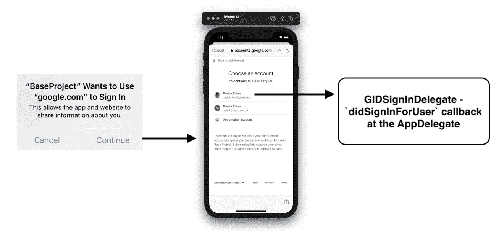

构建并运行您的应用程序。您将看到以下行为:

1.  谷歌登录对话框显示一条**不可定制的**消息
2.  一个应用内浏览器`UIViewController`出现了，用户可以登录
3.  无论用户取消还是成功登录，都会在`AppDelegate`触发`didSignInForUser`

然后我们的服务器可以使用用户的`idToken`在 3600s 的有效期内通过下面的公共 API 检索用户信息:

[https://www.googleapis.com/oauth2/v3/tokeninfo?id_token=xxxxxxxxx](https://www.googleapis.com/oauth2/v3/tokeninfo?id_token=)

> 要注销一个用户，我们只需要简单地调用`GIDSignIn.sharedInstance().signOut()`

# 高级主题/讨论

## 1)检索额外的范围/权限

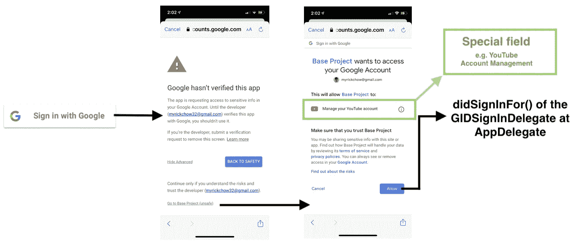

默认情况下，Google SignIn SDK 只请求用户的**个人资料**和**电子邮件**。这对于正常的帐户创建已经足够了。然而，如果你的应用程序有一些奇特的功能，需要一些**特殊用户的权限**，你必须在`GIDSignIn`实例定制`scopes`字段。这里有一个[链接](https://developers.google.com/identity/protocols/oauth2/scopes)到完整列表。

[](https://developers.google.com/identity/protocols/oauth2/scopes) [## Google APIs 的 OAuth 2.0 范围| Google 身份| Google 开发者

### 谷歌致力于促进黑人社区的种族平等。看看如何。

developers.google.com](https://developers.google.com/identity/protocols/oauth2/scopes) 

由于用户的隐私和安全，开发人员必须向 Google 提交 OAuth 同意要求，以验证您的应用程序确实需要这种敏感信息。审查过程需要几天时间。详细的步骤指南，请参考这个[谷歌链接](https://support.google.com/cloud/answer/7454865?hl=en)。

用户可以避免登录，因为同意屏幕对新用户来说是压倒性的，或者对为什么要求他们某些权限感到困惑。在任一种情况下，您都可以延迟附加的作用域，并在需要它们之前呈现它们。

## 2)苹果 App Store 数据披露要求

苹果是一家伟大的公司，非常关注用户的隐私。它要求所有应用程序公开收集的用户数据将如何使用。缺少明确的声明会导致苹果在应用审查过程中拒绝接受。因此，Google 提供了以下干净的声明，它可以应用于所有使用 Google SignIn SDK 的应用程序！

```
To enable your users to sign in quickly and securely, the Google Sign-In for iOS SDK may collect the following:1\. User identifier, to record OAuth grants created with the user’s consent.2\. IP address, which may be used to estimate the general location of a device for fraud prevention. 
```

## 3)“注销”和“断开”有什么区别？

**【登出】**是 SDK 在本地**删除用户档案**的动作。如果用户之前已经向我们的服务器发送了访问令牌，我们的服务器仍然可以代表用户执行任何操作，包括检索用户的配置文件。

```
GIDSignIn.sharedInstance().signOut()
```

**【断开】**是用户想要使我们的服务器已经拥有的访问令牌失效的动作。我们的服务器将不再能够访问用户的信息。

```
GIDSignIn.sharedInstance().disconnect()
```

用户可以在 Google 主页查看他/她授予 Google 登录权限的应用程序列表:

管理您的 Google 帐户
>安全性
>管理第三方访问
>“登录 Google”会话

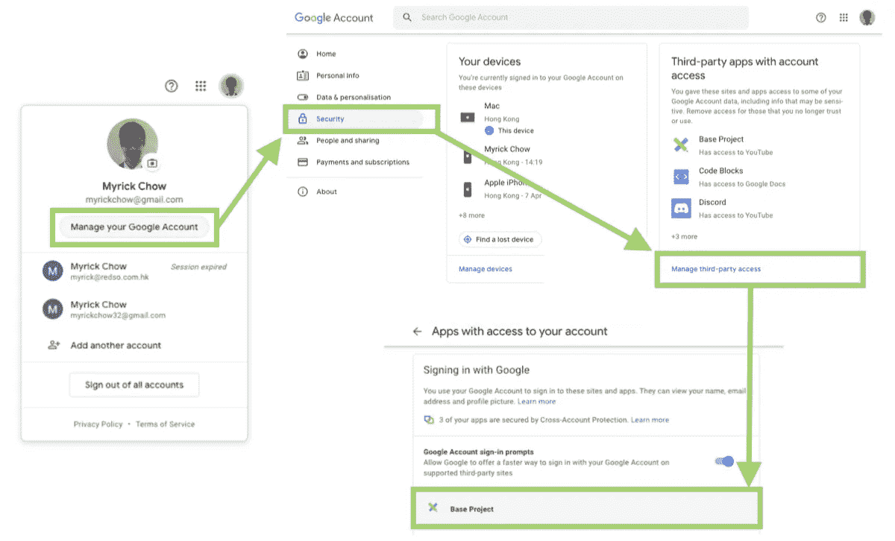

# 摘要

Google Sign-In SDK 是一个易于使用的工具，用于将授权任务委托给 Google 服务器。一旦用户在显示的应用内浏览器上登录，SDK 将返回用户的个人信息，包括名字、姓氏、电子邮件地址和个人资料图像 URL 等。

虽然根据官方文档，我们必须在 Xcode 项目中设置自定义 URL 方案，但由于唯一的谷歌授权应用“Google+”已经从 2019 年开始终止，`[application(_:open:options:)](https://developer.apple.com/documentation/uikit/uiapplicationdelegate/1623112-application)`将永远不会被触发！

该应用程序可以请求额外的用户权限来代表他们执行某些操作。比如 YouTube 账号，Google 云平台，Firebase 管理。

# 参考

[](https://developers.google.com/identity/sign-in/ios/start-integrating) [## 开始将谷歌登录整合到你的 iOS 应用中

### " type": "thumb-down "，" id ":" missingtheinformationneed "，" label ":"缺少我需要的信息" }，{ "type"…

developers.google.com](https://developers.google.com/identity/sign-in/ios/start-integrating) [](/swift-facebook-ios-login-sdk-dada412d8341) [## Swift —脸书 iOS 登录 SDK

### 脸书 SDK 允许用户登录并授予应用程序权限，以便从脸书检索个人信息…

itnext.io](/swift-facebook-ios-login-sdk-dada412d8341) [](https://developers.google.com/identity/protocols/oauth2/scopes) [## Google APIs 的 OAuth 2.0 范围| Google 身份| Google 开发者

### 谷歌致力于促进黑人社区的种族平等。看看如何。

developers.google.com](https://developers.google.com/identity/protocols/oauth2/scopes) 

感谢您阅读这篇文章。希望你觉得有趣和有用！欢迎您关注我，并通过以下渠道与我联系:

1.  [Twitter @ myrik _ chow](https://twitter.com/myrick_chow)
2.  [YouTube @ myrick show](https://www.youtube.com/channel/UC_UEqZPDms3rtX5W-m9hgxg)
3.  [LinkedIn @ myrik Chow](https://www.linkedin.com/in/myrick-chow-720b34118/)