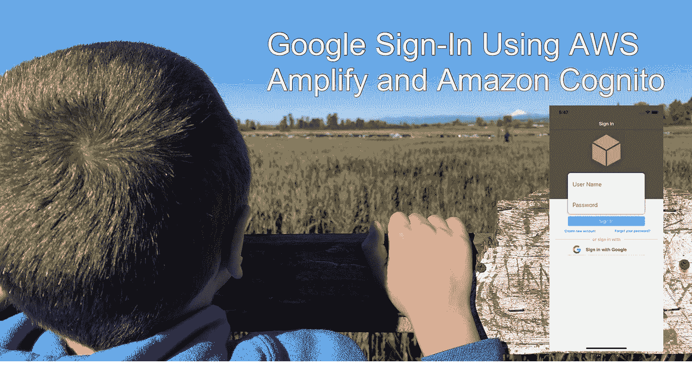
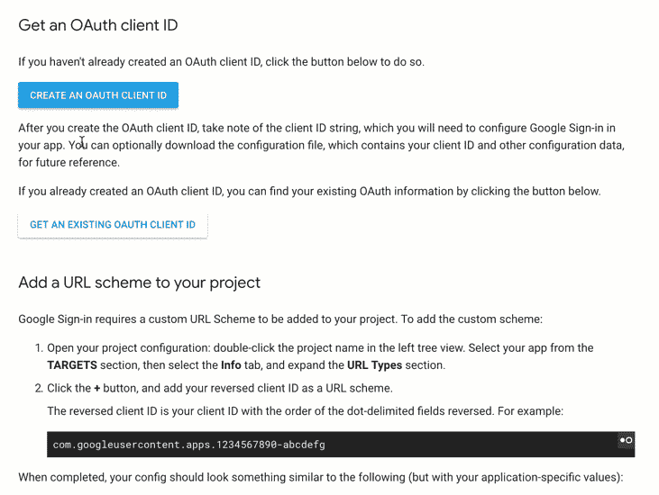
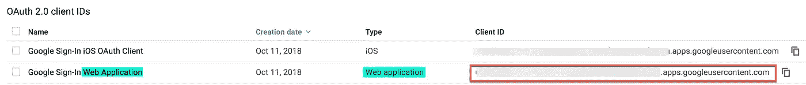
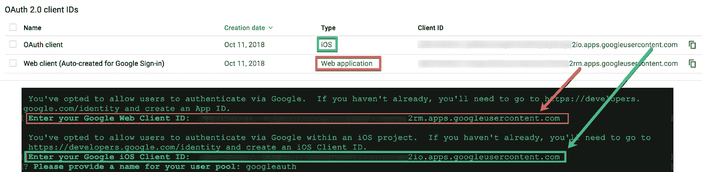
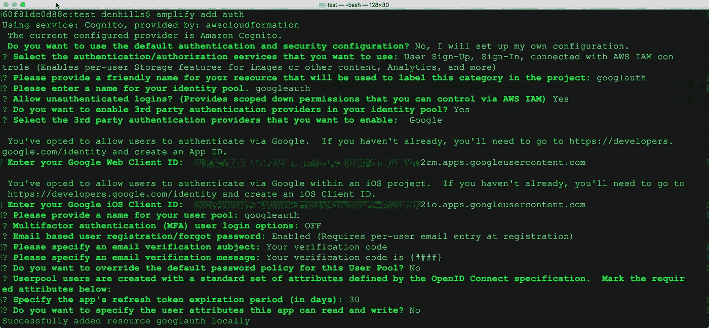
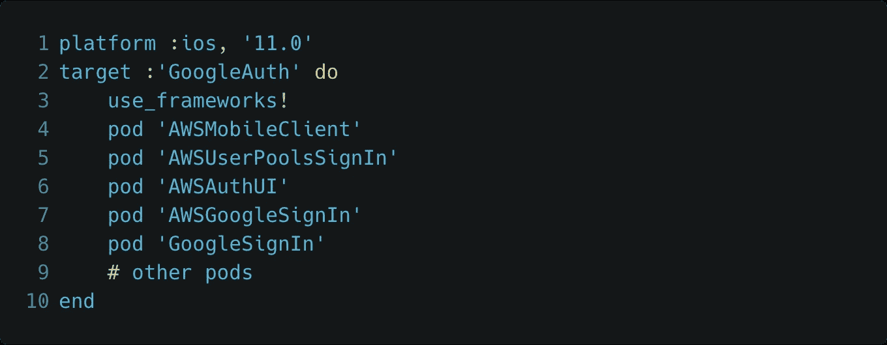
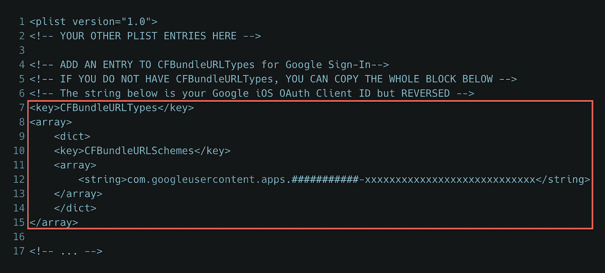
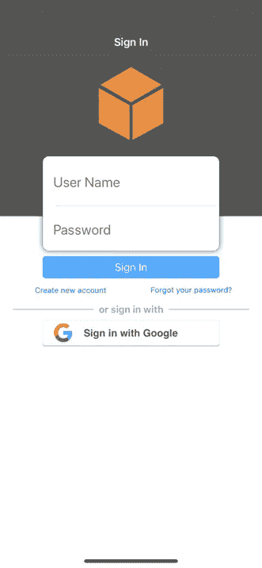

# iOS 版谷歌登录

> 原文：<https://itnext.io/google-sign-in-using-aws-amplify-and-amazon-cognito-69cc3bf219ad?source=collection_archive---------2----------------------->



*更新(2019 年 4 月):更新了客户端代码，以反映 AWS SDK for iOS (2.8.0+)和 AWS Amplify 的最新 auth 变化。*

我们将继续使用社交登录提供商作为移动认证机制，允许您的用户在 iOS 云应用中进行认证。在本文中，我们将把[谷歌登录](https://developers.google.com/identity/)集成到我们的 iOS 应用程序中。在上一篇文章“使用 AWS Amplify 和 Amazon Cognito 的[脸书登录”中，我们使用 Amazon 身份池通过脸书登录联合身份验证。在那篇文章之前，我们使用 Amazon](/facebook-login-using-aws-amplify-and-amazon-cognito-4acf74875a04) [Cognito 用户池作为基本认证](/basic-authentication-for-ios-using-aws-amplify-and-amazon-cognito-233b943222d4)来管理我们的应用程序用户目录，每个用户都创建了一个新帐户，并使用他们的用户名/密码进行认证，这是您的应用程序独有的。

借助谷歌登录集成，用户无需通过 Cognito 用户池创建新账户或联合脸书，只需在应用中选择**使用谷歌**按钮登录，并使用其谷歌凭据通过谷歌进行身份验证，同时保持在应用流程内。

注意:你的应用可以支持脸书、谷歌或用户名/密码的任意组合。你不局限于一个社交提供商或基本认证。

桥

# 步骤 1: Google OAuth 客户端 id

**目标**:这里的最终目标是获得 OAuth Web 客户端 ID 和 iOS 客户端 ID，以便在您的应用程序中使用 Google Sign-in。这些客户端 id 采用 URL 的形式。您将从 Google 开发者门户复制两个客户端 id，并保存它们以备后用。

**工作原理**:要在你的 iOS 应用中实现谷歌登录，你需要一个 OAuth Web & iOS 客户端 ID。这些客户端 id 是您的 Google 开发者项目的一部分。Cognito 身份池将使用 Web 客户端 ID 来管理服务器端 Cognito 和 Google 之间的 OAuth 流。iOS 客户端 ID 将在您的 iOS 应用程序中使用，以直接向 Google 授权 OAuth 流，从而允许您的用户使用他们的 Google 登录凭据向 Google 进行身份验证。

**实现**:有几种方法可以生成(Web 和 iOS)客户端 id。我发现的最简单的方法是遵循谷歌开发者门户的“开始整合”部分。这允许您创建一个新项目或选择一个现有项目，在后台自动生成 Web 客户端 ID，并创建一个 iOS 客户端 ID 供您复制。

**注意**:为 Google Sign-In 创建 OAuth 客户端的创建和配置步骤是不断变化的，因此请始终参考 Google 的官方设置说明。

**从这里开始**:

**一个**。登录[https://developers . Google . com/identity/sign-in/IOs/start-integrating](https://developers.google.com/identity/sign-in/ios/start-integrating)

**B** 。向下滚动到**获取 OAUTH 客户端 ID** 并选择**创建 OAuth 客户端 ID** 按钮。忽略页面上的其他内容。


**C** 。按照动画 gif 中概述的步骤进行您自己的项目。

*创建新项目或选择现有项目。*

*提供将显示给用户的产品名称。*

*指定 iOS 作为 OAuth 客户端的具体应用环境。*

*提供您的 iOS 应用捆绑包标识符(如 com.domain.appname)*

> **选择完成**。



**D** 。现在，从你的谷歌项目证书页面[https://console.developers.google.com/apis/credentials](https://console.developers.google.com/apis/credentials)获取你的**网络客户端 ID** 和 **iOS 客户端 ID**

**E** 。选中您的项目后，在 **OAuth 2.0 客户端 ID**下，复制并保存 **Web 客户端 ID** (与 Web 应用程序类型相关)和 **iOS 客户端 ID** (与 iOS 类型相关)，以备下一步使用。



# 步骤 2:在 Xcode 中创建新的 iOS 项目

创建新的 Swift iOS 单视图应用程序或使用现有的 Xcode iOS swift 项目。下一步，我们将使用 AWS Amplify 对该应用程序进行云支持。

# 步骤 3:放大 CLI

使用 Amplify CLI 初始化 Google 登录的云后端

[首次安装 Amplify CLI

在初始化我们的后端之前，我们将使用 AWS Amplify CLI，它是 [AWS Amplify 工具链](https://aws-amplify.github.io/media/toolchain?utm_source=da&utm_medium=blog&utm_campaign=denhills&utm_term=ios_native)的一部分。如果您之前没有安装 AWS Amplify CLI，这里有一个快捷方式。*放大配置*仅当您尚未安装或配置 AWS unified CLI 时才需要。如果您安装了 AWS CLI，Amplify CLI 将利用这些凭据。

```
$ npm install -g @aws-amplify/cli
$ amplify configure
```

这是一次性安装。查看[入门教程](https://aws-amplify.github.io/media/get_started?utm_source=da&utm_medium=blog&utm_campaign=denhills&utm_term=iOS_native)了解更多详情。

[通过 Amplify CLI 将 Auth 添加到我们的 iOS 应用程序]

在 iOS 项目文件夹的根目录下启动 Mac 终端。现在，我们将使用下面的 Amplify 命令初始化我们的 AWS 后端项目。

```
$ amplify init
```

将指导您完成设置项目的过程。**确保在适当的时候选择 iOS**。

接下来，让我们向移动项目添加经过身份验证的访问。我们将遵循 AWS 文档中的[电子邮件&密码](https://docs.aws.amazon.com/aws-mobile/latest/developerguide/add-aws-mobile-user-sign-in.html)选项选项卡中概述的相同流程。

```
$ amplify add auth
```

由于我们没有选择默认设置，我在应用程序中使用的值显示在下图中。大多数是您通过输入的默认值，其他的，您有机会命名您的资源。

对于下面的配置，我将通过用户池和谷歌登录添加基本身份验证，因为这更容易一步完成，而且为您的用户提供基本登录和社交登录选项也很好。



此处找到的 OAuth 客户端 id:[https://console.developers.google.com/apis/credentials](https://console.developers.google.com/apis/credentials)



AWS Amplify CLI —带基本身份验证和 Google 登录的身份验证

将本地配置更改推送到您的 AWS 帐户

```
$ amplify push
```

我们现在有了一个认知用户池、身份池、认证和未认证的 IAM 角色，以及作为认证提供者的 Google。

# **步骤 4:为 iOS 设置 AWS Mobile SDK(cocoa pods)**

在这个例子中，我将使用 Cocoapods 进行依赖管理，因为这是目前推荐的将 AWS SDK 集成到 iOS 项目中的方法。更多关于[椰子的信息](https://cocoapods.org/)。如果你的应用程序中还没有 pod，你可以简单地运行一个 *$ pod init* ，它会为你创建一个新的 pod 文件。有了 Podfile 之后，向该文件添加以下依赖项。

```
$ pod init
```

在您的 *Podfile* 中，向该文件添加以下依赖项。



[https://gist . github . com/mobile quickie/0ad 088 a 2731616462 fcd6b 556363120 c](https://gist.github.com/mobilequickie/0ad088a2731616462fcd6b556363120c)

将 SDK 库引入您的项目:

```
$ pod install --repo-update
```

# 步骤 5: AWSConfiguration.json

当使用 AWS Amplify CLI 提供后端资源时，它会在 iOS Xcode 项目的根目录下生成一个名为 *awsconfiguration.json* 的文件。该文件包含可通过应用程序访问的资源的描述，并在 Amplify 工具链添加、更新或删除资源时与项目同步。这种配置文件的自动更新是使用 Amplify CLI 从您的本地移动开发环境中提供 AWS 资源的巨大好处之一。

*您只需将 awsconfiguration.json 文件添加到 Xcode 项目中一次。您可以通过将它拖到 Xcode 项目管理器中的 Finder 来完成此操作。*

如果要复制文件，系统会提示您。**取消选择复制项目框**。当情况发生变化时，AWS Amplify CLI 会更新该文件。如果您选中目标框，那么您的项目在被复制时可能不会收到更新。如果取消选中该框，则每当您通过 Amplify CLI 修改项目资源时，该文件都会更新。

# 步骤 6: Google 登录 iOS URL 方案

Google 登录回调流需要一个定制的 URL 方案添加到您的 iOS 项目中。该 URL 方案是您在*获取 Google 项目证书(OAuth 客户端 ID)的第 3 步中复制的 OAuth iOS 客户端 ID。*

要添加自定义方案，我们将编辑 Xcode 项目 Info.plist:

启动 Xcode，使用**右键>打开其`Info.plist`文件作为>源代码。**

您的 iOS 客户端 ID 放在 Info.plist 的字符串值中，但顺序相反。

颠倒的客户端 ID 是您的 iOS 客户端 ID(以 URL 的形式),点分隔字段的顺序颠倒了。例如:


iOS 项目中的自定义 URL 方案



[https://gist . github . com/mobile quickie/133 cf 95d 49 DC 36 a 47 a2 f 6d 75 f 0 c 9 e 2 b 0](https://gist.github.com/mobilequickie/133cf95d49dc36a47a2f6d75f0c9e2b0)

现在您已经配置了 Xcode 项目，您可以将 [Google Sign-In](https://developers.google.com/identity/sign-in/ios/sign-in) UI 添加到由 AWSMobileClient 管理的 iOS 应用程序中，并将内置的 Auth UI 作为 AWS Mobile SDK 的一部分。

# **步骤 7:初始化 AWSMobileClient**

在您希望用户注册或登录的根 UIViewController 或相关屏幕中，添加下图中引用的以下代码:

> 1.添加第 2 行的导入
> 
> 2.将**initializeAWSMobileClient()**调用添加到 viewDidLoad()的底部，如**第 9 行**所示
> 
> 3.将第 12–45 行的新函数**initializeAWSMobileClient()**添加到视图控制器中。

注意: *showSignIn()* 函数还不存在。我们将在下一步中添加它。


[https://gist . github . com/dennisAWS/8 FBA 1d 9 DC 738141452 ceeb 9 f 98992 f 40](https://gist.github.com/dennisAWS/8fba1d9dc738141452ceeb9f98992f40)

# **第八步:在 UI 中添加谷歌签到下拉**

将 *showSignIn()* 函数添加到与上面相同的视图控制器中。这是允许您的用户注册、登录和重置密码的插件式身份验证用户界面。您可以自定义背景颜色和图像，以匹配您的品牌。当用户注销或用户的刷新令牌过期时，将调用此函数。注意:脸书的刷新令牌通常在 60 天内有效，没有任何活动。Google 登录更新令牌是“长期”的，所以不确定它何时到期。用户池(基本身份验证)刷新令牌因开发人员而异，从 1 天到 365 天不等。

> 将第 12–23 行的新函数 **showSignIn()** 添加到视图控制器中。


[https://gist . github . com/dennisAWS/30 e 43 e 3 ba 8 ab 7 df 79 a5 Fe 85973d 7543 e](https://gist.github.com/dennisAWS/30e43e3ba8ab7df79a5fe85973d7543e)

警告。使用 Auth UI drop in 时，iOS 应用程序中需要 UINavigationController:Auth UI 是 AWS Mobile SDK 的一部分，它要求您的应用程序具有 UINavigationController。

若要将 UINavigationController 添加到您的应用程序(如果不存在):

> 将 UINavigationController 添加到您的 iOS 应用程序:从您的 Xcode 项目中，选择 Storyboard 中的 ViewController，然后选择菜单选项:
> 
> *编辑*->-*嵌入*->-*导航控制器。*

# 步骤 9:构建并运行你的应用程序

您应该看到 AWS SDK 为您的应用程序预建的登录 UI，因为用户最初没有经过身份验证。用于 iOS 的 AWS SDK 提供了一个标准的默认 UI，现在允许用户通过谷歌登录**注册(注册)**，触发**忘记密码**功能，当然还有内置的**登录**功能以及默认的用户名/电子邮件和密码字段。

点击**用谷歌登录**按钮。然后，用户被重定向，并被要求用他们的谷歌凭证登录。一旦通过验证，UI 对话框将会消失，您现在应该会看到您的视图控制器屏幕。



此时，应用程序用户通过 Google 进行了身份验证，现在的用户**承担了经过身份验证的 IAM 角色**，并被授予了与该角色相关的权限，但是，该角色仍然有一个空的访问策略。当用户通过 Cognito 用户池或脸书使用用户名/密码进行身份验证时，我们也经历了同样的过程。这一次，用户使用 Google 作为 Cognito Identity Pool 的身份提供者进行身份验证。

## **最后的想法**

Amazon Cognito 是所有连接到 AWS 资源的移动应用的认证和未认证流的默认选择。如果您不需要登录或使用任何其他身份提供商，如脸书或谷歌，请使用 cogn ITO Federated Identities(**cogn ITO Identity Pool**)。

对于通过 Google 进行身份验证的用户，AWS Mobile SDK 会将经过身份验证的用户令牌传递(并充当身份管理器)到您的 Cognito 身份池，以换取该用户调用您的 AWS 资源的临时 AWS 凭据。然后，用户访问由 **IAM 认证角色**定义。如果用户不进行身份验证，Cognito Identity Pool 仍然授予 AWS 凭证，并且用户的访问由 **IAM 未验证角色**定义。

> 想深入了解 Cognito 身份池与 Google 登录的集成吗？如果您对 AWS Mobile SDK 如何与 Amazon Cognito Identity Pool 一起识别当前登录用户的幕后工作感兴趣，请查看 Google 的“[使用后端服务器](https://developers.google.com/identity/sign-in/ios/backend-auth)进行身份验证”指南。这让您更好地理解 AWS Mobile SDK 以及与 Amazon Cognito 的集成。

# 资源

[谷歌登录您的 iOS 应用](https://developers.google.com/identity/sign-in/ios/)

[AWS Amplify](https://aws-amplify.github.io/media/toolchain?utm_source=da&utm_medium=blog&utm_campaign=denhills&utm_term=ios_native) (使用 Amplify CLI 将我们的应用程序云化)

[亚马逊认知用户池](https://docs.aws.amazon.com/cognito/latest/developerguide/cognito-user-identity-pools.html)(用于基本认证)

[亚马逊认知身份池](https://docs.aws.amazon.com/cognito/latest/developerguide/cognito-identity.html)(用于联合基本认证和谷歌登录)