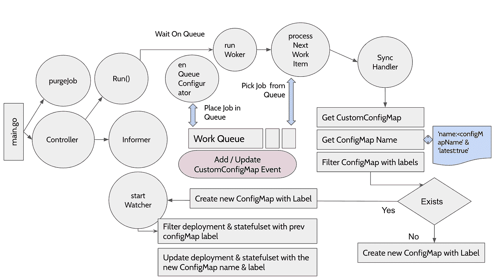

# Gopaddle Configurator:一个用于应用程序配置的 Kubernetes 原生版本系统

> 原文：<https://itnext.io/gopaddle-configurator-a-kubernetes-native-versioning-system-for-application-configuration-1e5c5481a972?source=collection_archive---------2----------------------->


照片由 [Unsplash](https://unsplash.com/s/photos/flamingos?utm_source=unsplash&utm_medium=referral&utm_content=creditCopyText) 上的[甘帕尼·库马尔](https://unsplash.com/@gkumar2175?utm_source=unsplash&utm_medium=referral&utm_content=creditCopyText)拍摄

*火烈鸟是滤食性动物，它们会把头“倒过来”吃东西。到了吃东西的时候，火烈鸟会把头倒扣在水里，喙指向脚。然后，它左右摆动头部，用舌头将水抽进和抽出它的嘴。沿着喙边缘的梳状板为水流出创造了一个过滤器，同时将食物截留在里面。(来源:*[](https://nationalzoo.si.edu/animals/news/why-are-flamingos-pink-and-other-flamingo-facts)**)**

# *配置映射和机密 API 资源*

*Kubernetes 提供 ConfigMap 和 Secret API 资源来帮助将应用程序的配置从应用程序容器中分离出来。将配置与应用分离的能力使得跨不同部署环境和云提供商移植应用变得毫不费力。ConfigMap 用于存储非机密数据，而 Secret 用于存储机密数据，如凭据和令牌。pod 可以将配置图和机密作为环境变量、命令行参数或卷中的配置文件来使用。这些资源的使用超出了存储配置数据的范围；例如，可以将外壳脚本存储在配置图中，将其安装在 initContainer 中并执行该脚本，以便在应用容器启动之前执行应用特定的 init 动作。*

# *配置映射和机密的版本控制*

*在应用程序的生命周期中，应用程序的配置数据很容易发生变化，对配置映射和机密的变化进行版本控制是一个很好的实践。版本控制有助于审计，能够顺利回滚到上一个工作版本，并通过允许检查应用程序的先前配置来帮助排除应用程序故障。然而，Kubernetes 没有为这些资源的版本控制提供一个树内解决方案。为此，我们必须使用树外解决方案。*

*任何 Kubernetes API 资源的版本控制系统都可以通过两种不同的方式实现:( I)使用合适的附加组件在 Kubernetes 集群中创建新的 API 资源实例;( ii)使用外部版本控制系统，如 Git。原则上，前一种方法使用 K8s 的 etcd 数据存储来维护版本，而后一种方法只是使用 Git 进行版本控制。在这篇博文中，我将解释 Configurator，一个开源的 Kubernetes 插件，它有助于版本控制和同步配置图和秘密。*

# *配置器概述*

**

*配置器徽标*

*Configurator 使用 CRDs 允许用户创建 **CustomConfigMaps** 和 **CustomSecrets，**，进而创建单独的 ConfigMap 和 Secret 资源，并在资源名称*后附加一个*后缀*。*当在 CustomConfigMap 或 CustomSecret 中检测到更改时，Configurator 会自动生成一个带有*新后缀*的新配置图。这相当于对配置映射和机密的版本控制。*

*为了使部署和状态集与最新版本的 ConfigMap 保持同步，用户必须首先创建一个自定义 ConfigMap。这将创建一个带有后缀的新配置映射，即初始版本。然后，用户必须在其部署和 Statefulset 规范中引用 ConfigMap 和 postfix。从此，用户可以直接更新 CustomConfigMap。CustomConfigMap 中的任何更改都将自动推广到引用初始 ConfigMap 版本的所有部署和状态集。*

# *使用配置器的好处*

*像 Configurator 这样的解决方案可以在几个不同的方面发挥作用。我在下面列出了其中的一些:*

*   ***集群内版本控制系统:**一个简单的集群内版本控制系统，用于配置映射和秘密资源，使用 Kubernetes 本身来维护版本。这在没有 Git 存储库或者集群没有足够的计算资源来运行单独的 Git 服务器(例如，边缘集群)的环境中非常有用*
*   ***自动版本化:**资源的版本化由配置器自动完成。用户只需更新/编辑原始 CustomConfigMap 资源。*
*   ***自动同步服务:** Configurator 跟踪不同版本的 CustomConfigMap，并自动将更改同步到使用 ConfigMap 的 pod。用户不需要跟踪版本，也不需要手动更新和部署部署/状态集。*
*   ***不可变的配置映射和秘密:**配置器帮助实现不可变的配置映射和秘密，因为对资源的任何修改都会导致创建资源的新版本，而先前的版本保持不变。*

# *配置器如何工作*

*Kubernetes 允许开发者通过定制资源来扩展 kubernetes api。配置器定义自定义资源种类 **CustomConfigMap** 和 **CustomSecret** 。它实现了一个定制控制器(名为配置器控制器)。用户可以使用 kubectl 命令来创建和删除 CustomConfigMap 和 CustomSecret 资源。*

**

*配置器如何工作*

*当创建新的 CustomConfigMap 或修改现有的 CustomConfigMap 时，配置器控制器使用 Informer 框架来获得通知。然后，控制器将资源排入工作队列。工作队列由多个工作线程监控(作为 Go 例程实现)。工作者的角色是监视工作队列并调用同步处理程序来处理作业。*

*对于给定的 CustomConfigMap，使用*标签选择器*获取 K8s ConfigMap 的所有现有版本。当需要创建新版本的配置图时，会创建一个带有标签`name:<configmap name>`的新配置图资源。使用特殊标签`latest:true`识别配置图的最新版本。有一个单独的监视程序，监视由配置器管理的新配置图。然后，观察器获取使用先前版本的配置图的所有部署和状态集，然后修改部署/状态集以使用新创建的配置图。此修改触发部署/状态集上的滚动更新，因此新的 pod 将开始使用新版本的配置图。*

# *立即试用配置器*

*在 Github repo([github.com/gopaddle-io/configurator](https://github.com/gopaddle-io/configurator))的部署文件夹下有用于部署最新版本配置器的 YAML 文件。您需要部署 CRDs、控制器和 RBAC 配置。*

```
*kubectl apply -f deploy/crd-customConfigMap.yaml
kubectl apply -f deploy/crd-customSecret.yaml
kubectl create ns configurator
kubectl apply -f deploy/configurator-clusterrole.yaml
kubectl apply -f deploy/configurator-clusterrolebinding.yaml
kubectl apply -f deploy/configurator-serviceaccount.yaml
kubectl apply -f deploy/configurator-deployment.yaml*
```

*验证配置器*控制器*是否创建成功。*

```
*kubectl get deployment -n configurator
NAME                                 READY   UP-TO-DATE   AVAILABLE   AGE
configurator-controller              1/1     1            1           4h38m*
```

*在集群中部署配置器后，开始创建自定义配置映射。样例 CustomConfigMaps 位于工件/示例文件夹下。创建 CustomConfigMap。这将创建一个带有后缀的 K8s 配置映射。*

```
*kubectl apply -f artifacts/exmaples/example-customConfigMap.yaml*
```

*第一次列出配置图并记下后缀。*

```
*kubectl get configmap -n test
NAME               DATA   AGE
testconfig-srseq   1      9s*
```

*这里的`srseq`是后缀。创建引用新创建的 ConfigMap 的部署。请注意，部署元数据标签必须包含最初创建的配置名称和配置后缀，例如`testconfig: srseq`。在“VolumeMounts”部分，使用配置图的完整名称，即`testconfig-srseq`*

```
*apiVersion: apps/v1
kind: Deployment
metadata:
  name: busybox-deployment
  labels:
   **testconfig: srseq**
    app: busybox
spec:
  replicas: 1
  revisionHistoryLimit: 1
  strategy:
    type: RollingUpdate
  selector:
    matchLabels:
      app: busybox
  template:
    metadata:
      labels:
        app: busybox
    spec:
      containers:
      - name: busybox
        image: busybox
        imagePullPolicy: IfNotPresent
        command: ['sh', '-c', 'echo Container 1 is Running ; sleep 3600']
        volumeMounts:
        - mountPath: /test
          name: test-config
      volumes:
      - name: test-config
        **configMap:
          name: testconfig-srseq***
```

*从现在开始，您可以直接更新 CustomConfigMap，这将创建一个带有新后缀的配置映射，并将相关部署与新创建的配置映射自动同步。同样的功能也适用于机密。*

# *结论*

*在这篇博客中，我解释了在 Kubernetes 集群中对 ConfigMap 和 Secret 资源进行版本控制的重要性，以及实现这种版本控制的两种不同方法。然后我深入研究了 Configurator，这是一个开源的插件，用于实现 Kubernetes-native 集群内解决方案，用于版本化应用程序配置。请务必访问 Github([github.com/gopaddle-io/configurator](https://github.com/gopaddle-io/configurator))中的项目库，并尝试一下。如果你碰巧知道类似的解决方案，请在评论区留言。*

*👉*我定期在 Kubernetes 和云原生技术上发微博。* *跟我上* [*推特*](https://twitter.com/senthilrch) *和* [*中*](https://medium.com/@senthilrch)*

*👉*查看*[*kube-edged*](https://github.com/senthilrch/kube-fledged)*，这是一个 kubernetes 操作器，用于直接在集群工作节点上创建和管理容器映像的缓存，因此应用程序 pods 几乎可以立即启动**