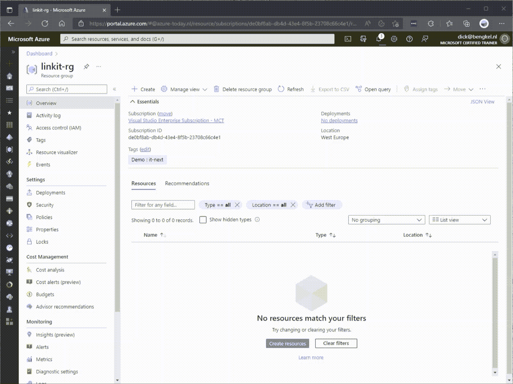
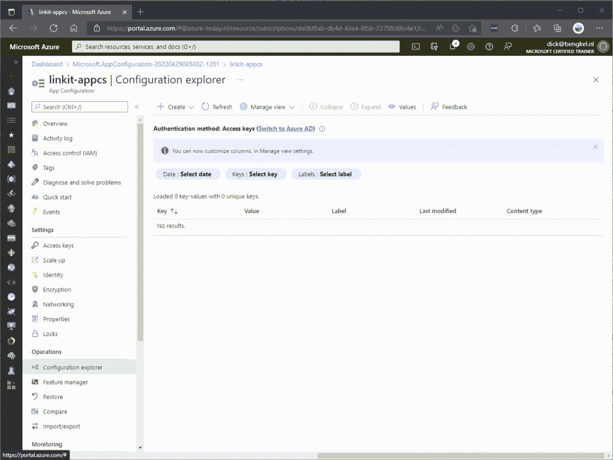
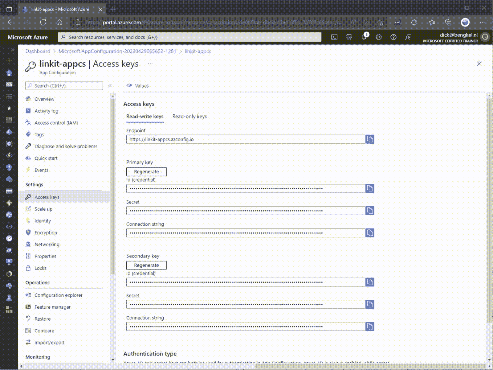
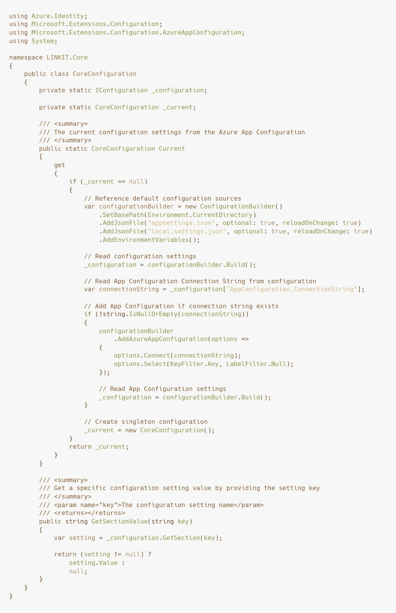
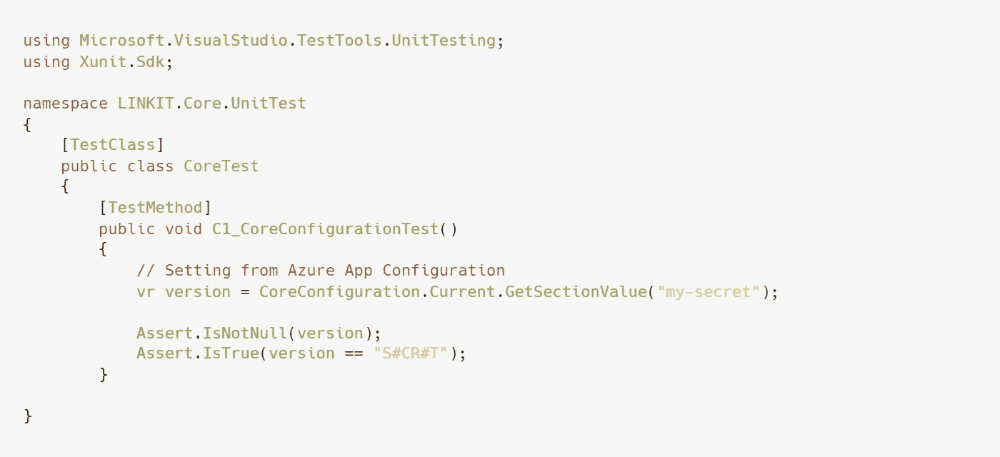
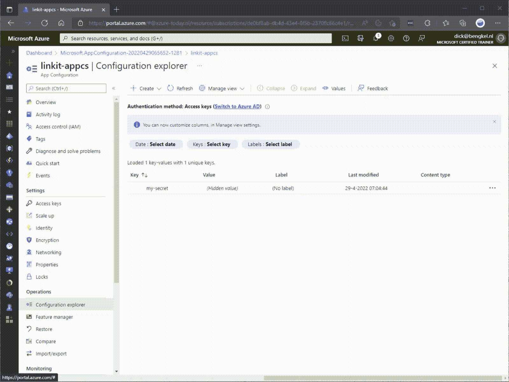
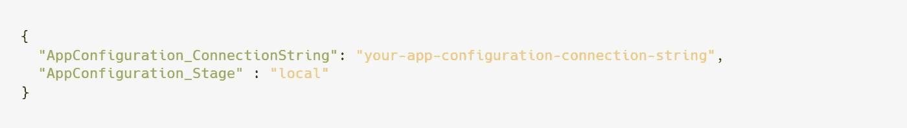
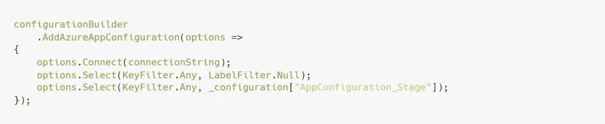
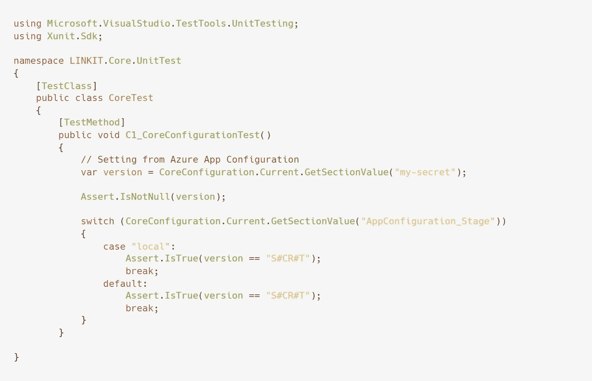

# 使用 Azure 应用配置管理和分发机密设置

> 原文：<https://itnext.io/govern-and-distribute-secret-settings-with-azure-app-configuration-96d120d12f14?source=collection_archive---------3----------------------->

管理为同一个项目工作的多个开发人员可能是一个真正的挑战。必须达成明确的协议来防止灾难的发生。有些协议是显而易见的；这些是每个开发人员都熟悉的最佳实践。

例如，项目秘密设置不存储在代码库中，这是一个不成文的规则。它们是秘密的，必须保密，因此必须小心分发。然而，为了能够开发和测试，所有开发人员都必须有正确的秘密设置。你如何管理这些秘密，控制发行并保持秘密？

**Azure App 配置**

[Azure App 配置](https://docs.microsoft.com/nl-nl/azure/azure-app-configuration/overview)在这里提供了一个解决方案。通过这项服务，您可以集中管理这些设置，并让您的开发人员可以轻松使用它们。

首先，在资源组中创建一个应用程序配置资源。

在应用配置资源的刀片中，导航到*配置浏览器*并创建一个设置。

最后，导航到刀片中的只读访问键，并复制连接字符串。

当资源准备就绪时，就是在项目中实现功能的时候了。

用于的 Azure 应用配置客户端库。网

应用程序配置的实现很容易。只需将 [NuGet 包](https://www.nuget.org/packages/Microsoft.Azure.AppConfiguration.AspNetCore)添加到您的项目中，并创建您的配置源，如下例所示，这也可以在我的 [GitHub 库](https://github.com/Bengkel/Article.AppConfiguration)中找到。

📄 *CoreConfiguration.cs*

将您从 Azure 门户复制的应用配置连接字符串添加到您的项目设置文件中，您就可以开始了！

📄 *appsettings.json*

您可以编写一个单元测试 TestMethod 来验证您的实现。在下面的示例中，我将尝试检索设置'***my-secre****T '*并检查值，该值应为'***S # CR # T****'*。

📄CoreTest.cs

当一切正常时，测试应该是成功的。

**环境**

另一个最佳实践是在不同的环境下分阶段发布您的软件。开发、测试、验收和生产的环境。很可能这些阶段之间的秘密设置会有所不同。应用程序配置允许您通过在设置中添加标签来区分不同的阶段。

首先，返回 Azure 门户，向现有设置添加一个值。这次我们将为其提供标签' **local** '，用于本地开发。

为了区分不同的环境，我们将在项目设置文件中引入一个设置来指定我们想要使用的标签。该标签指示我们想要接收秘密设置的环境。我把这个设置命名为'**app configuration*_ Stage****'*。我将赋值为' ***local*** *'。*

📝 *appsettings.json*

要检索这个标签，我们必须更改 CoreConfiguration 类，如下图所示。下面的代码将检索所有不带标签和带标签' **local** '的设置。在我们的例子中，由于顺序的原因，值' **local** ' 将是前导。

📝 *CoreConfiguration.cs*

为了验证这个功能，我们可以运行我们之前创建的单元测试。在这种情况下，UnitTest 将会失败，因为带有标签'***local****'*的值将会有不同的值。因此，我们更改代码，如下例所示。

📝 *CoreTest.cs*

**结论**

通过 Azure App Configuration，您可以控制团队中开发人员所需的所有项目机密设置。设置可以被集中管理，这使得在开发者之间分发秘密设置变得没有必要。

在我的团队中，我们通过共享密码管理器 [LastPass](https://www.lastpass.com/nl) 安全地共享应用配置连接字符串。由于这种入职和离职，开发人员很容易加入团队。

此外，部署期间的配置也得到简化，因为有了应用程序配置，我们不需要添加所有设置。

我是一个应用程序配置的粉丝，我也可能通过这个博客用我的热情激励其他开发者。