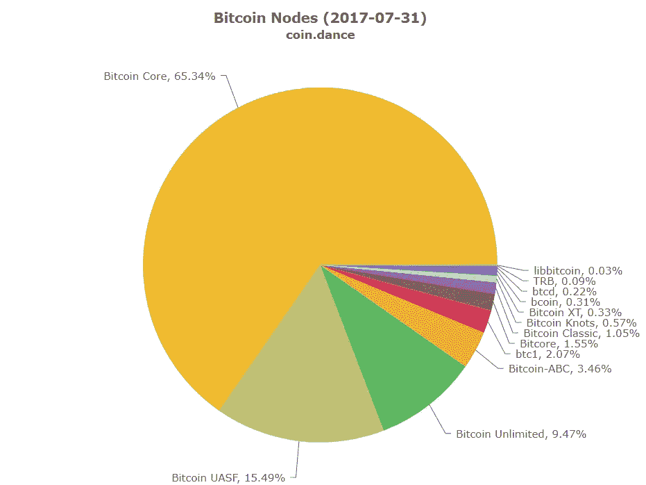
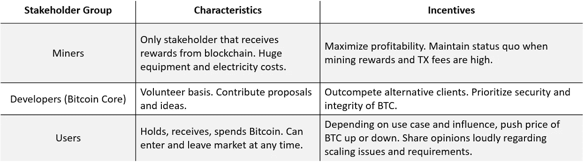

# 区块链治理第一部分:比特币实验

> 原文：<https://itnext.io/governance-in-blockchain-part-i-the-bitcoin-experiment-a8c633791e6d?source=collection_archive---------0----------------------->

图为:投资者对比特币叉子的反应

比特币引人入胜的戏剧的最新篇章发生在上周。最终，比特币社区的**努力不足以维护统一的加密货币**，导致官方一分为二:比特币(BTC)和比特币现金(BCH)。此举[很大程度上是一个惊喜](https://medium.com/@jimmysong/bitcoin-cash-what-you-need-to-know-c25df28995cf)，因为它紧随成功的比特币改进提案(BIP)之后，旨在解决短期规模问题，并被认为在很大程度上满足了社区利益相关者。

是时候揭示你认为世卫组织是最薄弱的环节了

比特币自诞生以来纷乱而有争议的历史暴露了一个缺陷(或特征！)支付系统——在最初的创建文件中忽略了清晰的治理流程。我所说的 ***治理*** 指的是协议中的**决策过程，它定义了规则是如何被同意、创建和更改的。**

从表面上看,“治理”这个词似乎有一个非常负面的含义，甚至可能与区块链技术所宣扬的去中心化的理念背道而驰。虽然我们已经听说比特币、莱特币和以太币分别与黄金、白银和石油的实物资产相比较，但我们应该记住，这些**加密货币最终是软件项目**，开发者和其他利益相关者会影响它们的方向。

在我的[关于密码经济学的文章](https://hackernoon.com/cryptoeconomics-paving-the-future-of-blockchain-technology-13b04dab971)中，我写了激励系统如何在区块链协议的设计中发挥关键作用。治理是这个主题的一个关键子集，它封装了系统在面对技术挑战、演进的用例以及意识形态差异时的适应能力。

因此，一个百万美元的问题是:我们如何在不损害区块链分散价值主张的完整性的情况下实现这种灵活性？当区块链教的前提——一套基于共识的严格规则——违背我们对进步和革命的渴望时，我们怎么能满足这些渴望呢？

目前，我们可以从比特币近十年的政治风暴、激烈辩论和竞争客户中学到很多。在这篇文章中，我将剖析并**讨论各种比特币利益主体群体**的动机和特征，重点关注他们对通过增加块大小进行扩展的态度以及他们在监管中的角色。到底[乱象是坑还是梯](https://www.youtube.com/watch?v=Naggi7ufrLc)？

# 比特币:数字世界的治理先锋

2008 年，[的神秘赞助人中本聪](http://www.newyorker.com/business/currency/we-need-to-know-who-satoshi-nakamoto-is)将比特币概念化并实现了第一个区块链，这是**分布式、无信任共识的技术**。随着这一革命性发明的出现，网络社区欢欣鼓舞，陶醉于“信任的自动化”和成功摆脱基于信任的系统的缺陷，这也许是富国银行面临的无休止的丑闻的最好例证。

然而，说比特币是一个“纯数学”解决方案，是一个不受治理约束的去中心化系统，这种说法与现实相去甚远。实际上，比特币受制于其自身的一套政治和人类行为的变化无常。简单地搜索一下比特币相关的话题，就会发现一个陷入激烈派系斗争的社区，在比特币 Twitter 人物之间有一个美味的樱桃顶广告人身攻击。

比特币生态系统中存在三个利益相关群体:**矿工、开发者和用户**。如今存在的治理“结构”进化得更加有机。通常，核心比特币客户端的开发人员会提出改进建议，其中一些会产生全新的区块链(如比特币现金、比特币无限)。然后，矿工和用户选择是否采用它们。

我将更详细地讨论这三个群体的观点。

# **矿工**

矿工执行比特币系统的跑腿工作，通过工作证明(PoW)协议将交易记录添加到区块链。在这种**“一个 cpu，一张选票”****的模式中，具有更大处理能力或散列率的**矿工更有可能成功发布区块并增加其链的可信度。****

如果绝大多数矿工不承认一个连锁店是合法的，并拒绝张贴交易，用户也可能拒绝它。事实上，大型矿池中矿工合并的趋势实际上赋予了某些人物，如[吴](http://www.investopedia.com/news/who-jihan-wu-and-does-he-basically-control-bitcoin-today/) (AntPool)，在比特币社区中的巨大影响力。

韩吉吴，的联合创始人，保持他的皮条客手强。[来源](https://cointelegraph.com/news/bitpays-partnership-with-jihan-wus-bitmain-blasted-by-critics)

比特币的采矿社区呈现了一个迷人的原始汤，里面有内部和外部的利益竞争。拥有设备仓库的大型“工业级”矿业公司与较小的矿商存在利益冲突，而作为一个整体，矿商的**目标可能与用户的需求或开发商的愿景相冲突。**

同样不足为奇的是，矿商将推动治理行动，保护他们的激励措施和设备的巨额固定成本。通过 PoW 协议，矿工寻求最大化他们找到并发布下一个区块的机会，以获得区块奖励以及该区块的总交易费。

总体而言，大型矿商试图通过纯粹的实力压倒规模较小的竞争对手，从而主导区块发现。事实上，比特币挖矿业务已经扩大到采用专用集成电路 **(ASIC)芯片**的程度，利用比特币设计疏忽将挖矿速度提高了 30%。这非常有利于大规模的挖掘，并使仅仅作为 CPU 或 GPU 矿工的参与在很大程度上无利可图。

矿商们还小心翼翼地研究比特币的改进方案可能会对交易费用产生怎样的影响。你可能知道，比特币社区一直在努力寻找正确的前进道路，以加快该服务的交易速度。在过去的几个月里，两个短期的扩展解决方案占据了新闻的主流: **SegWit** 和**块大小增加** (SegWit2x 是两者的结合)。两者都允许更快的事务处理时间，但两者的机制却有天壤之别。

## ***【隔离见证】***

SegWit 致力于通过消除所谓的事务可伸缩性来提高 PoW 系统的效率，同时更好地利用每个块中的空间。换句话说，该解决方案通过从每个事务中分离出某些数据，允许稍微多一些的事务被塞进每个 1MB 的块中。鉴于最近在必要的大多数比特币节点中发出的积极信号，在撰写本文时，SegWit 实际上将于本周被激活。

采矿社区的许多直言不讳的成员将 SegWit 视为一个简单问题的相对复杂的解决方案，该问题可以通过增加区块大小来解决。此外，他们认为，这款软件并不像开发者声称的那样经过充分测试，而且由于它无法还原，可能会对比特币的未来产生不可预见的后果。同样不值一提的是，SegWit 还使得 [ASIC 挖掘不兼容](https://bitcoinmagazine.com/articles/mining-manufacturer-blocking-segwit-benefit-asicboost/)。

因此，尽管对用户有好处，并且得到了开发者社区的广泛鼓励，但正是由于这些原因，许多采矿者试图将这一特定提议的实施推迟如此之久。

## 块大小增加

关于 ***数据块大小的争论*** 围绕着通过增加每个数据块的大小(目前上限为 1MB)来加快事务处理速度，其中也有细微差别。虽然较大的数据块相当于更多的过账交易，因此交易费用也更高，但较大的数据块大小需要更多的处理能力。

在大块大小时，这有效地排挤了许多较小的矿商，并进一步导致比特币走上权力分散的道路。何时增加以及增加多少的问题导致了社区中的戏剧性行动，从 11 月提议的 2MB hardfork 到最近创造比特币现金的 fork，容纳 8MB 块。

比特币社区中那些相信“**比特币是矿工的”**的人认为，矿权的集中化是一个积极因素。一种思路是，保留对矿商的激励制度至关重要，随着比特币发行量的逐渐下降，交易费可能必然需要保持在高位。由于矿商是整个系统的“主力”，他们必然应该在比特币的治理中发挥更大的作用，并对比特币的未来拥有更大的决策权。

# 开发商

开发者“种姓”肩负着比特币大量的意识形态负担。应该理解的是，比特币系统是一种协议，或一套规则，规定网络中的计算机如何相互通信。任何人都可以编写遵循该协议的软件，并且由用户来选择他们想要使用的软件实现。

这样，我们可以把**开发者想成顾问或者咨询师**；他们为比特币提出了一个具体的愿景或方向，而矿工和用户则选择是否采用它(例如，在比特币上采矿或交易或比特币现金)。

几本书或一个可笑的埃及长卷可能会写下关于比特币应该是什么样的 T2 的开发者意见。如果你对比特币世界相对陌生，我意识到它可能会很快与许多不同的实现混淆，如比特币核心、比特币经典、比特币现金、比特币无限、比特币 XT 和比特币 ABC。不要惊慌。

出于本文的目的，我将重点关注比特币核心以及导致这些替代实现的意识形态差异

## 比特币核心

标准比特币(BTC)，最大的实现，由比特币核心参考客户端背后的开发者维护。这就是你在新闻中听到的比特币。正如你在下面的图表中看到的，**比特币核心是迄今为止最受欢迎的实现**，而它的许多竞争对手表现出不同思想领导和哲学的复杂网络，这些思想领导和哲学涉及如何管理比特币以及如何改进协议。

[比特币节点实现](https://coin.dance/nodes/share)(2017 年 7 月)。自本文撰写以来，比特币现金节点尚未更新。

比特币核心是由比特币的创造者中本聪从比特币的最初实现演变而来，由一群志愿开发者维护。通过**比特币改进提案(BIPs)** ，这些开发者通过**广泛的同行评审**达成普遍共识，确定对现有协议的修改。

比特币核心开发者倾向于**规避风险**，高度重视比特币的安全性和完整性，代价是增加用户的可访问性和网络速度。为此，他们**出于各种技术和政治原因，抵制大幅增加区块大小限制**，包括[硬分叉](http://www.investopedia.com/terms/h/hard-fork.asp)(分裂成新的区块链，迫使所有用户更新)，这是一个短期解决方案，不能长期解决规模问题，以及对我上面讨论的采矿分散化的损害。

**硬分叉通常被认为是非常危险的**，因为它不仅会对比特币的市场份额产生不可估量的后果，还会影响其“数字稀缺性”的价值主张。大多数人会接受这个 2MB 硬分叉的孤注一掷的假设非常令人担忧，因为缺乏广泛的共识将基本上导致 BTC 2100 万硬币上限的翻倍，并导致进一步的品牌混乱。

想想过去几天由**比特币现金硬分叉**带来的情绪和金融大起大落，市场仍在忙于消化它。11 月的硬分叉不可否认是比特币核心的下一个重大考验，当然也不会是最后一次。

历史上，核心开发者只推广 SegWit，因为它是一个对所有用户“向后兼容”的软分叉提议。虽然 SegWit2x，一种将 SegWit 激活与块大小增加到 2MB 相结合的折衷方案，将于 11 月推出，但最近的强烈抗议预示着在开发者之间正在进行的内战中[另一场即将到来的战斗](https://news.bitcoin.com/segwit2x-and-the-tale-of-three-bitcoins/)。

## 持异议的开发商

社区中的许多开发人员对比特币核心团队的决策和提高交易速度的保守方法提出了质疑。特别是，**支持增加块大小的人认为他们忠于比特币的原始精神**和[对 SegWit](https://medium.com/@ViaBTC/why-we-dont-support-segwit-91d44475cc18) 不屑一顾，引用下面中本聪的话作为证明。

> "最终的解决方案将是不管它变得多大."— [中本聪](https://bitcointalk.org/index.php?topic=287.msg8810#msg8810)

这种确定区块大小限制的血腥斗争，加上缺乏清晰的治理模型，导致许多开发团队另辟蹊径。我们将快速浏览一下过去几年比特币的历史。

## 比特币 XT

增加块大小的想法始于 2015 年 8 月的[比特币 XT](http://www.investopedia.com/terms/b/bitcoin-xt.asp) 硬分叉，它提出了**将块大小从 1MB 增加到 8MB 的八倍，并每两年翻一番**。这一非常激进的增长从未获得过超过 10%的机构群体支持。

## 比特币经典

比特币经典可以被视为其继任者，2016 年提出了 **2MB 的块大小提案**，但它也未能实现任何有意义的进展，此后一直处于稳步下降的状态。值得注意的是，比特币经典试图通过 [consider.it](https://bitcoinclassic.consider.it/) 建立一个更加民主的治理模式。

## 比特币无限

这两个实验导致了**比特币无限(BTU)** 的诞生，它将区块大小扩展解决方案和治理变革提升到了一个新的水平。BTU 取消了硬编码的 1MB 块大小限制，并且**允许矿工通过“紧急共识”算法**来设置他们自己的块大小，这实质上意味着他们将在最长的链上挖掘块大小。人们的想法是，理想的区块规模或平衡最终将通过这种共识达成。

在备受争议的天使投资人 Roger Ver 和超级矿工 Wu 的支持下，BTU 最引人注目的提议是治理。许多 BTU 的支持者怀疑大型区块链科技公司的影响力，如资助比特币核心开发的 [Blockstream](https://www.blockstream.com/) 。[虽然这种不信任可能不被认可](http://While this may not be warranted)，但比特币无限非常重视将决策权从围绕比特币核心的核心开发者群体手中转移出去。通过他们的[联盟条款](https://www.bitcoinunlimited.info/resources/BUarticles.pdf)，BTU 概述了一个**治理流程，通过该流程** **所有通过公众投票进入社区的成员可以提议、讨论和投票支持具体的改进提案。**

正如上面的节点实现图所示，由于其块大小提议和小型开发社区，比特币无限取得的成功非常有限。尽管如此，它仍然值得注意，因为它是迄今为止唯一一个有点主流的比特币实现，深入关注治理流程和问题。

## 比特币现金

比特币核心开发社区对块大小增加缺乏进展的沮丧情绪在过去一周随着**比特币现金(BCH)** 的出现达到了顶点。

BCH 开发者优先考虑比特币作为用户交易货币和支付服务的效用，而不是保守的价值储存。为此，他们已经将块大小增加到 8MB，并计划按照比特币 XT 的精神自动增加块大小。没有进行重大的治理变革。

总的来说，多方面的冲突和意识形态在开发人员的白板上得到了体现。在在线论坛和代码行的巨大混乱中，开发人员努力描绘出每个人认为比特币的最佳路线和用例。除了不同开发者派系的竞争和游说之外，没有任何被广泛接受的治理体系，比特币的创造性破坏和分化可能会继续下去。

# 用户

虽然矿工编纂比特币历史，开发者实施变革，但这两个群体的**影响力都受到用户决定接受哪个比特币实施的影响**(当然，开发者和矿工本身也是用户的子集)。如果大多数用户不相信链的完整性，并拒绝承认或在其上交易，链的价值将稳步下降，其定义协议集将简单地变得模糊不清。

同样值得注意的是，比特币用户的不同用例对改进建议有着重大影响。自由主义者和投资者将比特币视为**安全可靠的财富储存库**，他们的反应将与消费者不同，消费者更喜欢像 Venmo 或 Paypal 一样易于使用的**便捷交易货币**。更不同的是，生活在威权国家的公民受到围攻和迫害，他们正在寻找安全的途径转移资金或进行国际支付。

委内瑞拉玻利瓦尔危机和比特币如何迎接挑战。

除了一些有限的治理实验，用户用他们的钱包投票，通过买卖他们的比特币来影响市场价格(除了市场操纵)。这样一来，开发商和矿商理论上就有了不小心“捣乱”的既得利益，因为公众对比特币的不良接受只会对价格和采用产生负面影响。然而，在实践中，孤立的三方比特币社区从未回避以壮观和滑稽的方式公开其不可告人的秘密。

# 按计划工作？

比特币及其竞争对手的实现方式的现状在很大程度上可以归结为一种混乱的平衡行为。**矿商寻求从交易费用和高效开采中获取最大价值**。**用户希望满足自己的使用需求**，并从每一次比特币实现的涨跌中获利。**开发人员承担着费力不讨好的任务，即开发解决方案**,在忠于他们自己的意识形态的同时协调这些利益。

类似于黑暗时代的封建景观，比特币的治理真空导致许多来自比特币核心的持不同意见的开发者只是提出意识形态的改进和“启动看看”。在大张旗鼓的宣传和 Twitter 的戏剧性事件中，比特币的利益相关者竞相发出自己的声音，并努力获得更大的影响力。

然而，比特币社区的一些成员会辩称，围绕治理的**有限准则是一种功能和保障。**

> 政治是激烈的，比特币治理在某些方面就像政府，而将该软件分叉的提议有点像宪法修正案。但我越来越习惯于将**比特币监管视为一种市场现象。**
> 
> 具体来说，拥有不同愿景的团体正在竞相赢得比特币矿工和节点的青睐，以便他们的愿景如果获胜，可以推动比特币项目向前发展。— [吉姆·哈珀，卡托研究所](https://www.coindesk.com/bitcoin-governance-as-competition/)

然而，这种有限的治理模式，尽管是去中心化的，能否解决安全性、可扩展性和速度之间的必要平衡，从而解决比特币的无数用例？比特币是否应该简单地优先考虑一些而不是另一些？我们有多确定一个清晰的、可接受的解决方案会上升到顶端，并且**比特币社区不会继续分裂和派系化，每个新想法都会产生一个单独的实现？**

总体而言，关于比特币治理的主要观点是，比特币真的没有那么多。当整个系统诞生于一个天才的、未经证实的概念时，怎么可能会出现这种情况呢？这个概念在一份九页的白皮书[中进行了描述，这份白皮书](https://bitcoin.org/bitcoin.pdf)理所当然地更关心它的初始实现，而不是它未来十年或一个世纪的可扩展性。

最终，无论比特币整体走向何方，比特币的核心系统在一个透明的、表面上由共识驱动的、刻薄的社区背后坚持了近十年，这是一个巨大的成就。

比特币实验及其高度政治化的发展环境让很多人看清了什么可行，什么不可行。在本系列的第二部分，我将讨论区块链治理中的一些关键问题，以及其他一些加密货币(尤其是以太币)是如何解决这些问题的。