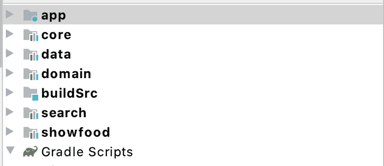

# 梯度模块:仅在受影响的模块中运行单元测试

> 原文：<https://itnext.io/gradle-modules-running-unit-tests-only-in-affected-modules-fff89562339e?source=collection_archive---------4----------------------->


# 1 —简介

你好。

多模块项目在 Android 世界越来越受欢迎，特别是在 2019 年谷歌 IO 之后，谷歌引入了这一想法，并展示了它的好处。

尽管模块变得越来越流行，但是在工具中仍然有很多事情要做，需要分析和处理。很难找到工具来分析模块之间的代码分布有多好，然后如何使编译更快，可视化模块之间的依赖关系，并寻找可能的优化。

因此，在这篇文章中，我想教你如何制作一个有趣的项目，以帮助你分析你的模块化 Gradle 项目(重要的是，它适用于任何 Gradle 项目，这根本不仅限于 android)。目标是:

1-按分支打印受影响的模块。

2-仅在受影响的模块中运行单元测试。

3-在受影响的模块中运行 UI 测试。(这将出现在以后的文章中)

4-可视化依赖关系图，并研究它们之间的关系。(这也会出现在以后的文章中)

这可以帮助你和你的团队避免在没有被 PR 改变的模块上运行单元测试，并且加速你的 CI，理解模块如何相互作用，以及这个图此刻有多复杂。介绍完了，让我们找点乐子吧！

# 2 —查找受影响的模块

针对这个问题，我创建了一个 Gradle 插件，你可以使用并打印你的模块的邻接表(对了，如果你不知道什么是邻接表:是不是一种表示图的方式，你可以搜索一下，会有很多引用)。你可以在这里找到这个插件的文档和代码:[https://github.com/leandroBorgesFerreira/dag-command](https://github.com/leandroBorgesFerreira/dag-command)。它是根据 [**佩德罗罗德里格斯**](https://github.com/hpedrorodrigues) **的惊人之作改编而成。**

假设我们有一个模块化的应用程序，就像这样:



图 1 —模块应用示例。

可以看看这里的小项目:[https://github.com/leandroBorgesFerreira/FoodList](https://github.com/leandroBorgesFerreira/FoodList)

因此，6 个模块和它们彼此之间有一些依赖关系，我们将在本文后面理解它们是如何相互依赖的。

您可以通过这种方式添加库。项目级 Gradle 文件中的库。

**build.gradle.kts(科特林版本):**

该版本可能已过时！

**build.gradle (Groovy 版本):**

该版本可能已过时！

然后你可以在**核心**模块中做一个小的改变(只改变代码的任何一行，比如添加一个注释),我运行插件:

```
./gradlew dag-command
```

你可以去文件夹**。/build/dag-command/** 你会看到一些文件。在那里你会找到 **adjacencies-list.json.** 这个文件包含了你的应用程序的模块依赖图的信息。在图像 1 的例子中，这是我得到的输出:

```
{“app”:[],”core”:[“showfood”],”data”:[“app”,”showfood”],”domain”:[“data”,”showfood”],”search”:[“showfood”],”showfood”:[“app”]}
```

可以格式化为:

```
{
  "app": [],
  "core": [
    "showfood"
  ],
  "data": [
    "app",
    "showfood"
  ],
  "domain": [
    "data",
    "showfood"
  ],
  "search": [
    "showfood"
  ],
  "showfood": [
    "app"
  ]
}
```

您可以通过查看文件 **affected-modules.json** 来查看受影响的模块。这是我的输出:

```
["app","core","showfood"]
```

你可以看一下邻接表得出结论:改变**核心**会影响 **app、showfood** 和**核心**因为依赖关系是**核心**->**show food**->**app**。

好的。所以我们成功了！现在我们知道如何通过我们的 PR 创建受影响的模块了！但是…那不是很有用…对吧？我们需要使用这些信息来创造更多的东西，比如加速我们的测试或者分析我们的模块是如何连接的(后者将在另一篇文章中介绍，抱歉=P)。这就把我们带到了文章的下一部分。

# 3-仅对更改的模块运行单元测试

我们现在需要做的是创建一个命令，该命令将只为被当前分支改变的模块运行单元测试。

我使用 Python 进行日常自动化，但是您可以使用任何您喜欢的语言。您可以毫不费力地将受影响的模块解析为一个简单的命令:

想用什么都可以，包括这个=P

这个代码片段将产生这个 Gradle 命令:

```
./gradlew core:testDebug showfood:testDebug app:testDebug
```

所以模块**数据、** **域**和**搜索**没有被测试，因为我们的改变没有影响到它们，所以在这些模块上运行单元测试只是浪费时间。

# 4 —我希望你喜欢它=]

现在你可以在你的 CI 上享受一些额外的时间。也许你可以多喝一杯咖啡，和你的同事聊聊天，读一本书的一小部分…你能想到的！

如果这篇文章和库在某种程度上帮助了你(或者如果你认为这是一篇有趣的文章),请记得点击鼓掌按钮，在 Github 上给我一个小星星。那很有帮助！

谢谢！