# Grafana 实验室:Loki——分布式系统、标签和过滤器

> 原文：<https://itnext.io/grafana-labs-loki-distributed-system-labels-and-filters-82458e77936b?source=collection_archive---------3----------------------->


上一篇帖子— [Grafana Labs: Loki —日志收集和监控系统](https://rtfm.co.ua/en/grafana-labs-loki-logs-collector-and-monitoring-system/)。

Loki、`promtail`和 Grafana 在同一台主机上配置在一个 Docker 合成堆栈中。

现在我想尝试一些分布式设置:

1.  Grafana 将在一台主机上工作
2.  **洛基**——另一个
3.  **提示** —将从第三个服务器收集日志

接下来的想法是:

*   我们有一个有 2 台服务器的*开发*环境
*   我们与 Grafana、Prometheus 等有专门的监控堆栈

在*开发*环境中，我们将运行我们的`promtail`代理，它将收集数据并`PUSH`到 Loki。

Grafana 将使用 Loki 作为其数据源，在仪表板上显示日志。

一般来说，接下来会是这样的(这个方案是使用[https://cloudcraft.co](https://cloudcraft.co)制定的):

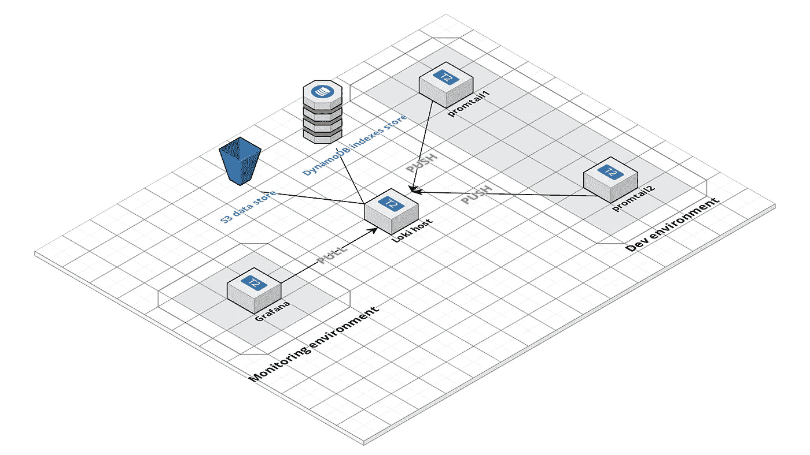

在下一篇文章中，我们将配置 Loki 使用 ASW DynamoDB 和 AWS S3 桶来存储数据和索引。

## 准备主机

让我们启动三台服务器:

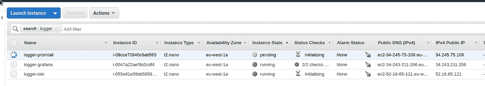

并创建三个要使用的域:

11 promtail.setevoy.org.ua

12 loki.setevoy.org.ua

13 grafana.setevoy.org.ua

## Promtail

从`promtail`开始。

我们希望收集 NGINX 日志，然后将它们推送到 Loki 实例。

创建`promtail-conf.yml`文件:

```
server:

  http_listen_port: 9080
  grpc_listen_port: 0

positions:

  filename: /tmp/positions.yaml

client:

  url: [http://loki.setevoy.org.ua:3100/api/prom/push](http://loki.setevoy.org.ua:3100/api/prom/push)

scrape_configs:

  - job_name: system
    entry_parser: raw
    static_configs:
    - targets:
        - localhost
      labels:
        job: varlogs
        __path__: /var/log/*log

  - job_name: nginx
    entry_parser: raw
    static_configs:
    - targets:
        - localhost
      labels:
        job: nginx
        __path__: /var/log/nginx/*log
```

创建一个合成文件来运行`promtail`的容器- `promtail-compose.yml`:

```
version: "3"

services:

  promtail:
    image: grafana/promtail:master
    volumes:
      - /home/admin/promtail-conf.yml:/etc/promtail/docker-config.yaml
      - /var/log:/var/log
    command: -config.file=/etc/promtail/docker-config.yaml
```

运行它:

```
root@ip-172–31–32–175:/home/admin# docker-compose -f promtail-compose.yml up -d
```

检查它是否工作:

```
root@ip-172–31–32–175:/home/admin# curl -s localhost:9080/metrics | head -5
#HELP go_gc_duration_seconds A summary of the GC invocation durations.
#TYPE go_gc_duration_seconds summary
go_gc_duration_seconds{quantile=”0.0"} 3.6174e-05
go_gc_duration_seconds{quantile=”0.25"} 3.6174e-05
go_gc_duration_seconds{quantile=”0.5"} 4.6829e-05
```

## 洛基

现在去洛基的主机那里。

在此创建一个新的 Loki 配置- `loki-conf.yml`:

```
auth_enabled: false

server:
  http_listen_port: 3100

ingester:
  lifecycler:
    address: 0.0.0.0
    ring:
      store: inmemory
      replication_factor: 1
  chunk_idle_period: 15m

schema_config:
  configs:
  - from: 0
    store: boltdb
    object_store: filesystem
    schema: v9
    index:
      prefix: index_
      period: 168h

storage_config:
  boltdb:
    directory: /tmp/loki/index

  filesystem:
    directory: /tmp/loki/chunks

limits_config:
  enforce_metric_name: false
```

在*地址:0.0.0.0* 中，我们设置监听所有可用的接口，因为我们想通过互联网访问它。

创建一个合成文件— `loki-compose.yml`:

```
version: "3"

services:
  loki:
    image: grafana/loki:master
    volumes:
      - /home/admin/loki-conf.yml:/etc/loki/local-config.yaml
    ports:
      - "3100:3100"
    command: -config.file=/etc/loki/local-config.yaml
```

运行它:

```
root@ip-172–31–38–97:/home/admin# docker-compose -f loki-compose.yml up -d
Starting admin_loki_1 … done
```

检查:

```
root@ip-172–31–38–97:/home/admin# curl -s localhost:3100/metrics | head -5
#HELP cortex_cache_corrupt_chunks_total Total count of corrupt chunks found in cache.
#TYPE cortex_cache_corrupt_chunks_total counter
cortex_cache_corrupt_chunks_total 0.0
#HELP cortex_chunk_store_chunks_per_query Distribution of #chunks per query.
#TYPE cortex_chunk_store_chunks_per_query histogram
```

很好。

现在让我们试着从*提示符*连接——主机:

```
root@ip-172–31–32–175:/home/admin# curl -s loki.setevoy.org.ua:3100/metrics | head -5
#HELP cortex_cache_corrupt_chunks_total Total count of corrupt chunks found in cache.
#TYPE cortex_cache_corrupt_chunks_total counter
cortex_cache_corrupt_chunks_total 0.0
#HELP cortex_chunk_store_chunks_per_query Distribution of #chunks per query.
#TYPE cortex_chunk_store_chunks_per_query histogram
```

目前为止一切顺利。

## 格拉夫纳

在 Grafana 的主机上创建一个合成文件来运行 Grafana 容器— `grafana-compose.yml`:

```
version: "3"

services:
  grafana:
    image: grafana/grafana:master
    ports:
      - "3000:3000"
```

运行它:

```
root@ip-172–31–43–174:/opt/loki# docker-compose -f grafana-compose.yml up -d
```

检查 UI—[*http://grafana.setevoy.org.ua:3000*:](http://grafana.setevoy.org.ua:3000:)

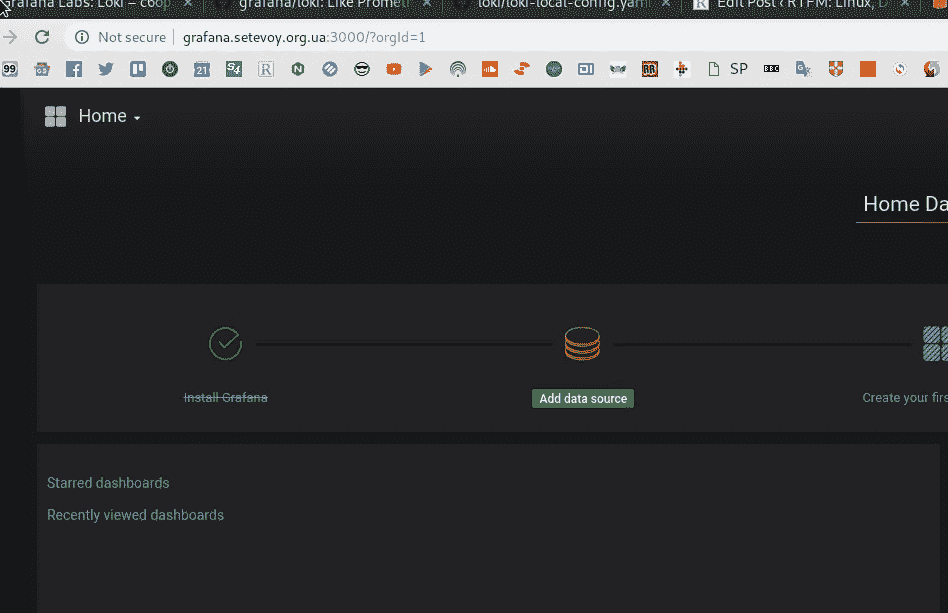

配置 Loki 数据源:

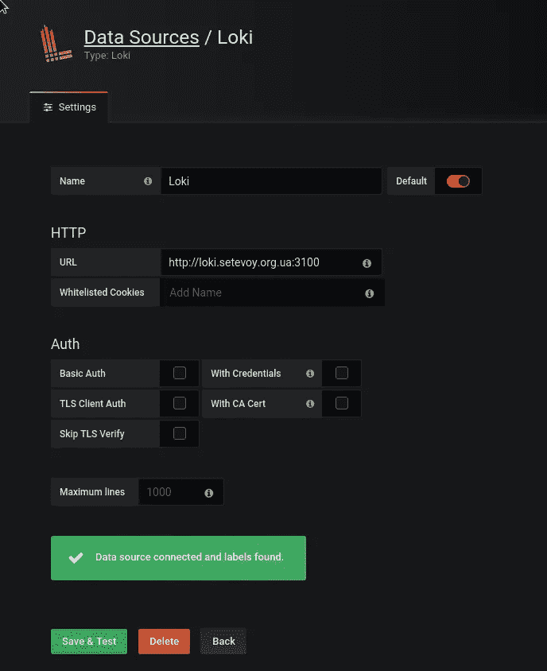

呃…

我的日志在哪里？

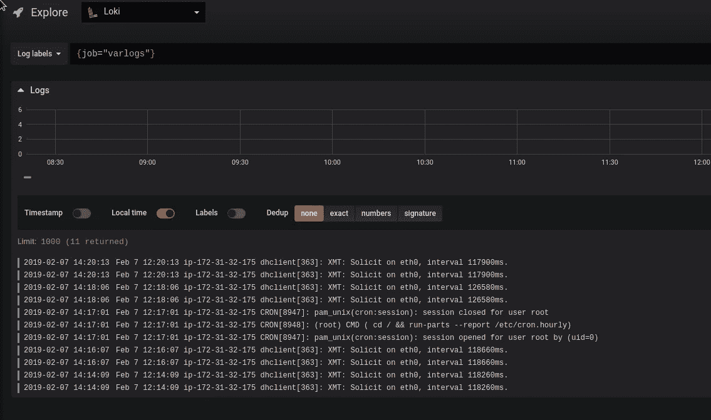

而且这里没有 *nginx* 组…

让我们检查一下`promtail`的日志:

```
root@ip-172–31–32–175:/home/admin# docker logs -f admin_promtail_1
…
l=error ts=2019–02–07T12:13:23.938327315Z caller=client.go:129 msg=”error sending batch” error=”Post [http://loki.setevoy.org.ua:3100/api/prom/push:](http://loki.setevoy.org.ua:3100/api/prom/push:) dial tcp 52.16.65.121:3100: connect: connection refused”
level=error ts=2019–02–07T12:13:24.946257437Z caller=client.go:129 msg=”error sending batch” error=”Post [http://loki.setevoy.org.ua:3100/api/prom/push:](http://loki.setevoy.org.ua:3100/api/prom/push:) dial tcp 52.16.65.121:3100: connect: connection refused”
```

为什么？

重启`promtail`的容器:

```
root@ip-172–31–32–175:/home/admin# docker-compose -f promtail-compose.yml restart
```

几分钟后，我们现在有了格拉夫纳的数据:


## 标签

好的——现在一切正常，但我们将有一堆具有不同主机名的 *Dev* 服务器，我们希望能够从不同的主机选择 Grafana 中的数据，因此——需要为每个主机添加额外的标签。

让我们添加一个新的主机，在那里有`promtail`，类似于第一个:

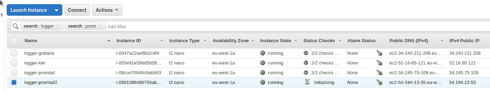

在那里创建一个类似的`promtail2-conf.yml`配置:

```
server:

  http_listen_port: 9080
  grpc_listen_port: 0

positions:

  filename: /tmp/positions.yaml

client:

  url: [http://loki.setevoy.org.ua:3100/api/prom/push](http://loki.setevoy.org.ua:3100/api/prom/push)

scrape_configs:

  - job_name: system
    entry_parser: raw
    static_configs:
    - targets:
        - localhost
      labels:
        job: varlogs
        __path__: /var/log/*log

  - job_name: nginx
    entry_parser: raw
    static_configs:
    - targets:
        - localhost
      labels:
        job: nginx
        host: promtail2
        __path__: /var/log/nginx/*log
```

这里唯一的区别是*主机:promtail2* 标签。

在第一个 Dev 的主机上添加带有 *promtail1* 值的相同的`job`标签:

```
...
      labels:
        job: nginx
        host: promtail1
        __path__: /var/log/nginx/*log
...
```

首先，我想使用`external_labels`通过`global`部分添加它，因为我现在已经在我的普罗米修斯生产设置上安装了它:

```
global:

  scrape_interval:     15s
  external_labels:
    monitor: 'monitoring-production'

...
```

但是洛基的`global`没有这样的选项:

> 正在创建 admin_promtail_1 … done
> 附加到 admin _ prom tail _ 1
> prom tail _ 1 | level = error ts = 2019–02–07t 13:32:36.436335841 z caller = main . go:36 msg = " error loading config " filename =/etc/prom tail/docker-config . YAML err = " YAML:unmarshal 错误:\n 第 1 行:在类型 api 中未找到字段全局。配置"

由于文档没有关于可用选项的信息——让我们检查 Loki 的[来源](https://github.com/grafana/loki/blob/master/pkg/promtail/api/config.go#L20):

```
...

type Config struct {
  ServerConfig    server.Config    `yaml:"server,omitempty"`
  ClientConfig    client.Config    `yaml:"client,omitempty"`
  PositionsConfig positions.Config `yaml:"positions,omitempty"`
  ScrapeConfig    []ScrapeConfig   `yaml:"scrape_configs,omitempty"`
}

...

type ScrapeConfig struct {
  JobName                string                           `yaml:"job_name,omitempty"`
  EntryParser            EntryParser                      `yaml:"entry_parser"`
  RelabelConfigs         []*relabel.Config                `yaml:"relabel_configs,omitempty"`
  ServiceDiscoveryConfig sd_config.ServiceDiscoveryConfig `yaml:",inline"`
}

...
```

有两个描述可用字段的结构——general 和`scrape_configs`。

在*提示符 2* 主机上创建合成文件:

```
version: "3"

services:

  promtail:
    image: grafana/promtail:master
    volumes:
      - /home/admin/promtail2-conf.yml:/etc/promtail/docker-config.yaml
      - /var/log:/var/log
    command: -config.file=/etc/promtail/docker-config.yaml
    ports:
      - "9080:9080"
```

这也和我们的第一个相似，只是映射到容器的文件是`/home/admin/promtail2-conf.yml`而不是`/home/admin/promtail-conf.yml`。

在第一台主机上重新启动容器:

```
root@ip-172–31–32–175:/home/admin# docker-compose -f promtail-compose.yml restart
```

从第二个开始:

```
root@ip-172–31–44–176:/home/admin# docker-compose -f promtail-compose.yml up -d
```

并在其输出中得到错误— *“守望者。添加:没有这样的文件或目录"*:

> prom tail _ 1 | level = info ts = 2019–02–07t 13:55:05.004415129 z caller = file target manager . go:165 msg = " Adding target " key = " { job = \ " var logs \ " } "
> prom tail _ 1 | level = info ts = 2019–02–07t 13:55:05.004815207 z caller = file target manager . go:165 msg = "正在添加目标添加:没有这样的文件或目录"

但是第一个问题很棘手:

> level = info ts = 2019–02–07t 13:43:52.153207236 z caller = file target manager . go:165 msg = " Adding target " key = " { job = \ " varlogs \ " } "
> level = info ts = 2019–02–07t 13:43:52.153657621 z caller = file target manager . go:165 msg = " Adding target " key = " { host = \ " prom tail 1

WTF？

嗯…

我在这里安装了 NGINX 吗？

```
root@ip-172–31–44–176:/home/admin# dpkg -l | grep nginx
```

嗯——没有……:-)

```
root@ip-172–31–44–176:/home/admin# ls -l /var/log/nginx
ls: cannot access ‘/var/log/nginx’: No such file or directory
```

现在“*没有这样的文件或目录*”的错误就清楚了。

安装 NGINX 并重启`promtail`:

```
root@ip-172–31–44–176:/home/admin# apt -y install nginx
```

现在检查其输出:

> prom tail _ 1 | level = info ts = 2019–02–07t 13:59:54.422710535 z caller = file target manager . go:165 msg = " Adding target " key = " { job = \ " varlogs \ " } "
> prom tail _ 1 | level = info ts = 2019–02–07t 13:59:54.423260616 z caller = file target manager . go:165 msg = " Adding target "

很好。

去格拉夫纳:

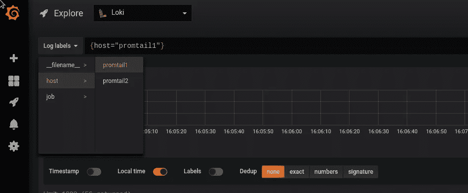

我们从两个主持人那里得到了两个标签。

## 洛基的查询过滤器示例

今天的最后一件事——我们如何在 Grafana 中搜索和过滤结果的几个例子。

此处的文档可用[>>>](http://docs.grafana.org/features/explore/#search-expression)。

让我们从另一台主机向 NGINX 实例发出一些 URL 请求，以便在日志中记录一些内容:

```
16:24:39 [setevoy@venti ~] $ curl [http://54.194.13.55/someuri](http://54.194.13.55/someuri)
```

现在使用 *job == nginx* 和 *host == promtail2* 进行搜索:

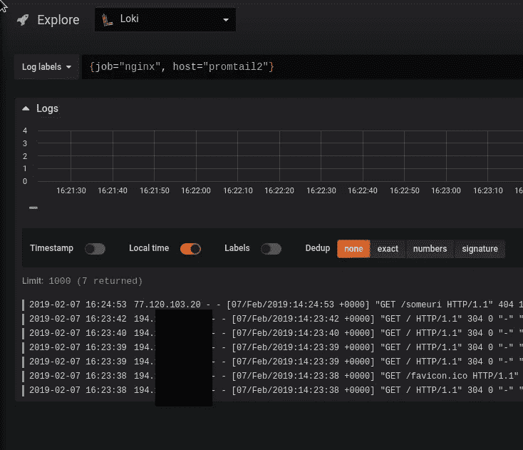

您也可以仅通过*77.120.103.20*IP 过滤结果:

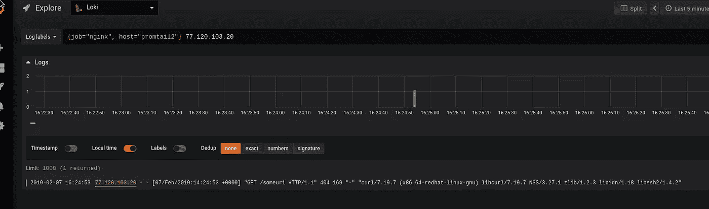

或者使用正则表达式:

`{job="nginx", host="promtail2"} 77.120.[\d\.]`

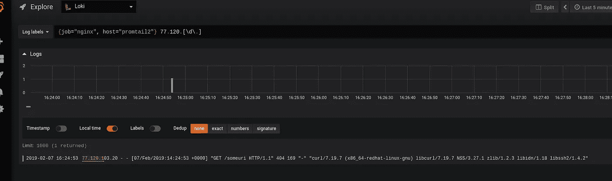

或者用 77.120 中的“ *IP。[\d\]掩码，或者如果请求中有 someuri 单词*:

`{job="nginx", host="promtail2"} (77.120.[\d\.]|someuri)`

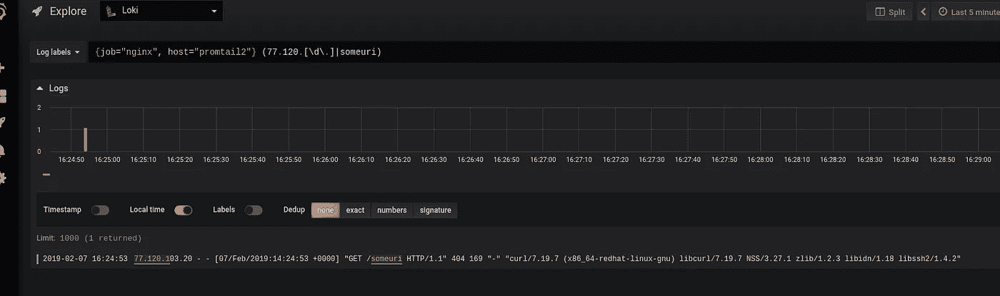

目前就这些。

下一步将是为 Loki 配置 AWS S3 铲斗和 AWS dynamo db——我将开始在我们的试运行环境中推广它。

*最初发布于* [*RTFM: Linux、DevOps 和系统管理*](https://rtfm.co.ua/en/grafana-labs-loki-distributed-system-labels-and-filters/) *。*