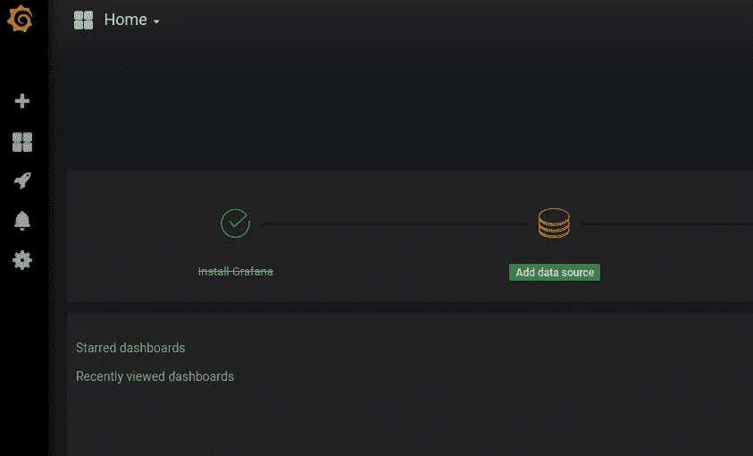
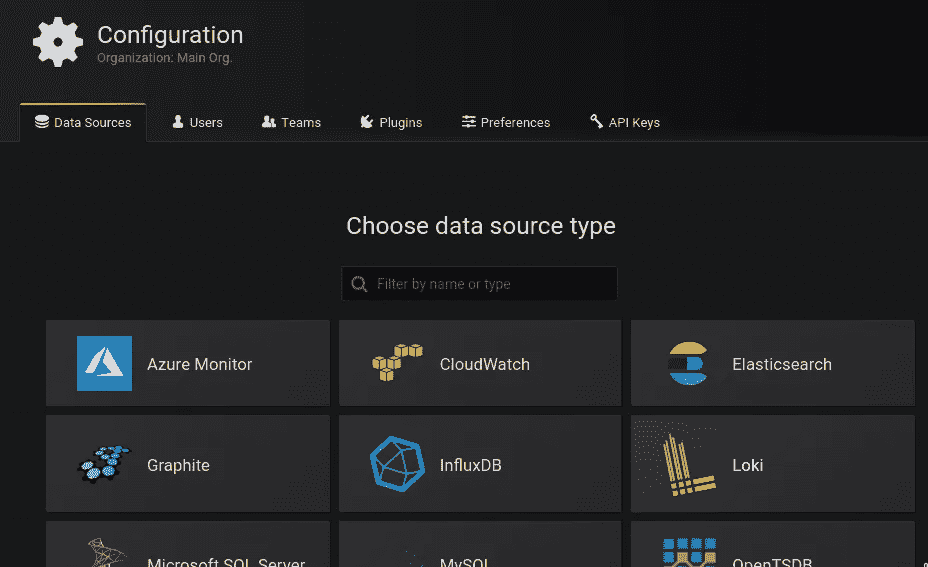
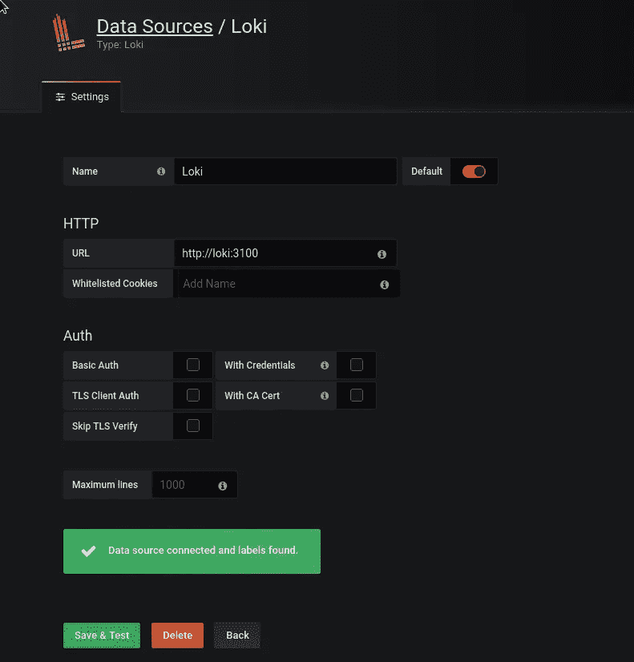
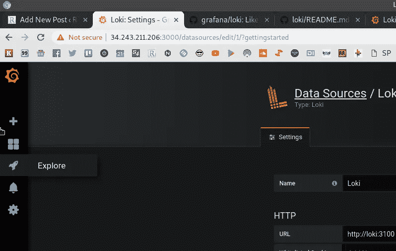
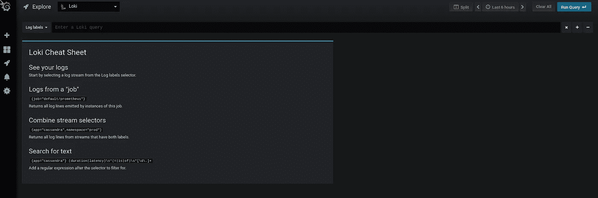
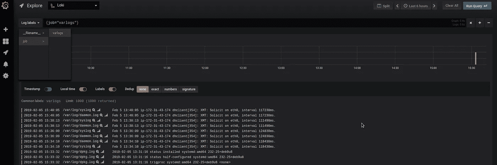
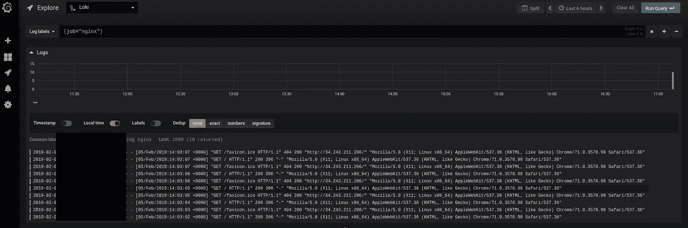

# Grafana 实验室:Loki —日志收集和监控系统

> 原文：<https://itnext.io/grafana-labs-loki-logs-collecting-and-monitoring-system-b8896b5cac5c?source=collection_archive---------0----------------------->


Grafana 6.0 在 2019 年 2 月仍处于测试阶段，当时推出了新功能——Loki，这是一个通过另一个新功能[探索](http://docs.grafana.org/guides/whats-new-in-v6-0/#explore)提供的日志聚合系统。

它类似于众所周知的[麋鹿](https://www.elastic.co/elk-stack) / [EFK](https://www.digitalocean.com/community/tutorials/how-to-set-up-an-elasticsearch-fluentd-and-kibana-efk-logging-stack-on-kubernetes) 栈，但设置和使用更简单，主要用于像 Prometheus 和 Kubernetes 这样的云和系统。

它仍处于早期开发阶段，我在尝试建立本帖中描述的概念验证时发现的主要缺点是缺乏文档和示例。

因此，在这篇文章和接下来的两篇文章中，我将尝试展示一些它的设置和使用示例。

总的来说，我喜欢 Loki，因为您不需要设置整个专用的 ELK 堆栈:相同的 Grafana 可以用于您的监控仪表板，并且您的所有日志都可以通过相同的 Grafana 实例获得。所以我会试着在我目前的项目上实现它。

还是会回到麋鹿解……)

项目首页— [此处> > >](https://grafana.com/loki#about) ，Grafana Lab 的博客中的帖子— [此处> > >](https://grafana.com/blog/2018/12/12/loki-prometheus-inspired-open-source-logging-for-cloud-natives/) ，Github 库[此处> > >](https://github.com/grafana/loki) 。

在 Reddit [这里> > >](https://www.reddit.com/r/devops/comments/a754si/grafanas_new_log_analysis_product/) 也有很好的讨论。

洛基有`[logcli](https://github.com/grafana/loki/blob/master/docs/logcli.md)`工具——但是我还没有检查它。

Loki-stack 由三个主要组件组成:

*   `promtail` -代理收集主机上的日志并将其推送到 Loki 实例
*   `loki` -日志聚合和处理服务器
*   [Grafana](https://github.com/grafana/grafana) —用于查询和显示日志

现在让我们试着设置它，添加一些 NGINX 日志，并检查它在 Grafana 中的样子。

*   [Loki Docker 编写堆栈](#4ac0)
*   [添加 Loki 数据源](#3794)
*   [添加新日志](#a0d3)

## Loki Docker 编写堆栈

创建 Loki 的主目录:

```
root@bttrm-dev-console:/opt# mkdir /opt/loki
root@bttrm-dev-console:/opt# cd /opt/loki/
```

接下来，创建一个 Docker 合成文件— `loki-compose.yml`:

```
version: "3"

networks:
  loki:

services:
  loki:
    image: grafana/loki:master
    ports:
      - "3100:3100"
    command: -config.file=/etc/loki/local-config.yaml
    networks:
      - loki

  promtail:
    image: grafana/promtail:master
    volumes:
      - /var/log:/var/log
    command: -config.file=/etc/promtail/docker-config.yaml
    networks:
      - loki

  grafana:
    image: grafana/grafana:master
    ports:
      - "3000:3000"
    networks:
      - loki
```

开始容器:

```
root@bttrm-dev-console:/opt/loki# docker-compose -f loki-compose.yml up
```

在`promtail`的输出中，您将看到`promatil`查看的日志信息:

> …
> prom tail _ 1 | level = info ts = 2019–02–05t 14:07:30.777577365 z caller = file target manager . go:165 msg = " Adding target " key = " { job = \ " varlogs \ " } "
> prom tail _ 1 | level = info ts = 2019–02–05t 14:07:30.779215957 z caller = file target . go:269 msg level = info ts = 2019–02–05t 14:07:30.78359605 z caller = file target . go:269 msg = " start tailing file " path =/var/log/cloud-init-output . log
> prom tail _ 1 | level = info ts = 2019–02–05t 14:07:30.783648219 z caller = file target . go:269 msg = " start tailing file " path =。

与 Prometheus exporters 类似，您可以通过`/metrics` URI 访问数据:

```
root@ip-172–31–43–174:/opt/loki# curl localhost:3100/metrics
#HELP cortex_cache_corrupt_chunks_total Total count of corrupt chunks found in cache.
#TYPE cortex_cache_corrupt_chunks_total counter
cortex_cache_corrupt_chunks_total 0.0
#HELP cortex_chunk_store_chunks_per_query Distribution of #chunks per query.
TYPE cortex_chunk_store_chunks_per_query histogram
cortex_chunk_store_chunks_per_query_bucket{le=”10.0"} 0.0
cortex_chunk_store_chunks_per_query_bucket{le=”80.0"} 0.0
cortex_chunk_store_chunks_per_query_bucket{le=”640.0"} 0.0
cortex_chunk_store_chunks_per_query_bucket{le=”5120.0"} 0.0
cortex_chunk_store_chunks_per_query_bucket{le=”40960.0"} 0.0
cortex_chunk_store_chunks_per_query_bucket{le=”327680.0"} 0.0
cortex_chunk_store_chunks_per_query_bucket{le=”+Inf”} 0.0
…
```

现在您可以通过[*http://IP:3000*](http://IP:3000)URL 访问您的 Grafana 实例:


使用默认凭证登录— *admin:admin* 。

## 添加 Loki 数据源

Grafana 会建议您添加一个数据源:



添加 *Loki* 数据源:



将 loki 的 URL 设置为[*http://Loki:3100*](http://loki:3100)(因为我们在 Docker 自己的网络中运行我们的 Loki 的堆栈):



现在您可以导航到*浏览*:



通过*日志标签*查看一些已经收集的日志:



## 添加新日志

要跟踪的日志在`promtail`的`[/etc/promtail/local-config.yaml](https://github.com/grafana/loki/blob/master/cmd/promtail/promtail-local-config.yaml)`或`[/etc/promtail/docker-config.yaml](https://github.com/grafana/loki/blob/master/cmd/promtail/promtail-docker-config.yaml)`配置中进行配置。

现在让我们安装 NGINX:

```
root@ip-172–31–43–174:/home/admin# apt install nginx -y
```

检查日志文件是否出现在主机上:

```
root@ip-172–31–43–174:/opt/loki# tail -f /var/log/nginx/*
==> /var/log/nginx/access.log <==
==> /var/log/nginx/error.log <==
==> /var/log/nginx/access.log <==
194.***.***.27 — — [05/Feb/2019:14:03:02 +0000] “GET / HTTP/1.1” 200 396 “-” “Mozilla/5.0 (X11; Linux x86_64) AppleWebKit/537.36 (KHTML, like Gecko) Chrome/71.0.3578.98 Safari/537.36”
194.***.***.27 — — [05/Feb/2019:14:03:03 +0000] “GET /favicon.ico HTTP/1.1” 404 200 “http://34.243.211.206/" “Mozilla/5.0 (X11; Linux x86_64) AppleWebKit/537.36 (KHTML, like Gecko) Chrome/71.0.3578.98 Safari/537.36”
```

Loki 的配置文件此时存储在容器内的`/etc/loki` 目录下:

```
root@ip-172–31–43–174:/opt/loki# docker exec -ti loki_loki_1 ls -l /etc/loki/
total 4
-rw-r — r — 1 root root 489 Feb 5 12:00 local-config.yaml
```

`promtail`的- in `/etc/promtail`:

```
root@ip-172–31–43–174:/opt/loki# docker exec -ti loki_promtail_1 ls -l /etc/promtail/
total 8
-rw-r — r — 1 root root 312 Feb 5 12:00 docker-config.yaml
-rw-r — r — 1 root root 317 Feb 5 12:00 local-config.yaml
```

让我们为`promtail` - `/opt/loki/loki-promtail-conf.yml`创建自己的配置:

```
server:

  http_listen_port: 9080
  grpc_listen_port: 0

positions:

  filename: /tmp/positions.yaml

client:

  url: [http://loki:3100/api/prom/push](http://loki:3100/api/prom/push)

scrape_configs:

  - job_name: system
    entry_parser: raw
    static_configs:
    - targets:
        - localhost
      labels:
        job: varlogs
        __path__: /var/log/*log

  - job_name: nginx
    entry_parser: raw
    static_configs:
    - targets:
        - localhost
      labels:
        job: nginx
        __path__: /var/log/nginx/*log
```

在这里的`scrape_configs`中，我们添加了一个新的任务- *nginx* 和`__path__`到由`promtail`跟踪的目录和文件中。

接下来，让我们更新我们的合成文件，并将来自主机的新配置文件映射添加到`promtail`的容器中，作为`/etc/promtail/docker-config.yaml`:

```
...
  promtail:
    image: grafana/promtail:master
    volumes:
      - /opt/loki/loki-promtail-conf.yml:/etc/promtail/docker-config.yaml
      - /var/log:/var/log
    command: -config.file=/etc/promtail/docker-config.yaml
    networks:
      - loki
...
```

重启构建堆栈并检查`promtail`输出中的日志，查看`promtail`现在正在查看哪些日志:

> …
> prom tail _ 1 | level = info ts = 2019–02–05t 15:08:10.53723788 z caller = file target manager . go:165 msg = " Adding target " key = " { job = \ " varlogs \ " } "
> prom tail _ 1 | level = info ts = 2019–02–05t 15:08:10.538575763 z caller = file target . go:269 msg = " start level = info ts = 2019–02–05t 15:08:10.543222436 z caller = file target . go:269 msg = "开始跟踪文件" path =/var/log/cloud-init . log
> prom tail _ 1 | level = info ts = 2019–02–05t 15:08:10.54394579 z caller = file target manager . go:165 msg = "添加目标" key="{job 2019/02/05 15:08:10 Seeked/var/log/auth . log—&{ Offset:0 where:0 }
> prom tail _ 1 | 2019/02/05 15:08:10 Seeked/var/log/nginx/access . log—&{ Offset:0 where:0 }
> prom tail _ 1 | level = info ts = 2019–02–05t 15:08:1

*key="{job=\"nginx\"}"* 出现了——一切都好。

让它工作几分钟，然后检查 Grafana 内部:



日志存在，我们现在完成了。

查看下一篇帖子— [Grafana Labs: Loki —分布式系统、标签和过滤器](https://rtfm.co.ua/en/grafana-labs-loki-distributed-system-labels-and-filters/)查看如何设置分布式系统的示例以及标签和过滤器的使用示例。

*最初发布于* [*RTFM: Linux、DevOps 和系统管理*](https://rtfm.co.ua/en/grafana-labs-loki-logs-collector-and-monitoring-system/) *。*