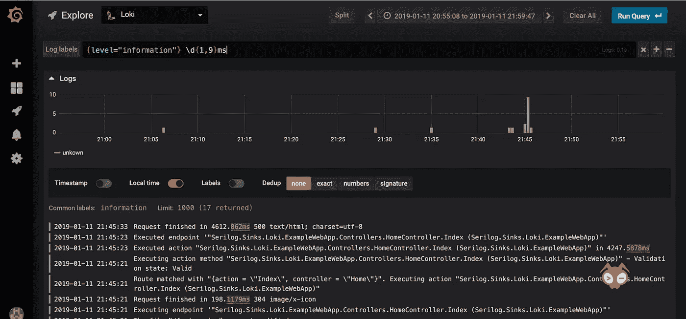
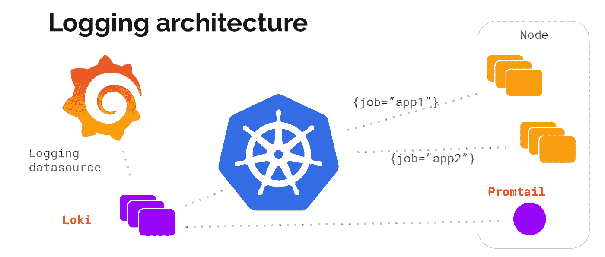
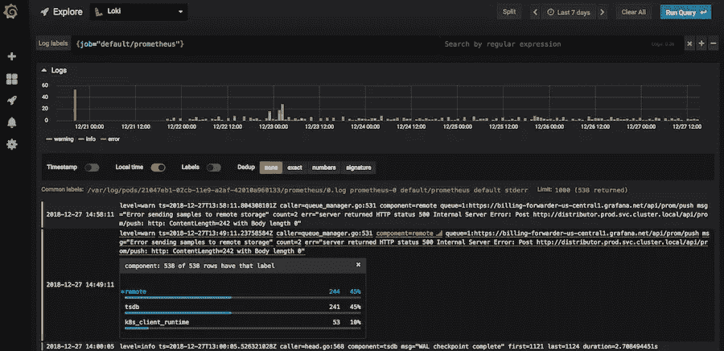

# 使用 Loki 的 Grafana 测井

> 原文：<https://itnext.io/grafana-logging-using-loki-45665916aec9?source=collection_archive---------0----------------------->

[Loki](https://grafana.com/loki) 是一个受普罗米修斯启发的针对云本地基础设施的日志服务。



# 洛基是什么？

在 KubeCon Seattle 2018 期间，Grafana Labs 开源了 Loki，它是一个针对运行 Prometheus 和 Kubernetes 的用户优化的日志后端，在 Grafana 6.0 中具有出色的日志搜索和可视化功能。

Loki 的设计旨在提高效率，同时实现以下目标:

*   原木应该很便宜。不应该要求任何人减少记录。
*   易于操作和扩展。
*   度量、日志(以及后面的跟踪)需要协同工作。

# Loki 与其他日志记录解决方案

如前所述，Loki 旨在提高效率，以便在 Kubernetes 环境中与 Prometheus metrics 结合使用。

这个想法是基于您已经在 Prometheus 上使用的 Kubernetes 标签，在指标和日志之间轻松切换。

与大多数日志记录解决方案不同，Loki 不解析传入的日志，也不进行全文索引。

相反，它使用与 Prometheus 相同的标签对日志流进行索引和分组。这大大提高了扩展和运营的效率。

# 洛基组件

Loki 是一个 TSDB(时间序列数据库)，它将日志存储为分割和压缩的数据块。

日志是通过 API 获取的，一个名为 Promtail(Prometheus 格式的跟踪日志)的代理将抓取 Kubernetes 日志并添加标签元数据，然后将其发送到 Loki。

这种元数据添加与 Prometheus 完全相同，因此您最终将获得与您的资源完全相同的标签。



[https://grafana . com/blog/2018/12/12/Loki-Prometheus-inspired-open-source-logging-for-cloud-natives/](https://grafana.com/blog/2018/12/12/loki-prometheus-inspired-open-source-logging-for-cloud-natives/)

# 如何在您的 Kubernetes 集群上部署 Loki

1.  **在您的集群上部署 Loki**

在 Kubernetes 集群上部署 Loki 最简单的方法是使用官方存储库中的 [Helm chart](https://github.com/grafana/loki/tree/master/production/helm) 。

可以按照官方回购的[设置指南](https://github.com/grafana/loki/blob/master/production/helm/README.md)操作。

这将部署洛基和 Promtail。

# **在 Grafana** 中添加 Loki 数据源(6.0 及更新版本中内置了对 Loki 的支持)

1.  登录您的 Grafana。
2.  通过左侧工具条中的齿轮图标进入`Configuration` > `Data Sources`。
3.  点击大`+ Add data source`按钮。
4.  从列表中选择洛基。
5.  http URL 字段应该是您的 Loki 服务器的地址:`[http://loki:3100](http://loki:3100)`

# **在“浏览”视图中查看您的日志**

1.  选择边栏上的“探索”视图。
2.  选择 Loki 数据源。
3.  使用“日志标签”按钮选择日志流。



# 快速配置

*Promtail 是元数据附加器和日志发送代理*

您从 Helm chart 获得的 Promtail 配置已经配置为从您的 Kubernetes 集群获得所有日志，并像 Prometheus 为 metrics 所做的那样在其上附加标签。

但是，您可以根据需要调整配置。

这里有两个例子:

1.  **仅获取特定名称空间的日志**

您可以使用`action: keep`作为您的名称空间，并为[prom tail/config map . YAML](https://github.com/grafana/loki/blob/master/production/helm/templates/promtail/configmap.yaml)中的每个`scrape_config`添加一个新的`relabel_configs`

例如，如果您只想获取`kube-system`名称空间的日志:

```
scrape_configs:
- job_name: kubernetes-pods         
  kubernetes_sd_configs:         
  - role: pod         
  relabel_configs:         
  - source_labels: [__meta_kubernetes_namespace]           
    action: keep           
    regex: kube-system# [...]

- job_name: kubernetes-pods-app         
  kubernetes_sd_configs:         
  - role: pod         
  relabel_configs:         
  - source_labels: [__meta_kubernetes_namespace]           
    action: keep           
    regex: kube-system
```

1.  **从特定名称空间中排除日志**

例如，如果您想从`kube-system`名称空间中排除日志:

您可以使用`action: drop`作为您的名称空间，并为[prom tail/config map . YAML](https://github.com/grafana/loki/blob/master/production/helm/templates/promtail/configmap.yaml)中的每个`scrape_config`添加一个新的`relabel_configs`

```
scrape_configs:
- job_name: kubernetes-pods         
  kubernetes_sd_configs:         
  - role: pod         
  relabel_configs:         
  - source_labels: [__meta_kubernetes_namespace]           
    action: drop           
    regex: kube-system# [...]

- job_name: kubernetes-pods-app         
  kubernetes_sd_configs:         
  - role: pod         
  relabel_configs:         
  - source_labels: [__meta_kubernetes_namespace]           
    action: drop           
    regex: kube-system
```

关于配置的更多信息，可以参考【Prometheus 官方配置文档。

# 使用 fluentd 输出插件

Fluentd 是一个著名的好的日志转发器，也是一个[CNCF 项目](https://www . cncf . io/projects/)。它有很多输入插件和良好的过滤内置。例如，如果您想要将日志转发到 Loki，则无法通过 Promtail 实现，因此您可以使用 fluentd syslog 输入插件和 fluentd Loki 输出插件将这些日志放入 Loki。

关于如何使用 fluentd Loki 插件，您可以参考[安装指南](https://github.com/grafana/loki/tree/master/fluentd/fluent-plugin-loki)。

还有一个例子，如何用 fluentd 将 API 服务器审计日志转发给 Loki。

以下是 fluentd 配置:

```
<match fluent.**>
  type null         
</match>
<source>      
  @type tail     
  path /var/log/apiserver/audit.log     
  pos_file /var/log/fluentd-audit.log.pos     
  time_format %Y-%m-%dT%H:%M:%S.%NZ     
  tag audit.*     
  format json     
  read_from_head true
</source>   
<filter kubernetes.**>
  type kubernetes_metadata
</filter>   
<match audit.**>
@type loki     
url "#{ENV['LOKI_URL']}"     
username "#{ENV['LOKI_USERNAME']}"     
password "#{ENV['LOKI_PASSWORD']}"     
extra_labels {"env":"dev"}     
flush_interval 10s     
flush_at_shutdown true     
buffer_chunk_limit 1m
</match>
```

# 作为边车的 Promtail

默认情况下，Promtail 被配置为自动从容器中抓取日志并将其发送到 Loki。这些日志来自 stdout。

但有时，您可能希望能够将日志从外部文件发送到 Loki。

在这种情况下，您可以将 Promtail 设置为 sidecar，即 pod 中的第二个容器，通过共享卷与它共享日志文件，并抓取数据以将其发送到 Loki

假设您有一个应用程序`simple-logger`。应用程序登录到`/home/slog/creator.log`

您的 kubernetes 部署将如下所示:

1.  **添加 Promtail 作为边车**

```
apiVersion: apps/v1  
kind: Deployment  
metadata:
  name: my-app
spec:
  template:
    metadata:
      name: my-app
spec:
  containers:        
  - name: simple-logger         
    image: giantswarm/simple-logger:latestapiVersion: apps/v1
kind: Deployment  
metadata:
  name: my-app
spec:
  template:
    metadata:
      name: my-app
spec:
  containers:
  - name: simple-logger          
  image: giantswarm/simple-logger:latest        
  - name: promtail          
  image: grafana/promtail:master          
  args:
    - "-config.file=/etc/promtail/promtail.yaml"            
    - "-client.url=http://loki:3100/api/prom/push"
```

2.**使用包含日志文件的共享数据卷**

```
apiVersion: apps/v1  
kind: Deployment  
metadata:
  name: my-app
spec:
  template:
    metadata:
      name: my-app
spec:
  containers:        
  - name: simple-logger         
    image: giantswarm/simple-logger:latest
    volumeMounts:
      - name: shared-data
        mountPath: /home/slog
  - name: promtail          
    image: grafana/promtail:master          
    args:
      - "-config.file=/etc/promtail/promtail.yaml"            
      - "-client.url=http://loki:3100/api/prom/push"
volumeMounts:
      - name: shared-data
        mountPath: /home/slog
volumes:
- name: shared-data
  emptyDir: {}
```

3.**配置 Promtail 来读取你的日志文件**

```
scrape_configs:
  - job_name: system          
    entry_parser: raw          
    static_configs:
      - targets:
          - localhost
        labels:
          job: my-app               
          my-label: awesome               
          __path__: /home/slog/creator.log
```

你就完了。

运行示例可在[这里](https://github.com/giantswarm/simple-logger)找到

# 结论

所以洛基看起来很有希望。足迹非常低。它与格拉夫纳和普罗米修斯完美结合。使用与 Prometheus 中相同的标签非常有助于将事件映射在一起，并快速找到与指标相关的日志。另一个要点是简单的可扩展性，Loki 的设计是水平可扩展的。

由于 Loki 目前是阿尔法软件，安装它，玩它。然后，加入我们的 grafana.slack.com，并添加您的反馈，使它变得更好。

有兴趣了解 Giant Swarm 如何处理包括 Loki 在内的整个云原生堆栈吗？在这里申请免费试用[巨型蜂群基础设施](https://giantswarm.io/)。

由[朱利安·加西亚·冈萨雷斯](https://twitter.com/jgsqware)——解决方案工程师@ [巨型蜂群](https://giantswarm.io/)撰写

[](https://twitter.com/jgsqware) [## 少尉🤘(@jgsqware) |推特

### 来自 JG 的最新推文🤘(@jgsqware)。解决方案工程师@GiantSwarm

twitter.com](https://twitter.com/jgsqware)