# grafana:Loki——LogQL 的类似普罗米修斯的计数器、聚合函数和 dnsmasq 的请求图

> 原文：<https://itnext.io/grafana-loki-the-logqls-prometheus-like-counters-aggregation-functions-and-dnsmasq-s-1e622c25c7e4?source=collection_archive---------2----------------------->


我上一次为日志收集和监控配置 Loki 是在 2019 年 2 月——大约一年前，请参见[Grafana Labs:Loki——日志收集和监控系统](https://rtfm.co.ua/en/grafana-labs-loki-logs-collector-and-monitoring-system/)帖子，当时 Loki 处于测试状态。

现在，我们在生产环境中面临传出流量问题，却找不到罪魁祸首。

尝试捕捉它的方法之一是收集关于 DNS 请求的统计数据，然后查看 AWS EC2 主机上的 out 尖峰和对本地`dnsmasq`服务的 DNS 请求之间是否存在相关性。

`dnsmasq`配置在[dnsmasq:AWS-“名称解析中的临时故障”、日志、调试和 dnsmasq 缓存大小](https://rtfm.co.ua/en/dnsmasq-aws-temporary-failure-in-name-resolution-logs-debug-and-dnsmasq-cache-size/)帖子中有所描述，在这篇文章中，我们将尝试实现下一个:

*   `dnsmasq`将所有请求写入本地日志文件
*   日志由`promtail`跟踪，它通过 Loki 向监控主机发送数据
*   最后，Grafana 将根据 Loki 的数据绘制图表

下面描述的设置更多的是概念验证，因为 Loki 本身及其在 Grafana 中的支持仍在开发中。

但是现在 Grafana 中的 Explore 特性支持类似于普罗米修斯的聚集和计数功能— `sum()`、`rate()`等。

去年的`promtail`也增加了一些有趣的新技能，我们会在这篇文章中用到。

首先，我们将构建一个普通的 Grafana + Loki + `promtail`栈，然后将添加从我们的生产环境中收集的日志，最后将使用新的 LogQL 函数添加一个 Grafana 的仪表板

*走吧！*

*   [洛基启动](https://rtfm.co.ua/en/grafana-loki-the-logqls-prometheus-like-counters-aggregation-functions-and-dnsmasqs-requests-graphs/#Loki_start)
*   [Grafana 开始](https://rtfm.co.ua/en/grafana-loki-the-logqls-prometheus-like-counters-aggregation-functions-and-dnsmasqs-requests-graphs/#Grafana_start)
*   [NGINX](https://rtfm.co.ua/en/grafana-loki-the-logqls-prometheus-like-counters-aggregation-functions-and-dnsmasqs-requests-graphs/#NGINX)
*   [提示开始](https://rtfm.co.ua/en/grafana-loki-the-logqls-prometheus-like-counters-aggregation-functions-and-dnsmasqs-requests-graphs/#promtail_start)
*   [promtail 和 dnsmasq 的日志](https://rtfm.co.ua/en/grafana-loki-the-logqls-prometheus-like-counters-aggregation-functions-and-dnsmasqs-requests-graphs/#promtail_and_dnsmasqs_logs)
*   [LogQL — Loki 的日志聚合和计数器](https://rtfm.co.ua/en/grafana-loki-the-logqls-prometheus-like-counters-aggregation-functions-and-dnsmasqs-requests-graphs/#LogQL_Lokis_logs_aggregation_and_counters)
*   [Loki“内部服务器错误”](https://rtfm.co.ua/en/grafana-loki-the-logqls-prometheus-like-counters-aggregation-functions-and-dnsmasqs-requests-graphs/#Loki_Internal_Server_Error)
*   [普罗米修斯 as…洛基？о.о](https://rtfm.co.ua/en/grafana-loki-the-logqls-prometheus-like-counters-aggregation-functions-and-dnsmasqs-requests-graphs/#Prometheus_as_Loki)
*   [利率()](https://rtfm.co.ua/en/grafana-loki-the-logqls-prometheus-like-counters-aggregation-functions-and-dnsmasqs-requests-graphs/#rate)
*   [提前流水线阶段](https://rtfm.co.ua/en/grafana-loki-the-logqls-prometheus-like-counters-aggregation-functions-and-dnsmasqs-requests-graphs/#promtail_pipeline_stages)
*   [Grafana DNS 仪表板](https://rtfm.co.ua/en/grafana-loki-the-logqls-prometheus-like-counters-aggregation-functions-and-dnsmasqs-requests-graphs/#Grafana_DNS_dashboard)

## 洛基开始

Loki 将由 Docker Compose 启动，创建一个`loki-stack.yml`文件:

```
version: '2.4'

networks:
  loki:

services:

  loki:
    image: grafana/loki:master-2739551
    ports:
      - "3100:3100"
    networks:
      - loki
    restart: unless-stopped
```

运行它:

```
root@monitoring-dev:/opt/loki# docker-compose -f loki-stack.yml up
```

检查:

```
root@monitoring-dev:/home/admin# curl localhost:3100/ready
Ready
```

Loki API 文档[此处> > >](https://github.com/grafana/loki/blob/master/docs/api.md) 。

## 格拉夫纳开始

以同样的方式使用 6.4.4 版本对 Grafana 进行重复操作(参见其 [Docker Hub](https://hub.docker.com/r/grafana/grafana/tags) 中的所有可用版本):

```
version: '2.4'

networks:
  loki:

services:

  loki:
    image: grafana/loki:master-2739551
    ports:
      - "3100:3100"
    networks:
      - loki
    restart: unless-stopped

  grafana:
    image: grafana/grafana:6.4.4
    ports:
      - "3000:3000"
    networks:
      - loki
    restart: unless-stopped
```

启动它，检查它:

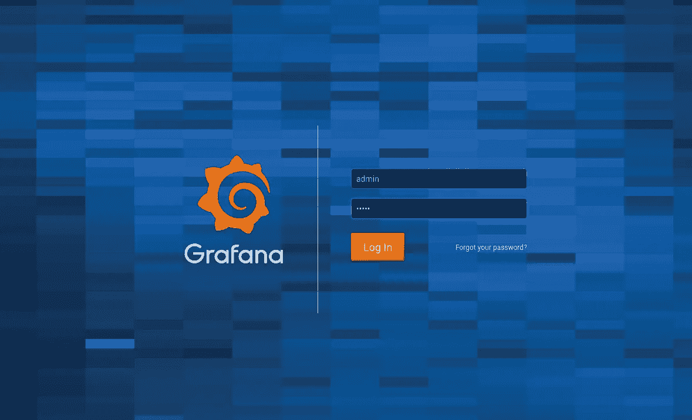

使用 *admin:admin* 登录，进入*数据源*:

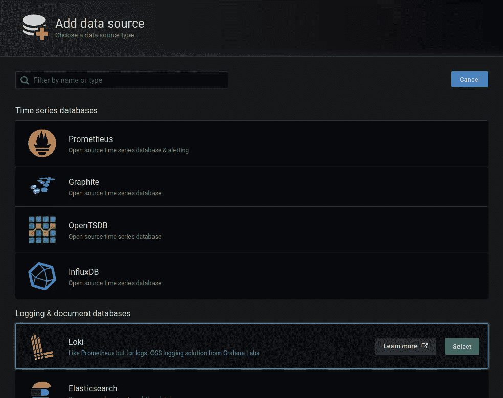

因为我们有运行在 Docker 网络中的 Loki—在这里使用[*http://Loki*](http://loki)URI:

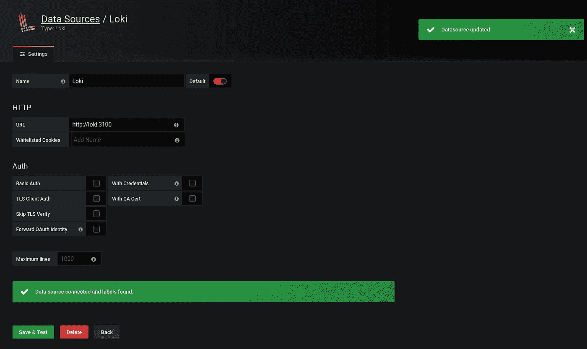

## NGINX

设置是在现有的监控开发环境中执行的，所以我已经在那里配置了 NGINX。

Loki 的配置`/etc/nginx/conf.d/dev.loki.example.com.conf`如下所示:

```
upstream grafana-loki {
    server 127.0.0.1:3000;
}

server {

    listen 80;
    server_name  dev.loki.example.com;

    # Lets Encrypt Webroot                                           
    location ~ /.well-known {

    root /var/www/html;
        allow all;
    }

    location / {

        allow 194.***.***.26/29;
        allow 91.***.***.78/32;
        allow 188.***.***.94/32;
        allow 78.***.***.191/32;
        allow 176.***.***.43/32;
        allow 10.0.10.0/24;
        deny  all;

        return 301 [https://dev.loki.example.com$request_uri;](https://dev.loki.example.com$request_uri;)
    }       
}

server {

    listen       443 ssl;
    server_name  dev.loki.example.com;

#    access_log  /var/log/nginx/dev.loki.example.com-access.log proxy;
    error_log /var/log/nginx/dev.loki.example.com-error.log warn;

#    auth_basic_user_file /var/www/dev.loki.example.com/.htpasswd;
#    auth_basic "Password-protected Area";

    allow 194.***.***.26/29;
    allow 91.***.***.78/32;
    allow 188.***.***.94/32;
    allow 78.***.***.191/32;
    allow 176.***.***.43/32;
    allow 10.0.10.0/24;
    deny  all;

    ssl_certificate /etc/letsencrypt/live/dev.loki.example.com/fullchain.pem;
    ssl_certificate_key /etc/letsencrypt/live/dev.loki.example.com/privkey.pem;

    ssl_protocols TLSv1 TLSv1.1 TLSv1.2;
    ssl_prefer_server_ciphers on;
    ssl_dhparam /etc/nginx/dhparams.pem;
    ssl_ciphers "EECDH+AESGCM:EDH+AESGCM:ECDHE-RSA-AES128-GCM-SHA256:AES256+EECDH:DHE-RSA-AES128-GCM-SHA256:AES256+EDH:ECDHE-RSA-AES256-GCM-SHA384:DHE-RSA-AES256-GCM-SHA384:ECDHE-RSA-AES256-SHA384:ECDHE-RSA-AES128-SHA256:ECDHE-RSA-AES256-SHA:ECDHE-RSA-AES128-SHA:DHE-RSA-AES256-SHA256:DHE-RSA-AES128-SHA256:DHE-RSA-AES256-SHA:DHE-RSA-AES128-SHA:ECDHE-RSA-DES-CBC3-SHA:EDH-RSA-DES-CBC3-SHA:AES256-GCM-SHA384:AES128-GCM-SHA256:AES256-SHA256:AES128-SHA256:AES256-SHA:AES128-SHA:DES-CBC3-SHA:HIGH:!aNULL:!eNULL:!EXPORT:!DES:!MD5:!PSK:!RC4";
    ssl_session_timeout 1d;
    ssl_stapling on;
    ssl_stapling_verify on;

    location / {

        proxy_redirect          off;
        proxy_set_header        Host            $host;
        proxy_set_header        X-Real-IP       $remote_addr;
        proxy_set_header        X-Forwarded-For $proxy_add_x_forwarded_for;
        proxy_pass [http://grafana-loki$request_uri;](http://grafana-loki$request_uri;)
    }

}
```

## `promtail`开始

目前，Grafana Explore 中没有任何内容，因为还没有日志被发送到 Loki。

创建`promtail`的配置- `/opt/loki/promtail.yml`:

在`client`块中使用 URL 作为 [http:// *loki* :](http://loki:)

```
server:

  http_listen_port: 9080
  grpc_listen_port: 0

positions:
  filename: /tmp/positions.yaml

client:

  url: [http://loki:3100/loki/api/v1/push](http://loki:3100/loki/api/v1/push)

scrape_configs:

  - job_name: messages
    static_configs:
    - targets:
        - localhost
      labels:
        job: all-logs
        env: dev
        host: monitoring-dev
        __path__: /var/log/*.log
```

将`promtail`添加到合成文件中，在那里挂载配置文件，并为`promtail`指定一个`command`，让它知道使用哪个配置文件:

```
...
  promtail:
    image: grafana/promtail:master-2739551
    networks:
      - loki
    volumes:
      - /opt/loki/promtail.yml:/etc/promtail/promtail.yml
    command: 
      - '-config.file=/etc/promtail/promtail.yml'
    restart: unless-stopped
```

检查一下。

`promtail`的输出:

```
…
promtail_1 | level=info ts=2019–11–16T09:19:57.935528884Z caller=filetargetmanager.go:257 msg=”Adding target” key=”{env=\”dev\”, host=\”monitoring-dev\”, job=\”all-logs\”}”promtail_1 | ts=2019–11–16T09:19:57.936230518Z caller=log.go:124 component=tailer level=info msg=”Seeked /var/log/dpkg.log — &{Offset:0 Whence:0}”promtail_1 | level=info ts=2019–11–16T09:19:57.936292402Z caller=tailer.go:77 component=tailer msg=”start tailing file” path=/var/log/dpkg.log
…
```

`dpkg.log`有尾巴。好吧。

并查看 Grafana Explore:

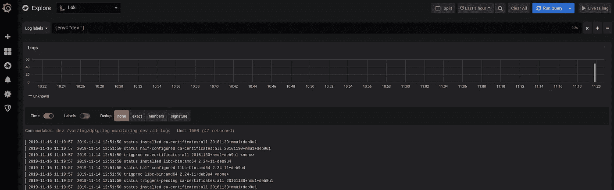

不错！

## `promtail`和`dnsmasq`的日志

现在，让我们去我们的生产хост，检查您是否可以从那里访问 Loki:

```
root@bttrm-production-console:/home/admin# curl [http://dev.logger.example.com:3100/ready](http://dev.logger.example.com:3100/ready)
```

准备好的

在那里创建一个`promtail`的配置`promtail-dev.yml`:

```
server:

  http_listen_port: 9080
  grpc_listen_port: 0

positions:
  filename: /tmp/positions.yaml

client:

  url: [http://dev.loki.example.com:3100/loki/api/v1/push](http://dev.loki.example.com:3100/loki/api/v1/push)

scrape_configs:

  - job_name: dnsmasq
    static_configs:
    - targets:
        - localhost
      labels:
        job: dnsmasq
        env: production
        host: bttrm-prod-console
        __path__: /var/log/dnsmasq.log
```

请注意，自从我上次设置后，Loki 的端点已经更改，现在是`/loki/api/v1/push`。

参见 Loki 的 API 文档[此处> > >](https://github.com/grafana/loki/blob/master/docs/api.md) 。

现在，让我们在没有 Docker Compose 的情况下运行它，我在那里有完整的监控导出器堆栈，稍后将添加 Promtail:

```
root@bttrm-production-console:/opt/prometheus-client# docker run -ti -v /opt/prometheus-client/promtail-dev.yml:/etc/promtail/promtail.yml grafana/promtail:master-2739551 -config.file=/etc/promtail/promtail.yml
Unable to find image ‘grafana/promtail:master-2739551’ locally
master-2739551: Pulling from grafana/promtail
…
Status: Downloaded newer image for grafana/promtail:master-2739551
level=warn ts=2019–11–16T09:29:00.668750217Z caller=filetargetmanager.go:98 msg=”WARNING!!! entry_parser config is deprecated, please change to pipeline_stages”
level=info ts=2019–11–16T09:29:00.669077956Z caller=server.go:121 http=[::]:9080 grpc=[::]:45421 msg=”server listening on addresses”
level=info ts=2019–11–16T09:29:00.66921034Z caller=main.go:65 msg=”Starting Promtail” version=”(version=, branch=, revision=)”
level=info ts=2019–11–16T09:29:05.669176878Z caller=filetargetmanager.go:257 msg=”Adding target” key=”{env=\”production\”, host=\”bttrm-prod-console\”, job=\”dnsmasq\”}”
```

呃…

为什么没有日志被跟踪？必须有"*msg = " start tailing file " path =/var/log/dnsmasq . log*"字符串…

洛基怎么样了？

什么是连接到数据源的" ***错误:数据源已连接，但未收到标签。验证 Loki 和 Promtail 是否正确配置*** “错误？

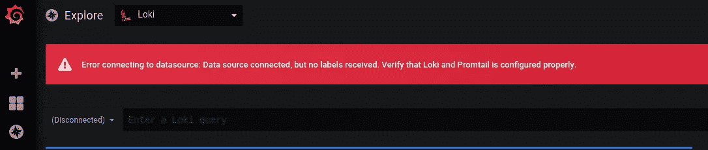

嗯，可以尝试重新创建容器:

```
root@monitoring-dev:/opt/loki# docker rm loki_grafana_1 loki_promtail_1
loki_grafana_1
loki_promtail_1
```

好——这很有帮助，洛基现在回去了。

日志没有被收集，因为我忘记将`/var/log`安装到`promtail`的容器中——将`-v /var/log:/var/log`添加到它的`run`命令中:

```
root@bttrm-production-console:/home/admin# docker run -ti -v /opt/prometheus-client/promtail-dev.yml:/etc/promtail/promtail.yml -v /var/log:/var/log grafana/promtail:master-2739551 -config.file=/etc/promtail/promtail.yml
level=warn ts=2019–11–16T09:48:02.248719806Z caller=filetargetmanager.go:98 msg=”WARNING!!! entry_parser config is deprecated, please change to pipeline_stages”
level=info ts=2019–11–16T09:48:02.249227598Z caller=server.go:121 http=[::]:9080 grpc=[::]:39883 msg=”server listening on addresses”
level=info ts=2019–11–16T09:48:02.249381673Z caller=main.go:65 msg=”Starting Promtail” version=”(version=, branch=, revision=)”
level=info ts=2019–11–16T09:48:07.249262647Z caller=filetargetmanager.go:257 msg=”Adding target” key=”{env=\”production\”, host=\”bttrm-prod-console\”}”
level=info ts=2019–11–16T09:48:07.24943453Z caller=tailer.go:77 component=tailer msg=”start tailing file” path=/var/log/dnsmasq.log
ts=2019–11–16T09:48:07.249544341Z caller=log.go:124 component=tailer level=info msg=”Seeked /var/log/dnsmasq.log — &{Offset:0 Whence:0}”
```

现在有日志:

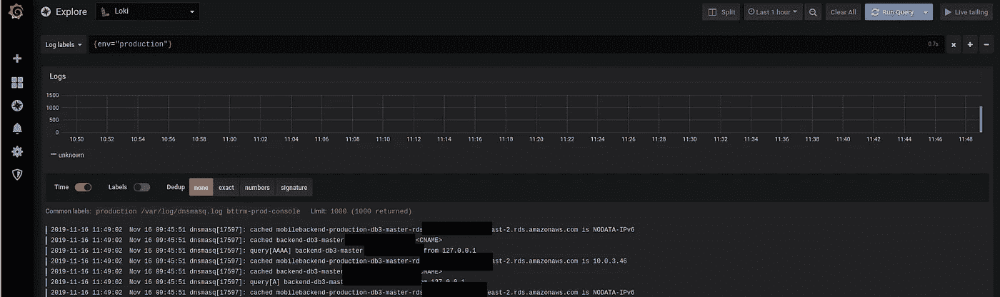

## LogQL — Loki 的日志聚合和计数器

下面是最有趣的部分开始— [LogQL](https://github.com/grafana/loki/blob/master/docs/logql.md) 和聚合/计数函数。

然而，我不得不花一些时间来使它工作，因为格拉夫纳和洛基的文件不清楚所有的细节。

## Loki“内部服务器错误”

如果尝试执行类似`count_over_time({job="dnsmasq"}[5m])`的查询，将会看到内部服务器错误:

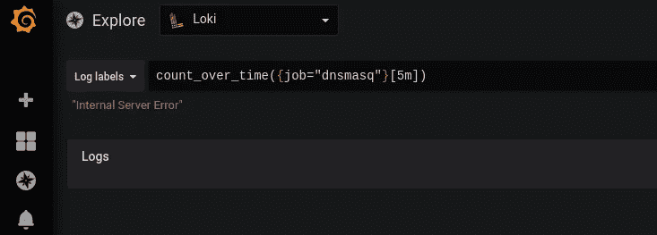

这是由…空格引起的！

修复它——在大括号之间添加空格，但现在 Grafana 什么也找不到:

```
count_over_time( {job="dnsmasq"}[5m] )
```

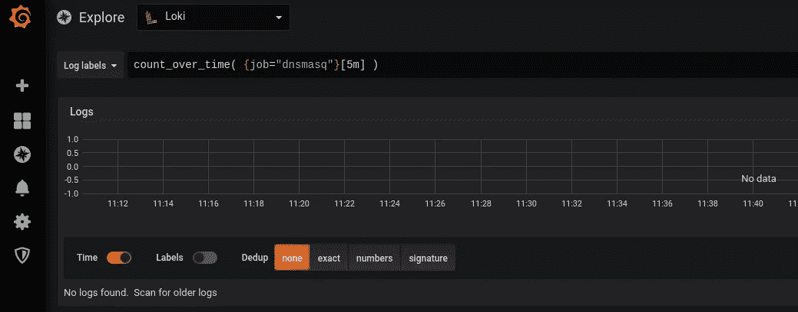

## 普罗米修斯作为…洛基？О.О

这有点奇怪，但很管用)

同样，这在任何地方都没有记录，但是我在[grafana.slack.com](https://grafana.slack.com)社区找到了这个“解决方案”。

在 Grafana 6.5 中，Loki 必须以正常方式支持函数，但是现在，让我们做一些奇怪的事情。

转到*数据源*，添加**普罗米修斯**——但是作为 **Loki** 。

或者洛基——作为普罗米修斯？

无论如何，选择了 Prometheus 类型，但是在 URL 中指定了[*http://Loki:310/Loki*](http://loki:310/loki)——结尾是 **/loki** :

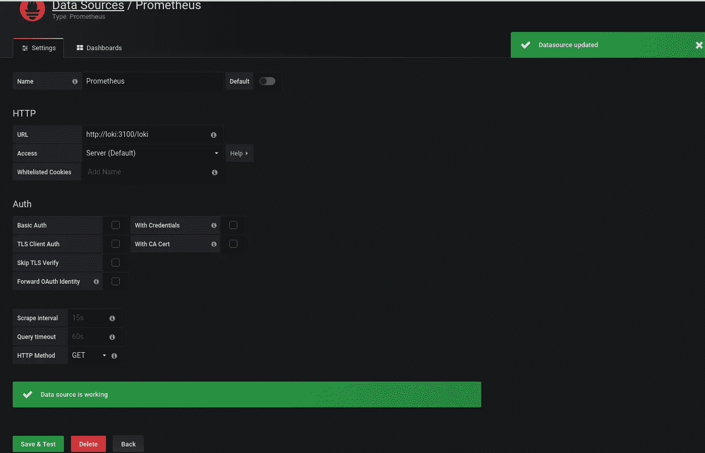

并检查:

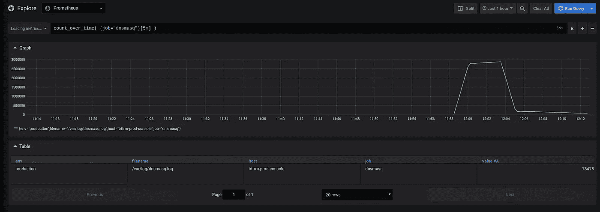

太好了！

`rate()`

让我们试着调用类似于`rate()` + regex 的东西来从`dnsmasq`的日志中选择主机名:

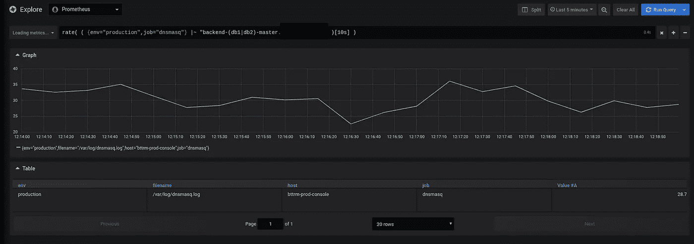

*“管用！”*

顺便说一下，当你开始输入时，Grafana 会显示函数及其描述:

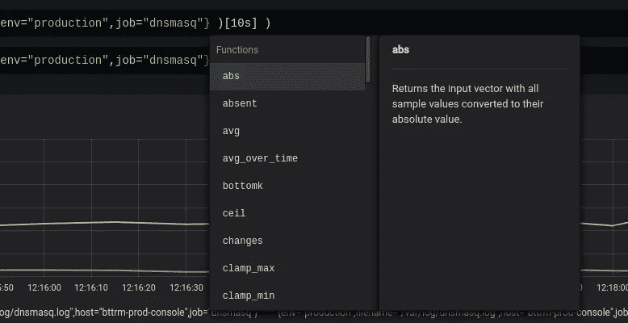

## `promtail`管道阶段

还有一个新的(？)有趣的事情发生在`promtail`——记不清是一年前了——*管道赛段*。

这里的文献资料是[>>>](https://github.com/grafana/loki/blob/master/docs/clients/promtail/pipelines.md)。

在其原始版本中:

> 管道用于转换单个日志行、其标签和时间戳。流水线由一组**阶段**组成。有 4 种类型的阶段:

1.  **解析阶段**解析当前日志行并从中提取数据。然后，提取的数据可供其他阶段使用。
2.  **变换阶段**变换从先前阶段提取的数据。
3.  **行动阶段**从之前的阶段提取数据，并对其进行处理。行动可以:
4.  向日志行添加或修改现有标签
5.  更改日志行的时间戳
6.  更改日志行的内容
7.  基于提取的数据创建指标

> **过滤阶段**根据某些条件选择性地应用阶段子集或删除条目。

因此，简而言之，你可以建立一个多类型阶段的数据管道。

阶段可以是:

1.  *解析阶段*:将解析日志并提取数据，然后将其传递给下一个阶段
2.  *转换阶段*:将转换前一阶段的数据
3.  *动作阶段*:从前一阶段接收数据，并能:

*   添加/移除标签
*   更改时间戳
*   更改日志的行
*   基于提取的数据创建指标

> 典型的管道从一个解析阶段开始(比如一个 [regex](https://github.com/grafana/loki/blob/master/docs/clients/promtail/stages/regex.md) 或 [json](https://github.com/grafana/loki/blob/master/docs/clients/promtail/stages/json.md) 阶段),从日志行中提取数据。然后，将出现一系列操作阶段，对提取的数据做一些事情。最常见的操作阶段是[标签](https://github.com/grafana/loki/blob/master/docs/clients/promtail/stages/labels.md)阶段，用于将提取的数据转换为标签。

让我们回到整个故事的最开始——我们想要实现什么？

我们希望获取对我们的`dnsmasq`的所有请求，提取主机名并显示一个图表——对一个特定的域名执行了多少请求。

因此，需要:

*   抓取所有请求
*   将每个保存到一个标签
*   数一数

转到生产和添加阶段的`promtail`-更新`promtail-dev.yml`配置文件:

```
server:

  http_listen_port: 9080
  grpc_listen_port: 0

positions:
  filename: /tmp/positions.yaml

client:

  url: [http://dev.loki.example.com:3100/loki/api/v1/push](http://dev.loki.example.com:3100/loki/api/v1/push)

scrape_configs:

  - job_name: dnsmasq
    static_configs:
    - targets:
        - localhost
      labels:
        job: dnsmasq
        env: production
        host: bttrm-prod-console
        __path__: /var/log/dnsmasq.log

    pipeline_stages:
    - match:
        selector: '{job="dnsmasq"}'
        stages:
        - regex:
            expression: ".*query\\[A\\] (?P<query>.*\\s)"
        - labels:
            query:
```

在`pipeline_stages`这里我们:

1.  选择了`dnsmasq`的工作
2.  创建一个 regex 阶段，该阶段使用*查询【A】*字符串选择所有行
3.  创建一个名为 *query* 的正则表达式组，将结果字符串保存到第一个空格
    处，即字符串的来源可能是:
    *11 月 16 日 08:23:33 dnsmasq[17597]:从 127.0.0.1*
    中查询[A]backend-db3-master.example.com，在*查询*中正则表达式组将获得值:
    *backend-db3-master.example.com*
4.  创建一个`labels`阶段，该阶段将附加一个名为*查询*的新标签，其*backend-db3-master.example.com*值取自*查询*正则表达式组

运行`promtail`:

```
root@bttrm-production-console:/home/admin# docker run -ti -v /opt/prometheus-client/promtail-dev.yml:/etc/promtail/promtail.yml -v /var/log:/var/log grafana/promtail:master-2739551 -config.file=/etc/promtail/promtail.yml
level=info ts=2019–11–16T11:56:29.760425279Z caller=server.go:121 http=[::]:9080 grpc=[::]:32945 msg=”server listening on addresses”
level=info ts=2019–11–16T11:56:29.760565845Z caller=main.go:65 msg=”Starting Promtail” version=”(version=, branch=, revision=)”
level=info ts=2019–11–16T11:56:34.760567558Z caller=filetargetmanager.go:257 msg=”Adding target” key=”{env=\”production\”, host=\”bttrm-prod-console\”, job=\”dnsmasq\”}”
level=info ts=2019–11–16T11:56:34.760752715Z caller=tailer.go:77 component=tailer msg=”start tailing file” path=/var/log/dnsmasq.log
ts=2019–11–16T11:56:34.760863031Z caller=log.go:124 component=tailer level=info msg=”Seeked /var/log/dnsmasq.log — &{Offset:0 Whence:0}”
```

查看 Grafana 的图表:

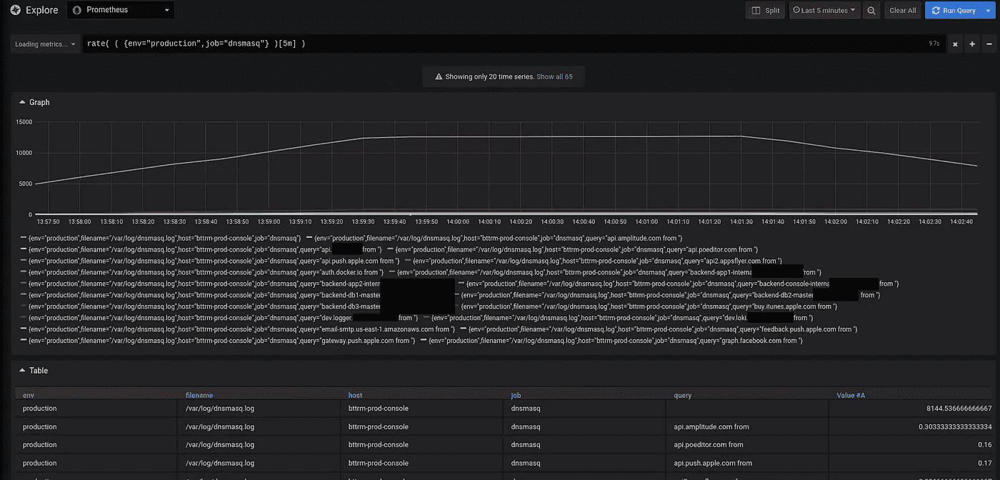

并创建如下查询:

```
sum (rate( ( {env="production",query=~".*\\..*"} )[5m] )) by (query)
```

在`query=~".*\\..*"`中，我不得不创建一个“crunch”来删除没有查询标签的数据，但我想这肯定是一个更正确的方法。现在-我可以离开这东西。

让我们看看结果:

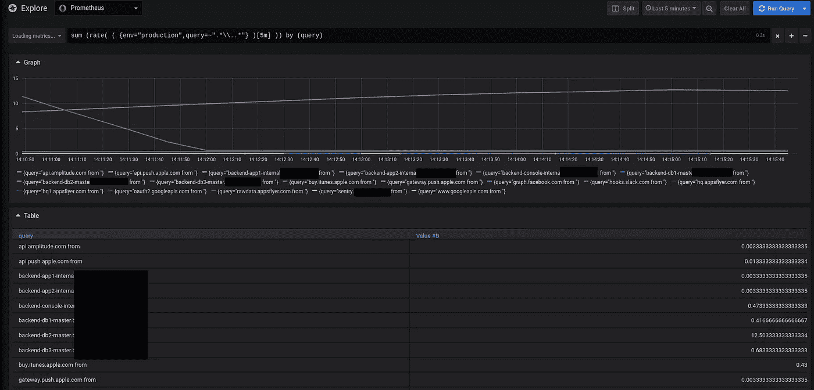

厉害！

嗯…

主机名是来自字符串的*…*

为什么？

使用[https://regex101.com](https://regex101.com)，修复正则表达式，结果是:

```
.*query\[A\] (?P<query>[^\s]+)
```

更新`promtail`的配置:

```
...
    pipeline_stages:
    - match:
        selector: '{job="dnsmasq"}'
        stages:
        - regex:
            expression: ".*query\\[A\\] (?P<query>[^\\s]+)"
        - labels:
            query:
```

## Grafana DNS 仪表板

好的，总的来说——我们看到它会起作用。现在，让我们尝试创建一个仪表板，将所有 DNS 请求统计数据放在一个漂亮的图表中。

点击*添加查询*:

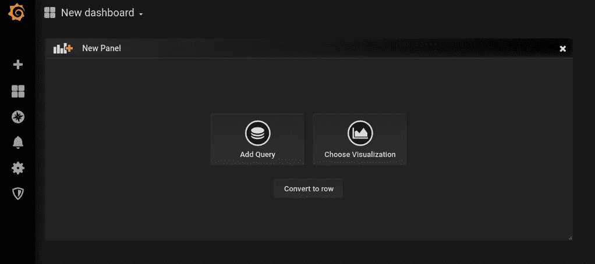

添加我们的查询:

```
sum (rate( ( {env="production", query=~".*\\..*"} )[5m] )) by (query)
```

在*图例*中，使用替换{{ query }}仅显示值:

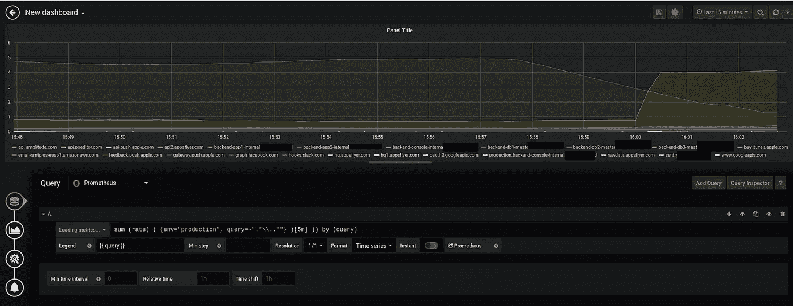

好吧，还不错…

让我们添加一些变量，使选择查询成为可能。

进入*仪表盘设置>变量>添加变量*，然后…

Loki 仍然不支持模板变量:-(

或者我只是没有找到为 Loki 执行`label_values()`的正确方法...

文档在这里是[>>>](https://grafana.com/docs/features/datasources/prometheus/#templating)。

我想创建一个包含来自`query`标签的值的变量，以便能够选择一个特定的域名，但是——唉...

好了，现在，我们可以做一个简单的过滤——用*文本框*类型创建一个变量:

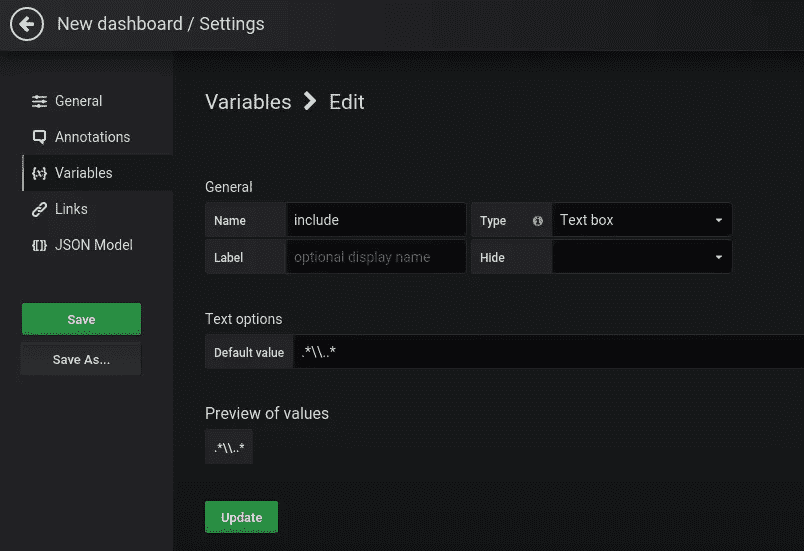

并选择一个环境—创建一个*自定义*类型变量:

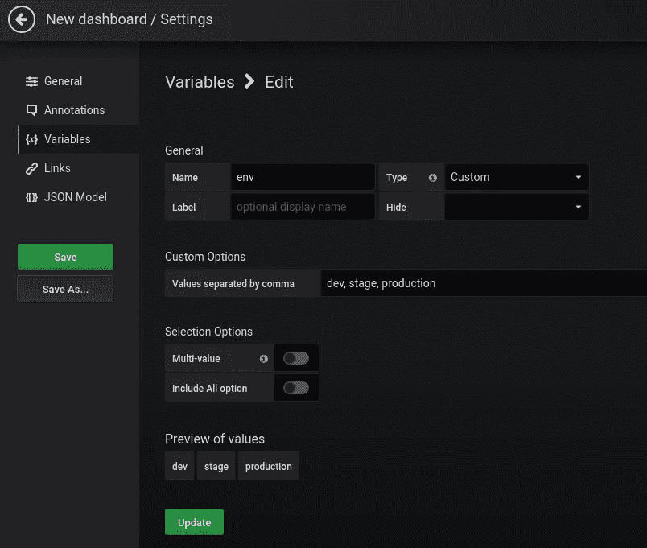

回到查询，更新它以使用这些变量:

```
sum (rate( ( {env="$env", query=~"$include"} )[5m] )) by (query)
```

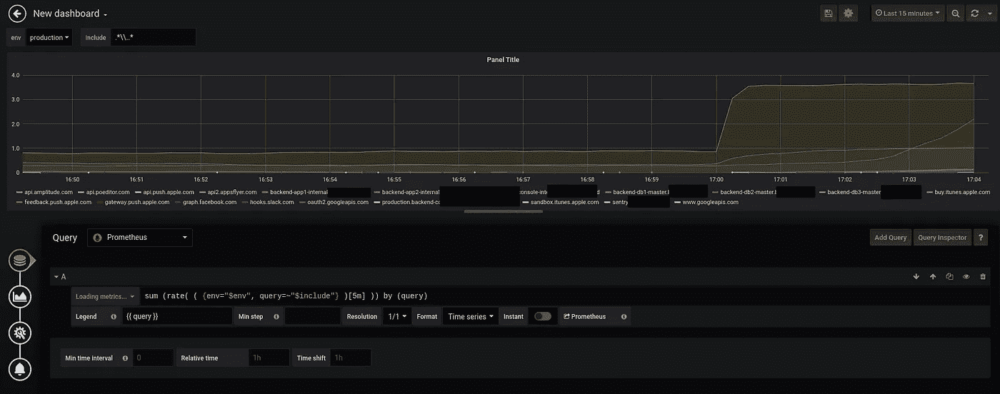

并按域用过滤器测试它:

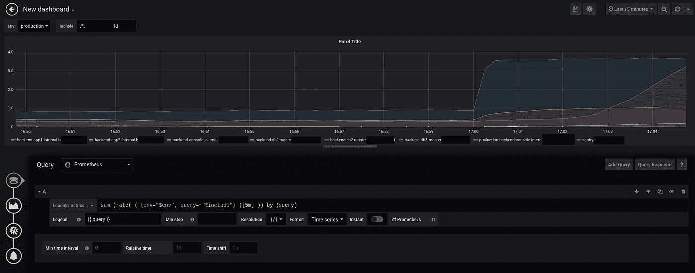

结果是 Grafana 仪表板，其中包含主机名 DNS 请求的统计信息:

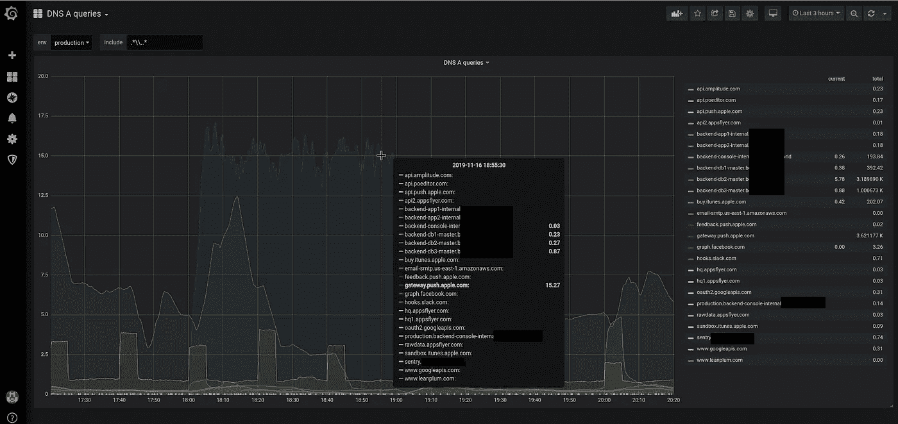

## 有用的链接

*   [格拉夫纳探索](https://grafana.com/docs/features/explore/)
*   [在 Grafana 中使用 Loki](https://www.bookstack.cn/read/grafana-v6.2/f30923b9a8c5198a.md)
*   [LogQL:日志查询语言](https://github.com/grafana/loki/blob/master/docs/logql.md)
*   [来自日志的标签](https://github.com/grafana/loki/blob/master/docs/design-documents/labels.md)
*   洛基的 HTTP API
*   [配置提示信息](https://github.com/grafana/loki/blob/master/docs/clients/promtail/configuration.md)
*   [前置管线](https://github.com/grafana/loki/blob/master/docs/clients/promtail/pipelines.md)
*   [正则表达式引用:命名组和反向引用](https://www.regular-expressions.info/refext.html)
*   [Grafana Labs:Loki——分布式系统、标签和过滤器](https://rtfm.co.ua/en/grafana-labs-loki-distributed-system-labels-and-filters/)
*   [Grafana Labs:Loki——使用 AWS S3 作为数据存储，使用 AWS DynamoDB 作为索引](https://rtfm.co.ua/en/grafana-labs-loki-using-aws-s3-as-a-data-storage-and-aws-dynamodb-for-indexes/)
*   [普罗米修斯:用 ansi ble-Grafana、Loki 和 promtail 设置 RTFM 博客监控](https://rtfm.co.ua/en/prometheus-rtfm-blog-monitoring-set-up-with-ansible-grafana-loki-and-promtail/)

*最初发布于* [*RTFM: Linux、DevOps 和系统管理*](https://rtfm.co.ua/en/grafana-loki-the-logqls-prometheus-like-counters-aggregation-functions-and-dnsmasqs-requests-graphs/) *。*