# 基于 dbt 的星云图数据库图形数据建模和 ETL

> 原文：<https://itnext.io/graph-data-modeling-and-etl-with-dbt-in-nebulagraph-database-f1f1b0cd6766?source=collection_archive---------5----------------------->

> *我们如何在表格数据源中建模数据，并将其 ETL 到 NebulaGraph？本文向我们展示了一个使用 dbt 实现这一点的端到端示例。*

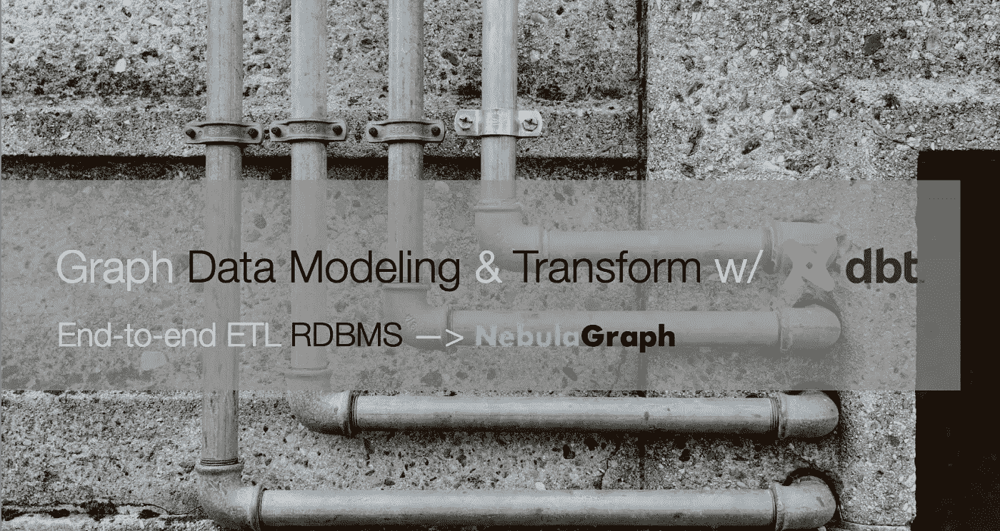

特写图片致谢:[克劳迪奥](https://unsplash.com/photos/Bu4lHKIHr-E)

# 工作

想象一下，我们正在用 NebulaGraph 为内容提供商 web 服务构建一个知识图，从而利用它来支持知识库 QA 系统、推荐系统和推理系统。

知识信息保存在不同的数据源中，这些数据源来自一些服务 API、数据库、数据仓库，甚至是 S3 中的一些文件。

我们需要:

*   分析数据以提取所需的知识
*   根据我们关心的关系对图表建模
*   提取关系，并将其输入到 NebulaGraph

# 数据分析

假设我们从 [OMDB](https://www.omdb.org/en/us/content/Help:DataDownload) 和[移动镜头](https://grouplens.org/datasets/movielens/)获取数据。

OMDB 是一个开放的电影数据库，我们现在认为它是我们的服务之一，我们可以获得以下信息。

*   电影
*   电影的分类
*   电影中的剧组(导演、动作导演、演员、后期制作等。)
*   电影封面、宣传片等。

MovieLens 是一个开放的数据集，我们将它视为我们服务的用户数据，我们可以获得的信息是:

*   用户
*   电影
*   用户对电影分级的交互

# 图形建模

我们为推荐系统构建了这个图表，并在这篇文章中讨论了一些基本方法:

在基于内容的过滤方法(CBF)中，涉及用户->电影、电影->类别、电影->演员和电影->导演的关系。

而协同过滤方法关注的是用户->电影的关系。

推荐推理服务与上述所有关系有关。

总而言之，我们需要以下优势:

*   观看(速率(双倍))
*   带 _ 流派
*   导演 _ 由
*   代理人

相应地，对于顶点类型将是:

*   用户(用户标识)
*   电影(名称)
*   人员(姓名，出生日期)
*   流派(名称)

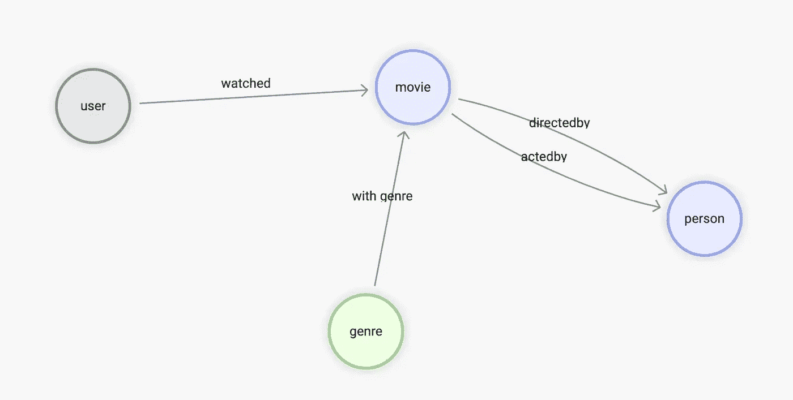

# 数据转换

确定了源日期后，让我们看看如何将它们映射并转换成图表。

# 来自 OMDB

首先是 OMDB 的数据，它由许多表组成，比如表`all_movies`，其中存储了所有电影及其不同语言的名称。

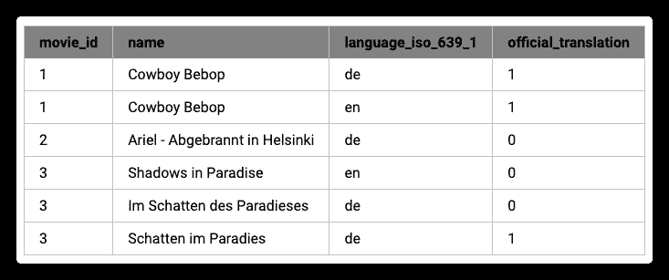

而`all_casts`桌容纳了电影行业的所有角色。

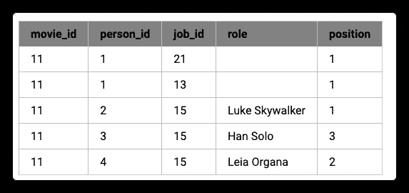

但是这里每个人的名字和其他信息，以及他/她在影片中担任的职位，都在单独的表格中。

*   `job_names`

例如，1 代表编剧，2 代表制片人。有趣的是，像电影 id 和名称一样，job_id 到名称是一对多的关系，因为 OMDB 的数据是多语言的。

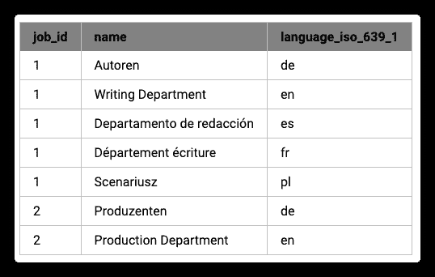

*   `all_people`

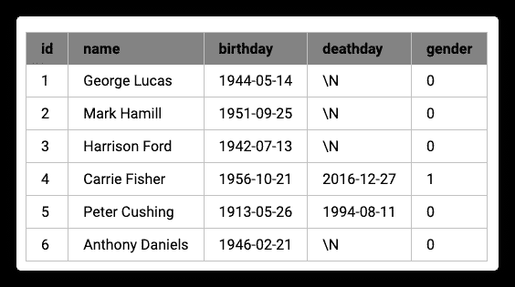

这是 RDBMS 中的一个典型情况，数据源是一个表结构，所以对于关系`movie <-[directed_by]-(person)`，涉及四个表`all_movies`、`all_casts`、`all_people`、`job_names`:

*   **导演 _ 导演**
*   在所有 _casts 中从 person_id 开始
*   到所有演员表中的电影 id
*   其中，职务 id 是职务名称中的“主管”
*   **电影**
*   所有 _casts 中的 person_id
*   按 id 从所有 _ 电影中命名，语言为“en”
*   **人**
*   所有演员表中的电影 id
*   所有人的姓名、生日

到目前为止，我们在 OMDB 关心的所有桌子是:

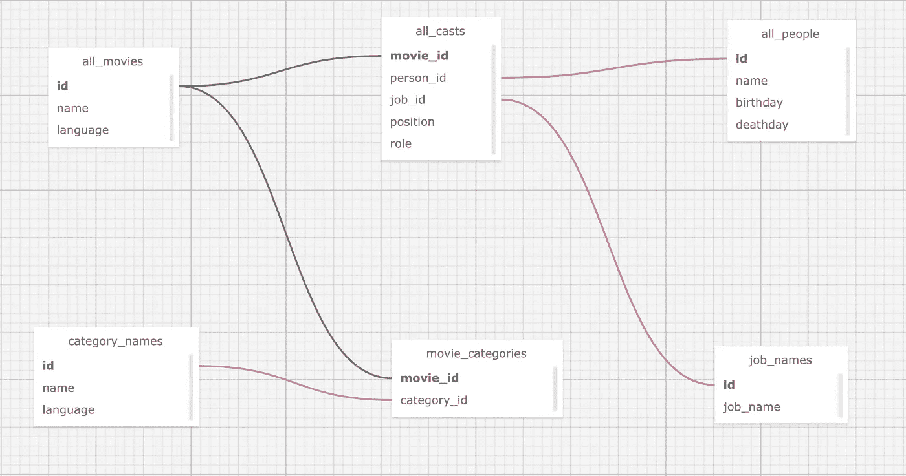

# 来自 MovieLens 数据集

虽然以上只是一个数据源，但在实际场景中，我们还需要从其他来源收集数据并汇总它们。例如，现在还需要从 MovieLens 数据集中提取知识。

这里，我们利用的唯一关系是:用户->电影。

*   `movies.csv`

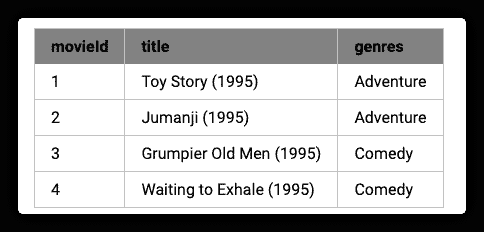

*   `ratings.csv`

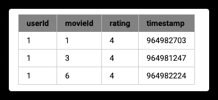

从两个表中的数据预览，自然地，我们需要一种类型的关系:`watched`和顶点:`user`:

*   **眼看着**
*   从`ratings.csv`中的用户标识开始
*   到`ratings.csv`中的 movieId
*   根据`ratings.csv`中的评级进行评级
*   **用户**
*   使用来自`ratings.csv`的用户 Id

但是，你一定注意到了，MovieLens 数据集中的 movieId 和 OMDB 的电影 Id 是两个不同的系统，如果我们需要将它们关联起来，就需要将 MovieLens 中的 movie id 转换成 OMDB 的电影 id，它们之间的关联条件是电影标题。

然而，通过观察，我们知道:

1.  OMDB 电影的片名是多语言的
2.  电影镜头中的片头在片尾有类似`(1995)`的年份信息

所以我们最后的结论是

*   **眼看着**
*   从`ratings.csv`中的用户标识开始
*   到`ratings.csv`中的 movieId
*   从`movies.csv`获取带有 movieId 的电影标题，并从 OMDB 找到它的 movie _ id——我们应该在语言:英语中匹配标题，去掉年份后缀
*   根据`ratings.csv`中的评级进行评级
*   **用户**
*   使用来自`ratings.csv`的用户 Id

现在，建模将两个表放在一起，如下图所示:


# 图形建模(属性图)

总而言之，我们需要聚合来自多个数据源的不同表格(或表格形式的 CSV 文件)，这样对应关系如图所示:其中蓝色虚线表示图中顶点的数据信息来源，粉色虚线表示边信息来源。

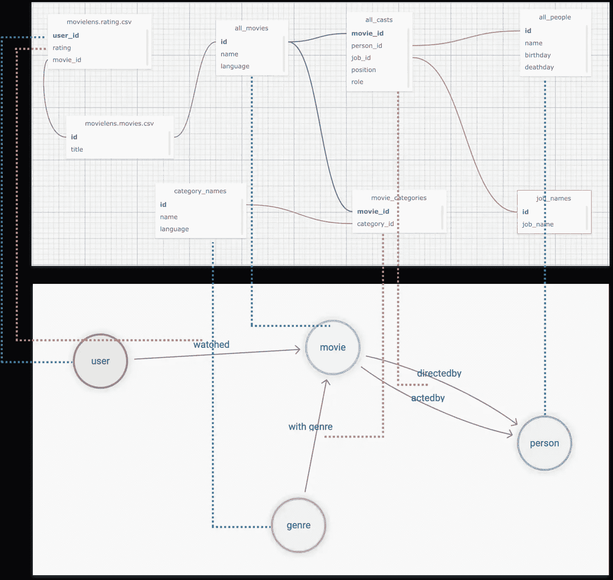

然后，我们必须格式化不同表中个人的 id，例如 user_id，这是一个自递增的数字，我们希望将其转换为全局唯一的 vertex_id。一种方便的方法是给现有的 id 添加一个字符串前缀，比如`u_`。

最后，对于关系`user -[watched]-> movie`，我们可以如下处理表结构数据。


其中，在每一行中，存在三个变量来构建图形结构:

*   `user`顶点 id
*   `movie`顶点 id
*   作为`watched`边沿属性的额定值

# 工具作业

至此，我们已经完成了数据分析和图形建模设计；在我们开始“提取相关性，导入图形数据库”之前，让我们介绍一下我们将使用的工具。

“提取关系”可以简单地认为是 ETL 中的提取和转换，本质上是数据映射和转换的工程，市面上有很多不同的工具和开源项目。这里我们使用我个人最喜欢的工具之一:dbt。

# dbt

dbt 是一个开源的数据转换工具，拥有非常成熟的社区和生态，可以在大多数主流数据仓库中执行高效、可控、高质量的数据转换工作，无论是对于临时任务还是复杂的编排，dbt 都可以非常胜任。

dbt 的一个特点是使用类似 SQL 的语言来描述数据转换的规则。使用 GitOps，在大型数据团队中协作和维护复杂的数据处理操作是非常优雅的。内置的数据测试功能使您能够控制数据的质量，并使其具有可重复性和可控性。

dbt 不仅有许多集成的子项目，而且可以与许多其他优秀的开源项目(meltano、AirFlow、Amundsen、Superset 等)结合。)要形成一套现代数据基础设施系统，请随意查看我以前的文章:数据沿袭和元数据治理参考架构[https://siwei.io/en/data-lineage-oss-ref-solution,](https://siwei.io/en/data-lineage-oss-ref-solution,)整个解决方案看起来像这样:

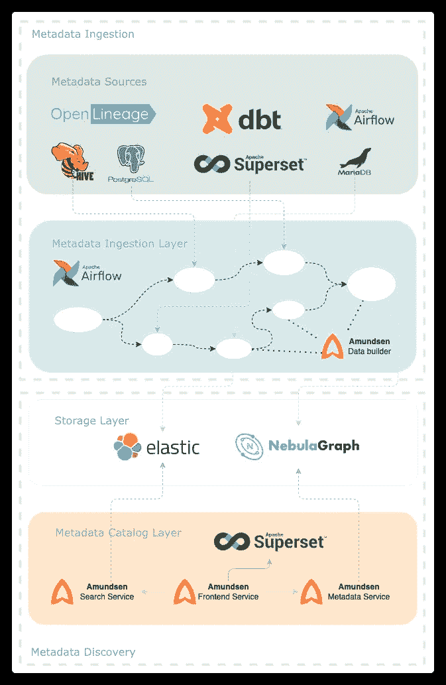

简而言之，dbt 是一个用 python 编写的命令行工具，我们可以创建一个项目文件夹，其中包含一个 YAML 格式的配置文件，指定数据转换的源信息在哪里，目标在哪里(处理后的数据存储在哪里，可能是 Postgres、Big Query、Spark 等。).在数据源中，我们使用 YAML 文件和`.SQL`文件来描述关于“从哪里获取数据，如何进行转换，以及输出什么”的信息。

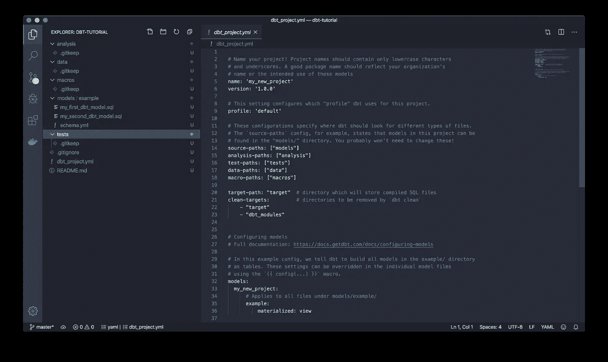

您可以看到，模型/示例中的信息是核心数据转换规则，所有其他数据都是与此转换相关的元数据。数据操作。

> *注意事项。*
> 
> *可以参考 dbt 文档，亲自了解一下:*[*https://docs . get dbt . com/docs/get-started/getting-started-dbt-core*](https://docs.getdbt.com/docs/get-started/getting-started-dbt-core)

# 星云图数据摄取

通过 dbt 处理数据后，我们可以得到直接映射到其属性的不同类型的顶点、边和表结构的中间数据，可以是 CSV 文件、DWs 中的表，甚至是 Spark 中的数据帧的形式，并且有不同的选项可以将它们导入到 NebulaGraph 中，其中 NebulaGraph Exchange、Nebula-Importer 和 Nebula-Spark-Connector 可以用于导入数据。

> *注释。*
> 
> *你可以在*[*https://siwei.io/en/sketches/nebula-data-import-options*](https://siwei.io/en/sketches/nebula-data-import-options)*了解更多关于导入星云图数据的不同工具，知道如何选择其中一个 c.*

这里我就用最简单的一个，Nebula-Importer 来举例。

Nebula-Importer 是一个用 Golang 编写的开源工具，可以编译成一个二进制文件，它可以从一个给定的 CSV 文件中获取顶点和边的对应关系，并通过预先配置的 YAML 格式文件读取和导入。

> *注意事项。*
> 
> 【星云-进口商】代号:[*https://github.com/vesoft-inc/nebula-importer/*](https://github.com/vesoft-inc/nebula-importer/)
> 
> *星云-导入器文档:*[*https://docs . Nebula-graph . io/master/Nebula-Importer/use-Importer/*](https://docs.nebula-graph.io/master/nebula-importer/use-importer/)

# dbt +星云-进口商在

现在让我们使用 dbt + Nebula-Importer 来端到端演示如何提取、转换和导入多个数据源到 NebulaGraph 中，整个项目代码已经开源，资源库在[https://github.com/wey-gu/movie-recommendation-dataset,](https://github.com/wey-gu/movie-recommendation-dataset,)随时查看那里的详细信息。

整个过程如下。

*   预处理原始数据并将其导入数据仓库(EL)
*   使用 dbt 转换数据(transform)，并将其导出到 CSV 文件
*   使用 Nebula Importer (L)将 CSV 导入 NebulaGraph

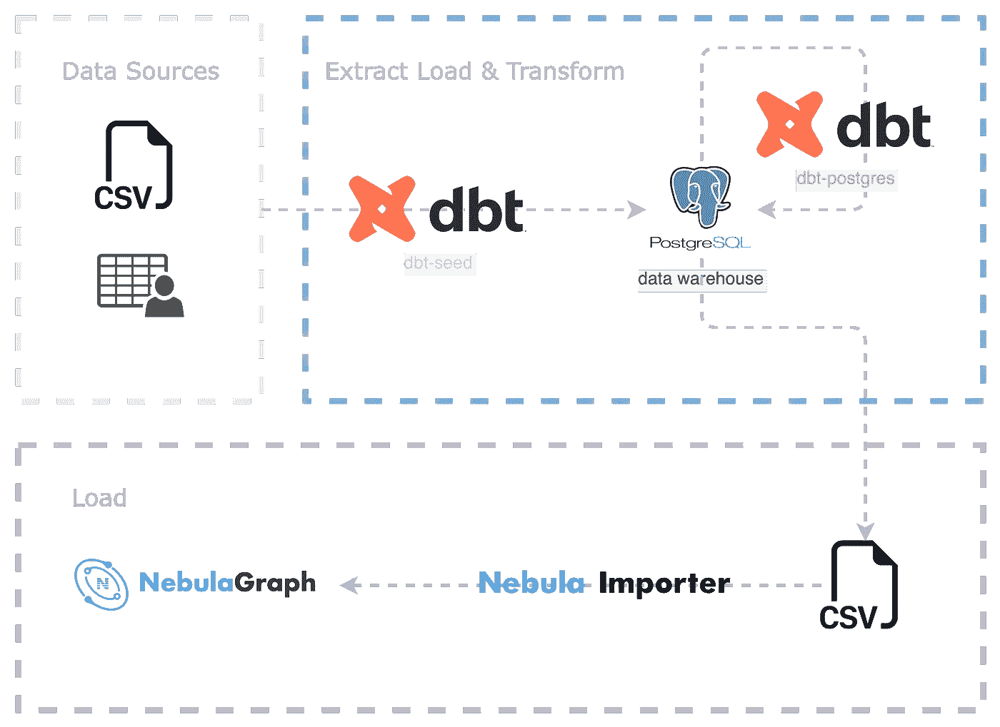

# 准备 dbt 环境

dbt 是一个 python 项目，我们在一个虚拟的 python3 环境中安装 dbt 和 dbt-postgres。

# 用 dbt 设置环境

dbt 是用 python 编写的，我们可以将它与 dbt-postgres 一起安装在 python 虚拟 env 中，因为我们将在这个示例项目中使用 postgres 作为 DW。

```
python3 -m venv .venv
source .venv/bin/activate
pip install dbt-postgres
```

创建 dbt 项目:

```
dbt init dbt_project
cd dbt_project
```

让我们看看这个项目中的文件:

```
$ tree .
.
|-- README.md                      # README of the project
|-- analyses
|-- dbt_project.yml                # dbt project conf
|-- macros
|-- models                         # transforms
|   \-- example
|       |-- my_first_dbt_model.sql # meta data to describe transform rules from the source data with SELECT
|       |-- my_second_dbt_model.sql
|       \-- schema.yml             # the meta data of the rules
|-- seeds                          # for CSV-file data sources
|-- snapshots
\-- tests
```

```
7 directories, 5 files
```

最后，让我们启动一个 Postgress 作为 DW，如果你已经有一个，你可以跳过这一步，请确保配置和 dbt 插件是一致的，如果你选择使用自己的 DW。

```
docker run --rm --name postgres \
    -e POSTGRES_PASSWORD=nebula \
    -e POSTGRES_USER=nebula \
    -e POSTGRES_DB=warehouse -d \
    -p 5432:5432 postgres
```

# 数据下载和预处理

让我们创建一个名为`raw_data`的文件夹，并将目录更改为它。

```
mkdir -p raw_data
cd raw_data
```

我们估计这是在我们的 dbt 项目下:

```
tree ..
..
|-- README.md
|-- analyses
|-- dbt_project.yml
|-- macros
|-- models
|   \-- example
|       |-- my_first_dbt_model.sql
|       |-- my_second_dbt_model.sql
|       \-- schema.yml
|-- raw_data                       # <--- newly created data
|-- seeds
|-- snapshots
\-- tests
```

```
8 directories, 5 files
```

下载并解压缩 omdb 数据:

```
wget www.omdb.org/data/all_people.csv.bz2
wget www.omdb.org/data/all_people_aliases.csv.bz2
wget www.omdb.org/data/people_links.csv.bz2
wget www.omdb.org/data/all_casts.csv.bz2
wget www.omdb.org/data/job_names.csv.bz2
wget www.omdb.org/data/all_characters.csv.bz2
wget www.omdb.org/data/movie_categories.csv.bz2
wget www.omdb.org/data/movie_keywords.csv.bz2
wget www.omdb.org/data/category_names.csv.bz2
wget www.omdb.org/data/all_categories.csv.bz2
wget www.omdb.org/data/all_movie_aliases_iso.csv.bz2
bunzip2 *.bz2
```

对于 then MovieLens 数据集:

```
wget https://files.grouplens.org/datasets/movielens/ml-latest-small.zip
unzip ml-latest-small.zip
rm *.zip
```

在使用 dbt 进行转换之前，我们做了一些简单的预处理，然后将它们放在`seeds`下:

```
grep -v '\\"' raw_data/all_movie_aliases_iso.csv > seeds/all_movie_aliases_iso.csv
grep -v '\\"' raw_data/all_casts.csv > seeds/all_casts.csv
grep -v '\\"' raw_data/all_characters.csv > seeds/all_characters.csv
grep -v '\\"' raw_data/all_people.csv > seeds/all_people.csv
grep -v '\\"' raw_data/category_names.csv > seeds/category_names.csv
grep -v '\\"' raw_data/job_names.csv > seeds/job_names.csv
cp raw_data/movie_categories.csv seeds/movie_categories.csv
cp raw_data/movie_keywords.csv seeds/movie_keywords.csv
cp raw_data/all_categories.csv seeds/all_categories.csv
cp raw_data/ml-latest-small/ratings.csv seeds/movielens_ratings.csv
cp raw_data/ml-latest-small/movies.csv seeds/movielens_movies.csv
```

放置好上述文件后，我们可以用一个命令将它们加载到 DW 中:

> *参考 dbt*`*seeds*`*[*https://docs.getdbt.com/docs/build/seeds*](https://docs.getdbt.com/docs/build/seeds)的文件*

```
*dbt seed*
```

*如果你像我一样使用本地 postgres，可能需要一段时间，在生产级别的情况下(即从云存储中的文件加载到大查询)，应该会更快，应该是这样的:*

```
*$ dbt seed
05:58:27  Running with dbt=1.3.0
05:58:27  Found 2 models, 4 tests, 0 snapshots, 0 analyses, 289 macros, 0 operations, 11 seed files, 0 sources, 0 exposures, 0 metrics
05:58:28  
05:58:28  Concurrency: 8 threads (target='dev')
05:58:28  
05:58:28  1 of 11 START seed file public.all_casts ....................................... [RUN]
...
07:10:11  1 of 11 OK loaded seed file public.all_casts ................................... [INSERT 1082228 in 4303.78s]
07:10:11  
07:10:11  Finished running 11 seeds in 1 hours 11 minutes and 43.93 seconds (4303.93s).
07:10:11  
07:10:11  Completed successfully
07:10:11  
07:10:11  Done. PASS=11 WARN=0 ERROR=0 SKIP=0 TOTAL=11*
```

## *构建转换模型*

*我们在`models`下创建转换:*

```
*mkdir models/movie_recommedation
touch models/movie_recommedation/user_watched_movies.sql
touch models/movie_recommedation/schema.yml*
```

*这些文件如下:*

```
*$ tree models
models
\-- movie_recommedation
    |-- user_watched_movies.sql
    \-- schema.yml*
```

*现在这个模型下只有一个变换规则:处理`user_watched_movies.sql`中`user_watched_movies`的边缘*

*由于我们计划输出三列:user_id、movie_id、rating，因此`schema.yml`类似于:*

```
*version: 2*
```

```
*models:
  - name: user_watched_movies
    description: "The edges between users and movies they have watched"
    columns:
      - name: user_id
        description: "user id"
        tests:
          - not_null
      - name: movie_id
        description: "movie id"
        tests:
          - not_null
      - name: rating
        description: "rating given by user to movie"
        tests:
          - not_null*
```

*请注意`tests`是关于数据的验证和约束，有了它，我们可以很容易地控制数据质量。这里的`not_null`确保测试执行时没有空值。*

*然后，我们来作曲`user_watched_movies.sql`:*

```
*{{ config(materialized='table') }}*
```

```
*/*
 JOIN the movieielens_ratings table with the movieielens_movies table, and removing the movie title tailing the year of release
 */
WITH user_watched_movies AS(
    SELECT moveielens_ratings."userId",
        moveielens_ratings."movieId",
        moveielens_ratings.rating,
        REGEXP_REPLACE(moveielens_movies.title, ' \(\d{4}\)$', '') AS title,
        moveielens_movies.genres AS movielens_genres
    FROM moveielens_ratings
        JOIN moveielens_movies ON moveielens_movies."movieId" = moveielens_ratings."movieId"
)
/* 
 JOIN user_watched_movies table with all_movie_aliase_iso table where language is English
 the join condition is the movie title
 */
SELECT concat('u_',user_watched_movies."userId") AS user_id,
    user_watched_movies.rating,
    user_watched_movies.title,
    all_movie_aliases_iso."movie_id" AS OMDB_movie_id,
    user_watched_movies.movielens_genres
FROM user_watched_movies
    JOIN all_movie_aliases_iso ON user_watched_movies.title LIKE CONCAT(all_movie_aliases_iso.name, '%')
    AND all_movie_aliases_iso.language_iso_639_1 = 'en'*
```

*这条 SQL 做的是绿色圆圈标记的部分:*

*   *从`moveielens_ratings`中选择用户 id、电影 id、分级、电影名称(去掉年份部分)并保存为`user_watched_movies`的中间表*
*   *电影片名是从`moveielens_movies`编辑而来的`JOIN`，与`movie_id`的匹配条件相同*
*   *从`user_watched_movies`中选择用户 id(前缀`u_`)、分级、标题、OMDB _ 电影 _id*
*   *OMDB _ 电影 _id 是由`all_movie_aliases_iso`演变而来的`JOIN`，由相似电影名匹配 OMDB 电影的中英文片名得到*
*   *输出最终字段*

*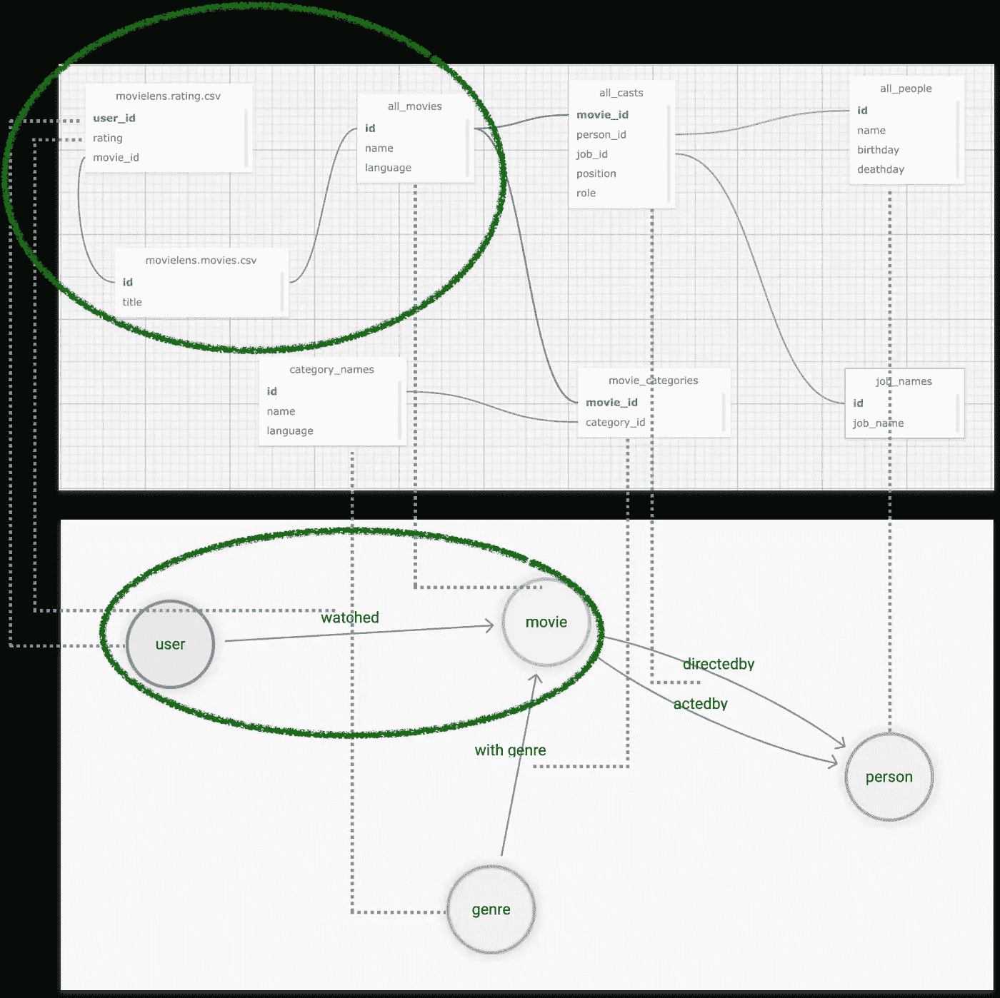*

> **提示:我们可以添加* `*LIMIT*` *来从 Postgres 控制台快速调试 SQL 查询**

*然后我们可以从 dbt 运行它来转换和测试规则:*

```
*dbt run -m user_watched_movies*
```

*之后，我们应该能够在 Postgres (DW)中看到转换后的表格。*

*类似地，对转换规则的所有其他部分遵循相同的方法，我们可以有其他模型:*

```
*$ tree models
models
\-- movie_recommedation
    |-- acted_by.sql
    |-- directed_by.sql
    |-- genres.sql
    |-- movies.sql
    |-- people.sql
    |-- schema.yml
    |-- user_watched_movies.sql
    \-- with_genre.sql*
```

*然后全部运行:*

```
*dbt run -m acted_by
dbt run -m directed_by
dbt run -m with_genre
dbt run -m people
dbt run -m genres
dbt run -m movies*
```

## *将数据导出到 CSV*

*其实 NebulaGraph Exchange 本身支持直接导入很多数据源(Postgres、Clickhouse、MySQL、Hive 等。)到 NebulaGraph 中，但是在这个例子中，我们处理的数据量对于 NebulaGraph 来说非常小，所以我们只使用最轻量级的一个:Nebula-Importer。Nebula-Importer 只能导入 CSV 文件，所以我们正在这样做。*

*首先，我们进入 Postgres 控制台并执行`COPY`命令*

> **参考 Postgres 文档:*[*https://www.postgresql.org/docs/current/sql-copy.html*](https://www.postgresql.org/docs/current/sql-copy.html)*

```
*COPY acted_by TO '/tmp/acted_by.csv'  WITH DELIMITER ',' CSV HEADER;
COPY directed_by TO '/tmp/directed_by.csv'  WITH DELIMITER ',' CSV HEADER;
COPY with_genre TO '/tmp/with_genre.csv'  WITH DELIMITER ',' CSV HEADER;
COPY people TO '/tmp/people.csv'  WITH DELIMITER ',' CSV HEADER;
COPY movies TO '/tmp/movies.csv'  WITH DELIMITER ',' CSV HEADER;
COPY genres TO '/tmp/genres.csv'  WITH DELIMITER ',' CSV HEADER;
-- for user_watched_movies, we don't output HEADER, as we will parse it in importer in a no-header way.
COPY user_watched_movies TO '/tmp/user_watched_movies.csv'  WITH DELIMITER ',' CSV;*
```

*然后将 CSV 文件复制到`to_nebulagraph`*

```
*mkdir -p to_nebulagraph
docker cp postgres:/tmp/. to_nebulagraph/*
```

## *将数据导入 NebulaGraph*

*引导星云星团*

*我们可以使用 Nebula-Up 和 oneliner 来创建一个 NebulaGraph 游乐场集群。*

> **注:**
> 
> *星云团:[https://github.com/wey-gu/nebula-up](https://github.com/wey-gu/nebula-up)*
> 
> *数据集储存库:[https://github.com/wey-gu/movie-recommendation-dataset](https://github.com/wey-gu/movie-recommendation-dataset)*

```
*curl -fsSL nebula-up.siwei.io/install.sh | bash*
```

***定义数据模式***

*首先，我们需要创建一个图形空间，然后在其上创建标记(顶点类型)和边类型:*

*访问 Nebula 控制台(NebulaGraph 的 CLI 客户端):*

```
*~/.nebula-up/console.sh*
```

*运行以下 DDL(数据定义语言):*

```
*CREATE SPACE moviegraph(partition_num=10,replica_factor=1,vid_type=fixed_string(32));
:sleep 20
USE moviegraph;
CREATE TAG person(name string, birthdate string);
CREATE TAG movie(name string);
CREATE TAG genre(name string);
CREATE TAG user(user_id string);
CREATE EDGE acted_by();
CREATE EDGE directed_by();
CREATE EDGE with_genre();
CREATE EDGE watched(rate float);
exit*
```

*创建 Nebula-Importer 配置文件*

*该配置是一个 YAML 文件，描述了 CSV 文件和簇中的顶点或边数据之间的对应关系。*

*详见文档:[https://docs . nebula-graph . io/master/nebula-importer/use-importer/](https://docs.nebula-graph.io/master/nebula-importer/use-importer/)。*

*我已经为它创建了一个，可以在[https://github . com/wey-gu/movie-recommendation-dataset/blob/main/nebula-importer . YAML .](https://github.com/wey-gu/movie-recommendation-dataset/blob/main/nebula-importer.yaml.)下载*

*在这里，我们将直接下载配置文件。*

> **注意，这个文件不应该是 dbt 项目文件的一部分。:**

```
*cd ..
wget https://raw.githubusercontent.com/wey-gu/movie-recommendation-dataset/main/nebula-importer.yaml*
```

*摄取数据*

*让我们使用 docker 中的 Nebula-Importer 来避免任何安装:*

```
*docker run --rm -ti \
    --network=nebula-net \
    -v ${PWD}:/root/ \
    -v ${PWD}/dbt_project/to_nebulagraph/:/data \
    vesoft/nebula-importer:v3.2.0 \
    --config /root/nebula-importer.yaml*
```

*执行后，所有数据都在 NebulaGraph 中，我们可以从 Nebula-Console 检查数据:*

*首先，再次访问控制台:*

```
*~/.nebula-up/console.sh*
```

*进入图形空间并执行`SHOW STATS`*

```
*USE moviegraph;
SHOW STATS;*
```

*结果应该是这样的:*

```
*(root@nebula) [moviegraph]> SHOW STATS;
+---------+---------------+---------+
| Type    | Name          | Count   |
+---------+---------------+---------+
| "Tag"   | "genre"       | 14397   |
| "Tag"   | "movie"       | 20701   |
| "Tag"   | "person"      | 263907  |
| "Tag"   | "user"        | 610     |
| "Edge"  | "acted_by"    | 673763  |
| "Edge"  | "directed_by" | 101949  |
| "Edge"  | "watched"     | 31781   |
| "Edge"  | "with_genre"  | 194009  |
| "Space" | "vertices"    | 299615  |
| "Space" | "edges"       | 1001502 |
+---------+---------------+---------+
Got 10 rows (time spent 1693/15136 us)*
```

*使用 Nebula-Studio，我们还可以在可视化界面中探索这个图表，例如，通过执行这个查询，我们可以看到它向 id 为 u_124 的用户推荐 id 为 1891 的电影的原因？*

```
*FIND NOLOOP PATH FROM "u_124" TO "1891" over * BIDIRECT UPTO 4 STEPS yield path as `p` | LIMIT 20*
```

*结果可能是:曾经最受欢迎的星球大战电影的大多数演员和工作人员也参与了这部同样的“奥斯卡获奖”和“经典”电影。*

*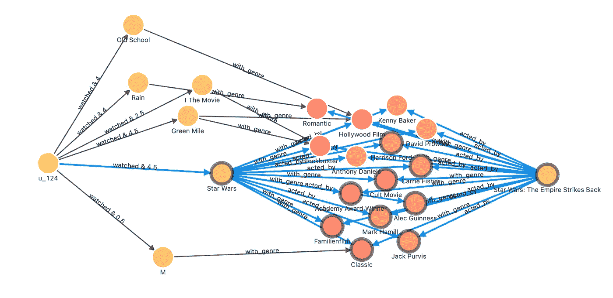*

> *在另一篇文章中，我使用了相同的图来演示更多的图数据库和图算法在推荐系统中的应用。如果有兴趣，请阅读:[*https://siwei.io/recommendation-system-with-graphdb/.*](https://siwei.io/recommendation-system-with-graphdb/.)*

# *摘要*

*当我们计划利用海量数据的图形数据库来转换知识和分析见解时，第一步通常是将多个数据源转换、处理和建模为图形数据。对于不知道从哪里开始的初学者来说，一个可行的想法是从所有相关的信息开始，描绘出最关心的关系，然后列出可以获得的顶点，以及需要附加的顶点。在确定初始建模之后，您可以使用 ETL 工具来清理原始数据，ETL 成将被映射到图形的表结构，最后，使用 import 工具来导入 NebulaGraph，用于进一步的模型迭代。*

*在 dbt 的帮助下，我们可以对我们的建模和数据转换进行版本控制、测试和迭代，并逐渐进化和丰富所构建的知识图。*