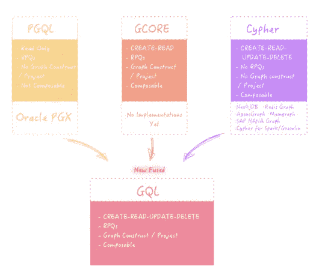
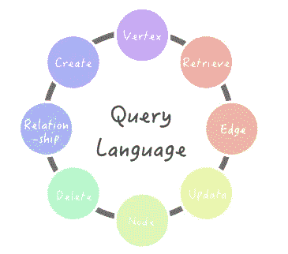
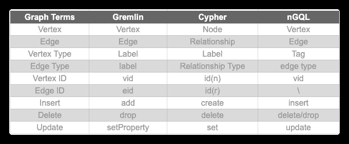
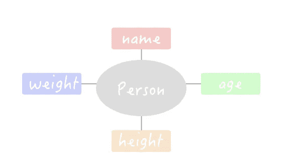
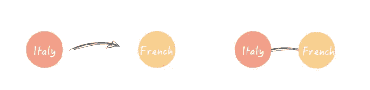
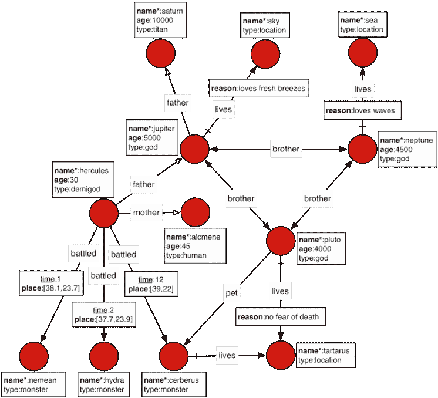

# 图查询语言对比:Gremlin vs Cypher vs nGQL

> 原文：<https://itnext.io/graph-query-language-comparison-gremlin-vs-cypher-vs-ngql-3680cf830f8b?source=collection_archive---------4----------------------->



# 要比较哪些图形查询语言



## 小妖精

Gremlin 是由 Apache TinkerPop 开发的一种图形遍历语言，已经被许多图形数据库解决方案所采用。可以是**的陈述性**，也可以是**的祈使性**。

Gremlin 基于 Groovy，但有许多语言变体，允许开发人员用许多现代编程语言(如 Java、JavaScript、Python、Scala、Clojure 和 Groovy)原生编写 Gremlin 查询。

**支持的图数据库** : Janus Graph、InfiniteGraph、Cosmos DB、DataStax Enterprise(5.0+)和亚马逊 Neptune。

## 赛弗

[Cypher](https://www.google.com/url?sa=t&rct=j&q=&esrc=s&source=web&cd=13&cad=rja&uact=8&ved=2ahUKEwi5-ZfEtfvnAhWSad4KHTDpClwQFjAMegQIBRAB&url=https%3A%2F%2Fen.wikipedia.org%2Fwiki%2FCypher&usg=AOvVaw3rCtDns3Bbr5mIuBpSN4hr) 是一种声明式图形查询语言，允许在属性图中进行富有表现力和高效的数据查询。

这种语言是用 SQL 的强大功能设计的。Cypher 语言的关键字不区分大小写，但是属性、标签、关系类型和变量区分大小写。

**支持的图形数据库** : Neo4j、AgensGraph 和 RedisGraph

## nGQL

[**NebulaGraph**](https://nebula-graph.io) 引入了自己的查询语言 [nGQL](https://docs.nebula-graph.io/manual-EN/1.overview/1.concepts/2.nGQL-overview/) ，这是一种声明式的、文本化的查询语言，类似于 SQL，但是是为图形设计的。

nGQL 语言的关键字是区分大小写的，它支持语句合成，因此不需要嵌入语句。

**支持图形数据库**:星云图

# 术语比较

在比较这三种图查询语言之前，我们先来看看它们的术语和概念。下表解释了这些语言如何定义节点和边:



语法比较— CRUD

了解了 Gremlin、Cypher 和 nGQL 中的常用术语后，让我们来看看这些图形查询语言的一般语法。

本节将分别带您了解 Gremlin、Cypher 和 nGQL 的基本 CRUD 语法。

## 图表

关于如何创建图形空间，请参考以下示例。我们省略了 Cypher，因为在向图形数据库添加任何数据之前，您不需要创建图形空间。

```
# Create a graph that Gremlin can traverse
g = TinkerGraph.open().traversal()# Create a graph space in nGQL
CREATE SPACE gods
```

## 顶点

我们都知道图是由节点和边组成的。Cypher 中的一个节点在 Gremlin 和 nGQL 中称为顶点。边是两个节点之间的连接。

参考下面分别在这些查询语言中插入新顶点的例子。

```
# Insert vertex in Gremlin
g.addV(vertexLabel).property()# Insert vertex in Cypher
CREATE (:nodeLabel {property})# Insert vertex in nGQL
INSERT VERTEX tagName (propNameList) VALUES vid:(tagKey propValue)
```

顶点类型

节点/顶点可以有类型。它们在 Gremlin 和 Cypher 中称为标签，在 nGQL 中称为标签。

一个顶点类型可以有多个属性。例如，顶点类型*人物*有两个属性，即*姓名*和*年龄*。



```
Create Vertex Type
```

请参考下面的顶点类型创建示例。我们省略了 Cypher，因为在插入数据之前不需要标签。

```
# Create vertex type in Gremlin
g.addV(vertexLabel).property()# Create vertex type in nGQL
CREATE tagName(PropNameList)
```

注意，Gremlin 和 nGQL 都支持 IF NOT EXISTS。该关键字自动检测相应的顶点类型是否存在。如果它不存在，则创建一个新的。否则，不会创建任何顶点类型。

```
Show Vertex Types
```

创建顶点类型后，您可以使用以下查询来显示它们。他们将列出所有标签/标记，而不是某些标签/标记。

```
# Show vertex types in Gremlin
g.V().label().dedup();# Show vertex types in Cypher method 1
MATCH (n) 
RETURN DISTINCT labels(n)
# Show vertex types in Cypher method 2
CALL db.labels();# Show vertex types in nGQL
SHOW TAGS
```

顶点上的污垢

本节介绍使用三种查询语言对顶点进行的基本 CRUD 操作。

```
Insert Vertices# Insert vertex of certain type in Gremlin
g.addV(String vertexLabel).property()# Insert vertex of certain type in Cypher
CREATE (node:label) # Insert vertex of certain type in nGQL
INSERT VERTEX <tag_name> (prop_name_list) VALUES <vid>:(prop_value_list)Get Vertices# Fetch vertices in Gremlin
g.V(<vid>)# Fetch vertices in Cypher
MATCH (n) 
WHERE condition
RETURN properties(n)# Fetch vertices in nGQL
FETCH PROP ON <tag_name> <vid>Delete Vertices# Delete vertex in Gremlin
g.V(<vid>).drop()# Delete a vertex in Cypher
MATCH (node:label) 
DETACH DELETE node# Delete vertex in nGQL
DELETE VERTEX <vid>Update a Vertex's Property
```

本节将向您展示如何更新顶点的属性。

```
# Update vertex in Gremlin
g.V(<vid>).property()# Update vertex in Cypher
SET n.prop = V# Update vertex in nGQL
UPDATE VERTEX <vid> SET <update_columns>
```

Cypher 和 nGQL 都使用关键字 SET 来设置顶点类型，只是 nGQL 中增加了 UPDATE 关键字来标识操作。Gremlin 的操作类似于上面提到的抓取顶点，只是增加了改变属性的操作。

## 优势

本节介绍边上的基本 CRUD 操作。

边缘类型

像顶点一样，边也可以有类型。

```
# Create an edge type in Gremlin
g.edgeLabel()# Create an edge type in nGQL
CREATE EDGE edgeTypeName(propNameList)
```

边缘有污垢

```
Insert Edges of Certain Types
```

插入边类似于插入顶点。Cypher 用-[]-->和 nGQL 分别用->表示边。Gremlin 使用关键字 to()来指示边方向。

缺省情况下，三种语言中的边都是定向的。下面左边的图表是有向边，而右边的图表是无向边。



```
# Insert edge of certain type in Gremlin
g.addE(String edgeLabel).from(v1).to(v2).property()# Insert edge of certain type in Cypher
CREATE (<node1-name>:<label1-name>)-
  [(<relationship-name>:<relationship-label-name>)]
  ->(<node2-name>:<label2-name>)# Insert edge of certain type in nGQL
INSERT EDGE <edge_name> ( <prop_name_list> ) VALUES <src_vid> -> <dst_vid>: ( <prop_value_list> )Delete Edges# Delete edge in Gremlin
g.E(<eid>).drop()# Delete edge in Cypher
MATCH (<node1-name>:<label1-name>)-[r:relationship-label-name]->()
DELETE r# Delete edge in nGQL
DELETE EDGE <edge_type> <src_vid> -> <dst_vid>Fetch Edges# Fetch edges in Gremlin
g.E(<eid>)# Fetch edges in Cypher
MATCH (n)-[r:label]->()
WHERE condition
RETURN properties(r)# Fetch edges in nGQL
FETCH PROP ON <edge_name> <src_vid> -> <dst_vid>
```

## 其他操作

除了顶点和边上常见的 CRUD，我们还将向您展示三种图形查询语言中的一些组合查询。

遍历边缘

```
# Traverse edges with specified vertices in Gremlin
g.V(<vid>).outE(<edge>)# Traverse edges with specified vertices in Cypher
Match (n)->[r:label]->[]
WHERE id(n) = vid
RETURN r# Traverse edges with specified vertices in nGQL
GO FROM <vid> OVER <edge>
```

反向遍历边

在反向遍历中，GremlIn 用 in 表示反转，Cypher 用

```
# Traverse edges reversely with specified vertices Gremlin
g.V(<vid>).in(<edge>)# Traverse edges reversely with specified vertices Cypher
MATCH (n)<-[r:label]-()# Traverse edges reversely with specified vertices nGQL
GO FROM <vid>  OVER <edge> REVERSELY
```

Traverse edges bidirectionally

If the edge direction is [不相关](https://www.google.com/search?q=irrelevant&spell=1&sa=X&ved=2ahUKEwjR1fPGovvnAhUsIDQIHXSzDRIQkeECKAB6BAgOECs)(两个方向都可以)，Gremlin 都用 thE()，Cypher use -[]-，nGQL 用关键字 BIDIRECT。

```
# Traverse edges reversely with specified vertices Gremlin
g.V(<vid>).bothE(<edge>)# Traverse edges reversely with specified vertices Cypher
MATCH (n)-[r:label]-()# Traverse edges reversely with specified vertices nGQL
GO FROM <vid>  OVER <edge> BIDIRECT
```

沿指定边查询 N 跳

Gremlin 和 nGQL 分别用时间和步长来表示 N 跳。Cypher 使用关系*N。

```
# Query N hops along specified edge in Gremlin
g.V(<vid>).repeat(out(<edge>)).times(N)# Query N hops along specified edge in Cypher
MATCH (n)-[r:label*N]->()
WHERE condition
RETURN r# Query N hops along specified edge in nGQL
GO N STEPS FROM <vid> OVER <edge>
```

查找两个顶点之间的路径

```
# Find paths between two vertices in Gremlin
g.V(<vid>).repeat(out()).until(<vid>).path()# Find paths between two vertices in Cypher
MATCH p =(a)-[.*]->(b)
WHERE condition
RETURN p# Find paths between two vertices in nGQL
FIND ALL PATH FROM <vid> TO <vid> OVER *
```

# 示例查询

本节介绍一些演示查询。

## 演示模型:神的图形

本节中的示例广泛使用了分布有[杰纳斯图](https://janusgraph.org/)的玩具图，称为 [*天神图*](https://docs.janusgraph.org/#getting-started) ，如下图所示。

这个例子描述了罗马万神殿的存在和地点之间的关系。



## 插入数据

```
# Inserting vertices
## nGQL
nebula> INSERT VERTEX character(name, age, type) VALUES hash("saturn"):("saturn", 10000, "titan"), hash("jupiter"):("jupiter", 5000, "god");
## Gremlin
gremlin> saturn = g.addV("character").property(T.id, 1).property('name', 'saturn').property('age', 10000).property('type', 'titan').next();
==>v[1]
gremlin> jupiter = g.addV("character").property(T.id, 2).property('name', 'jupiter').property('age', 5000).property('type', 'god').next();
==>v[2]
gremlin> prometheus = g.addV("character").property(T.id, 31).property('name',  'prometheus').property('age', 1000).property('type', 'god').next();
==>v[31]
gremlin> jesus = g.addV("character").property(T.id, 32).property('name',  'jesus').property('age', 5000).property('type', 'god').next();
==>v[32]
## Cypher
cypher> CREATE (src:character {name:"saturn", age: 10000, type:"titan"})
cypher> CREATE (dst:character {name:"jupiter", age: 5000, type:"god"})# Inserting edges
## nGQL
nebula> INSERT EDGE father() VALUES hash("jupiter")->hash("saturn"):();
## Gremlin
gremlin> g.addE("father").from(jupiter).to(saturn).property(T.id, 13);
==>e[13][2-father->1]
## Cypher
cypher> CREATE (src)-[rel:father]->(dst)
```

## 删除

```
# nGQL
nebula> DELETE VERTEX hash("prometheus");
# Gremlin
gremlin> g.V(prometheus).drop();
# Cypher
cypher> MATCH (n:character {name:"prometheus"}) DETACH DELETE n
```

## 更新

```
# nGQL
nebula> UPDATE VERTEX hash("jesus") SET character.type = 'titan';
# Gremlin
gremlin> g.V(jesus).property('age', 6000);
==>v[32]
# Cypher
cypher> MATCH (n:character {name:"jesus"}) SET n.type = 'titan';
```

## 获取/读取

```
# nGQL
nebula> FETCH PROP ON character hash("saturn");
===================================================
| character.name | character.age | character.type |
===================================================
| saturn         | 10000         | titan          |
---------------------------------------------------
# Gremlin
gremlin> g.V(saturn).valueMap();
==>[name:[saturn],type:[titan],age:[10000]]
# Cypher
cypher> MATCH (n:character {name:"saturn"}) RETURN properties(n)
  ╒════════════════════════════════════════════╕
  │"properties(n)"                             │
  ╞════════════════════════════════════════════╡
  │{"name":"saturn","type":"titan","age":10000}│
  └────────────────────────────────────────────┘
```

## 找到赫拉克勒斯父亲的名字

```
# nGQL
nebula>  LOOKUP ON character WHERE character.name == 'hercules' | \
      -> GO FROM $-.VertexID OVER father YIELD $$.character.name;
=====================
| $$.character.name |
=====================
| jupiter           |
---------------------
# Gremlin
gremlin> g.V().hasLabel('character').has('name','hercules').out('father').values('name');
==>jupiter
# Cypher
cypher> MATCH (src:character{name:"hercules"})-[:father]->(dst:character) RETURN dst.name
      ╒══════════╕
      │"dst.name"│
      ╞══════════╡
      │"jupiter" │
      └──────────┘
```

## 找到赫拉克勒斯祖父的名字

```
# nGQL
nebula> LOOKUP ON character WHERE character.name == 'hercules' | \
     -> GO 2 STEPS FROM $-.VertexID OVER father YIELD $$.character.name;
=====================
| $$.character.name |
=====================
| saturn            |
---------------------
# Gremlin
gremlin> g.V().hasLabel('character').has('name','hercules').out('father').out('father').values('name');
==>saturn
# Cypher
cypher> MATCH (src:character{name:"hercules"})-[:father*2]->(dst:character) RETURN dst.name
      ╒══════════╕
      │"dst.name"│
      ╞══════════╡
      │"saturn"  │
      └──────────┘
```

## 找出年龄大于 100 岁的人物

```
# nGQL
nebula> LOOKUP ON character WHERE character.age > 100 YIELD character.name, character.age;
=========================================================
| VertexID             | character.name | character.age |
=========================================================
| 6761447489613431910  | pluto          | 4000          |
---------------------------------------------------------
| -5860788569139907963 | neptune        | 4500          |
---------------------------------------------------------
| 4863977009196259577  | jupiter        | 5000          |
---------------------------------------------------------
| -4316810810681305233 | saturn         | 10000         |
---------------------------------------------------------
# Gremlin
gremlin> g.V().hasLabel('character').has('age',gt(100)).values('name');
==>saturn
==>jupiter
==>neptune
==>pluto
# Cypher
cypher> MATCH (src:character) WHERE src.age > 100 RETURN src.name
      ╒═══════════╕
      │"src.name" │
      ╞═══════════╡
      │  "saturn" │
      ├───────────┤
      │ "jupiter" │
      ├───────────┤
      │ "neptune" │
      │───────────│
      │  "pluto"  │
      └───────────┘
```

## 找出布鲁托的同居者，不包括布鲁托本人

```
# nGQL
nebula>  GO FROM hash("pluto") OVER lives YIELD lives._dst AS place | GO FROM $-.place OVER lives REVERSELY WHERE \
$$.character.name != "pluto" YIELD $$.character.name AS cohabitants;
===============
| cohabitants |
===============
| cerberus    |
---------------
# Gremlin
gremlin> g.V(pluto).out('lives').in('lives').where(is(neq(pluto))).values('name');
==>cerberus
# Cypher
cypher> MATCH (src:character{name:"pluto"})-[:lives]->()<-[:lives]-(dst:character) RETURN dst.name
      ╒══════════╕
      │"dst.name"│
      ╞══════════╡
      │"cerberus"│
      └──────────┘
```

## 布鲁托的兄弟

```
# which brother lives in which place?
## nGQL
nebula> GO FROM hash("pluto") OVER brother YIELD brother._dst AS god | \
GO FROM $-.god OVER lives YIELD $^.character.name AS Brother, $$.location.name AS Habitations;
=========================
| Brother | Habitations |
=========================
| jupiter | sky         |
-------------------------
| neptune | sea         |
-------------------------
## Gremlin
gremlin> g.V(pluto).out('brother').as('god').out('lives').as('place').select('god','place').by('name');
==>[god:jupiter, place:sky]
==>[god:neptune, place:sea]
## Cypher
cypher> MATCH (src:Character{name:"pluto"})-[:brother]->(bro:Character)-[:lives]->(dst)
RETURN bro.name, dst.name
      ╒═════════════════════════╕
      │"bro.name"    │"dst.name"│
      ╞═════════════════════════╡
      │ "jupiter"    │  "sky"   │
      ├─────────────────────────┤
      │ "neptune"    │ "sea"    │
      └─────────────────────────┘
```

除了三种图形查询语言中的基本操作之外，我们还将研究这些语言中高级操作的另一个比较。敬请期待！