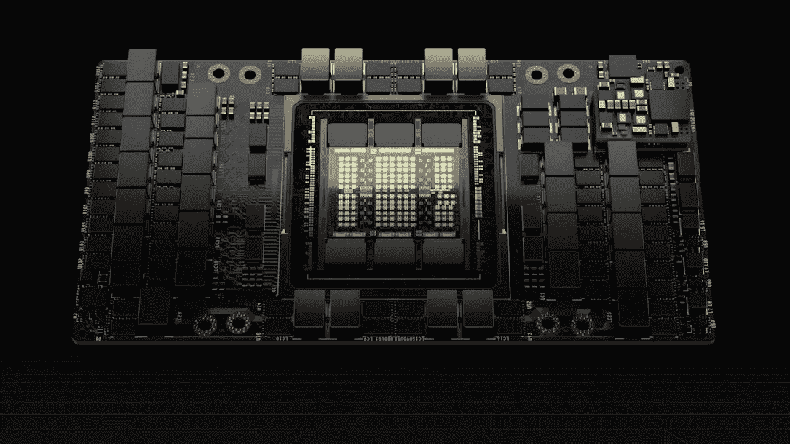
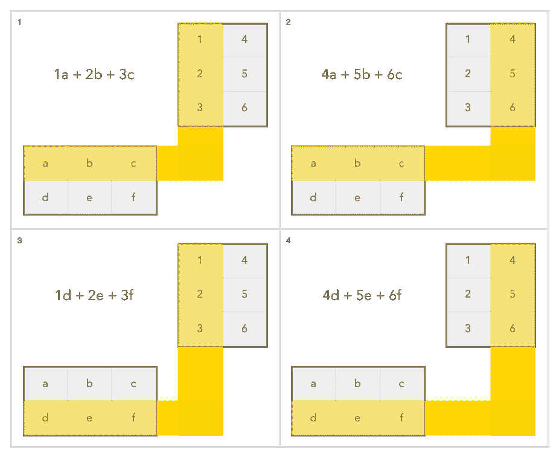

# 引擎下的图形处理器(GPU)

> 原文：<https://itnext.io/graphics-processors-gpus-under-the-hood-4522dbec777d?source=collection_archive---------1----------------------->

## 关于 CPU 如何工作的常见问题和误解的解答。



用于高性能计算和机器学习任务的 Nvidia Hopper H100

由于我一直在深入研究现代 GPU 的内部工作方式，我不得不与自己对它们如何工作的误解作斗争。这个故事试图回答我和其他人在尝试使用 CUDA 等框架进行 GPU 编程时遇到的许多问题。

我不会过多地关注编程的实际方面，而是更多地关注对底层硬件如何工作的理解。

# 线、经线、线块和网格

当你试图用 CUDA 解决一个问题时，你试图把你的问题分成更小的部分，以适应你的图形硬件的处理能力。假设你有一百万个元素要处理。你想对他们做什么并不重要。也许它们是你想要平方或去掉平方根的数字。

我们可以将问题划分成线程块。在当前架构上，这些线程最多可以包含 1024 个线程。使用 978 个线程块，我们可以处理 978 × 1024 = 1，001，472 个元素。比我们需要的多一点，但是 976 个块只处理 999，424 个元素。所有这些线程块一起形成了我们所说的网格。


将线程组织成不同维度的块

现在，您已经了解了基础知识，但是对于所有线程块、经线、线程和 GPU 核心如何协同工作还有许多误解。

## 一个 GPU 线程和 CPU 线程一样吗？

我的第一印象是它们根本不一样，但经过更仔细的研究，我得出结论，GPU 线程实际上与 CPU 线程有许多相似之处。什么是常规编程中的线程？

在常规编程中，多个线程可以执行同一个程序。它们各自在同一个程序中跟踪自己的位置。换句话说，每个线程都有一个持久的状态，这意味着当你恢复一个线程时，它可以从先前挂起的地方恢复。

这同样适用于 GPU 线程。每个 GPU 线程都有一个关联的状态，例如:

*   程序计数器—指向线程当前正在执行的指令的位置。
*   线程索引——x、y 和 z 位置，有助于识别线程负责处理哪个数组元素。
*   用于执行算术运算的寄存器。

当 CPU 上的线程调度器调度线程时，它读取存储的线程状态，并将 CPU 寄存器和程序计数器设置为为该线程存储的值。

当 CUDA 线程被调度时，类似的事情发生在 GPU 核心中。

## GPU 线程和 CPU 线程有什么不同？

一个 CPU 线程可以完全独立于其他线程运行。对于 GPU 线程来说，情况并非如此。GPU 线程总是在 warp 环境中执行。经线是 32 根线的集合。

warp 将在它包含的所有线程中并行执行一条指令。对于所有执行的线程，它必须是相同的指令。因此，只有具有相同程序计数器的线程才会并行运行。假设我们在曲速中有 A，B，C，D 和 E 线。如果 A、B、C 在指令 4，D、E 在指令 6，那么所有线程不能同时运行。相反，C 和 D 将被禁用，指令 4 开始运行。接下来，A、B、C 被禁用，指令 6 开始运行。


扭曲是如何在 GPU 核心中调度的

## 如何将线指定给经线？

根据线的 ID 将线指定给扭曲。所以 ID 为 0，1，…，31 的线程将被分配给第一个经线。ID 为 32，33，…，64 的线程将被分配给第二个经线，依此类推。

线程的索引和它的线程 ID 以一种直接的方式相互关联:对于一维块，它们是相同的；对于二维块，其为:

```
threadID = threadIdx.x + threadIdx.y * blockIdx.x
```

对于大小为的三维块，线程 ID 为:

```
threadID = threadIdx.x + threadIdx.y * blockIdx.x 
                       + threadIdx.z * blockIdx.x * blockIdx.y
```

您可能认为这是将一维数组视为二维或三维数组的方式。

## 为什么分配给 GPU 核心的线程比它能够并行执行的线程多？

通常不可能在一个时钟周期内读取 32 个线程的数据。因此，依赖于从存储器读取的数据的指令将会停止。这使得 CPU 内核未得到充分利用。通过分配比可以并行处理的线程更多的线程，我们可以在一些线程等待输入时在 GPU 核心上运行其他线程。这种方法提高了硬件资源的利用率。

# 环

关于 GPU 核心如何处理循环有很多困惑。

## GPU 可以执行 for 循环吗？

考虑一个简单的加法函数，它将两个长度为`n`的数组相加。常规的 CPU 代码会有一个显式的 for 循环。

```
void
vadd(int n, float *xs, float *ys) {
    for (int i=0; i<n; i++)
        ys[i] = xs[i] + ys[i];
}
```

如果我们重新编写这个代码来使用 CUDA，它将看起来像这样:

```
_global_void 
gpu_vadd(int n, float *xs, float *ys) {
    int i = blockIdx.x * blockDim.x + threadIdx.x;
    if (i < n) 
        y[i] = xs[i] + ys[i]; 
}
```

你可以看到 for 循环消失了。这是因为这是将被并行应用于所有元素`xs`和`ys`的内核函数。这是通过设置对`gpu_vadd`函数的调用来实现的，这样它可以跨所有数组元素工作:

```
int blocksize = 256
int nblocks = (n + blocksize-1) / blocksize;
gpu_vadd<<<nblocks, blocksize>>>(n, xs, ys);
```

这个例子给人一种错误的印象，你根本不应该在 CUDA 中使用 for 循环，或者你甚至不能这样做。然而，GPU 可以在内核中执行循环，如 [Nvidia CUDA 文档](https://docs.nvidia.com/cuda/cuda-c-programming-guide/index.html)中的矩阵乘法示例所示。

```
typedef struct {
    int width;
    int height;
    float* elements;
} Matrix;

// Matrix multiplication kernel called by MatMul()
__global__ void MatMulKernel(Matrix A, Matrix B, Matrix C)
{
    // Each thread computes one element of C
    // by accumulating results into Cvalue
    float Cvalue = 0;
    int row = blockIdx.y * blockDim.y + threadIdx.y;
    int col = blockIdx.x * blockDim.x + threadIdx.x;
    for (int e = 0; e < A.width; ++e)
        Cvalue += A.elements[row * A.width + e]
                * B.elements[e * B.width + col];
    C.elements[row * C.width + col] = Cvalue;
}
```

在这种情况下，for 循环遍历矩阵`A`的行中的所有值和矩阵`B`的列中的所有值。这是因为矩阵乘法是通过取矩阵`A`中的行向量和矩阵`B`中的列向量之间的点积来完成的。

阅读更多:[为什么矩阵乘法是这样工作的？](https://erik-engheim.medium.com/why-does-matrix-multiplication-work-the-way-it-does-7a8ed9739254)

Julia 编程语言非常擅长交互地做这件事。下面是对一些行进行点积的演示:

```
julia> using LinearAlgebra

julia> B = [1 4; 2 5; 3 6]
3×2 Matrix{Int64}:
 1  4
 2  5
 3  6

julia> A = [3 2 1; 4 5 2]
2×3 Matrix{Int64}:
 3  2  1
 4  5  2

julia> A*B
2×2 Matrix{Int64}:
 10  28
 20  53

# Dot product to calculate values for first row 
julia> [3, 2, 1] ⋅ [1, 2, 3]
10

julia> [3, 2, 1] ⋅  [4, 5, 6]
28
```

下图说明了矩阵乘法的工作原理。



为什么要展示所有这些关于矩阵乘法的细节？我只想让你明白，输出中的每个值都需要访问整个矩阵的行和列。这就是循环的作用。我们实际上是在并行地循环几行和几列，因为内核程序将并行执行几个线程。在将结果写入内存中的正确位置之前，每个线程都有独立的寄存器来存储中间结果。

内存写入不能独立完成，必须捆绑在一起。内存是以 32 字节为单位进行读写的，因此只要输入或输出内存地址位于连续的内存位置，就可以在一个周期内完成这些读/写操作。否则你需要多个周期。GPU 核心包含独立的 *SIMD 通道*用于运行每个线程。下图显示了两个这样的通道，允许两个线程并行运行。

它旨在说明每个通道如何使用自己的 LSU(加载/存储单元)独立生成读/写地址。然而，不可能并行执行多个存储器访问。因此，我们需要依次执行。例外情况是同一 32 字节块内的内存地址。这就是为什么我们可以将内存访问合并到单个读/写指令中。


GPU 中的每个 SIMD 通道如何访问内存

## 何时使用和不使用循环

所以你可以在内核中使用一个循环，但你并不总是必须这样做？我怎么知道什么时候用什么？

理想情况下，您应该避免循环，并尽可能多地在并行线程中运行。有时这是不可能的。假设您正在处理一百万个元素。当您启动内核时，您可以设置一百万个线程来处理这些元素，但是如果每个元素都需要访问相邻的元素呢？也许是高斯平滑滤波器，卷积或者只是矩阵乘法。

设置用于访问数据的线程是不切实际的，这需要一些编程逻辑来确定位置。

这就是为什么有时循环是一个完美可行的解决方案。循环不一定会导致性能下降。

如果您的硬件可以同时并行处理最多 512 个线程，那么每个线程执行 4 次迭代的 for 循环与调度 2048 (512 × 4)个线程在显卡上运行没有任何区别。

如果您只是读取输入数据中的每个内存位置一次，则不需要循环。

# 内存访问和使用

如果同一块内存将被多次访问，那么在本地内存中存储一个副本是值得的，因为它可以被更快地访问。

为什么访问本地内存更快？全局内存必须在多个 GPU 核心之间共享。因此，任何访问都会导致多个 GPU 核心竞争使用数据和地址总线。

其他 GPU 核心无法访问每个 GPU 核心的本地内存。因此，不存在对共享资源的争用来减缓存储器访问。

访问速度也更快，因为用于本地内存访问的 L1 缓存在物理上更靠近每个内核。


同一块上的线程可以共享内存。

在对 CUDA 编程时，你可以使用`__shared__`关键字来表示一些静态分配的内存将代表 GPU 核心的本地内存，而不是全局内存(所有核心共享的内存)。

```
__global__ void MatMulKernel(Matrix A, Matrix B, Matrix C) 
{
    // some code...
        __shared__ float As[16][16];
    __shared__ float Bs[16][16];
 // more code ...
}
```

在这个例子中，我们为矩阵`A`的子集分配了 256 个浮点值，为矩阵`B`的子集分配了另外 256 个浮点值。您可以在 [CUDA 工具包文档](https://docs.nvidia.com/cuda/cuda-c-programming-guide/index.html#shared-memory)中了解更多关于使用共享内存的细节。

# GPU 汇编代码是什么样子的？

GPU 的硬件不像主处理器那样保持稳定的指令集架构。通常图形驱动程序会给出一个你想要执行的内核的高级表示。然后内核负责将这个高级代码编译成机器代码。

GPU 的指令集在每一代之间会有很大的变化。保持二进制兼容性对个人电脑来说非常重要，但并不那么重要。

然而，你仍然可以得到关于汇编代码的信息，但这主要是为了阅读。你不会自己写的。下面是一些代码的例子。

```
; Uniform Integer Multiplication
IMAD.MOV.U32 R6, RZ, RZ, c[0x0][0x170]

MOV R7, c[0x0][0x174] ; Move from memory to register
IADD3 R9, R2, R5, RZ  ; Uniform integer addition
STG.E.SYS [R6], R9    ; Store to global memory
```

操作通常在名为`R0`、`R1`的寄存器上完成，...`R32`(不确定他们有多少寄存器)。

# 资源

来自 Nvidia 和其他公司的一些有用的资源。

*   [CUDA 基础知识](https://www.nvidia.com/docs/IO/116711/sc11-cuda-c-basics.pdf)
*   [CUDA 矩阵乘法示例](https://docs.nvidia.com/cuda/cuda-c-programming-guide/index.html)
*   [CUDA C++编程指南](https://docs.nvidia.com/cuda/cuda-c-programming-guide/index.html) —伟大的 Nvidia 指南，详细介绍了内存层次结构(每个线程、块和网格的内存)以及如何将事物分为线程和块。
*   [CUDA 二进制实用程序](https://docs.nvidia.com/cuda/cuda-binary-utilities/index.html#instruction-set-ref) —通过查看 CUDA 的汇编器/反汇编器来解释 GPU 汇编代码。