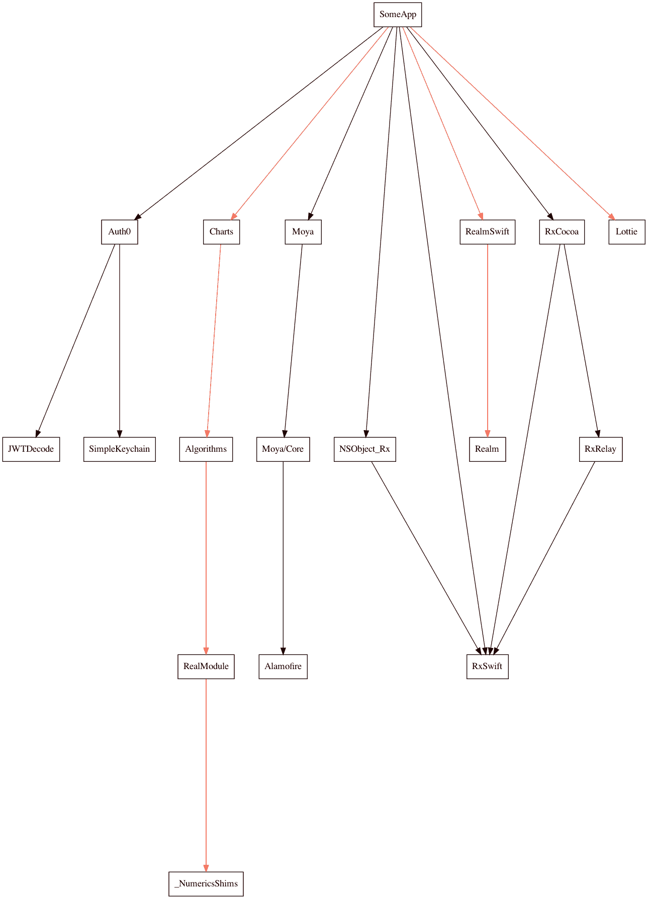
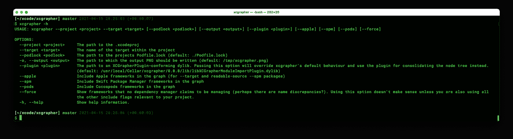

# 绘制 Xcode 项目依赖关系 XCGrapher 简介

> 原文：<https://itnext.io/graphing-xcode-project-dependencies-introducing-xcgrapher-cb99aa0a325e?source=collection_archive---------1----------------------->

## 最近，我们一直在将我们的(许多)内部库从 CocoaPods 迁移到 Swift 包。为了全面了解我们的进展，我构建了一个新工具，随后学到了一些对我来说新的东西:在运行时动态加载 Swift 库！

这是一篇有点长的文章，所以为了吊起你的胃口，这里列出了我们将要讨论的部分内容(有时非常详细) :

*   💡我为什么创建`xcgrapher`以及它是如何工作的
*   👨‍💻如何写一个`xcgrapher`插件
*   👨‍🔧如何阻止 Swift 编译器篡改函数名
*   🧙‍♂️如何在运行时加载和执行外部动态库中的代码
*   🍺如何通过自制软件分发 Swift 包
*   🕵️‍♂️如何看到和改变动态库路径嵌入在二进制

搜索上面的表情符号跳转到一个章节！



下面是 xcgrapher 可以为您提供的开箱即用功能

# 💡模块迁移混乱

将 10 多个定制 CocoaPods 迁移到 Swift 包是一项棘手的任务，尤其是当它们相互依赖并且都由三个 iOS/tvOS 应用程序项目使用时。决定迁移的顺序和确定哪些依赖项会很快受到影响变得很困难，所以用一个图表来显示谁依赖谁听起来是一个很好的主意。

似乎有各种各样的依赖绘图工具已经可用，但没有一个满足我的所有要求。出于我的目的，绘图工具必须:

*   在模块级而不是类级绘制图形
*   支持私人/内部图书馆
*   在单个图表中显示 Swift 包和 CocoaPods

# 查找导入的模块

最初，我用`objdump`(稍后会有更多介绍)作为展示二进制文件依赖于什么库的一种方式，然而很快就发现并不是所有的情况都可以用这种方式解决。由于每个模块导入都由一行代码表示，如`import MyModule` …看起来行动的过程就是简单地让工具读取这些导入。

## 读取 Xcode 目标的编译源列表

如果你和任何规模的团队一起做过 Xcode 项目，那么在解决合并冲突的时候，你无疑必须处理读取`project.pbxproj`文件的头痛问题。我不想花时间去破译它的格式，只是为了得到一个编译源代码的列表，所以幸运的是 [Cocoapods 团队有一个工具](https://github.com/CocoaPods/Xcodeproj)来与它交互。

```
require 'xcodeproj'Xcodeproj::Project.open("SomeApp.xcodeproj")
    .targets
    .filter do |target|
        target.name == "SomeApp"
    end
    .first
    .source_build_phase.files.to_a
    .each do |file| 
        puts file.file_ref.real_path.to_s 
    end
```

这个脚本…是用 Ruby 写的。这很烦人，因为 Ruby 意味着 Gems，Gems 意味着 Bundler，Bundler 意味着过于频繁地对 Rbenv 设置进行故障排除。但是……大多数 iOS 工程师已经为 CocoaPods 做了所有这些工作，这比解析 pbxproj 要好，所以我把它压缩成一个可 shell 化的一行程序，并且[那个](https://github.com/maxchuquimia/xcgrapher/blob/d5b410f1f42bb95ce51453da539834d3678d85a4/Sources/XCGrapherLib/ShellTasks/Xcodeproj.swift#L20)就是目前在`xcgrapher`中使用的:

```
**$** ruby -r xcodeproj -e 'Xcodeproj::Project.open("XXX").targets.filter do |t| t.name == "YYY" end.first.source_build_phase.files.to_a.each do |f| puts f.file_ref.real_path.to_s end'
```

现在继续。

## 查找导入

这相对简单:遍历编译源列表，找到所有带有`import Something`的行，并将所有的`Something`编译到一个列表中。导入有多种方式，包括:

```
import Module
@testable import Module
import class Module.Class
@_exported import Module
```

我尽可能多地解释了这些，然后是一些。查看 [ImportFinder](https://github.com/maxchuquimia/xcgrapher/blob/master/Sources/XCGrapherLib/ImportFinder.swift) 获取完整列表。

## 在 Swift 包裹中查找进口

同样的`ImportFinder`代码需要在每个 Swift 软件包上运行。据我所知，没有简单的方法列出 Xcode 项目所依赖的所有 Swift 包，因为我也不希望我的工具在读取每个包的源代码之前必须克隆每个包的正确提交，所以我选择了简单的[运行 xcodebuild](https://github.com/maxchuquimia/xcgrapher/blob/d5b410f1f42bb95ce51453da539834d3678d85a4/Sources/XCGrapherLib/ShellTasks/Xcodebuild.swift#L39) 并解析其输出以找到本地包克隆。

一旦知道了每个包的克隆目录，获得每个目标的源文件列表就很容易了！

```
**$** swift package -—package-path /path/to/clone describe -—type json
```

然后前面提到的`ImportFinder`可以用来读取每个包装产品中的所有进口商品。

## 在椰子中寻找进口

这对我来说不是一个优先考虑的问题，因为我们正在远离 cocoa pods——事实上，`xcgrapher`目前主要面向只使用 Swift 包的项目。编译已知 CocoaPods 列表的最简单方法是解析`Podfile.lock`:如果您对此感兴趣，那么请在这里查看实现。

# 用 GraphViz 绘图

一旦编译了所有导入模块的列表，那么`xcgrapher`将遍历它们，并将它们与其他模块进行匹配。实际的绘图是通过使用有向图的 [GraphViz](https://graphviz.org/) 完成的。有向图是一种用于指定图上“节点”之间“边”的格式(箭头在**di**rected-**graph**中):

```
digraph XCGrapher {

  graph [ nodesep = 0.5, ranksep = 4, overlap = false, splines = true ]
  node [ shape = box ]

  "Algorithms" -> "RealModule"
  "Charts" -> "Algorithms"
  "RealModule" -> "_NumericsShims"
  "RealmSwift" -> "Realm"
  "SomeApp" -> "Charts"
  "SomeApp" -> "Lottie"
  "SomeApp" -> "RealmSwift"

}
```

如果你想亲自尝试，只需用`brew install graphviz`然后用`dot -T png -o output.png digraph.txt`从包含上述内容的文本文件中生成一个 PNG 图像。当在本地运行`xcgrapher`时，你的有向图存储在`/tmp/xcgrapher.dot`。

这是最简单的例子。GraphViz 的功能非常非常多。一定要去看看！

[](https://graphviz.org/) [## Graphviz 图形可视化软件

### 请加入 Graphviz 论坛提问，讨论 Graphviz。Graphviz 是开源的图形可视化工具…

graphviz.org](https://graphviz.org/) 

# 👨‍💻使用 XCGrapher 插件创建自定义图表

我们才刚刚开始。

如果你想画别的东西呢？例如，我们的项目使用自定义属性包装器`@Injected`作为将依赖项注入类实例的方式。哪些类需要哪些注入的图表在将来也会有用…

您可以使用一个`xcgrapher`插件来完成这些定制任务，而不是编写上面描述的所有模板。

## 插件结构

`xcgrapher`插件只是编译成动态库的 Swift 包，依赖于`XCGrapherPluginSupport`:

```
let package = Package(
    name: "MyPlugin",
    products: [
        .library(
            name: "MyPlugin",
            type: .dynamic, 
            targets: ["MyPlugin"]
        ),
    ],
    dependencies: [
        .package(
            url: "https://github.com/maxchuquimia/XCGrapherPluginSupport.git", 
            from: "0.0.6"
        ),
    ],
    targets: [
        .target(
            name: "MyPlugin", 
            dependencies: [
                .product(
                    name: "XCGrapherPluginSupport",
                    package: "xcgrapher"
                )
            ]
        ),
    ]
)
```

在包中你可以`import XCGrapherPluginSupport`和子类`XCGrapherPlugin`。然后，您可以覆盖函数来帮助构建您的图形:

`**override func process(file: XCGrapherFile) throws -> [Any] { ... }**` 该函数为项目中的每个源文件调用一次，为 Swift 包依赖关系中的每个源文件调用一次(如果`--spm`传递给`xcgrapher`)。模型`XCGrapherFile`包含关于源文件的便利信息，然后你可以用你自己的方式解析它(见[XCGrapherFile](https://github.com/maxchuquimia/XCGrapherPluginSupport/tree/master/Sources/XCGrapherPluginSupport/XCGrapherFile.swift)*)*。

`**override func process(library: XCGrapherImport) throws -> [Any] { ... }**` 这个函数在你的项目中的每一个`import SomeLibrary`行被调用一次(取决于传递给`xcgrapher`的标志)。`SomeLibrary`以`XCGrapherImport`模式为代表。可用参数见 [XCGrapherImport](https://github.com/maxchuquimia/XCGrapherPluginSupport/tree/master/Sources/XCGrapherPluginSupport/XCGrapherImport.swift) 。

`**override func makeArrows(from results: [Any]) throws -> [XCGrapherArrow]**` 上面列出的处理函数返回的数组将被连接并传递给你，以便在`makeArrows(from:)`函数中进行最终合并。在这里，你应该按照你认为合适的方式遍历`results`，以便返回一个`XCGrapherArrow`模型的列表，这些模型将被传递给 GraphViz 并被绘制到`xcgrapher`的`--output` PNG 文件中。

*我在这里选择使用* `*Any*` *是为了给你这个插件构建者尽可能多的灵活性。强制插件成为* `*XCGrapherPlugin*` *的子类，而不是任何符合协议的对象，这是另一个战略决策，使插件构建者的生活更容易，因为有些棘手的事情需要以后做——继续阅读！*

因此，如果您想要绘制每个文件(包括 Swift 包)中的所有`@Injected`行，您需要做的就是解析`process(file:)`中的`file`，返回您自己的表示`@Injected`关系的对象，然后在`makeArrows(from:)`函数中将该对象转换为`XCGrapherArrow`！

## 👨‍🔧避免混乱的函数名

你有没有在 Xcode 的调试器中编辑过一些东西，并注意到一个类的名字看起来… *混乱不堪*？例如，考虑以下 Swift 文件:

```
*// doSomething.swift*public func thisFunctionDoesSomething() {
    print("doing something...")
}
```

如果您要将这个`doSomething.swift`编译成一个动态库:

```
**$** swiftc -emit-library -module-name libDoSomething doSomething.swift
```

然后使用`nm`打印出结果 dylib 中的所有符号，您可以看到我们的函数名称`thisFunctionDoesSomething()`不再是我们所期望的:

```
**$** nm -an liblibDoSomething.dylib 
                 U _$sSS21_builtinStringLiteral17utf8CodeUnitCount7isASCIISSBp_BwBi1_tcfC
                 U _$sSSN
                 U _$ss27_allocateUninitializedArrayySayxG_BptBwlF
                 U _$ss5print_9separator10terminatoryypd_S2StF
                 U _$sypN
                 U _swift_bridgeObjectRelease
                 U dyld_stub_binder
0000000000003e50 T **_$s14libDoSomething016thisFunctionDoesC0yyF**
0000000000003f00 t _$ss5print_9separator10terminatoryypd_S2StFfA0_
0000000000003f20 t _$ss5print_9separator10terminatoryypd_S2StFfA1_
0000000000003fa8 s ___swift_reflection_version
0000000000008020 d __dyld_private
```

> Swift 编译器将被破坏的名称发送到二进制映像中，以对运行时实例化和反射的类型引用进行编码。在二进制文件中，这些混乱的名称可能会嵌入指向运行时数据结构的指针，以便更有效地表示本地定义的类型。
> —[https://github . com/apple/swift/blob/main/docs/ABI/mangling . rst](https://github.com/apple/swift/blob/main/docs/ABI/Mangling.rst)

简而言之，名称管理允许编译器以确定的方式为函数生成新名称——这很重要，因为它允许我们开发人员编写(例如)两个同名的函数(每次我们在子类中覆盖函数时都会这样做)。

为了避免在 Swift 中混淆，我们可以使用`@_cdecl`属性来指定编译器应该为被注释的函数存储的确切符号名:

```
*// doSomething.swift***@_cdecl("thisFunctionDoesSomething")**
public func thisFunctionDoesSomething() {
    print("doing something...")
}
```

现在，当我们编译并列出 dylib 二进制文件中的符号时，我们可以清楚地看到我们的函数名！

```
**$** swiftc -emit-library -module-name libDoSomething doSomething.swift
**$** nm -an liblibDoSomething.dylib 
                 U _$sSS21_builtinStringLiteral17utf8CodeUnitCount7isASCIISSBp_BwBi1_tcfC
                 U _$sSSN
                 U _$ss27_allocateUninitializedArrayySayxG_BptBwlF
                 U _$ss5print_9separator10terminatoryypd_S2StF
                 U _$sypN
                 U _swift_bridgeObjectRelease
                 U dyld_stub_binder
0000000000003e40 T _**thisFunctionDoesSomething**
0000000000003e50 T _$s14libDoSomething016thisFunctionDoesC0yyF
0000000000003f00 t _$ss5print_9separator10terminatoryypd_S2StFfA0_
0000000000003f20 t _$ss5print_9separator10terminatoryypd_S2StFfA1_
0000000000003fa8 s ___swift_reflection_version
0000000000008020 d __dyld_private
```

在运行时加载库时，我们需要在编译符号之前知道它们的名称，这样我们就可以调用它们——所以在创建自定义`XCGrapherPlugin`子类的插件 dylib 中注释一个函数是必须的:

```
@_cdecl("makeXCGrapherPlugin")                       
public func makeXCGrapherPlugin() -> UnsafeMutableRawPointer {
    Unmanaged.passRetained(MyPlugin()).toOpaque()                       }
```

我们在这里使用`UnsafeMutableRawPointer`,因为我们正在做 Dodgy Things，而 Swift 编译器不希望对大量可能出错的事情负责。

> **那是斯威夫特高举双手后退……“嘿，你自己看着办吧，伙计”**
> ——我的同事在我向他展示了实现之后

(实际上`@_cdecl`将函数标记为 C 声明，所以我们需要使用 C 兼容的返回值。有一些关于让它得到官方支持的讨论，希望它能很快实现！)

## 编译动态库

像构建任何 Swift 包一样构建库:

```
**$** swift build -c release --disable-sandbox
```

然后该库被保存到`./.build/release/libMyPlugin.dylib`

## 🧙‍♂️在运行时加载动态库

现在我们已经将 dylib 存储在磁盘上，回到主代码中，我们可以将它的路径传递给`dlopen()`，并检索指向前面标有`@_cdecl("makeXCGrapherPlugin")`的函数的符号:

```
let path = "/path/to/libMyPlugin.dylib"
let openResult = dlopen(path, RTLD_NOW|RTLD_LOCAL)
guard openResult != nil else { ... }
defer { dlclose(openResult) }let symbol = dlsym(openResult, "makeXCGrapherPlugin")
```

如果你想了解`RTLD_NOW`和`RTLD_LOCAL`(我知道你不想！)，那么[这里](https://pubs.opengroup.org/onlinepubs/009696699/functions/dlopen.html)有一些信息给你。我似乎记得读到过，可能实际上并不需要`RTLD_LOCAL`，因为它是默认的，除非你指定`RTLD_GLOBAL` …但是我在网上看到的一半 Swift 例子都使用它，所以我现在把它留在这里。更多的是关于我不知道我是否应该删除的东西。

无论如何，我们可以将该符号转换为与动态库中的 Dodgy Things 函数具有相同签名的函数:

```
typealias MakeFunc = @convention(c) () -> UnsafeMutableRawPointerlet makePlugin = unsafeBitCast(symbol, to: MakeFunc.self)
```

最后调用函数得到动态库中定义的`XCGrapherPlugin`子类的一个实例！

```
let pluginPointer = makeXCGrapherPlugin()
let plugin = Unmanaged<XCGrapherPlugin>.fromOpaque(pluginPointer)
    .takeRetainedValue()
```

> **耶哇。这比我想象的简单多了** —我的同事(同一个同事)

要使用新创建的`xcgrapher`插件，请将其路径传递给`xcgrapher`工具的`--plugin`选项。

## 实例和参考

`xcgrapher`的动态库加载代码可以在这里查看[。图形模块导入的默认行为是作为一个独立的插件实现的，可以在这里查看](https://github.com/maxchuquimia/xcgrapher/blob/master/Sources/XCGrapherLib/PluginSupport/PluginLoader.swift)。

我第一次从[这篇](https://theswiftdev.com/building-and-loading-dynamic-libraries-at-runtime-in-swift/)精彩的文章中了解到以这种方式加载库——他们的方法和我的有点不同，所以如果你想了解更多，请阅读一下！最后，[这里](https://developer.apple.com/library/archive/documentation/DeveloperTools/Conceptual/DynamicLibraries/100-Articles/DynamicLibraryUsageGuidelines.html#//apple_ref/doc/uid/TP40001928-SW10)是一些关于`dlopen()`和朋友的官方文献。

# 出版

构建工具的最后一步是使其易于安装。在 macOS 世界中，这意味着通过`brew`来安装它。


[https://www.jspowerhour.com/comics/263](https://www.jspowerhour.com/comics/263)

如果你想安装`xcgrapher`，你需要先添加我的水龙头。

```
**$** brew tap maxchuquimia/scripts
**$** brew install xcgrapher
*# If you don’t use CocoaPods you’ll also need to* [*install Xcodeproj*](https://github.com/CocoaPods/Xcodeproj)*.*
```

我选择使用我自己的水龙头，而不是将其添加到 brew 主水龙头，因为我不太喜欢像家酿和 CocoaPods 那样保持一切集中(出于速度原因)。我个人希望 Swift 包裹永远不要走这条路…

## 编译、安装和嵌入式动态库路径

生成可执行文件的 Swift 包实际上与任何 brew 可安装工具没有什么不同:只需构建二进制文件并将其移动到由`brew`指定的位置。我使用了一个 Makefile 来完成这项工作:

```
prefix ?= /usr/local
bindir = $(prefix)/bin
libdir = $(prefix)/lib
buildroot = $(shell swift build -c release --show-bin-path)

configure:
	echo "let DEFAULT_PLUGIN_LOCATION=\"$(libdir)/libXCGrapherModuleImportPlugin.dylib\"" > Sources/xcgrapher/Generated.swift

build: configure
	swift build -c release --disable-sandbox

install: build
	mkdir -p "$(bindir)"
	mkdir -p "$(libdir)"
	install "$(buildroot)/xcgrapher" "$(bindir)"
	install "$(buildroot)/libXCGrapherPluginSupport.dylib" "$(libdir)"
	install "$(buildroot)/libXCGrapherModuleImportPlugin.dylib" "$(libdir)"
	install_name_tool -change "$(buildroot)/libXCGrapherPluginSupport.dylib" "$(libdir)/libXCGrapherPluginSupport.dylib" "$(bindir)/xcgrapher"

uninstall:
	rm -rf "$(bindir)/xcgrapher"
	rm -rf "$(libdir)/libXCGrapherPluginSupport.dylib"
	rm -rf "$(libdir)/libXCGrapherModuleImportPlugin.dylib"

clean:
	rm -rf .build
	rm Sources/xcgrapher/Generated.swift

.PHONY: build install uninstall clean configure
```

这里发生了一些事情！首先是一些定义，然后是几个步骤:

**前缀？= /usr/local** 

**bindir** 和 **libdir
和**这两个变量定义了二进制文件和库应该安装的目录。

**buildroot** 这个变量被设置为`swift build -c release --show-bin-path`的输出——这是`swift build`在编译时将工件写入的目录。

**配置:**
`configure`目标将预测的 dylib 安装路径写入`xcgrapher`的包内的文件中。然后在编译时获得，生成的`DEFAULT_PLUGIN_LOCATION`变量被用作`--plugin`参数的默认值。

**构建:**
`build`目标首先运行配置步骤。然后使用`mkdir -p`确保二进制和库目录存在。第一个`install`命令安全地将`xcgrapher`二进制文件复制到二进制文件目录，第二个和第三个`install`命令将`libXCGrapherPluginSupport.dylib`和`libXCGrapherModuleImportPlugin.dylib`复制到库目录。

**🕵️‍♂️install _ name _ tool** `install_name_tool`是一个有趣的命令:它打开一个二进制文件(第三个参数)并将匹配第一个参数的 dylib 路径更改为第二个参数的路径。使用`install_name_tool`似乎是马特·汤普森(一个可靠的知识来源)推荐的[这里是](https://nshipster.com/homebrew/)，但是在他的文章中他并没有详细说明在什么情况下需要它。所以，我当然决定调查一下。

让我们看看`xcgrapher`依赖的所有动态库(注意`/usr/local/bin/xcgrapher`是`xcgrapher`二进制安装的路径) :

```
**$** objdump -p /usr/local/bin/xcgrapher

/usr/local/bin/xcgrapher:    file format Mach-O 64-bit x86-64

Mach header
      magic cputype cpusubtype  caps    filetype ncmds sizeofcmds      flags
MH_MAGIC_64  X86_64        ALL  0x00     EXECUTE    30       4240   NOUNDEFS DYLDLINK TWOLEVEL PIE
Load command 0
<redacted>
<redacted>
<redacted>
Load command 13
          cmd LC_LOAD_DYLIB
      cmdsize 56
         name /usr/lib/libobjc.A.dylib (offset 24)
   time stamp 2 Thu Jan  1 10:00:02 1970
      current version 228.0.0
compatibility version 1.0.0
Load command 14
          cmd LC_LOAD_DYLIB
      cmdsize 56
         name /usr/lib/libSystem.B.dylib (offset 24)
   time stamp 2 Thu Jan  1 10:00:02 1970
      current version 1292.60.1
compatibility version 1.0.0
Load command 15
          cmd LC_LOAD_DYLIB
      cmdsize 64
         name @rpath/libXCGrapherPluginSupport.dylib (offset 24)
   time stamp 2 Thu Jan  1 10:00:02 1970
      current version 0.0.0
compatibility version 0.0.0
Load command 16
          cmd LC_LOAD_DYLIB
      cmdsize 96
         name /System/Library/Frameworks/Foundation.framework/Versions/C/Foundation (offset 24)
   time stamp 2 Thu Jan  1 10:00:02 1970
      current version 1770.255.0
<redacted>
<redacted>
<redacted>
```

好的，让我们再试一次，这次进行一些过滤(只打印匹配`LC_LOAD_DYLIB`及其后两行的行) :

```
**$** objdump -p /usr/local/bin/xcgrapher | grep LC_LOAD_DYLIB -A 2
          cmd LC_LOAD_DYLIB
      cmdsize 56
         name /usr/lib/libobjc.A.dylib (offset 24)
--
          cmd LC_LOAD_DYLIB
      cmdsize 56
         name /usr/lib/libSystem.B.dylib (offset 24)
--
          cmd LC_LOAD_DYLIB
      cmdsize 64
 **name @rpath/libXCGrapherPluginSupport.dylib (offset 24)**
--
          cmd LC_LOAD_DYLIB
      cmdsize 96
         name /System/Library/Frameworks/Foundation.framework/Versions/C/Foundation (offset 24)
--
          cmd LC_LOAD_DYLIB
      cmdsize 64
         name /usr/lib/swift/libswiftCore.dylib (offset 24)
--
          cmd LC_LOAD_DYLIB
      cmdsize 64
         name /usr/lib/swift/libswiftDarwin.dylib (offset 24)
--
          cmd LC_LOAD_DYLIB
      cmdsize 64
         name /usr/lib/swift/libswiftFoundation.dylib (offset 24)
```

在这里，你可以清楚地看到`xcgrapher`需要的所有 dylibs 包括我们自己的`libXCGrapherPluginSupport`(注意，这不是我们在运行时加载的插件本身:这是定义我们之前谈到的超类`XCGrapherPlugin`的包)。

`libXCGrapherPluginSupport`没有像其他库一样给出完整的路径:而是以`@rpath`开始！这是一个[特殊的宏](https://developer.apple.com/library/archive/documentation/DeveloperTools/Conceptual/DynamicLibraries/100-Articles/RunpathDependentLibraries.html)，它允许我们*避免*不得不做的事情，比如使用`install_name_tool`并使我们开发者能够分发带有 dylibs 的程序。事实上，Makefile 中的`install_name_tool`命令似乎完全没有用，因为它试图匹配`.build/release/libXCGrapherPluginSupport.dylib`而不是`@rpath/libXCGrapherPluginSupport.dylib`。

改变应该加载的 dylib 路径的真正方法是:

```
**$** install_name_tool -change "@rpath/libXCGrapherPluginSupport.dylib" "/new/dylib/path/something.dylib" /usr/local/bin/xcgrapher
```

现在，当我们再次搜索已加载的库时:

```
**$** objdump -p /usr/local/bin/xcgrapher | grep LC_LOAD_DYLIB -A 2
          cmd LC_LOAD_DYLIB
      cmdsize 56
         name /usr/lib/libobjc.A.dylib (offset 24)
--
          cmd LC_LOAD_DYLIB
      cmdsize 56
         name /usr/lib/libSystem.B.dylib (offset 24)
--
          cmd LC_LOAD_DYLIB
      cmdsize 56
 **name /new/dylib/path/something.dylib (offset 24)**
--
          cmd LC_LOAD_DYLIB
      cmdsize 96
         name /System/Library/Frameworks/Foundation.framework/Versions/C/Foundation (offset 24)
--
          cmd LC_LOAD_DYLIB
      cmdsize 64
         name /usr/lib/swift/libswiftCore.dylib (offset 24)
--
          cmd LC_LOAD_DYLIB
      cmdsize 64
         name /usr/lib/swift/libswiftDarwin.dylib (offset 24)
--
          cmd LC_LOAD_DYLIB
      cmdsize 64
         name /usr/lib/swift/libswiftFoundation.dylib (offset 24)
```

`libXCGrapherPluginSupport.dylib`不见踪影。如果我们现在尝试运行`xcgrapher`，我们会得到一个我们中的一些人可能很熟悉的错误:

```
**$** xcgrapher 
dyld: Library not loaded: /new/dylib/path/something.dylib
  Referenced from: /usr/local/bin/xcgrapher
  Reason: image not found
Abort trap: 6
```

我在 Makefile 中留下`install_name_tool`的原因主要是担心我缺乏这方面的知识。也许马特知道一些我不知道的事情，也许在他的机器上运行`swift build`时，就不用`@rpath`宏了？我这里只有两台电脑可以测试安装，也许如果我在第三台电脑上试一试，就会需要它了？现在，我要留着它。

无论如何，回到遍历 Makefile。

**卸载:** `uninstall`目标从您的机器上删除二进制文件和库。

**清除:**
`clean`目标清除任何由`build`步骤创建的工件。

**。假的** 这定义了一个不是文件的目标列表(据我所知`make`实际上是关于创建文件的，所以我们需要确保它不会被我们所写的内容所混淆——更多关于那个[在这里](https://www.gnu.org/software/make/manual/html_node/Phony-Targets.html))。

## 🍺自制配方

`brew`命令读取一个“公式”,该公式定义了安装命令需要做的事情。`xcgrapher`的公式看起来是这样的:

```
class Xcgrapher < Formula
  desc "Framework-level dependency graph generator for Xcode projects "
  homepage "https://github.com/maxchuquimia/xcgrapher"
  url "https://github.com/maxchuquimia/xcgrapher.git",
      :tag => "0.0.8", :revision => "d5b410f1f42bb95ce51453da539834d3678d85a4"
  head "https://github.com/maxchuquimia/xcgrapher.git"

  depends_on :xcode => ["12.4", :build]
  depends_on "graphviz"

  def install
    system "make", "install", "prefix=#{prefix}"
  end

end
```

首先，定义关于源代码和版本的信息。然后`depends_on`确保 Xcode 存在，并在必要时安装`graphviz`(记住，`xcgrapher`需要 GraphViz' `dot`命令)。然后`install`函数在项目克隆的目录中调用`make install`。

正如本文前面提到的，`prefix=#{prefix}`是 Makefile 中的`prefix`变量被覆盖的地方。通过使用公式的前缀而不是我们在 Makefile 中编写的常量`/usr/local`,我们允许 Homebrew 优雅地管理安装。在我的例子中`prefix`变成了`/usr/local/Cellar/xcgrapher/0.0.8`。不过不用担心，brew 象征性地将所有东西都链接到了`/usr/local` (这就是为什么我可以在前面的例子中使用`/usr/local/bin/xcgrapher`)。

`xcgrapher`的公式发表在[我的 tap](https://github.com/maxchuquimia/homebrew-scripts) 。最简单的定制 tap 是以你的名字命名的 GitHub repo，名为`hombrew-scripts`，公式存储在`Formula`目录中。当然，在某些情况下，它会变得更加复杂:在这里[阅读全部内容](https://github.com/Homebrew/brew/blob/master/docs/How-to-Create-and-Maintain-a-Tap.md)。

# dlclose(本文)

感谢您读到这里！我希望`xcgrapher`在某些方面对你有用，即使它只是一个完全不同的东西的起点。

[](https://github.com/maxchuquimia/xcgrapher) [## maxchuquimia/xcgrapher

### 默认情况下，xcgrapher 是 Xcode 项目的框架级依赖图生成器。它通过读取本地…

github.com](https://github.com/maxchuquimia/xcgrapher) 

我会把`xcgrapher --help`留给你——但是现在，晚安:)



制图快乐！