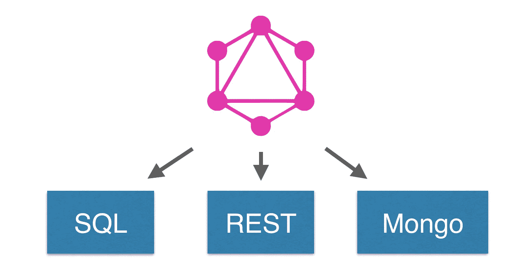
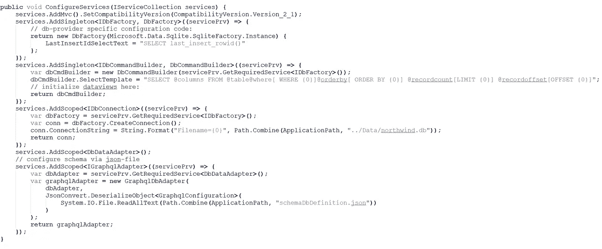
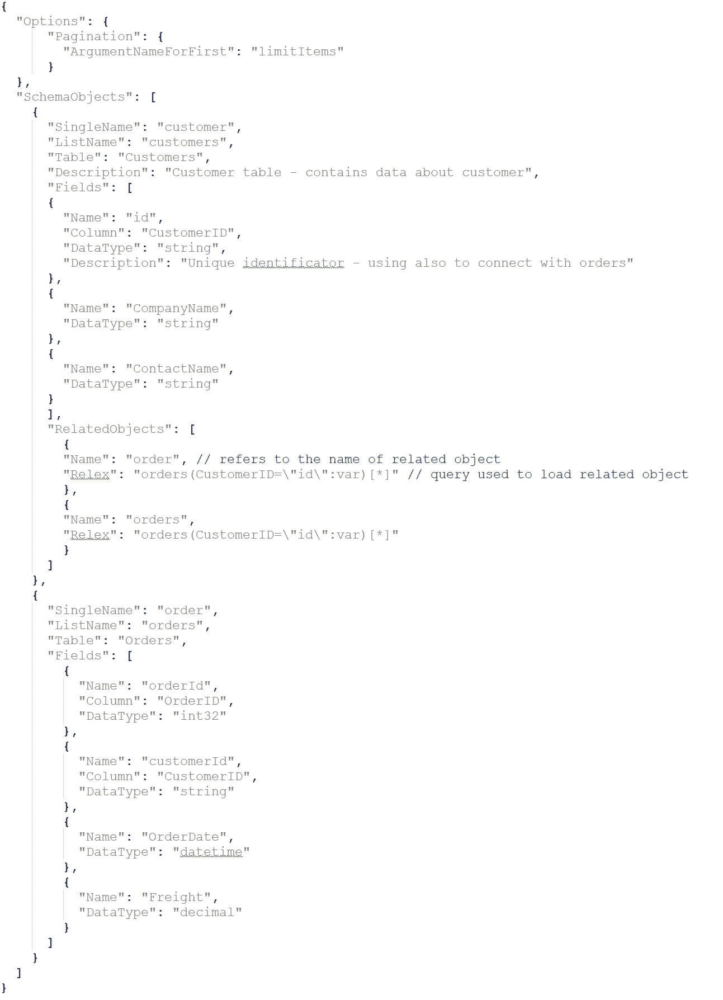
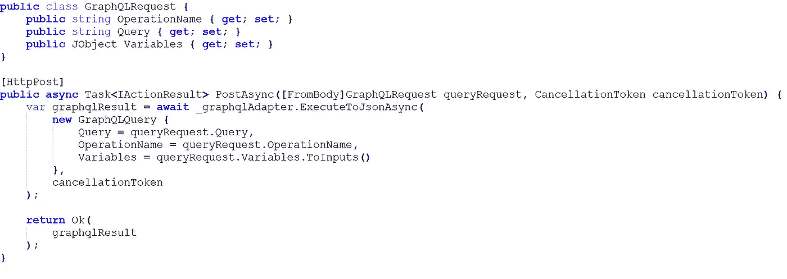
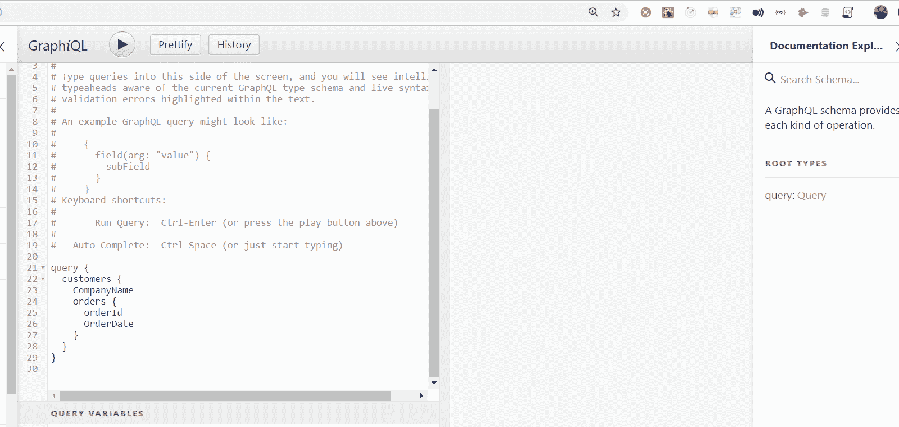
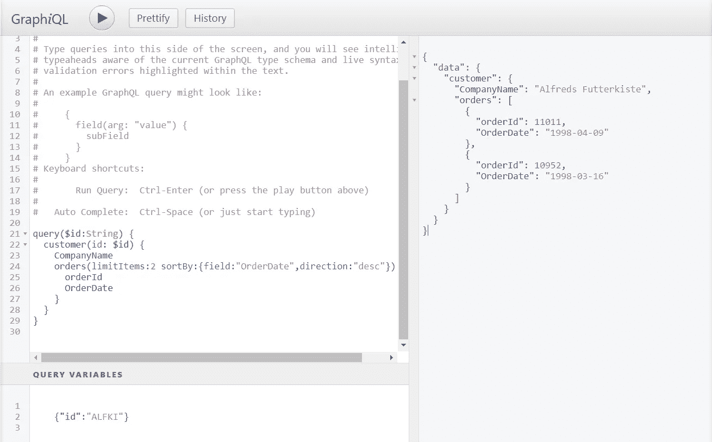
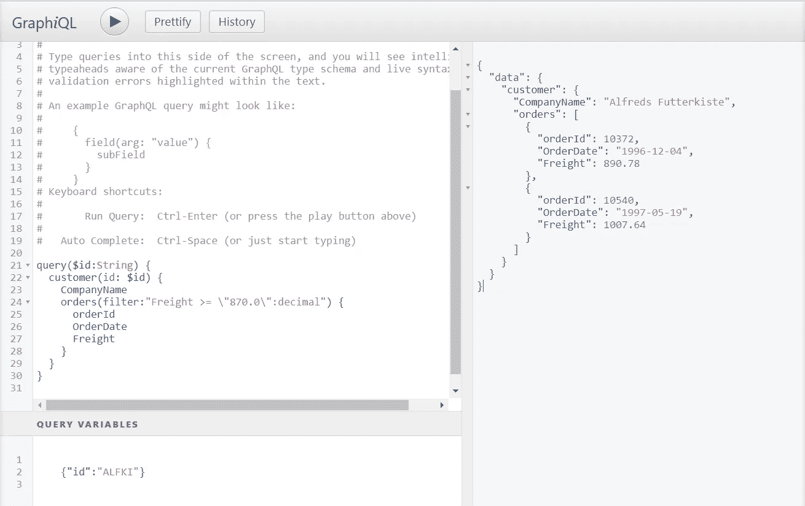

# 中 SQL 数据库的 GraphQL API。网

> 原文：<https://itnext.io/graphql-api-for-sql-database-in-net-af2fe322fe28?source=collection_archive---------1----------------------->

您可能听说过 GraphQL 技术作为 REST APIs 的替代技术。然而，让我们简短地回忆一下 GraphQL 是什么，它的主要用途，以及我们如何在现实生活中使用它。

GraphQL 由脸书于 2015 年发布，定位为众所周知的 RESTful 架构风格的替代方案。与数百个 web API 方法(显然可以有不同的版本)不同，您只有一个 Web API 端点，它允许您获得关于字段的所有信息(一种类型的字段，是否需要，等等)。).本质上，GraphQL 接受查询——这是一种 JSON 格式的数据——并尝试将其解析为之前定义的模式。

您可以发布两种类型的查询:

*   查询—用于获取多个数据以及查询中定义的字段
*   突变—用于创建、更新或删除数据

让我们关注基于轻量级 ORM [NReco 的获取数据方法。Data](https://www.nrecosite.com/dalc_net.aspx) (它有广泛的数据库适配器，允许连接到任何流行的数据库——MSSQL、PostgreSQL、MySQL、Elasticsearch 等。)并看看我们如何直接从数据库中获取数据。

SQL-db 的组件[GraphQL.Net API](https://www.nrecosite.com/graphql_to_sql_database.aspx)允许我们在 JSON 格式的文件中定义所有模式(甚至关系)。让我们配置模式并运行几个查询。NET Core Web 应用程序分步指南:

1.  首先，让我们在 Startup.cs 中设置一个数据库配置字符串和模式定义:

2.第二步是定义一个“schemaDbDefinition.json”文件，其中包含以下属性:

*   默认情况下，分页是启用的，用于定义查询中的排序参数(sortBy，direction)。
*   默认情况下，Sort 是启用的，用于定义查询中的排序参数(sortBy，direction)。
*   默认情况下，Filter 处于启用状态，用于定义查询中的筛选参数(默认为“filter”)。
*   SingleName—graph QL 查询中单个对象的名称
*   ListName—graph QL 查询中对象列表的名称
*   表-数据库表名
*   描述—可选字段；出现在 GraphiQL IDE 中并包含简短描述
*   字段 GraphQL 查询中可用的所有字段
*   RelatedObjects —相关对象的数组；只能由架构中定义的对象使用
*   Relex —字符串表达式(阅读更多信息 [NReco。Relex](https://github.com/nreco/data/wiki/Relex) )，其中所有字段值都取自父模式对象，并且可以在条件中使用。

最终，应该是这样的:

3.让我们向 API 方法的控制器添加一个 GraphQL 适配器:

4.让我们让所有的顾客都下订单:

5.或者获取特定客户最近两个订单的数据:

6.应用过滤器并获取运费高于 870 的所有订单:

和 NReco 一起。GraphQL 定义模式，数据提取非常容易，只需要几个步骤。您不再需要创建类来定义 GraphQL 方案，也不再需要在更新后重新构建整个解决方案——您所需要做的只是稍微修改一个 JSON 文件。NReco 的另一个优点是。GraphQL 的优势在于这种 DB 适配器可以很容易地连接到任何流行的数据库。

请在评论中告诉我们你的想法。

第二部分—设置 GraphQL [访问数据](/graphql-api-for-sql-database-in-net-setting-up-access-to-the-data-e7be91326576)