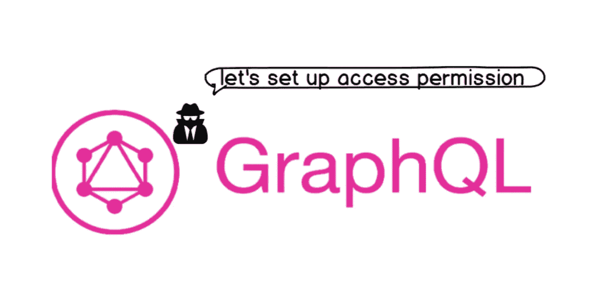
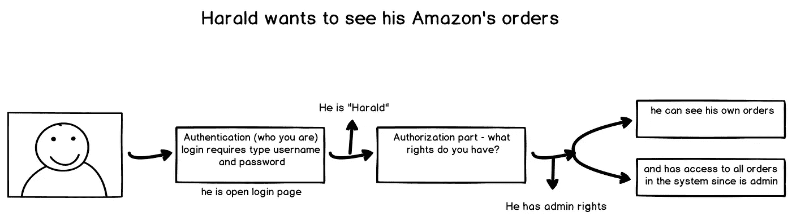
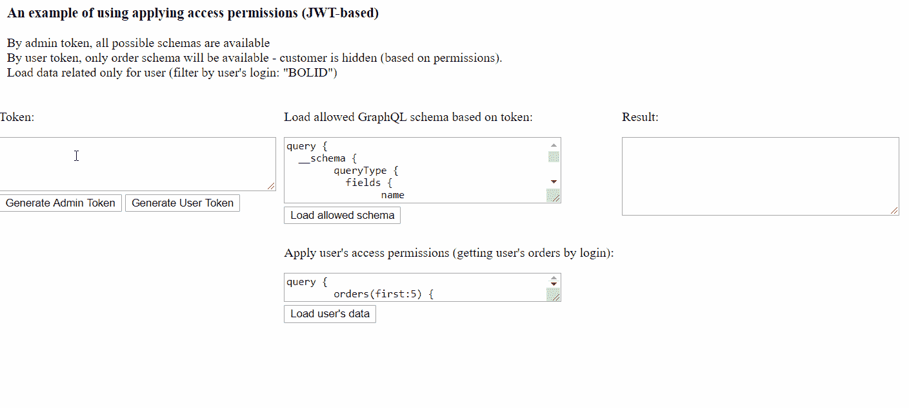
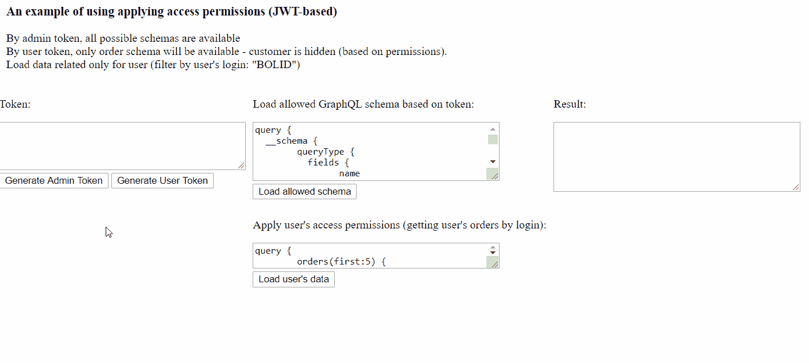

# 中 SQL 数据库的 GraphQL API。NET —设置对数据的访问

> 原文：<https://itnext.io/graphql-api-for-sql-database-in-net-setting-up-access-to-the-data-e7be91326576?source=collection_archive---------3----------------------->

在上一篇文章中，我们对. Net 下的 SQL 数据库的 GraphQL 技术和组件做了一个简短的概述。在那里，您可以找到一些关于如何设置 metaDbSchema、使用分页或定义过滤器的示例，因此，如果您还没有阅读它，请点击这里。

因为我们有一个 API 访问点——权限是应用程序中重要而敏感的部分

对于从 DB 获取数据来说，这一切都很好，但是如果您需要对结果集进行更多的控制，并且需要能够在字段级别快速方便地设置基于角色的权限，该怎么办呢？在这种情况下，我们需要实现对系统的访问，以及允许特定用户获取数据的权限。这意味着我们需要认证/授权事实和 JSON Web Token (JWT ),这是一个开放标准(RFC 7519 ),它定义了传输这些事实的方式。

尽管授权和认证这两个术语都与安全性和访问数据或系统功能的一部分有关，但它们经常被混淆。因此，让我们简短地回忆一下认证、授权和 JSON Web 令牌的含义。

**认证**

在验证您的用户名和密码等凭据(以验证您的身份)时，系统会检查您是否使用了自己的凭据。本质上，认证是确定某人确实是他们所声称的那个人的过程。

**授权**

相反，授权是确定用户访问级别的工具。例如，用户 Harald 是否有权查看这些数据？还是他只能看到和他相关的数据？

**什么是 JSON Web Token (JWT)？**

> JSON Web Token (JWT)是一个开放标准(RFC 7519 ),它定义了一种紧凑且独立的方式，以 JSON 对象的形式在各方之间安全地传输信息。该信息可以被验证和信任，因为它是数字签名的。

授权是使用 JWT 最常见的场景。用户登录后，每个后续请求都将包含 JWT，允许用户访问该令牌允许的路由、服务和资源。

使用 JWT 的目的不是隐藏数据，而是确保数据的真实性。JWT 是签名和编码的，不是加密的。

**为 GraphQL API 应用程序设置权限**

我们已经完成了所有的魔术，你可以下载它作为例子，但让我们把重点放在几个关键的步骤。

1.  首先，让我们在 Startup.cs 文件中设置身份验证选项

2.我们还需要生成 JWT 访问令牌的 web api 方法:

3.现在，我们可以使用检查和应用权限，我们有两个选项来完成此操作。第一个是在生成 GraphQL 模式时应用用户权限。因此，我们可以省略模式或模式字段，它们不会出现，也不能在进一步的操作中使用:

在我们的示例中，如果登录用户是“用户”角色，我们省略“客户”模式。例如，如果我们必须确保对登录用户隐藏一些敏感的实体，即使数据库返回了错误和数据，这可能是有用的。让我们看看它是如何工作的:

第二种方式非常有趣——预过滤数据基于 SQL 查询级别的角色。让我们从 DbCommandBuilder 继承(我们用的是 NReco。数据作为 lighweight-ORM)并在 SQL-query 运行之前在 Startup.cs:

并通过使用 Relex 查询设置权限—如果登录者拥有“admin”权限，将获取所有客户订单(relex-where 表达式将为“true”)，或者如果我们作为普通客户端登录，将仅获取与该客户相关的订单:

现在，我们可以根据我们的访问权限仅获取用户的订单:

例如，如果我们生成 admin 的 toke 并尝试获取相同的数据，我们将获得所有订单:

Relex 是一个强大且非常灵活的工具，它不仅允许我们编写 where 子句过滤条件，还允许我们决定选择哪些字段，编写复杂的子查询来检查权限等。

在这个主题中，我们在下面设置了对 [NReco GraphQL](https://www.nrecosite.com/graphql_to_sql_database.aspx) API 的访问权限。Net，展示了我们如何在不同的级别上定义和应用权限(甚至在字段级别)。根据业务需要，技术顾问可以很容易地添加或修改权限规则，不会花费太多时间。同时，要清楚地了解我们向特定用户展示什么。

感谢你的阅读，如果能在评论中听到你的想法会很酷。