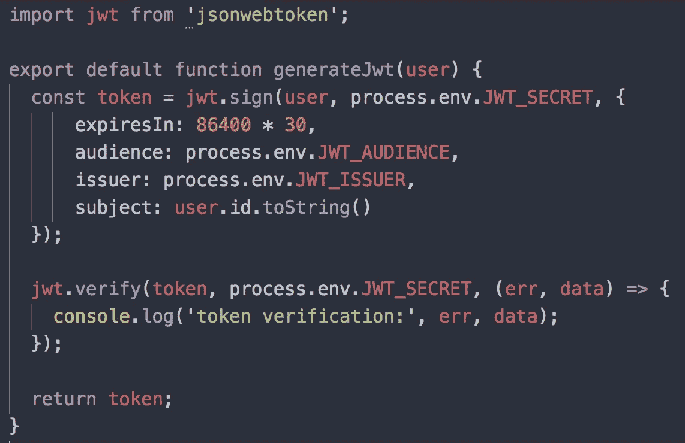
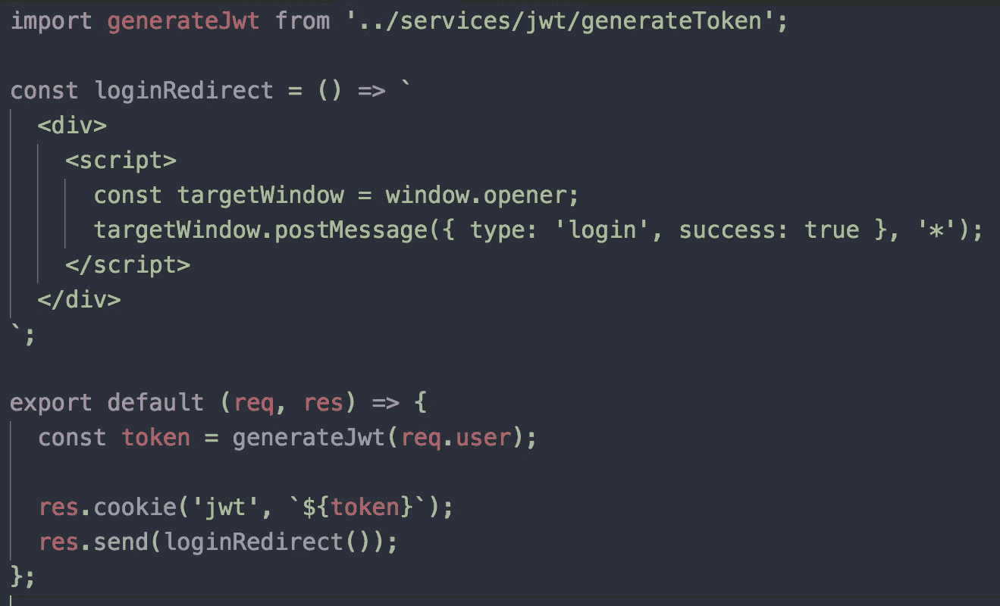
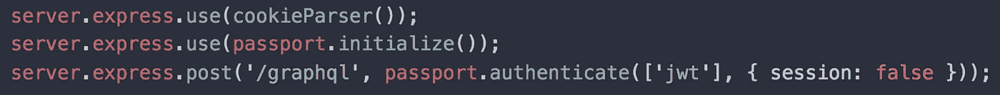
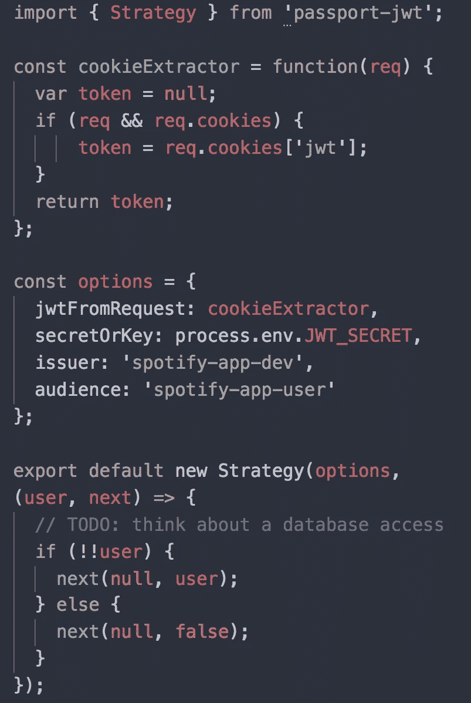
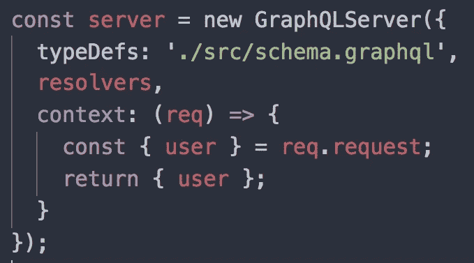

# 使用 OAuth 和 JSON Web 令牌的 GraphQL 认证

> 原文：<https://itnext.io/graphql-authentication-using-oauth-json-web-tokens-bdb829602a5c?source=collection_archive---------3----------------------->

这篇文章是我上周写的一篇文章的后续，讨论了如何使用 passport 向 GraphQL 服务器添加[认证。我将在这篇文章的基础上讨论如何用一个安全的](https://medium.com/@mjw56/graphql-authentication-with-passport-d75c08d5fbdc) [JSON Web 令牌(JWT)](https://jwt.io/) 包装生成的 OAuth 令牌，这样访问令牌就不会通过网络传递。

在之前的文章中，应用程序使用 OAuth 策略和 passport 模块在节点服务器上持久化用户会话。使用 JSON Web 令牌时要知道的关键是没有服务器会话。

没有服务器会话

本质上，我们将在服务器上使用一个秘密的服务器密钥对 JWT 进行编码，并将其作为 cookie 发送回客户端。在响应返回到客户端之后，服务器不知道任何关于本地 JWT 的信息，因为它没有被持久化。对于来自客户端的每个需要进行身份验证的请求，客户端将使用收到的 cookie 发回 JWT。然后，服务器可以读取传入的请求，获取 cookie 的 JWT 值，再次使用秘密密钥对其进行解码，如果一切正常，则对解码后的信息做任何需要做的事情，并将其传递给受保护的路由。简而言之，这就是 JWT 的工作方式。一旦你理解了一些关键的想法，这就非常简单了。我将向您展示我是如何用 [graphql-yoga](https://github.com/prismagraphql/graphql-yoga) 和现有的 [passport 策略](https://github.com/JMPerez/passport-spotify)来实现它的，我已经准备好获取 Spotify API 的访问令牌。

首先需要的是将插入 passport 的 [passport-jwt](https://www.npmjs.com/package/passport-jwt) 模块。这个模块将帮助我们定义一个中间件策略，如何从 cookie 中获取传入请求的 JWT，并检查它以确保它是有效的。接下来，我们将需要 [jsonwebtoken](https://www.npmjs.com/package/jsonwebtoken) ，它将是用于生成实际 JWT 的包。

让我们来看看第一段代码。这是将要生成 JWT 的函数。JWT 的就像他们所说的那样——一个由 JSON 生成的用于网络的令牌。这里我传入一个用户，但这实际上可以是您想要编码的任何 JSON 数据。这里最重要的部分是用来编码的密钥。当令牌从客户端发回时，它将使用相同的密钥对其进行解码。

接下来，在从 Spotify OAuth 登录流接收到经过身份验证的用户数据后，我将生成这个令牌。当用户登录 Spotify 时，我的应用程序会打开一个新的模态窗口，然后它会在我的节点服务器上重定向回 route。

set-jwt-cookie

该代码片段创建了 JWT，并将其作为 cookie 放在被设置回的响应上。此后，服务器会忘记 JWT 曾经存在过，浏览器会设置 cookie。

最后一步是将 JWT 身份验证放在节点服务器上的路由前面，因为已经发布了 JWT。对于我的用例，我使用的是 graphql-yoga，幸运的是他们的服务器公开了 express 应用程序实例，所以中间件可以像这样放在`/graphql`路径上

graph QL-yoga-中间件

要记住的一件重要事情是，在他们的服务器上使用`passport`中间件需要再次初始化！我第一次尝试的时候被它绊倒了。

最后，这是我为`passport-jwt`使用的策略代码:

护照-智威汤逊-战略

这里我传入了一个定制的提取器函数，它从传入的请求中提取 cookie。然后，该模块使用秘密密钥对令牌进行解码。一旦完成，它就可以将未编码的数据传递给下一个中间件。

在我的例子中是 GraphQL 服务器，我再次拦截请求，从请求中获取新的用户数据，并将其传递给 GraphQL 上下文。这个数据有一个访问令牌，我的 API 需要这个令牌来调用 Spotify API 以获取数据。有了这个，我的`/graphql`端点就成功地设置在认证之后。

这是我将 JWT 认证添加到我的服务器的[提交](https://github.com/mjw56/spotify/commit/7047d99c9bc6c28e97827986377bd87e3222c837)。

黑客快乐！

[标题照片致谢](https://www.shutterstock.com/g/praet)