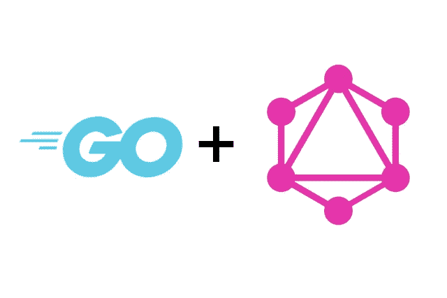

# GraphQL:集中现有的 REST API 端点以便于开发

> 原文：<https://itnext.io/graphql-centralize-existing-rest-api-endpoints-for-easier-development-abd7b007d7c4?source=collection_archive---------5----------------------->

API 网关非常适合开发团队，因为它们在一个中心位置公开了各种不同用途所需的数据。有一些很棒的 REST API 网关，比如 [KrakenD](https://www.krakend.io/) ，但是如果您想换一个方向，选择 GraphQL 作为您的 API 基础设施，该怎么办呢？嗯，这很完美，因为这是 GraphQL 的目标之一:将许多不同的服务抽象到一个地方，并允许开发人员对他们需要的数据进行非常细粒度的控制。

在这篇文章中，我们将查看一个 GraphQL 实现，它牢记着前面的句子:将现有的 REST API 端点抽象到一个快速的 GraphQL 服务器中。为了构建 GraphQL 服务器，我们将使用 Golang:它速度快，内存效率高，提供的工具刚好够用，但不会太多。我们将使用的 GraphQL 包是 github.com/graphql-go/graphql 的 T2。这个包与 JavaScript 实现 [graphql-js](https://github.com/graphql/graphql-js) 非常接近。这使它成为一个完美的候选，因为您将能够遵循 JavaScript 教程，并能够移植它。

# 入口点

为了展示如何在 GraphQL 中抽象现有的 REST API 端点，我们需要一个示例项目。我已经在[github.com/roelofjan-elsinga/graphql-rest-abstraction](https://github.com/roelofjan-elsinga/graphql-rest-abstraction)创建了一个示例项目。在这篇文章中，你可以用它来跟进，因为我将介绍 GraphQL 服务器的不同部分，并解释发生了什么。

我们的 GraphQL 服务器的入口点是 [main.go](https://github.com/roelofjan-elsinga/graphql-rest-abstraction/blob/master/main.go) 。这里我们指定了 GraphQL 服务器中的两个资源:users 和 user。

我们打算使用一个伪 [REST API 服务](https://jsonplaceholder.typicode.com/)来获取所有用户和单个用户的 JSON 数据。“用户”资源将用于获取在[https://jsonplaceholder.typicode.com/users](https://jsonplaceholder.typicode.com/users)的所有用户，而“用户”资源将用于从[https://jsonplaceholder.typicode.com/users/1](https://jsonplaceholder.typicode.com/users/1)获取单个用户的 ID 或我们可用的任何其他用户。

# 获取所有用户

现在我们有了一个可以使用的 REST API，我们可以创建一个资源来通过 GraphQL 资源获取这些数据。您可以在[查询/用户中找到该资源。](https://github.com/roelofjan-elsinga/graphql-rest-abstraction/blob/master/queries/users.go)

在这里你会发现一个方法“fetchUsers”，在这里我们调用 REST API 端点并将数据转换成 Go 结构，它位于 [models/user.go](https://github.com/roelofjan-elsinga/graphql-rest-abstraction/blob/master/models/user.go) 中。我们的字段“Users”将从“fetchUsers”返回用户切片。

在“users”字段声明中，我们指定了我们期望从这个 GraphQL 资源接收的类型:graphql。NewList(userObject)。我们告诉 GraphQL 我们正在返回多个用户。userObject 是我们的 GraphQL 资源之一，你可以[在这里](https://github.com/roelofjan-elsinga/graphql-rest-abstraction/blob/master/queries/users.go#L134)查看它的全部内容。这里的内联代码太多了，所以我把它链接到了源代码中你需要的那一行。userObject 本身也包含字段和嵌套对象([地址](https://github.com/roelofjan-elsinga/graphql-rest-abstraction/blob/master/queries/users.go#L77)和[公司](https://github.com/roelofjan-elsinga/graphql-rest-abstraction/blob/master/queries/users.go#L13))。这些嵌套对象也链接到确切的行。如您所见，对象可以嵌套在嵌套对象中。

既然我们已经指定了所有字段，并且可以从 REST API 中检索数据，那么是时候尝试一下我们的新 GraphQL 资源了。按照[设置步骤](https://github.com/roelofjan-elsinga/graphql-rest-abstraction#how-to-launch-the-server-for-development)(只有 4 个，很简单)尝试执行以下 GraphQL 查询:

现在，您应该看到所有用户都出现在响应中，但只有我们在查询中指定的字段:

我已经编辑了其余的用户，以避免这段代码太长。如您所见，正如我们对 GraphQL 的期望，我们只返回请求的字段。

# 获取单个用户

既然我们已经看到可以检索所有用户，我们还将检索单个用户。userObject 与我们之前看到的相同，所以我不会再重复，但是“user”的字段声明与“users”相比有了一点变化，查询也是如此。让我们先看看字段声明。它位于 [queries/user.go](https://github.com/roelofjan-elsinga/graphql-rest-abstraction/blob/master/queries/user.go) 中，如下所示:

有三个主要区别:

1.  我们期望的类型现在是 userObject 而不是 graphql。NewList(userObject)。我们只期待 1 个用户。
2.  我们的字段声明有一个 Args 键。我们用它来告诉服务器我们需要一个用户 ID 来进行查询，并且不能为空:graphql。NewNonNull(graphql。Int)
3.  我们将用户 ID 传递给 fetchSingleUser 方法，并将其附加到 REST 端点

我提到 GraphQL 查询现在也发生了变化，所以让我们看看它是什么样子的:

该查询需要提交一个 user_id(类型为 Int！)，所以我们可以使用{"user_id": 1}或者您希望从 API 端点检索的任何 user_id 来实现。

该查询产生以下响应:

如您所见，我们现在只有 ID 为 1 的用户。

# 结论

本指南向您展示了如何使用 GraphQL 创建 API 网关，从而在您现有的 REST API 端点之前创建一个抽象层。还缺少一些东西，比如身份验证，一个用于高效数据获取的数据加载器，但是这是一个简单的例子来展示它是如何工作的。使用这种方法，您可以在 GraphQL 中一点一点地扩展您的 API 网关，并覆盖您的整个 REST API 端点列表，而不会干扰您现有的客户。您现有的客户仍然可以从您的 REST API 中获取数据，但是随着时间的推移，您可以帮助他们迁移到您易于使用的 GraphQL API 网关。

发布时间:2020 年 8 月 26 日

*最初发表于*[T5【https://roelofjanelsinga.com】](https://roelofjanelsinga.com/articles/graphql-centralize-existing-rest-api-endpoints)*。*